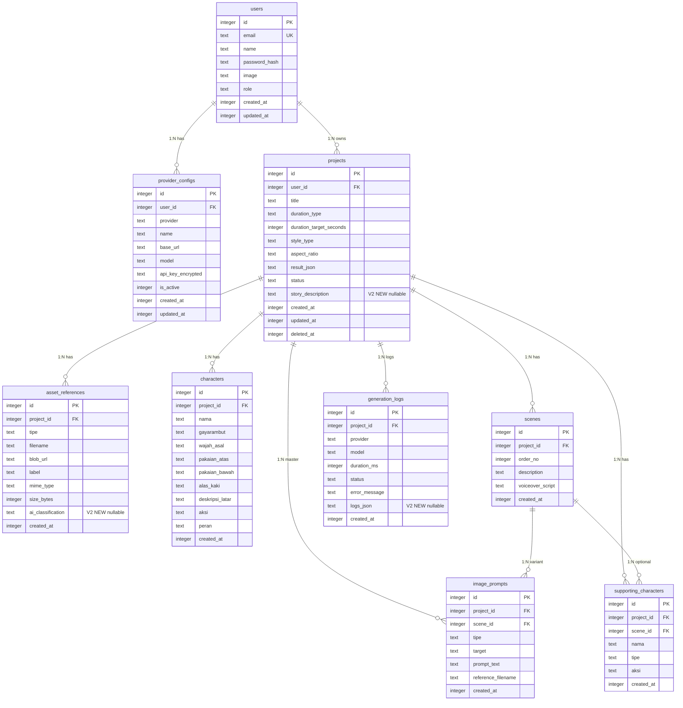

# Database Schema — PromptFlow

> **Versi:** 2.0
> **Dibuat:** 2026-06-20
> **Status:** Final
> **Pemilik:** Bos Agrian
> **Sumber kebenaran:** `product-docs/RAG-CONTEXT.md` + `product-docs/PRD.md` V2.0 + `product-docs/SRS.md` V2.0 + `src/lib/db/schema.ts` (ground truth kode)
> **Root proyek:** `C:\laragon\www\PromptFlow`
> **GitHub:** https://github.com/agrianwahab29/promptflow.git
> **Catatan:** OVERWRITE V1.0. V2 = additive nullable columns di 3 tabel existing (projects, asset_references, generation_logs). 9 tabel tetap. Tidak ada tabel baru. Tidak ada kolom dihapus. Semua perubahan backward-compatible.

---

## Daftar Isi

1. Pendahuluan & Justifikasi Database
2. Daftar Entitas (9 tabel)
3. ERD (Diagram Relasi)
4. Definisi Tabel (V1 + V2 changes)
5. Primary Key, Foreign Key & Relasi
6. Indexes
7. Constraints & Validation
8. Strategi Normalisasi
9. Migration Plan (V1 to V2)
10. Seed Data
11. Data Retention & Soft Delete
12. Keamanan Data
13. Catatan Desain
14. Ringkasan Perubahan V2

---

## 1. Pendahuluan & Justifikasi Database

### 1.1 Pilihan Database

| Aspek | Nilai | Bukti |
|---|---|---|
| Jenis | Relasional (SQLite-compatible) | `SRS.md V2.0 S4.1` |
| Engine | Turso (libSQL, SQLite-compatible via HTTP) | `RAG-CONTEXT.md S2.1-S2.2` ; `SRS.md V2.0 S4.1` |
| ORM | Drizzle ORM `^0.38.0` | `package.json:32` ; `drizzle.config.ts` |
| DB client | `@libsql/client` `^0.14.0` | `package.json:31` |
| Akses | Remote HTTP (serverless-safe) | `RAG-CONTEXT.md S5.4` |
| Deploy | Vercel + Turso Cloud | `SRS.md V2.0 S1.2` |

### 1.2 Justifikasi Turso/libSQL

1. **Vercel filesystem tidak persisten.** SQLite file lokal hilang saat instance recycle. Turso = SQLite-compatible via HTTP, persisten, serverless-safe. `RAG-CONTEXT.md S2.2, S5.4`
2. **Resmi Vercel Marketplace.** Turso Cloud integration didukung native. `RAG-CONTEXT.md S2.1`
3. **SQLite-compatible.** Skema portabel, tipe data SQLite standar (`integer`, `text`, `blob`, `real`). `SRS.md V2.0 S9.5`
4. **Drizzle ORM.** Type-safe, ringan, migration bawaan (`drizzle-kit`), dukung libSQL driver. `package.json:32-33`

### 1.3 Tipe Data SQLite & Drizzle Mapping

| SQLite type | Drizzle builder | Penggunaan |
|---|---|---|
| `INTEGER` | `integer()` / `integer({ mode: 'number' })` | PK auto-increment, FK, counter, boolean (0/1), timestamp (unix epoch) |
| `TEXT` | `text()` | string, JSON serialize, enum (text), timestamp ISO-8601 |
| `BLOB` | `blob()` | data biner (tidak dipakai fase awal) |
| `REAL` | `real()` | angka desimal (durasi ms, dll) |

> **Catatan timestamp:** Drizzle mendukung `integer({ mode: 'timestamp' })` (unix epoch). Dokumen ini pakai `integer` unix epoch second untuk `created_at`/`updated_at`/`deleted_at`. Konsisten lintas tabel. `schema.ts:12-13`

---

## 2. Daftar Entitas

9 entitas dari `schema.ts` (ground truth kode):

| # | Entitas (tabel) | Deskripsi singkat | V2 Change | Bukti |
|---|---|---|---|---|
| 1 | `users` | Akun user (login NextAuth). 1:N Project, 1:N ProviderConfig. | TIDAK ADA | `schema.ts:5-14` |
| 2 | `provider_configs` | Konfigurasi provider LLM per user. API key terenkripsi AES-256-GCM. | TIDAK ADA | `schema.ts:17-30` |
| 3 | `projects` | Project prompt animasi. Metadata + `result_json` snapshot + soft delete. | **Tambah `story_description` (TEXT nullable)** | `schema.ts:33-49` |
| 4 | `asset_references` | Metadata gambar referensi upload. | **Tambah `ai_classification` (TEXT nullable)** | `schema.ts:52-65` |
| 5 | `characters` | Master karakter konsisten per project (FR-07). Identitas stabil lintas scene. | TIDAK ADA | `schema.ts:68-84` |
| 6 | `scenes` | Adegan berurut per project. 1:N ImagePrompt varian. | TIDAK ADA | `schema.ts:87-97` |
| 7 | `image_prompts` | Prompt gambar per tokoh/background. Master list root + varian per scene. | TIDAK ADA | `schema.ts:100-114` |
| 8 | `generation_logs` | Log telemetri per generate (provider, model, durasi, status). | **Tambah `logs_json` (TEXT nullable)** | `schema.ts:117-129` |
| 9 | `supporting_characters` | Karakter pendukung/hewan + aksi per project atau per scene. | TIDAK ADA | `schema.ts:132-143` |

**Catatan V2:** Semua perubahan = additive nullable columns. Tidak ada tabel baru. Tidak ada kolom dihapus. Tidak ada tabel yang di-rename. 100% backward-compatible. `PRD.md V2.0 S8.2` ; `SRS.md V2.0 S7.2`

---

## 3. ERD (Diagram Relasi)

### 3.1 Deskripsi Relasi

| Relasi | Tipe | Dari | Ke | ON DELETE | Bukti |
|---|---|---|---|---|---|
| User -> ProviderConfig | 1:N | `users.id` | `provider_configs.user_id` | CASCADE | `schema.ts:19` |
| User -> Project | 1:N | `users.id` | `projects.user_id` | CASCADE | `schema.ts:35` |
| Project -> AssetReference | 1:N | `projects.id` | `asset_references.project_id` | CASCADE | `schema.ts:54` |
| Project -> Character | 1:N | `projects.id` | `characters.project_id` | CASCADE | `schema.ts:70` |
| Project -> Scene | 1:N | `projects.id` | `scenes.project_id` | CASCADE | `schema.ts:89` |
| Project -> ImagePrompt (master) | 1:N | `projects.id` | `image_prompts.project_id` | CASCADE | `schema.ts:102` |
| Project -> GenerationLog | 1:N | `projects.id` | `generation_logs.project_id` | CASCADE | `schema.ts:119` |
| Project -> SupportingCharacter | 1:N | `projects.id` | `supporting_characters.project_id` | CASCADE | `schema.ts:133` |
| Scene -> ImagePrompt (varian) | 1:N | `scenes.id` | `image_prompts.scene_id` | CASCADE | `schema.ts:103` |
| Scene -> SupportingCharacter (opsional) | 1:N | `scenes.id` | `supporting_characters.scene_id` | SET NULL | `schema.ts:135` |

### 3.2 Diagram Mermaid ERD



---

## 4. Definisi Tabel

> **Konvensi:** tabel jamak snake_case. Kolom snake_case. PK = `id` INTEGER auto-increment. Timestamp = integer unix epoch second. Boolean = integer 0/1. V2 changes ditandai `[V2 NEW]`.

### 4.1 `users`

Akun user login NextAuth. `schema.ts:5-14`

| Kolom | Tipe SQLite | Drizzle | Nullable | Default | Unique | Deskripsi | Bukti |
|---|---|---|---|---|---|---|---|
| `id` | INTEGER | `integer().primaryKey({ autoIncrement: true })` | NO | auto | YES | PK auto-increment | `schema.ts:6` |
| `email` | TEXT | `text().notNull().unique()` | NO | — | YES | Email user (login) | `schema.ts:7` |
| `name` | TEXT | `text()` | YES | NULL | NO | Nama tampilan | `schema.ts:8` |
| `password_hash` | TEXT | `text().notNull()` | NO | — | NO | Hash password (bcryptjs) | `schema.ts:9` |
| `image` | TEXT | `text()` | YES | NULL | NO | URL avatar (opsional) | `schema.ts:10` |
| `role` | TEXT | `text().notNull().default('user')` | NO | `'user'` | NO | Role (fase awal = `user`) | `schema.ts:11` |
| `created_at` | INTEGER | `integer().default(sql`(unixepoch())`).notNull()` | NO | epoch now | NO | Audit create | `schema.ts:12` |
| `updated_at` | INTEGER | `integer().default(sql`(unixepoch())`).notNull()` | NO | epoch now | NO | Audit update | `schema.ts:13` |

**PK:** `id`. **Unique:** `email`. **FK:** —. **Index:** — (SQLite auto-index PK + unique).

### 4.2 `provider_configs`

Konfigurasi provider LLM per user. API key terenkripsi AES-256-GCM. `schema.ts:17-30`

| Kolom | Tipe SQLite | Drizzle | Nullable | Default | Unique | Deskripsi | Bukti |
|---|---|---|---|---|---|---|---|
| `id` | INTEGER | `integer().primaryKey({ autoIncrement: true })` | NO | auto | YES | PK auto-increment | `schema.ts:18` |
| `user_id` | INTEGER | `integer().notNull()` FK->users | NO | — | NO | FK -> `users.id` ON DELETE CASCADE | `schema.ts:19` |
| `provider` | TEXT | `text().notNull()` | NO | — | NO | Enum: `ollama`/`openrouter`/`9router`/`custom` | `schema.ts:20` |
| `name` | TEXT | `text().notNull()` | NO | — | NO | Label user (mis "Ollama Cloud Utama") | `schema.ts:21` |
| `base_url` | TEXT | `text().notNull()` | NO | — | NO | Base URL provider | `schema.ts:22` |
| `model` | TEXT | `text().notNull()` | NO | — | NO | Model ID (user input) | `schema.ts:23` |
| `api_key_encrypted` | TEXT | `text()` | YES | NULL | NO | JSON `{iv, ciphertext, tag}` AES-256-GCM | `schema.ts:24` |
| `is_active` | INTEGER | `integer().notNull().default(1)` | NO | 1 | NO | Boolean 0/1 | `schema.ts:25` |
| `created_at` | INTEGER | `integer().default(sql`(unixepoch())`).notNull()` | NO | epoch now | NO | Audit create | `schema.ts:26` |
| `updated_at` | INTEGER | `integer().default(sql`(unixepoch())`).notNull()` | NO | epoch now | NO | Audit update | `schema.ts:27` |

**PK:** `id`. **FK:** `user_id` -> `users.id` ON DELETE CASCADE. **Unique:** (`user_id`, `name`) via `idx_provider_configs_user_name`. **Index:** `idx_provider_configs_user_name` (unique composite). `schema.ts:28-30`

### 4.3 `projects`

Project prompt animasi. Metadata + `result_json` snapshot + soft delete. `schema.ts:33-49`

| Kolom | Tipe SQLite | Drizzle | Nullable | Default | Unique | Deskripsi | Bukti |
|---|---|---|---|---|---|---|---|
| `id` | INTEGER | `integer().primaryKey({ autoIncrement: true })` | NO | auto | YES | PK auto-increment | `schema.ts:34` |
| `user_id` | INTEGER | `integer().notNull()` FK->users | NO | — | NO | FK -> `users.id` ON DELETE CASCADE | `schema.ts:35` |
| `title` | TEXT | `text().notNull()` | NO | — | NO | Judul animasi (Zod min 3 max 200) | `schema.ts:36` |
| `duration_type` | TEXT | `text().notNull()` | NO | — | NO | Enum: `shorts`/`tutorial` | `schema.ts:37` |
| `duration_target_seconds` | INTEGER | `integer().notNull()` | NO | — | NO | Detik target | `schema.ts:38` |
| `style_type` | TEXT | `text().notNull()` | NO | — | NO | Enum: `3D`/`2D` | `schema.ts:39` |
| `aspect_ratio` | TEXT | `text().notNull()` | NO | — | NO | Rasio (`16:9`/`9:16`/`1:1`/custom) | `schema.ts:40` |
| `result_json` | TEXT | `text()` | YES | NULL | NO | Snapshot hasil generate (JSON) | `schema.ts:41` |
| `status` | TEXT | `text().notNull().default('draft')` | NO | `'draft'` | NO | Enum: `draft`/`generating`/`complete`/`failed` | `schema.ts:42` |
| `story_description` | TEXT | `text()` | YES | NULL | NO | **[V2 NEW]** Deskripsi singkat cerita dari generate form | `PRD.md V2.0 S8.2` ; `RAG-CONTEXT.md S9 V2-4` |
| `created_at` | INTEGER | `integer().default(sql`(unixepoch())`).notNull()` | NO | epoch now | NO | Audit create | `schema.ts:43` |
| `updated_at` | INTEGER | `integer().default(sql`(unixepoch())`).notNull()` | NO | epoch now | NO | Audit update | `schema.ts:44` |
| `deleted_at` | INTEGER | `integer()` | YES | NULL | NO | Soft delete timestamp. NULL = aktif. | `schema.ts:45` |

**PK:** `id`. **FK:** `user_id` -> `users.id` ON DELETE CASCADE. **Index:** `idx_projects_user_id`, `idx_projects_user_created` (composite). `schema.ts:46-49`

### 4.4 `asset_references`

Metadata gambar referensi upload via Vercel Blob. `schema.ts:52-65`

| Kolom | Tipe SQLite | Drizzle | Nullable | Default | Unique | Deskripsi | Bukti |
|---|---|---|---|---|---|---|---|
| `id` | INTEGER | `integer().primaryKey({ autoIncrement: true })` | NO | auto | YES | PK auto-increment | `schema.ts:53` |
| `project_id` | INTEGER | `integer().notNull()` FK->projects | NO | — | NO | FK -> `projects.id` ON DELETE CASCADE | `schema.ts:54` |
| `tipe` | TEXT | `text().notNull()` | NO | — | NO | V1: `tokoh`/`background`. V2 ext: +`prop`/`accessory`/`environment`/`other` | `schema.ts:55` |
| `filename` | TEXT | `text().notNull()` | NO | — | NO | Nama file asli (di-inject ke prompt) | `schema.ts:56` |
| `blob_url` | TEXT | `text().notNull()` | NO | — | NO | URL Vercel Blob / path lokal dev | `schema.ts:57` |
| `label` | TEXT | `text()` | YES | NULL | NO | Label user (mis "Hero", "Hutan") | `schema.ts:58` |
| `mime_type` | TEXT | `text()` | YES | NULL | NO | MIME type (`image/png`, dll) | `schema.ts:59` |
| `size_bytes` | INTEGER | `integer()` | YES | NULL | NO | Ukuran file (max 10MB) | `schema.ts:60` |
| `ai_classification` | TEXT | `text()` | YES | NULL | NO | **[V2 NEW]** JSON hasil Vision LLM: `{role, name, description, confidence}` | `PRD.md V2.0 S8.2` ; `RAG-CONTEXT.md S9 V2-3` |
| `created_at` | INTEGER | `integer().default(sql`(unixepoch())`).notNull()` | NO | epoch now | NO | Audit create | `schema.ts:61` |

**PK:** `id`. **FK:** `project_id` -> `projects.id` ON DELETE CASCADE. **Index:** `idx_asset_refs_project_id`, `idx_asset_refs_project_tipe` (composite). `schema.ts:62-65`

### 4.5 `characters`

Master karakter konsisten per project (FR-07). Identitas stabil lintas scene (FR-12). `schema.ts:68-84`

| Kolom | Tipe SQLite | Drizzle | Nullable | Default | Unique | Deskripsi | Bukti |
|---|---|---|---|---|---|---|---|
| `id` | INTEGER | `integer().primaryKey({ autoIncrement: true })` | NO | auto | YES | PK auto-increment | `schema.ts:69` |
| `project_id` | INTEGER | `integer().notNull()` FK->projects | NO | — | NO | FK -> `projects.id` ON DELETE CASCADE | `schema.ts:70` |
| `nama` | TEXT | `text().notNull()` | NO | — | NO | Nama karakter | `schema.ts:71` |
| `gayarambut` | TEXT | `text().notNull()` | NO | — | NO | Deskripsi gaya rambut | `schema.ts:72` |
| `wajah_asal` | TEXT | `text().notNull()` | NO | — | NO | Deskripsi wajah / asal daerah | `schema.ts:73` |
| `pakaian_atas` | TEXT | `text().notNull()` | NO | — | NO | Deskripsi pakaian atas | `schema.ts:74` |
| `pakaian_bawah` | TEXT | `text().notNull()` | NO | — | NO | Deskripsi pakaian bawah | `schema.ts:75` |
| `alas_kaki` | TEXT | `text().notNull()` | NO | — | NO | Deskripsi alas kaki | `schema.ts:76` |
| `deskripsi_latar` | TEXT | `text().notNull()` | NO | — | NO | Latar belakang (boleh beda per scene) | `schema.ts:77` |
| `aksi` | TEXT | `text().notNull()` | NO | — | NO | Aksi default (boleh beda per scene) | `schema.ts:78` |
| `peran` | TEXT | `text().notNull()` | NO | — | NO | Enum: `utama`/`lain`/`pendamping` | `schema.ts:79` |
| `created_at` | INTEGER | `integer().default(sql`(unixepoch())`).notNull()` | NO | epoch now | NO | Audit create | `schema.ts:80` |

**PK:** `id`. **FK:** `project_id` -> `projects.id` ON DELETE CASCADE. **Unique:** (`project_id`, `nama`) via `idx_characters_project_nama`. **Index:** `idx_characters_project_id`, `idx_characters_project_nama` (unique composite). `schema.ts:81-84`

### 4.6 `scenes`

Adegan berurut per project. `schema.ts:87-97`

| Kolom | Tipe SQLite | Drizzle | Nullable | Default | Unique | Deskripsi | Bukti |
|---|---|---|---|---|---|---|---|
| `id` | INTEGER | `integer().primaryKey({ autoIncrement: true })` | NO | auto | YES | PK auto-increment | `schema.ts:88` |
| `project_id` | INTEGER | `integer().notNull()` FK->projects | NO | — | NO | FK -> `projects.id` ON DELETE CASCADE | `schema.ts:89` |
| `order_no` | INTEGER | `integer().notNull()` | NO | — | NO | Urutan adegan (1..N) | `schema.ts:90` |
| `description` | TEXT | `text().notNull()` | NO | — | NO | Deskripsi adegan | `schema.ts:91` |
| `voiceover_script` | TEXT | `text().notNull()` | NO | — | NO | Naskah voiceover teks | `schema.ts:92` |
| `created_at` | INTEGER | `integer().default(sql`(unixepoch())`).notNull()` | NO | epoch now | NO | Audit create | `schema.ts:93` |

**PK:** `id`. **FK:** `project_id` -> `projects.id` ON DELETE CASCADE. **Unique:** (`project_id`, `order_no`) via `idx_scenes_project_order`. **Index:** `idx_scenes_project_id`, `idx_scenes_project_order` (unique composite). `schema.ts:94-97`

### 4.7 `image_prompts`

Prompt gambar per tokoh/background. Dua tipe: master list root (`scene_id` NULL) & varian per scene (`scene_id` terisi). `schema.ts:100-114`

| Kolom | Tipe SQLite | Drizzle | Nullable | Default | Unique | Deskripsi | Bukti |
|---|---|---|---|---|---|---|---|
| `id` | INTEGER | `integer().primaryKey({ autoIncrement: true })` | NO | auto | YES | PK auto-increment | `schema.ts:101` |
| `project_id` | INTEGER | `integer().notNull()` FK->projects | NO | — | NO | FK -> `projects.id` ON DELETE CASCADE | `schema.ts:102` |
| `scene_id` | INTEGER | `integer()` FK->scenes | YES | NULL | NO | NULL = master list root. Terisi = varian per scene. | `schema.ts:103` |
| `tipe` | TEXT | `text().notNull()` | NO | — | NO | V1: `tokoh`/`background`. V2 ext: +`prop`/`accessory`/`environment`/`other` | `schema.ts:104` |
| `target` | TEXT | `text().notNull()` | NO | — | NO | Nama tokoh / nama tempat | `schema.ts:105` |
| `prompt_text` | TEXT | `text().notNull()` | NO | — | NO | Teks prompt detail visual | `schema.ts:106` |
| `reference_filename` | TEXT | `text()` | YES | NULL | NO | Nama file referensi. NULL bila no ref. | `schema.ts:107` |
| `created_at` | INTEGER | `integer().default(sql`(unixepoch())`).notNull()` | NO | epoch now | NO | Audit create | `schema.ts:108` |

**PK:** `id`. **FK:** `project_id` -> `projects.id` ON DELETE CASCADE; `scene_id` -> `scenes.id` ON DELETE CASCADE. **Index:** `idx_image_prompts_project_id`, `idx_image_prompts_scene_id`, `idx_image_prompts_project_tipe` (composite), `idx_image_prompts_project_scene` (composite). `schema.ts:109-114`

### 4.8 `generation_logs`

Log telemetri per generate. `schema.ts:117-129`

| Kolom | Tipe SQLite | Drizzle | Nullable | Default | Unique | Deskripsi | Bukti |
|---|---|---|---|---|---|---|---|
| `id` | INTEGER | `integer().primaryKey({ autoIncrement: true })` | NO | auto | YES | PK auto-increment | `schema.ts:118` |
| `project_id` | INTEGER | `integer().notNull()` FK->projects | NO | — | NO | FK -> `projects.id` ON DELETE CASCADE | `schema.ts:119` |
| `provider` | TEXT | `text().notNull()` | NO | — | NO | Nama provider (`ollama`/`openrouter`/`9router`/`custom`) | `schema.ts:120` |
| `model` | TEXT | `text().notNull()` | NO | — | NO | Model ID dipakai | `schema.ts:121` |
| `duration_ms` | INTEGER | `integer()` | YES | NULL | NO | Durasi generate (ms) | `schema.ts:122` |
| `status` | TEXT | `text().notNull()` | NO | — | NO | Enum: `success`/`fail`/`partial` | `schema.ts:123` |
| `error_message` | TEXT | `text()` | YES | NULL | NO | Pesan error bila status != success | `schema.ts:124` |
| `logs_json` | TEXT | `text()` | YES | NULL | NO | **[V2 NEW]** JSON array real-time logs: `[{level, message, timestamp}]` | `PRD.md V2.0 S8.2` ; `RAG-CONTEXT.md S9 V2-5` |
| `created_at` | INTEGER | `integer().default(sql`(unixepoch())`).notNull()` | NO | epoch now | NO | Audit create | `schema.ts:125` |

**PK:** `id`. **FK:** `project_id` -> `projects.id` ON DELETE CASCADE. **Index:** `idx_gen_logs_project_id`, `idx_gen_logs_project_created` (composite). `schema.ts:126-129`

### 4.9 `supporting_characters`

Karakter pendukung/hewan + aksi. Bisa per project (global) atau per scene. `schema.ts:132-143`

| Kolom | Tipe SQLite | Drizzle | Nullable | Default | Unique | Deskripsi | Bukti |
|---|---|---|---|---|---|---|---|
| `id` | INTEGER | `integer().primaryKey({ autoIncrement: true })` | NO | auto | YES | PK auto-increment | `schema.ts:133` |
| `project_id` | INTEGER | `integer().notNull()` FK->projects | NO | — | NO | FK -> `projects.id` ON DELETE CASCADE | `schema.ts:134` |
| `scene_id` | INTEGER | `integer()` FK->scenes | YES | NULL | NO | NULL = global per project. Terisi = spesifik scene. | `schema.ts:135` |
| `nama` | TEXT | `text().notNull()` | NO | — | NO | Nama karakter pendukung/hewan | `schema.ts:136` |
| `tipe` | TEXT | `text().notNull()` | NO | — | NO | Enum: `pendukung`/`hewan` | `schema.ts:137` |
| `aksi` | TEXT | `text().notNull()` | NO | — | NO | Aksi karakter | `schema.ts:138` |
| `created_at` | INTEGER | `integer().default(sql`(unixepoch())`).notNull()` | NO | epoch now | NO | Audit create | `schema.ts:139` |

**PK:** `id`. **FK:** `project_id` -> `projects.id` ON DELETE CASCADE; `scene_id` -> `scenes.id` ON DELETE SET NULL. **Index:** `idx_supporting_chars_project_id`, `idx_supporting_chars_scene_id`. `schema.ts:140-143`

---

## 5. Primary Key, Foreign Key & Relasi

### 5.1 Primary Key

Semua tabel pakai `id` INTEGER auto-increment sebagai PK. SQLite auto-create index untuk PK.

### 5.2 Foreign Key Rules

| FK | Dari | Ke | ON DELETE | ON UPDATE | Alasan | Bukti |
|---|---|---|---|---|---|---|
| `provider_configs.user_id` | `provider_configs` | `users` | CASCADE | — | Hapus user = hapus config | `schema.ts:19` |
| `projects.user_id` | `projects` | `users` | CASCADE | — | Hapus user = hapus projects | `schema.ts:35` |
| `asset_references.project_id` | `asset_references` | `projects` | CASCADE | — | Hapus project = hapus refs | `schema.ts:54` |
| `characters.project_id` | `characters` | `projects` | CASCADE | — | Hapus project = hapus chars | `schema.ts:70` |
| `scenes.project_id` | `scenes` | `projects` | CASCADE | — | Hapus project = hapus scenes | `schema.ts:89` |
| `image_prompts.project_id` | `image_prompts` | `projects` | CASCADE | — | Hapus project = hapus prompts | `schema.ts:102` |
| `image_prompts.scene_id` | `image_prompts` | `scenes` | CASCADE | — | Hapus scene = hapus varian | `schema.ts:103` |
| `generation_logs.project_id` | `generation_logs` | `projects` | CASCADE | — | Hapus project = hapus logs | `schema.ts:119` |
| `supporting_characters.project_id` | `supporting_characters` | `projects` | CASCADE | — | Hapus project = hapus supporting | `schema.ts:134` |
| `supporting_characters.scene_id` | `supporting_characters` | `scenes` | SET NULL | — | Hapus scene = supporting tetap (global) | `schema.ts:135` |

### 5.3 Relasi Summary

| Dari | Ke | Tipe | Keterangan |
|---|---|---|---|
| `users` | `provider_configs` | 1:N | Satu user punya banyak provider config |
| `users` | `projects` | 1:N | Satu user punya banyak project |
| `projects` | `asset_references` | 1:N | Satu project punya banyak referensi gambar |
| `projects` | `characters` | 1:N | Satu project punya banyak karakter master |
| `projects` | `scenes` | 1:N | Satu project punya banyak adegan |
| `projects` | `image_prompts` | 1:N | Master list root per project |
| `projects` | `generation_logs` | 1:N | History generate per project |
| `projects` | `supporting_characters` | 1:N | Karakter pendukung per project |
| `scenes` | `image_prompts` | 1:N | Varian prompt per scene |
| `scenes` | `supporting_characters` | 1:N | Karakter pendukung per scene (opsional) |

---

## 6. Indexes

| # | Nama index | Tabel | Kolom | Tipe | Alasan query | Bukti |
|---|---|---|---|---|---|---|
| 1 | `idx_provider_configs_user_name` | `provider_configs` | `user_id, name` | UNIQUE COMPOSITE | List provider per user + unique constraint | `schema.ts:29` |
| 2 | `idx_projects_user_id` | `projects` | `user_id` | NORMAL | List project per user | `schema.ts:47` |
| 3 | `idx_projects_user_created` | `projects` | `user_id, created_at` | COMPOSITE | List project paginate + sort terbaru | `schema.ts:48` |
| 4 | `idx_asset_refs_project_id` | `asset_references` | `project_id` | NORMAL | List referensi per project | `schema.ts:63` |
| 5 | `idx_asset_refs_project_tipe` | `asset_references` | `project_id, tipe` | COMPOSITE | Filter tokoh vs background | `schema.ts:64` |
| 6 | `idx_characters_project_id` | `characters` | `project_id` | NORMAL | List karakter per project | `schema.ts:82` |
| 7 | `idx_characters_project_nama` | `characters` | `project_id, nama` | UNIQUE COMPOSITE | Nama unik per project (konsistensi referensi) | `schema.ts:83` |
| 8 | `idx_scenes_project_id` | `scenes` | `project_id` | NORMAL | List scene per project | `schema.ts:95` |
| 9 | `idx_scenes_project_order` | `scenes` | `project_id, order_no` | UNIQUE COMPOSITE | Query adegan berurut | `schema.ts:96` |
| 10 | `idx_image_prompts_project_id` | `image_prompts` | `project_id` | NORMAL | List master image prompt per project | `schema.ts:110` |
| 11 | `idx_image_prompts_scene_id` | `image_prompts` | `scene_id` | NORMAL | List varian per scene | `schema.ts:111` |
| 12 | `idx_image_prompts_project_tipe` | `image_prompts` | `project_id, tipe` | COMPOSITE | Filter tokoh vs background | `schema.ts:112` |
| 13 | `idx_image_prompts_project_scene` | `image_prompts` | `project_id, scene_id` | COMPOSITE | Query varian per scene | `schema.ts:113` |
| 14 | `idx_gen_logs_project_id` | `generation_logs` | `project_id` | NORMAL | History per project | `schema.ts:127` |
| 15 | `idx_gen_logs_project_created` | `generation_logs` | `project_id, created_at` | COMPOSITE | History paginate + sort | `schema.ts:128` |
| 16 | `idx_supporting_chars_project_id` | `supporting_characters` | `project_id` | NORMAL | List per project | `schema.ts:141` |
| 17 | `idx_supporting_chars_scene_id` | `supporting_characters` | `scene_id` | NORMAL | List per scene | `schema.ts:142` |

**Total: 17 indexes** (termasuk 4 unique composite + auto PK indexes).

---

## 7. Constraints & Validation

### 7.1 DB-Level Constraints

| Tabel | Constraint | Tipe | Detail | Bukti |
|---|---|---|---|---|
| `users` | `email` UNIQUE | UNIQUE | Email unik (login) | `schema.ts:7` |
| `provider_configs` | (`user_id`, `name`) UNIQUE | COMPOSITE UNIQUE | Satu nama config per user | `schema.ts:29` |
| `characters` | (`project_id`, `nama`) UNIQUE | COMPOSITE UNIQUE | Nama unik per project | `schema.ts:83` |
| `scenes` | (`project_id`, `order_no`) UNIQUE | COMPOSITE UNIQUE | Urutan unik per project | `schema.ts:96` |
| Semua FK | ON DELETE CASCADE / SET NULL | FK | Lihat S5.2 | `schema.ts:19-143` |

### 7.2 App-Level Validation (Zod - BUKAN DB CHECK)

SQLite CHECK terbatas (tidak bisa query aggregate cross-row). Constraint berikut enforce di app layer (`lib/validation/schemas.ts`):

| Constraint | Enforce di | Detail | Bukti |
|---|---|---|---|
| `title` panjang 3-200 | Zod | `z.string().min(3).max(200).trim()` | `SRS.md V2.0 S9.4` |
| `duration_type` enum | Zod | `z.enum(['shorts','tutorial'])` | `SRS.md V2.0 S9.4` |
| Shorts <=180s, tutorial 420-900s | Zod + business | Shorts >180 = 400, tutorial out range = warning | `PRD.md V2.0 S7 AC-02` |
| `style_type` enum `3D`/`2D` | Zod | `z.enum(['3D','2D'])` | `SRS.md V2.0 S9.4` |
| `peran` enum | Zod | `z.enum(['utama','lain','pendamping'])` | `PRD.md V2.0 S8.2` |
| `tipe` supporting char enum | Zod | `z.enum(['pendukung','hewan'])` | `PRD.md V2.0 S8.2` |
| **V2:** `tipe` asset extended | Zod | `z.enum(['tokoh','background','prop','accessory','environment','other'])` | `PRD.md V2.0 S8.3` |
| **V2:** `storyDescription` | Zod | `z.string().max(500).optional()` | `PRD.md V2.0 S8.3` |
| `provider` enum | Zod | `z.enum(['ollama','openrouter','9router','custom'])` | `SRS.md V2.0 S9.4` |
| Batas tokoh <=10 per project | Zod + app | Count characters where project_id sebelum insert | ASUMSI SRS-A10 |
| `result_json` valid schema | Zod | `PromptPackageSchema` parse sebelum save | `PRD.md V2.0 S8.2` |
| Konsistensi karakter (FR-12) | App post-check | Banding character identitas vs scenes. Mismatch = warning. | `PRD.md V2.0 S5 FR-12` |

---

## 8. Strategi Normalisasi

### 8.1 Normalisasi (3NF)

- **9 tabel terpisah** - hindari duplikasi data. Setiap entitas = 1 tabel.
- **Character master + referensi** - enforce konsistensi FR-07/FR-12. Karakter dirujuk via `nama`, BUKAN duplikasi deskripsi per scene.
- **FK + cascade** - integritas referensial via Drizzle relation.

### 8.2 Denormalisasi Sengaja

| Denormalisasi | Alasan | Bukti |
|---|---|---|
| `projects.result_json` (TEXT serialize) | Snapshot hasil generate untuk export cepat & history. Hindari re-query 9 tabel. | `SRS.md V2.0 S7.5` |
| `image_prompts.reference_filename` | Inject ke prompt saat generate, rujuk nama file langsung tanpa join. | `schema.ts:107` |
| **V2:** `asset_references.ai_classification` | Cache hasil Vision LLM agar tidak reclassify. JSON serialize. | `PRD.md V2.0 S5 FR-V2-02` |
| **V2:** `generation_logs.logs_json` | Persist real-time logs untuk debugging/history. JSON serialize array. | `PRD.md V2.0 S5 FR-V2-05` |
| **V2:** `projects.story_description` | Simpan deskripsi cerita untuk re-edit/re-generate. | `PRD.md V2.0 S5 FR-V2-04` |

---

## 9. Migration Plan (V1 to V2)

### 9.1 Strategi Migration

| Aspek | Nilai | Bukti |
|---|---|---|
| Tooling | `drizzle-kit` `^0.30.0` | `package.json:33` |
| Schema file | `src/lib/db/schema.ts` | `schema.ts:1-163` |
| Config file | `drizzle.config.ts` (root) | `drizzle.config.ts` |
| Generate migration | `drizzle-kit generate` -> SQL di `drizzle/` | ASUMSI |
| Apply (dev) | `drizzle-kit push` | ASUMSI |
| Apply (prod) | SQL migration manual via turso CLI | ASUMSI |
| Env | `TURSO_DATABASE_URL` + `TURSO_AUTH_TOKEN` | `drizzle.config.ts:3-7` |

### 9.2 Urutan Buat Tabel (V1 - Dependency)

| # | Tabel | Dependency | Alasan |
|---|---|---|---|
| 1 | `users` | — | Root, no FK |
| 2 | `provider_configs` | `users` | FK `user_id` |
| 3 | `projects` | `users` | FK `user_id` |
| 4 | `asset_references` | `projects` | FK `project_id` |
| 5 | `characters` | `projects` | FK `project_id` |
| 6 | `scenes` | `projects` | FK `project_id` |
| 7 | `image_prompts` | `projects`, `scenes` | FK `project_id` + `scene_id` (nullable) |
| 8 | `generation_logs` | `projects` | FK `project_id` |
| 9 | `supporting_characters` | `projects`, `scenes` | FK `project_id` + `scene_id` (nullable) |

### 9.3 V2 Migration (Additive - 3 kolom nullable)

V2 = **additive columns only**. Tidak ada tabel baru. Tidak ada tabel dihapus. Tidak ada kolom yang diubah type. Semua kolom baru = nullable -> existing data intact.

| # | Tabel | Kolom Baru | Tipe | Nullable | Default | Alasan | Sitasi |
|---|---|---|---|---|---|---|---|
| 1 | `projects` | `story_description` | TEXT | YES | NULL | Deskripsi cerita dari generate form | `PRD.md V2.0 S8.2` ; `RAG-CONTEXT.md S9 V2-4` |
| 2 | `asset_references` | `ai_classification` | TEXT | YES | NULL | JSON hasil Vision LLM classification | `PRD.md V2.0 S8.2` ; `RAG-CONTEXT.md S9 V2-3` |
| 3 | `generation_logs` | `logs_json` | TEXT | YES | NULL | JSON array real-time logs | `PRD.md V2.0 S8.2` ; `RAG-CONTEXT.md S9 V2-5` |

**SQL Migration (V2):**

```sql
-- V2 Migration: Additive nullable columns
-- Generated by drizzle-kit generate
-- Date: 2026-06-20

-- 1. projects.story_description
ALTER TABLE projects ADD COLUMN story_description TEXT;

-- 2. asset_references.ai_classification
ALTER TABLE asset_references ADD COLUMN ai_classification TEXT;

-- 3. generation_logs.logs_json
ALTER TABLE generation_logs ADD COLUMN logs_json TEXT;
```

> **Catatan:** SQLite `ALTER TABLE ADD COLUMN` mendukung nullable columns tanpa default. Existing rows otomatis dapat NULL. Tidak perlu `DEFAULT`. Tidak perlu `NOT NULL`. `PRD.md V2.0 S8.2 VA-10` ; `SRS.md V2.0 S7.2`

### 9.4 Command Migration

```bash
# V1: Generate migration SQL dari schema.ts
npx drizzle-kit generate

# V1: Apply ke Turso dev
npx drizzle-kit push

# V2: Generate migration SQL (setelah tambah 3 kolom di schema.ts)
npx drizzle-kit generate

# V2: Apply ke Turso dev
npx drizzle-kit push

# Prod Turso: jalankan SQL migration file manual
# turso db shell <db-name> < drizzle/0002_v2_add_columns.sql
```

### 9.5 Drizzle Schema V2 Update

Tambahan di `src/lib/db/schema.ts`:

```ts
// projects - tambah storyDescription
export const projects = sqliteTable('projects', {
  // ... existing columns ...
  storyDescription: text('story_description'),  // V2 NEW
  // ... existing columns ...
});

// asset_references - tambah aiClassification
export const assetReferences = sqliteTable('asset_references', {
  // ... existing columns ...
  aiClassification: text('ai_classification'),  // V2 NEW
  // ... existing columns ...
});

// generation_logs - tambah logsJson
export const generationLogs = sqliteTable('generation_logs', {
  // ... existing columns ...
  logsJson: text('logs_json'),  // V2 NEW
  // ... existing columns ...
});
```

### 9.6 Config File (`drizzle.config.ts`)

```ts
import { defineConfig } from 'drizzle-kit';

export default defineConfig({
  schema: './src/lib/db/schema.ts',
  out: './drizzle',
  dialect: 'turso',
  dbCredentials: {
    url: process.env.TURSO_DATABASE_URL!,
    authToken: process.env.TURSO_AUTH_TOKEN!,
  },
});
```

---

## 10. Seed Data

### 10.1 Provider Preset (Master Data)

Seed default base URL per provider (TIDAK insert ke DB - referensi UI hint):

| Provider | Base URL | Catatan | Bukti |
|---|---|---|---|
| `ollama` | `https://ollama.com/v1` | OpenAI-compat cloud | `RAG-CONTEXT.md S5.2` |
| `openrouter` | `https://openrouter.ai/api/v1` | OpenAI-compat | `RAG-CONTEXT.md S5.2` |
| `9router` | `http://localhost:20128/v1` | Lokal dev only | ASUMSI SRS-A7 |
| `custom` | (user input) | Bebas | `PRD.md V2.0 S5 FR-13` |

### 10.2 User Demo (Opsional)

| Field | Nilai |
|---|---|
| `email` | `demo@promptflow.local` |
| `name` | `Demo User` |
| `password_hash` | (hash via bcryptjs, generate saat seed) |
| `role` | `user` |

### 10.3 Seed Script

```ts
// scripts/seed.ts
import { db } from '../src/lib/db/client';
import { users } from '../src/lib/db/schema';
import { hash } from 'bcryptjs';

async function seed() {
  const passwordHash = await hash('demo123', 10);
  await db.insert(users).values({
    email: 'demo@promptflow.local',
    name: 'Demo User',
    passwordHash,
    role: 'user',
  }).onConflictDoNothing({ target: users.email });
  console.log('Seed complete');
}
seed();
```

> **Catatan:** User demo opsional untuk dev. Jangan seed ke prod. ASUMSI.

---

## 11. Data Retention & Soft Delete

### 11.1 Soft Delete Strategy

| Aspek | Detail | Bukti |
|---|---|---|
| Mekanisme | `projects.deleted_at` INTEGER nullable. NULL = aktif, terisi = soft deleted. | `schema.ts:45` |
| Query filter | Semua query project WAJIB filter `WHERE deleted_at IS NULL` | ASUMSI |
| Hard delete | Setelah retention window, hapus permanen via job | ASUMSI |
| Cascade | Soft delete project TIDAK cascade ke child. Hard delete = CASCADE. | ASUMSI |

### 11.2 Retention Policy (ASUMSI)

| Data | Retention | Action | Bukti |
|---|---|---|---|
| `projects` (soft deleted) | 30 hari | Hard delete via cleanup job | ASUMSI |
| `generation_logs` | 90 hari | Hapus log lama | ASUMSI |
| `asset_references` (orphan) | Immediate | CASCADE hapus | `schema.ts:54` |
| `users` | Selamanya (fase awal) | — | ASUMSI |
| `provider_configs` | Selamanya (user hapus manual) | — | ASUMSI |

### 11.3 Cleanup Job (Opsional)

```ts
// scripts/cleanup.ts (Vercel Cron harian)
// 1. Hard delete projects where deleted_at < now() - 30 days
// 2. Delete generation_logs where created_at < now() - 90 days
```

> **Catatan:** Vercel Cron butuh plan Pro+. Fase awal manual cleanup. ASUMSI.

---

## 12. Keamanan Data

### 12.1 Enkripsi API Key (AES-256-GCM)

| Aspek | Detail | Bukti |
|---|---|---|
| Algoritma | AES-256-GCM via Node `crypto` | ASUMSI SRS-A4 |
| Env key | `ENCRYPTION_KEY` (32 byte base64) | `RAG-CONTEXT.md S7` |
| Storage | `provider_configs.api_key_encrypted` = JSON `{iv, ciphertext, tag}` | `schema.ts:24` |
| Encrypt | `lib/crypto/aes.ts encrypt(plaintext)` sebelum save | `SRS.md V2.0 S10.1 SEC-01` |
| Decrypt | `lib/crypto/aes.ts decrypt(...)` hanya server-side | `SRS.md V2.0 S10.1 SEC-03` |
| Response client | Mask `****` + 4 char terakhir | `SRS.md V2.0 S10.1 SEC-02` |
| Server-only | `import 'server-only'` | `SRS.md V2.0 S10.1 SEC-03` |

### 12.2 RBAC Dasar (Ownership Check)

| Aturan | Implementasi | Bukti |
|---|---|---|
| User hanya akses resource miliknya | Server check `project.user_id === session.user.id` | `SRS.md V2.0 S10.1 SEC-07` |
| Query filter `user_id` | List/detail WAJIB filter by session user | `PRD.md V2.0 S5 FR-15` |
| Middleware protected routes | `/projects`, `/settings`, `/generate`, `/api/v1/*` | `SRS.md V2.0 S10.1 SEC-11` |

### 12.3 Env Secrets

| Env | Kegunaan | Bukti |
|---|---|---|
| `TURSO_DATABASE_URL` | URL Turso DB | `drizzle.config.ts:3` |
| `TURSO_AUTH_TOKEN` | Token auth Turso | `drizzle.config.ts:4` |
| `ENCRYPTION_KEY` | Key AES-256-GCM (32 byte base64) | `RAG-CONTEXT.md S7` |
| `NEXTAUTH_SECRET` | Secret NextAuth | `SRS.md V2.0 S10.1 SEC-12` |
| `BLOB_READ_WRITE_TOKEN` | Token Vercel Blob | `RAG-CONTEXT.md S7` |

---

## 13. Catatan Desain

### 13.1 Character Master untuk Konsistensi (FR-07, FR-12)

- `characters` = master identitas per project. Identitas (nama, gayarambut, wajah_asal, pakaian_atas/bawah, alas_kaki) WAJIB stabil.
- `aksi` & `deskripsi_latar` BOLEH berubah per scene - perubahan disimpan di `image_prompts` varian per scene.
- `scenes[].image_prompts.characters[].target` rujuk `characters.nama`.
- Validasi post-generate di `lib/ai/consistency-checker.ts`.

### 13.2 ImagePrompt Dua Tipe (Master + Varian)

- **Master list root:** `scene_id = NULL`. 1 prompt per tokoh/tempat global.
- **Varian per scene:** `scene_id` terisi. Aksi/latar beda per adegan.

### 13.3 result_json Snapshot

- `projects.result_json` = full structured JSON serialize TEXT.
- Entitas terpisah = query/filter/relasi bila perlu.
- KEDUA disimpan (snapshot + entitas).

### 13.4 V2: AI Classification Cache

- `asset_references.ai_classification` = JSON serialize `{role, name, description, confidence}`.
- Cache hasil Vision LLM agar tidak reclassify.
- Confidence threshold 0.7 - di bawah = warning, suggest manual override.
- Fallback ke manual select jika Vision LLM gagal.

### 13.5 V2: Real-time Logs Persistence

- `generation_logs.logs_json` = JSON array `[{level, message, timestamp}]`.
- Persist logs dari SSE stream untuk debugging/history.
- Default OFF di UI (toggle show/hide).

### 13.6 V2: Story Description

- `projects.story_description` = nullable TEXT.
- Input dari textarea opsional di generate form (max 500 char).
- Di-inject ke `buildUserMessage()` untuk konteks LLM lebih kaya.
- Simpan saat create project.

### 13.7 Batas Tokoh 10 (ASUMSI SRS-A10)

- Default max 10 `characters` per project.
- Enforce di app layer (Zod + count check), BUKAN DB CHECK.

### 13.8 Asumsi Terbuka

| Asumsi | Status | Validasi |
|---|---|---|
| ORM = Drizzle | Ground truth dari `schema.ts` + `package.json:32` | Tidak perlu konfirmasi |
| Enkripsi AES-256-GCM | ASUMSI | Bisa defer ke secret manager |
| Storage = Vercel Blob | ASUMSI | Bisa S3/R2 |
| NextAuth credentials | ASUMSI | Bisa OAuth |
| Timestamp = integer unix epoch | Ground truth dari `schema.ts` | Konsisten lintas tabel |
| V2 kolom nullable only | ASUMSI | `PRD.md V2.0 S8.2 VA-10` |

---

## 14. Ringkasan Perubahan V2

### 14.1 Perubahan Schema

| Aspek | V1 | V2 | Dampak |
|---|---|---|---|
| Jumlah tabel | 9 | 9 (tetap) | Tidak ada tabel baru |
| Kolom baru | — | 3 (nullable) | Additive, backward-compatible |
| Kolom dihapus | — | 0 | Tidak ada |
| Kolom type change | — | 0 | Tidak ada |
| Index baru | 17 | 17 (tetap) | Tidak ada index baru |
| FK baru | 10 | 10 (tetap) | Tidak ada FK baru |

### 14.2 Detail Kolom V2

| Tabel | Kolom Baru | Tipe | Nullable | Default | Alasan |
|---|---|---|---|---|---|
| `projects` | `story_description` | TEXT | YES | NULL | Deskripsi cerita dari generate form |
| `asset_references` | `ai_classification` | TEXT | YES | NULL | JSON hasil Vision LLM classification |
| `generation_logs` | `logs_json` | TEXT | YES | NULL | JSON array real-time logs |

### 14.3 Validasi Enum V2 (App Layer)

| Schema | V1 | V2 |
|---|---|---|
| `GenerateReferenceSchema.type` | `z.enum(['tokoh','background'])` | `z.enum(['tokoh','background','prop','accessory','environment','other'])` |
| `GenerateInputSchema` | title, durationType, durationTargetSeconds, styleType, aspectRatio, references | + `storyDescription: z.string().max(500).optional()` |

### 14.4 Backward Compatibility

- Semua kolom V2 = nullable -> existing data rows otomatis NULL.
- Semua API endpoint V1 tetap -> tidak breaking.
- Frontend V1 tetap jalan -> kolom baru optional.
- Rollback = DROP COLUMN (SQLite 3.35.0+ support).

---

**Dokumen ini fokus pada SKEMA DATA konkret siap migration/DDL. Arsitektur penuh di
PROJECT_ARCHITECTURE, kontrak API penuh di API_CONTRACT, aturan kode di CODING_RULES.
DATABASE_SCHEMA tidak membangun deliverable akhir / menjalankan migration - hanya spesifikasi.**

> **Dibuat oleh:** docgen-dbschema subagent
> **Tanggal:** 2026-06-20
> **Versi:** 2.0
