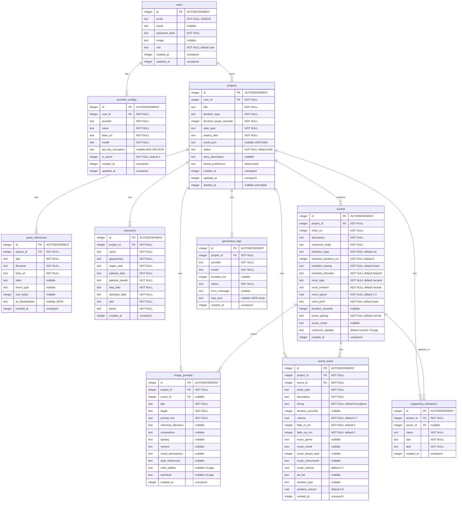

# Database Schema — PromptFlow V3

**Versi:** 3.0  
**Tanggal:** 2026-06-22  
**Status:** Draft  
**Database:** Turso (libSQL / SQLite compatible)  
**ORM:** Drizzle ORM ^0.38.0  
**Sumber:** src/lib/db/schema.ts, drizzle/0000_gigantic_genesis.sql, drizzle/0001_v3_core_features.sql

---

## 1. Data Model Summary

| Aspek | Detail |
|-------|--------|
| **Tipe DB** | Relational (SQLite / libSQL) |
| **Provider** | Turso - edge-compatible SQLite, low latency, free tier |
| **ORM** | Drizzle ORM - type-safe SQL, migration tooling |
| **Jumlah Tabel** | 10 (9 existing + 1 V3 new) |
| **Strategi** | 3NF normalized. Soft delete pada projects. JSON blob pada result_json dan logs_json (intentional denormalization). |
| **V3 Update** | Incremental: 3 ALTER TABLE + generate route patch. Non-breaking. |

**Justifikasi SQLite/Turso:**
- Single-user app, read-heavy, low write concurrency
- Edge deployment di Vercel - Turso replicate ke edge, latency <50ms
- Free tier cukup untuk target user (solo creator, freelancer)
- Drizzle ORM punya first-class SQLite support + migration CLI

---

## 2. Entity List

| # | Entity | Tabel DB | Deskripsi |
|---|--------|----------|-----------|
| 1 | User | users | Pengguna aplikasi. Autentikasi via NextAuth Credentials. |
| 2 | Provider Config | provider_configs | Konfigurasi LLM provider per user. API key terenkripsi AES-256-GCM. |
| 3 | Project | projects | Satu animation brief. Root entity. Soft delete via deleted_at. |
| 4 | Asset Reference | asset_references | File upload (gambar/video) via Vercel Blob. |
| 5 | Character | characters | Karakter utama per project (1:many). Deskripsi fisik lengkap. |
| 6 | Scene | scenes | Satu scene dalam animation brief. Punya transisi, voice, pacing, mood. |
| 7 | Image Prompt | image_prompts | Prompt 8-lapis untuk AI image generator per scene. |
| 8 | Generation Log | generation_logs | Log satu kali proses generate (LLM call, durasi, status, error). |
| 9 | Supporting Character | supporting_characters | Karakter pendukung per project, opsional per scene. |
| 10 | Scene Audio | scene_audio | Spesifikasi audio per scene (BGM, SFX, ambient, music cue, transition audio). V3 NEW. |
---

## 3. ERD (Entity Relationship Diagram)


---

## 4. Table Definitions

### 4.1 users

| Kolom | Tipe | Nullable | Default | Unique | Deskripsi |
|-------|------|----------|---------|--------|-----------|
| id | INTEGER | NO | autoincrement | PK | Primary key |
| email | TEXT | NO | — | YES | Email pengguna. Login credential. |
| name | TEXT | YES | — | NO | Nama tampilan |
| password_hash | TEXT | NO | — | NO | Hash bcryptjs |
| image | TEXT | YES | — | NO | URL foto profil |
| role | TEXT | NO | 'user' | NO | Peran: user / admin |
| created_at | INTEGER | NO | unixepoch() | NO | Timestamp buat |
| updated_at | INTEGER | NO | unixepoch() | NO | Timestamp update |

**Drizzle source:** schema.ts:5-14

---

### 4.2 provider_configs

| Kolom | Tipe | Nullable | Default | Unique | Deskripsi |
|-------|------|----------|---------|--------|-----------|
| id | INTEGER | NO | autoincrement | PK | Primary key |
| user_id | INTEGER | NO | — | FK | Referensi users.id CASCADE |
| provider | TEXT | NO | — | NO | Nama provider: ollama/openrouter/9router/custom |
| name | TEXT | NO | — | NO | Nama config (unik per user) |
| base_url | TEXT | NO | — | NO | Endpoint LLM API |
| model | TEXT | NO | — | NO | Model identifier (e.g. llama3, gpt-4o) |
| api_key_encrypted | TEXT | YES | — | NO | API key terenkripsi AES-256-GCM |
| is_active | INTEGER | NO | 1 | NO | 1=aktif, 0=nonaktif |
| created_at | INTEGER | NO | unixepoch() | NO | Timestamp buat |
| updated_at | INTEGER | NO | unixepoch() | NO | Timestamp update |

**Drizzle source:** schema.ts:17-30

---

### 4.3 projects

| Kolom | Tipe | Nullable | Default | Unique | Deskripsi |
|-------|------|----------|---------|--------|-----------|
| id | INTEGER | NO | autoincrement | PK | Primary key |
| user_id | INTEGER | NO | — | FK | Referensi users.id CASCADE |
| title | TEXT | NO | — | NO | Judul project |
| duration_type | TEXT | NO | — | NO | Tipe durasi (shorts/tutorial/long) |
| duration_target_seconds | INTEGER | NO | — | NO | Target durasi detik |
| style_type | TEXT | NO | — | NO | Gaya visual (cinematic/flat/3d/dll) |
| aspect_ratio | TEXT | NO | — | NO | Rasio aspek (16:9, 9:16, 1:1) |
| result_json | TEXT | YES | — | NO | Full JSON result dari generate |
| status | TEXT | NO | 'draft' | NO | Status: draft/generating/completed/failed |
| story_description | TEXT | YES | — | NO | Deskripsi cerita (V2) |
| theme_preference | TEXT | YES | 'dark' | NO | UI theme: dark/light/system (V3) |
| created_at | INTEGER | NO | unixepoch() | NO | Timestamp buat |
| updated_at | INTEGER | NO | unixepoch() | NO | Timestamp update |
| deleted_at | INTEGER | YES | — | NO | Soft delete timestamp |

**Drizzle source:** schema.ts:33-51

---

### 4.4 asset_references

| Kolom | Tipe | Nullable | Default | Unique | Deskripsi |
|-------|------|----------|---------|--------|-----------|
| id | INTEGER | NO | autoincrement | PK | Primary key |
| project_id | INTEGER | NO | — | FK | Referensi projects.id CASCADE |
| tipe | TEXT | NO | — | NO | Tipe asset: character_ref/background/video |
| filename | TEXT | NO | — | NO | Nama file |
| blob_url | TEXT | NO | — | NO | URL Vercel Blob storage |
| label | TEXT | YES | — | NO | Label deskriptif |
| mime_type | TEXT | YES | — | NO | MIME type file |
| size_bytes | INTEGER | YES | — | NO | Ukuran file bytes |
| ai_classification | TEXT | YES | — | NO | Hasil klasifikasi AI (JSON) |
| created_at | INTEGER | NO | unixepoch() | NO | Timestamp upload |

**Drizzle source:** schema.ts:54-68

---

### 4.5 characters

| Kolom | Tipe | Nullable | Default | Unique | Deskripsi |
|-------|------|----------|---------|--------|-----------|
| id | INTEGER | NO | autoincrement | PK | Primary key |
| project_id | INTEGER | NO | — | FK | Referensi projects.id CASCADE |
| nama | TEXT | NO | — | NO | Nama karakter |
| gayarambut | TEXT | NO | — | NO | Deskripsi gaya rambut |
| wajah_asal | TEXT | NO | — | NO | Deskripsi wajah/etnis |
| pakaian_atas | TEXT | NO | — | NO | Deskripsi pakaian atas |
| pakaian_bawah | TEXT | NO | — | NO | Deskripsi pakaian bawah |
| alas_kaki | TEXT | NO | — | NO | Deskripsi sepatu/sandal |
| deskripsi_latar | TEXT | NO | — | NO | Deskripsi latar belakang default |
| aksi | TEXT | NO | — | NO | Aksi default karakter |
| peran | TEXT | NO | — | NO | Peran: protagonist/antagonist/narrator |
| created_at | INTEGER | NO | unixepoch() | NO | Timestamp buat |

**Drizzle source:** schema.ts:71-87
---

### 4.6 scenes

| Kolom | Tipe | Nullable | Default | Unique | Deskripsi |
|-------|------|----------|---------|--------|-----------|
| id | INTEGER | NO | autoincrement | PK | Primary key |
| project_id | INTEGER | NO | — | FK | Referensi projects.id CASCADE |
| order_no | INTEGER | NO | — | NO | Urutan scene (1, 2, 3...) |
| description | TEXT | NO | — | NO | Deskripsi scene |
| voiceover_script | TEXT | NO | — | NO | Naskah voiceover |
| transition_type | TEXT | NO | 'cut' | NO | cut/dissolve/fade_to_black/fade_to_white/wipe/match_cut |
| transition_duration_ms | INTEGER | NO | 0 | NO | Durasi transisi milidetik |
| transition_easing | TEXT | NO | 'linear' | NO | Easing: linear/ease-in/ease-out/ease-in-out |
| transition_direction | TEXT | NO | 'forward' | NO | Arah: forward/backward/left/right |
| voice_type | TEXT | NO | 'narrator' | NO | child/teen/adult_male/adult_female/elderly_male/elderly_female/narrator |
| voice_emotion | TEXT | NO | 'neutral' | NO | neutral/happy/sad/excited/serious/calm/dramatic/melancholy |
| voice_speed | REAL | NO | 1.0 | NO | Kecepatan bicara (0.5-2.0) |
| voice_pitch | TEXT | NO | 'auto' | NO | auto/high/medium/low |
| duration_seconds | INTEGER | YES | — | NO | Durasi scene detik |
| scene_pacing | TEXT | NO | 'normal' | NO | fast/normal/slow |
| scene_mood | TEXT | YES | — | NO | Mood: cheerful/dramatic/tense/peaceful/mysterious/dll |
| voiceover_speaker | TEXT | YES | 'narrator' | NO | **V3 GAP** — Nama karakter atau "narrator" |
| created_at | INTEGER | NO | unixepoch() | NO | Timestamp buat |

**Drizzle source:** schema.ts:90-115

---

### 4.7 image_prompts

| Kolom | Tipe | Nullable | Default | Unique | Deskripsi |
|-------|------|----------|---------|--------|-----------|
| id | INTEGER | NO | autoincrement | PK | Primary key |
| project_id | INTEGER | NO | — | FK | Referensi projects.id CASCADE |
| scene_id | INTEGER | YES | — | FK | Referensi scenes.id CASCADE |
| tipe | TEXT | NO | — | NO | Tipe: character/environment/action/close-up |
| target | TEXT | NO | — | NO | Target render (nama karakter/objek) |
| prompt_text | TEXT | NO | — | NO | Prompt utama (layer 1) |
| reference_filename | TEXT | YES | — | NO | File referensi visual |
| composition | TEXT | YES | — | NO | Layer 2: komposisi frame |
| lighting | TEXT | YES | — | NO | Layer 3: pencahayaan |
| camera | TEXT | YES | — | NO | Layer 4: angle kamera |
| mood_atmosphere | TEXT | YES | — | NO | Layer 5: mood dan atmosfer |
| style_references | TEXT | YES | — | NO | Layer 6: referensi gaya visual |
| color_palette | TEXT | YES | — | NO | **V3 GAP** — Layer 7: palet warna dominan |
| technical | TEXT | YES | — | NO | **V3 GAP** — Layer 8: spesifikasi teknis |
| created_at | INTEGER | NO | unixepoch() | NO | Timestamp buat |

**Drizzle source:** schema.ts:118-139

---

### 4.8 generation_logs

| Kolom | Tipe | Nullable | Default | Unique | Deskripsi |
|-------|------|----------|---------|--------|-----------|
| id | INTEGER | NO | autoincrement | PK | Primary key |
| project_id | INTEGER | NO | — | FK | Referensi projects.id CASCADE |
| provider | TEXT | NO | — | NO | Provider yang dipakai |
| model | TEXT | NO | — | NO | Model yang dipakai |
| duration_ms | INTEGER | YES | — | NO | Durasi generate milidetik |
| status | TEXT | NO | — | NO | success/failed/timeout |
| error_message | TEXT | YES | — | NO | Pesan error jika gagal |
| logs_json | TEXT | YES | — | NO | JSON array log proses real-time |
| created_at | INTEGER | NO | unixepoch() | NO | Timestamp generate |

**Drizzle source:** schema.ts:142-155

---

### 4.9 supporting_characters

| Kolom | Tipe | Nullable | Default | Unique | Deskripsi |
|-------|------|----------|---------|--------|-----------|
| id | INTEGER | NO | autoincrement | PK | Primary key |
| project_id | INTEGER | NO | — | FK | Referensi projects.id CASCADE |
| scene_id | INTEGER | YES | — | FK | Referensi scenes.id SET NULL |
| nama | TEXT | NO | — | NO | Nama karakter pendukung |
| tipe | TEXT | NO | — | NO | Tipe: npc/crowd/animal/object |
| aksi | TEXT | NO | — | NO | Aksi yang dilakukan |
| created_at | INTEGER | NO | unixepoch() | NO | Timestamp buat |

**Drizzle source:** schema.ts:158-169

---

### 4.10 scene_audio

| Kolom | Tipe | Nullable | Default | Unique | Deskripsi |
|-------|------|----------|---------|--------|-----------|
| id | INTEGER | NO | autoincrement | PK | Primary key |
| project_id | INTEGER | NO | — | FK | Referensi projects.id CASCADE |
| scene_id | INTEGER | NO | — | FK | Referensi scenes.id CASCADE |
| audio_type | TEXT | NO | — | NO | background_music/sfx/ambient/music_cue/transition_audio |
| description | TEXT | NO | — | NO | Deskripsi audio |
| timing | TEXT | NO | 'throughout' | NO | throughout/intro/outro/specific |
| duration_seconds | INTEGER | YES | — | NO | Durasi audio detik |
| volume | REAL | NO | 0.7 | NO | Volume 0.0-1.0 |
| fade_in_ms | INTEGER | NO | 0 | NO | Fade in milidetik |
| fade_out_ms | INTEGER | NO | 0 | NO | Fade out milidetik |
| music_genre | TEXT | YES | — | NO | Genre musik (jazz/orchestral/electronic/dll) |
| music_mood | TEXT | YES | — | NO | Mood musik (upbeat/calm/tense/dll) |
| music_tempo_bpm | INTEGER | YES | — | NO | Tempo BPM |
| music_instruments | TEXT | YES | — | NO | Daftar instrumen (comma-separated) |
| music_volume | REAL | YES | 0.7 | NO | Volume musik khusus |
| sfx_list | TEXT | YES | — | NO | Daftar sound effects (comma-separated) |
| ambient_type | TEXT | YES | — | NO | Tipe ambient (nature/city/indoor/dll) |
| ambient_volume | REAL | YES | 0.5 | NO | Volume ambient |
| created_at | INTEGER | NO | unixepoch() | NO | Timestamp buat |

**Drizzle source:** schema.ts:172-196
---

## 5. Primary Keys, Foreign Keys and Relationships

### 5.1 Primary Keys

Semua tabel menggunakan INTEGER id PRIMARY KEY AUTOINCREMENT (SQLite).

### 5.2 Foreign Keys

| Tabel | Kolom FK | Referensi | ON DELETE | ON UPDATE |
|-------|----------|-----------|-----------|-----------|
| provider_configs | user_id | users.id | CASCADE | NO ACTION |
| projects | user_id | users.id | CASCADE | NO ACTION |
| asset_references | project_id | projects.id | CASCADE | NO ACTION |
| characters | project_id | projects.id | CASCADE | NO ACTION |
| scenes | project_id | projects.id | CASCADE | NO ACTION |
| image_prompts | project_id | projects.id | CASCADE | NO ACTION |
| image_prompts | scene_id | scenes.id | CASCADE | NO ACTION |
| generation_logs | project_id | projects.id | CASCADE | NO ACTION |
| supporting_characters | project_id | projects.id | CASCADE | NO ACTION |
| supporting_characters | scene_id | scenes.id | SET NULL | NO ACTION |
| scene_audio | project_id | projects.id | CASCADE | NO ACTION |
| scene_audio | scene_id | scenes.id | CASCADE | NO ACTION |

### 5.3 Relationship Types

| Relasi | Tipe | Detail |
|--------|------|--------|
| users -> provider_configs | 1:N | Satu user punya banyak provider config |
| users -> projects | 1:N | Satu user punya banyak project |
| projects -> scenes | 1:N | Satu project punya banyak scene |
| projects -> characters | 1:N | Satu project punya banyak karakter utama |
| projects -> image_prompts | 1:N | Satu project punya banyak image prompt |
| projects -> generation_logs | 1:N | Satu project punya banyak log generate |
| projects -> supporting_characters | 1:N | Satu project punya banyak supporting character |
| projects -> scene_audio | 1:N | Satu project punya banyak audio spec |
| projects -> asset_references | 1:N | Satu project punya banyak asset upload |
| scenes -> image_prompts | 1:N | Satu scene punya banyak image prompt (via scene_id) |
| scenes -> scene_audio | 1:N | Satu scene punya banyak audio spec (0-5) |
| scenes -> supporting_characters | 1:N | Satu scene bisa punya banyak supporting character |

**Tidak ada relasi N:N** dalam schema saat ini.
---

## 6. Indexes

| # | Nama Index | Tabel | Kolom | Tipe | Rationale |
|---|------------|-------|-------|------|-----------|
| 1 | users_email_unique | users | email | UNIQUE | Login lookup by email |
| 2 | idx_provider_configs_user_name | provider_configs | user_id, name | UNIQUE | Prevent duplicate config name per user |
| 3 | idx_projects_user_id | projects | user_id | INDEX | List projects by user |
| 4 | idx_projects_user_created | projects | user_id, created_at | INDEX | Sort projects by date per user |
| 5 | idx_asset_refs_project_id | asset_references | project_id | INDEX | List assets by project |
| 6 | idx_asset_refs_project_tipe | asset_references | project_id, tipe | INDEX | Filter assets by type per project |
| 7 | idx_characters_project_id | characters | project_id | INDEX | List characters by project |
| 8 | idx_characters_project_nama | characters | project_id, nama | UNIQUE | Prevent duplicate character name per project |
| 9 | idx_scenes_project_id | scenes | project_id | INDEX | List scenes by project |
| 10 | idx_scenes_project_order | scenes | project_id, order_no | UNIQUE | Ensure unique scene ordering per project |
| 11 | idx_image_prompts_project_id | image_prompts | project_id | INDEX | List prompts by project |
| 12 | idx_image_prompts_scene_id | image_prompts | scene_id | INDEX | List prompts by scene |
| 13 | idx_image_prompts_project_tipe | image_prompts | project_id, tipe | INDEX | Filter prompts by type per project |
| 14 | idx_image_prompts_project_scene | image_prompts | project_id, scene_id | INDEX | Join prompt+scene per project |
| 15 | idx_gen_logs_project_id | generation_logs | project_id | INDEX | List logs by project |
| 16 | idx_gen_logs_project_created | generation_logs | project_id, created_at | INDEX | Sort logs by date per project |
| 17 | idx_supporting_chars_project_id | supporting_characters | project_id | INDEX | List supporting chars by project |
| 18 | idx_supporting_chars_scene_id | supporting_characters | scene_id | INDEX | List supporting chars by scene |
| 19 | idx_scene_audio_project_id | scene_audio | project_id | INDEX | List audio by project |
| 20 | idx_scene_audio_scene_id | scene_audio | scene_id | INDEX | List audio by scene |
| 21 | idx_scene_audio_project_scene | scene_audio | project_id, scene_id | INDEX | Join audio+scene per project |

---

## 7. Constraints and DB-Level Validation

### 7.1 NOT NULL Constraints

Semua kolom NOT NULL sudah didefinisikan di Drizzle schema. Kolom nullable:
- **users:** name, image
- **provider_configs:** api_key_encrypted
- **projects:** result_json, story_description, theme_preference, deleted_at
- **asset_references:** label, mime_type, size_bytes, ai_classification
- **scenes:** duration_seconds, scene_mood, voiceover_speaker
- **image_prompts:** scene_id, reference_filename, composition, lighting, camera, mood_atmosphere, style_references, color_palette, technical
- **generation_logs:** duration_ms, error_message, logs_json
- **supporting_characters:** scene_id
- **scene_audio:** duration_seconds

### 7.2 UNIQUE Constraints

| Constraint | Tabel | Kolom |
|------------|-------|-------|
| users_email_unique | users | email |
| idx_provider_configs_user_name | provider_configs | (user_id, name) |
| idx_characters_project_nama | characters | (project_id, nama) |
| idx_scenes_project_order | scenes | (project_id, order_no) |

### 7.3 CHECK Constraints

SQLite CHECK constraints tidak didefinisikan di Drizzle schema saat ini. Validasi dilakukan di layer Zod (application-level). Enum values yang HARUS divalidasi:

| Kolom | Allowed Values | Validated By |
|-------|---------------|--------------|
| users.role | user, admin | Zod |
| projects.status | draft, generating, completed, failed | Zod |
| projects.duration_type | shorts, tutorial, long | Zod |
| projects.aspect_ratio | 16:9, 9:16, 1:1, 4:3 | Zod |
| projects.theme_preference | dark, light, system | ThemePreferenceSchema |
| scenes.transition_type | cut, dissolve, fade_to_black, fade_to_white, wipe, match_cut | Zod |
| scenes.transition_easing | linear, ease-in, ease-out, ease-in-out | Zod |
| scenes.transition_direction | forward, backward, left, right | Zod |
| scenes.voice_type | child, teen, adult_male, adult_female, elderly_male, elderly_female, narrator | Zod |
| scenes.voice_emotion | neutral, happy, sad, excited, serious, calm, dramatic, melancholy | Zod |
| scenes.voice_pitch | auto, high, medium, low | Zod |
| scenes.scene_pacing | fast, normal, slow | Zod |
| scene_audio.audio_type | background_music, sfx, ambient, music_cue, transition_audio | Zod |
| scene_audio.timing | throughout, intro, outro, specific | Zod |

### 7.4 Default Values

| Kolom | Default | Source |
|-------|---------|--------|
| users.role | 'user' | schema.ts:11 |
| provider_configs.is_active | 1 | schema.ts:25 |
| projects.status | 'draft' | schema.ts:42 |
| projects.theme_preference | 'dark' | schema.ts:44 |
| scenes.transition_type | 'cut' | schema.ts:97 |
| scenes.transition_duration_ms | 0 | schema.ts:98 |
| scenes.transition_easing | 'linear' | schema.ts:99 |
| scenes.transition_direction | 'forward' | schema.ts:100 |
| scenes.voice_type | 'narrator' | schema.ts:102 |
| scenes.voice_emotion | 'neutral' | schema.ts:103 |
| scenes.voice_speed | 1.0 | schema.ts:104 |
| scenes.voice_pitch | 'auto' | schema.ts:105 |
| scenes.scene_pacing | 'normal' | schema.ts:109 |
| scene_audio.timing | 'throughout' | schema.ts:178 |
| scene_audio.volume | 0.7 | schema.ts:180 |
| scene_audio.fade_in_ms | 0 | schema.ts:181 |
| scene_audio.fade_out_ms | 0 | schema.ts:182 |
| scene_audio.music_volume | 0.7 | schema.ts:187 |
| scene_audio.ambient_volume | 0.5 | schema.ts:190 |
| semua created_at | unixepoch() | schema.ts (all tables) |
| semua updated_at | unixepoch() | schema.ts (users, projects, provider_configs) |
---

## 8. Normalization Strategy

| Aspek | Strategi | Alasan |
|-------|----------|--------|
| Normal form | 3NF (Third Normal Form) | Sebagian besar tabel sudah 3NF |
| Denormalization #1 | projects.result_json | Simpan full JSON LLM output. Data besar, jarang di-query per-field, hanya di-read utuh untuk export. |
| Denormalization #2 | generation_logs.logs_json | JSON array log proses. Write-once, read-rarely. Tidak perlu normalize ke tabel log_entries. |
| Denormalization #3 | scene_audio.music_instruments, sfx_list | Comma-separated text. Simple list, tidak perlu junction table untuk app skala ini. |
| Denormalization #4 | asset_references.ai_classification | JSON blob dari Vision LLM. Tidak di-query per-field. |

---

## 9. Migration Plan

### 9.1 Migration History

| # | File | Deskripsi | Status |
|---|------|-----------|--------|
| 0000 | 0000_gigantic_genesis.sql | Initial schema: 9 tabel (users, provider_configs, projects, asset_references, characters, scenes, image_prompts, generation_logs, supporting_characters) | Done |
| 0001 | 0001_v3_core_features.sql | V3 core: 11 ALTER TABLE pada scenes + image_prompts + projects. CREATE TABLE scene_audio + 3 indexes. | Done |
| 0002 | 0002_v3_gap_closure.sql | V3 gap closure: 3 ALTER TABLE (voiceover_speaker, color_palette, technical) | Pending |

### 9.2 V3 Gap Closure Migration (0002)

```sql
-- 0002_v3_gap_closure.sql
-- V3 Gap Closure: 3 missing columns

ALTER TABLE scenes ADD voiceover_speaker TEXT DEFAULT 'narrator';
ALTER TABLE image_prompts ADD color_palette TEXT;
ALTER TABLE image_prompts ADD technical TEXT;
```

**Rollback:**
```sql
ALTER TABLE scenes DROP COLUMN voiceover_speaker;
ALTER TABLE image_prompts DROP COLUMN color_palette;
ALTER TABLE image_prompts DROP COLUMN technical;
```

### 9.3 Table Creation Order (Dependencies)

```
1. users                    (no FK)
2. provider_configs          (FK -> users)
3. projects                  (FK -> users)
4. asset_references          (FK -> projects)
5. characters                (FK -> projects)
6. scenes                    (FK -> projects)
7. image_prompts             (FK -> projects, scenes)
8. generation_logs           (FK -> projects)
9. supporting_characters     (FK -> projects, scenes)
10. scene_audio              (FK -> projects, scenes)
```

### 9.4 Migration Tooling

| Tool | Command |
|------|---------|
| Generate migration | npx drizzle-kit generate |
| Apply migration | npx drizzle-kit migrate |
| Push (dev) | npx drizzle-kit push |
| Studio (visual) | npx drizzle-kit studio |
| V2-to-V3 script | src/lib/migration/v2-to-v3.ts (custom: migrateV2ToV3 + rollbackV2ToV3) |

**Config:** drizzle.config.ts — schema: src/lib/db/schema.ts, out: drizzle/, dialect: sqlite

---

## 10. Initial Seed / Master Data

Tidak ada seed data wajib. Data yang diisi otomatis:

| Tipe | Sumber | Detail |
|------|--------|--------|
| Admin user | Manual INSERT atau register pertama | role = 'admin' |
| Template presets | src/lib/templates/presets.ts (in-memory) | 5 presets: tutorial, cinematic, kids, documentary, action. Tidak disimpan di DB. |
| Provider presets | src/lib/ai/provider-registry.ts (in-memory) | 4 presets: ollama, openrouter, 9router, custom. Tidak disimpan di DB. |

**Catatan:** Template dan provider presets adalah data application-level (hardcoded), bukan database seed.
---

## 11. Considerations

### 11.1 Data Retention

| Data | Retensi | Strategi |
|------|---------|----------|
| Projects | Soft delete (deleted_at) | Tidak auto-purge. User bisa restore. |
| Generation logs | Selamanya | Tidak ada auto-cleanup. Volume kecil. |
| Asset references | Ikut project | CASCADE delete saat project hard-deleted. Blob URL orphaned perlu manual cleanup. |
| Scene audio | Ikut scene/project | CASCADE delete. |

### 11.2 Soft Delete

Hanya projects yang punya soft delete (deleted_at). Query default HARUS filter WHERE deleted_at IS NULL. Repository pattern di project.repo.ts sudah handle ini.

### 11.3 Audit Columns

| Kolom | Tabel | Pola |
|-------|-------|------|
| created_at | Semua tabel | INTEGER DEFAULT unixepoch() NOT NULL |
| updated_at | users, provider_configs, projects | INTEGER DEFAULT unixepoch() NOT NULL |
| deleted_at | projects | INTEGER nullable (soft delete) |

**Catatan:** updated_at TIDAK auto-update via trigger di SQLite. Aplikasi HARUS set updated_at = unixepoch() secara eksplisit saat UPDATE query. Drizzle ORM tidak auto-set ini — perlu manual di repository layer.

### 11.4 Data Integrity

| Mekanisme | Detail |
|-----------|--------|
| FK cascade | Semua child table: ON DELETE CASCADE. Exception: supporting_characters.scene_id -> SET NULL. |
| Unique constraints | 4 unique indexes mencegah data duplikat (email, provider name, character name, scene order). |
| Zod validation | Application-level validation sebelum INSERT. Enum values, string length, format. |
| Transaction | Generate route menggunakan batch INSERT. Jika satu gagal, rollback semua (Drizzle transaction). |

### 11.5 Scalability

| Aspek | Status | Catatan |
|-------|--------|---------|
| Read scaling | OK | Turso replicate ke edge. SQLite read = fast. |
| Write scaling | OK untuk skala saat ini | Single-instance. Turso handle write forwarding. |
| Table size | Kecil | Target: <10K rows per tabel untuk user base <1000. |
| Index coverage | Lengkap | Semua FK dan frequent query pattern punya index. |
| JSON blob size | Monitor | result_json bisa besar (10KB+). Tidak di-index. |
| Future: partitioning | Tidak perlu | SQLite + Turso cukup untuk skala ini. Jika scale-up needed, migrasi ke PostgreSQL. |

### 11.6 scene_audio Table Verification

scene_audio table sudah ada dan schema sudah sesuai kebutuhan V3:

| Aspek | Status |
|-------|--------|
| 5 audio types (background_music, sfx, ambient, music_cue, transition_audio) | OK |
| Timing options (throughout, intro, outro, specific) | OK |
| Volume/fade controls | OK |
| Music-specific fields (genre, mood, tempo, instruments) | OK |
| SFX list | OK |
| Ambient type + volume | OK |
| FK ke projects dan scenes dengan CASCADE | OK |
| 3 indexes (project_id, scene_id, project+scene) | OK |
| Generate route INSERT logic | GAP — perlu patch di generate/route.ts |

---

## 12. V3 Gap Summary

| # | Gap | Tabel | Kolom Baru | Migration | Status |
|---|-----|-------|------------|-----------|--------|
| 1 | voiceover_speaker | scenes | voiceover_speaker TEXT DEFAULT 'narrator' | 0002 | Perlu migration |
| 2 | color_palette | image_prompts | color_palette TEXT | 0002 | Perlu migration |
| 3 | technical | image_prompts | technical TEXT | 0002 | Perlu migration |
| 4 | audio_specs to scene_audio | scene_audio | (table sudah ada) | — | Perlu generate route patch |
| 5 | Drizzle schema update | schema.ts | Tambah 3 kolom ke Drizzle definition | — | Perlu update schema.ts |

---

*Dokumen ini berdasarkan evidence dari src/lib/db/schema.ts, drizzle/0000_gigantic_genesis.sql, drizzle/0001_v3_core_features.sql, PRD.md, SRS.md, dan RAG-CONTEXT.md. Semua claim teknis memiliki sitasi ke file dan baris kode.*
