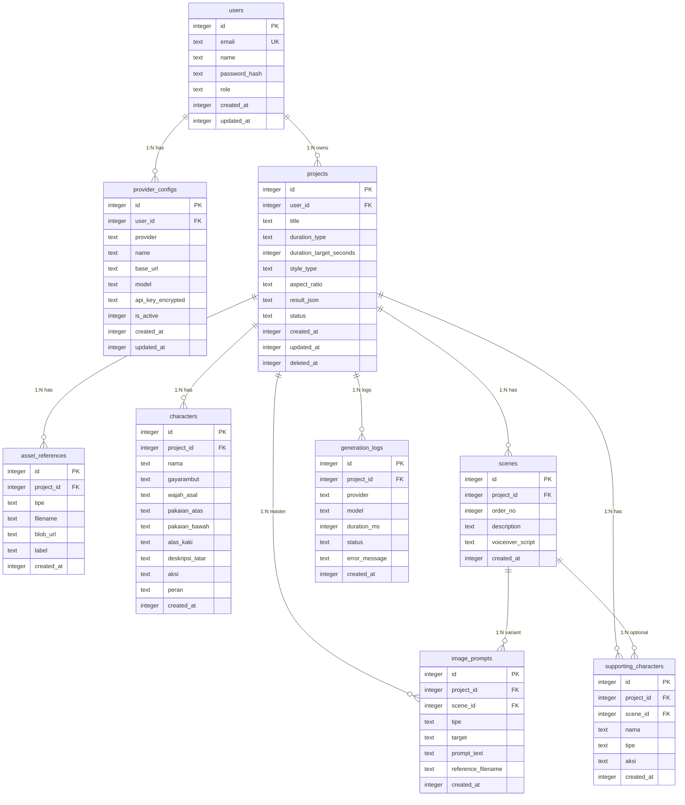

# Database Schema — PromptFlow

> **Versi:** 1.0
> **Dibuat:** 2026-06-19
> **Status:** Draft
> **Pemilik:** Bos Agrian
> **Sumber kebenaran:** `product-docs/RAG-CONTEXT.md` + `product-docs/PRD.md` + `product-docs/SRS.md` (bersitasi per klaim penting)
> **Root proyek:** `C:\laragon\www\PromptFlow`
> **GitHub:** https://github.com/agrianwahab29/promptflow.git
> **Catatan:** Dokumen ini turun dari data model SRS §6 (9 entitas) + fitur PRD (FR-07, FR-12, FR-13, FR-14, FR-15, FR-17) + constraint SRS §8/§9. ORM = Drizzle (asumsi SRS-A3). DB = Turso/libSQL (SQLite-compatible via HTTP). Enkripsi API key = AES-256-GCM (asumsi SRS-A4). Batas tokoh default 10 (asumsi SRS-A10). Soft delete via `deleted_at` (asumsi SRS-A19).

---

## Daftar Isi

1. Pendahuluan & Justifikasi Database
2. Daftar Entitas
3. ERD (Diagram Relasi)
4. Definisi Tabel
5. Indexes
6. Constraints & Validation
7. Strategi Normalisasi
8. Migration Plan
9. Seed Data
10. Data Retention & Soft Delete
11. Keamanan Data
12. Catatan Desain

---

## 1. Pendahuluan & Justifikasi Database

### 1.1 Pilihan Database

| Aspek | Nilai | Bukti |
|---|---|---|
| Jenis | Relasional (SQLite-compatible) | `SRS.md 4.1` |
| Engine | Turso (libSQL, SQLite-compatible via HTTP) | `RAG-CONTEXT.md 2.1, 2.2` ; `SRS.md 4.1` |
| ORM | Drizzle ORM | ASUMSI SRS-A3 `SRS.md 4.2 #4, 12 SRS-A3` |
| DB client | `@libsql/client` (di bawah Drizzle) | `SRS.md 4.1` ; https://docs.turso.tech/sdk/ts/guides/nextjs |
| Akses | Remote HTTP (serverless-safe) | `RAG-CONTEXT.md 2.2, 5.4` |
| Deploy | Vercel + Turso Cloud | `SRS.md 1.2` |

### 1.2 Justifikasi Turso/libSQL

1. **Vercel filesystem tidak persisten.** SQLite file lokal hilang saat instance recycle. Turso = SQLite-compatible via HTTP, persisten, serverless-safe. `RAG-CONTEXT.md 2.2, 5.4`
2. **Resmi Vercel Marketplace.** Turso Cloud integration didukung native. `RAG-CONTEXT.md 2.1`
3. **SQLite-compatible.** Skema portabel, tipe data SQLite standar (`integer`, `text`, `blob`, `real`). Hindari fitur PostgreSQL-specific. `SRS.md 8.2`
4. **Drizzle ORM.** Type-safe, ringan, migration bawaan (`drizzle-kit`), dukung libSQL driver. `SRS.md 4.2 #4`

### 1.3 Tipe Data SQLite ↔ Drizzle Mapping

| SQLite type | Drizzle builder | Penggunaan |
|---|---|---|
| `INTEGER` | `integer()` / `integer({ mode: 'number' })` | PK auto-increment, FK, counter, boolean (0/1), timestamp (unix epoch) |
| `TEXT` | `text()` | string, JSON serialize, enum (text), timestamp ISO-8601 |
| `BLOB` | `blob()` | data biner (tidak dipakai fase awal) |
| `REAL` | `real()` | angka desimal (durasi ms, dll) |

> **Catatan timestamp:** Drizzle mendukung `integer({ mode: 'timestamp' })` (unix epoch) dan `integer({ mode: 'timestamp_ms' })`. SRS tidak spesifik. Dokumen ini pakai `integer` unix epoch second untuk `created_at`/`updated_at`/`deleted_at` (ASUMSI). Konsisten lintas tabel.

---

## 2. Daftar Entitas

9 entitas dari SRS §6.1:

| # | Entitas (tabel) | Deskripsi singkat | Bukti |
|---|---|---|---|
| 1 | `users` | Akun user (login NextAuth). 1:N Project, 1:N ProviderConfig. | ASUMSI SRS-A1 `SRS.md 6.1` ; `PRD.md 5 (FR-18)` |
| 2 | `provider_configs` | Konfigurasi provider LLM per user (Ollama cloud/OpenRouter/9router/custom). API key terenkripsi AES-256-GCM. | `PRD.md 5 (FR-13, FR-14)` ; `SRS.md 6.1` |
| 3 | `projects` | Project prompt animasi. Simpan metadata + `result_json` (snapshot hasil generate). Soft delete via `deleted_at`. | `PRD.md 5 (FR-15)` ; `SRS.md 6.1` |
| 4 | `asset_references` | Metadata gambar referensi upload (Vercel Blob URL + filename). Tipe tokoh/background. | `PRD.md 5 (FR-17)` ; `SRS.md 6.1 (AssetReference)` |
| 5 | `characters` | Master karakter konsisten per project (FR-07). Identitas stabil lintas scene (FR-12). | `PRD.md 5 (FR-07, FR-12)` ; `SRS.md 6.1` |
| 6 | `scenes` | Adegan berurut per project. 1:N ImagePrompt (varian per scene). | `PRD.md 5 (FR-03, FR-04)` ; `SRS.md 6.1` |
| 7 | `image_prompts` | Prompt gambar per tokoh/background. Dua tipe: master list root (`scene_id` null) & varian per scene (`scene_id` terisi). | `PRD.md 5 (FR-06)` ; `SRS.md 6.1, 6.2 #2` |
| 8 | `generation_logs` | Log telemetri per generate (provider, model, durasi, status, error). | ASUMSI `SRS.md 6.1 (GenerationLog)` ; KPI K5 `BRD.md 3.2` |
| 9 | `supporting_characters` | Karakter pendukung/hewan + aksi (per project atau per scene). | `PRD.md 5 (FR-08)` ; `SRS.md 6.1` |

---

## 3. ERD (Diagram Relasi)

### 3.1 Deskripsi Relasi

| Relasi | Tipe | Dari | Ke | Aturan ON DELETE | Bukti |
|---|---|---|---|---|---|
| User → ProviderConfig | 1:N | `users.id` | `provider_configs.user_id` | CASCADE | `SRS.md 6.1` |
| User → Project | 1:N | `users.id` | `projects.user_id` | CASCADE (hard) / SET NULL `deleted_at` (soft) | `SRS.md 6.1` ; ASUMSI SRS-A19 |
| Project → AssetReference | 1:N | `projects.id` | `asset_references.project_id` | CASCADE | `SRS.md 6.1` |
| Project → Character | 1:N | `projects.id` | `characters.project_id` | CASCADE | `SRS.md 6.1` |
| Project → Scene | 1:N | `projects.id` | `scenes.project_id` | CASCADE | `SRS.md 6.1` |
| Project → ImagePrompt (master) | 1:N | `projects.id` | `image_prompts.project_id` (scene_id null) | CASCADE | `SRS.md 6.1, 6.2 #2` |
| Project → GenerationLog | 1:N | `projects.id` | `generation_logs.project_id` | CASCADE | `SRS.md 6.1` |
| Project → SupportingCharacter | 1:N | `projects.id` | `supporting_characters.project_id` | CASCADE | `SRS.md 6.1` |
| Scene → ImagePrompt (varian) | 1:N | `scenes.id` | `image_prompts.scene_id` | CASCADE | `SRS.md 6.1, 6.2 #2` |
| Scene → SupportingCharacter (opsional) | 1:N | `scenes.id` | `supporting_characters.scene_id` (nullable) | SET NULL | `SRS.md 6.1` |

### 3.2 Diagram Mermaid ERD



---

## 4. Definisi Tabel

> **Konvensi penamaan:** tabel jamak snake_case (`users`, `provider_configs`). Kolom snake_case. PK = `id` `INTEGER` auto-increment (Drizzle `integer().primaryKey().autoincrement()`). Timestamp = `integer` unix epoch second (ASUMSI). Boolean = `integer` 0/1.

### 4.1 `users`

Akun user login NextAuth. Sumber: ASUMSI SRS-A1 `SRS.md 6.1` ; `PRD.md 5 (FR-18)`.

| Kolom | Tipe SQLite | Drizzle | Nullable | Default | Unique | Deskripsi | Bukti |
|---|---|---|---|---|---|---|---|
| `id` | INTEGER | `integer().primaryKey().autoincrement()` | NO | auto | YES | PK auto | — |
| `email` | TEXT | `text()` | NO | — | YES | Email user (login) | `PRD.md 5 (FR-18)` |
| `name` | TEXT | `text()` | YES | NULL | NO | Nama tampilan | ASUMSI |
| `password_hash` | TEXT | `text()` | NO | — | NO | Hash password (NextAuth credentials) | ASUMSI SRS-A1 |
| `image` | TEXT | `text()` | YES | NULL | NO | URL avatar (opsional) | ASUMSI NextAuth |
| `role` | TEXT | `text()` | NO | `'user'` | NO | Role (`user` fase awal, ekstensi `admin` nanti) | ASUMSI |
| `created_at` | INTEGER | `integer().default(sql\`(unixepoch())\`)` | NO | epoch now | NO | Audit create | ASUMSI |
| `updated_at` | INTEGER | `integer().default(sql\`(unixepoch())\`)` | NO | epoch now | NO | Audit update | ASUMSI |

**PK:** `id`. **Unique:** `email`. **FK:** —. **Index:** `idx_users_email` (unique).

> **Catatan NextAuth:** NextAuth v5+ bisa pakai Turso adapter atau JWT cookie. Tabel `users` di sini = user record minimum. NextAuth session table bisa dibuat terpisah bila pakai DB adapter (ASUMSI — tergantung konfigurasi `lib/auth/config.ts`, detail di `PROJECT_ARCHITECTURE.md`). TIDAK ADA BUKTI preferensi (`RAG-CONTEXT.md 9 G2`).

### 4.2 `provider_configs`

Konfigurasi provider LLM per user. API key terenkripsi AES-256-GCM. Sumber: `PRD.md 5 (FR-13, FR-14)` ; `SRS.md 6.1, 9.1 SEC-01/SEC-02`.

| Kolom | Tipe SQLite | Drizzle | Nullable | Default | Unique | Deskripsi | Bukti |
|---|---|---|---|---|---|---|---|
| `id` | INTEGER | `integer().primaryKey().autoincrement()` | NO | auto | YES | PK auto | — |
| `user_id` | INTEGER | `integer().notNull()` | NO | — | NO | FK → `users.id` | `SRS.md 6.1` |
| `provider` | TEXT | `text().notNull()` | NO | — | NO | Enum: `ollama` / `openrouter` / `9router` / `custom` | `PRD.md 5 (FR-13)` ; `RAG-CONTEXT.md 5.2` |
| `name` | TEXT | `text().notNull()` | NO | — | NO | Label user (mis "Ollama Cloud Utama") | ASUMSI |
| `base_url` | TEXT | `text().notNull()` | NO | — | NO | Base URL provider (mis `https://ollama.com/v1`) | `RAG-CONTEXT.md 5.2` ; `SRS.md 5 (FR-13)` |
| `model` | TEXT | `text().notNull()` | NO | — | NO | Model ID (user input, no hardcode default) | ASUMSI SRS-A8 `SRS.md 12` |
| `api_key_encrypted` | TEXT | `text()` | YES | NULL | NO | JSON `{iv, ciphertext, tag}` AES-256-GCM. NULL bila provider tidak butuh key. | `PRD.md 5 (FR-14)` ; ASUMSI SRS-A4 `SRS.md 12, 6.2 #4` |
| `is_active` | INTEGER | `integer().notNull().default(1)` | NO | 1 | NO | Boolean 0/1. Provider aktif untuk generate. | ASUMSI |
| `created_at` | INTEGER | `integer().default(sql\`(unixepoch())\`)` | NO | epoch now | NO | Audit create | ASUMSI |
| `updated_at` | INTEGER | `integer().default(sql\`(unixepoch())\`)` | NO | epoch now | NO | Audit update | ASUMSI |

**PK:** `id`. **FK:** `user_id` → `users.id` ON DELETE CASCADE. **Unique:** (`user_id`, `name`) — satu nama config per user (ASUMSI). **Index:** `idx_provider_configs_user_id`.

> **Catatan enkripsi:** `api_key_encrypted` = JSON serialize `{ "iv": "<hex>", "ciphertext": "<hex>", "tag": "<hex>" }` dari `lib/crypto/aes.ts`. Decrypt hanya server-side di `provider.factory.ts`. Response API = mask `****` + 4 char terakhir. `SRS.md 5 (FR-14), 8.4, 9.1 SEC-02`.

### 4.3 `projects`

Project prompt animasi. Simpan metadata + `result_json` snapshot hasil generate. Soft delete via `deleted_at`. Sumber: `PRD.md 5 (FR-15), 8.2` ; `SRS.md 6.1, 6.2 #3/#5`.

| Kolom | Tipe SQLite | Drizzle | Nullable | Default | Unique | Deskripsi | Bukti |
|---|---|---|---|---|---|---|---|
| `id` | INTEGER | `integer().primaryKey().autoincrement()` | NO | auto | YES | PK auto | — |
| `user_id` | INTEGER | `integer().notNull()` | NO | — | NO | FK → `users.id` (ownership) | `PRD.md 5 (FR-15)` ; `SRS.md 5 (FR-15)` |
| `title` | TEXT | `text().notNull()` | NO | — | NO | Judul animasi (Zod `min(3).max(200)`) | `PRD.md 5 (FR-01)` ; `SRS.md 5 (FR-01)` |
| `duration_type` | TEXT | `text().notNull()` | NO | — | NO | Enum: `shorts` / `tutorial` | `PRD.md 5 (FR-02)` ; `SRS.md 5 (FR-02)` |
| `duration_target_seconds` | INTEGER | `integer().notNull()` | NO | — | NO | Detik target (shorts ≤180, tutorial 420-900) | `PRD.md 7 (AC-02)` ; `SRS.md 5 (FR-02)` |
| `style_type` | TEXT | `text().notNull()` | NO | — | NO | Enum: `3D` / `2D` | `PRD.md 5 (FR-10), 8.2` |
| `aspect_ratio` | TEXT | `text().notNull()` | NO | — | NO | Rasio (`16:9` / `9:16` / `1:1` / custom) | `PRD.md 5 (FR-10), 8.2` |
| `result_json` | TEXT | `text()` | YES | NULL | NO | Snapshot hasil generate (JSON serialize sesuai PRD §8.2). NULL bila belum generate. | `PRD.md 8.2` ; `SRS.md 6.2 #3` |
| `status` | TEXT | `text().notNull().default('draft')` | NO | `'draft'` | NO | Enum: `draft` / `generating` / `complete` / `failed` | ASUMSI |
| `created_at` | INTEGER | `integer().default(sql\`(unixepoch())\`)` | NO | epoch now | NO | Audit create | ASUMSI |
| `updated_at` | INTEGER | `integer().default(sql\`(unixepoch())\`)` | NO | epoch now | NO | Audit update | ASUMSI |
| `deleted_at` | INTEGER | `integer()` | YES | NULL | NO | Soft delete timestamp. NULL = aktif. | ASUMSI SRS-A19 `SRS.md 12` ; `SRS.md 6.2 #5` |

**PK:** `id`. **FK:** `user_id` → `users.id` ON DELETE CASCADE. **Index:** `idx_projects_user_id`, `idx_projects_user_created` (`user_id`, `created_at`) komposit untuk list paginate.

> **Catatan `result_json`:** Simpan full structured JSON (PRD §8.2) sebagai TEXT serialize. Entitas terpisah (`characters`, `scenes`, `image_prompts`) optional untuk query/filter. Fase awal bisa hanya simpan `result_json` saja bila query entitas tidak dibutuhkan — keputusan ini `DATABASE_SCHEMA.md` = simpan KEDUA (snapshot `result_json` + entitas terpisah) untuk fleksibilitas export & history. `SRS.md 6.2 #3`.

### 4.4 `asset_references`

Metadata gambar referensi upload via Vercel Blob. Sumber: `PRD.md 5 (FR-17)` ; `SRS.md 6.1 (AssetReference), 5 (FR-17), 8.5`.

| Kolom | Tipe SQLite | Drizzle | Nullable | Default | Unique | Deskripsi | Bukti |
|---|---|---|---|---|---|---|---|
| `id` | INTEGER | `integer().primaryKey().autoincrement()` | NO | auto | YES | PK auto | — |
| `project_id` | INTEGER | `integer().notNull()` | NO | — | NO | FK → `projects.id` | `SRS.md 6.1` |
| `tipe` | TEXT | `text().notNull()` | NO | — | NO | Enum: `tokoh` / `background` | `PRD.md 5 (FR-17)` ; `SRS.md 5 (FR-17)` |
| `filename` | TEXT | `text().notNull()` | NO | — | NO | Nama file asli (di-inject ke prompt sebagai `reference_filename`) | `RAG-CONTEXT.md 6` ; `PRD.md 5 (FR-17)` |
| `blob_url` | TEXT | `text().notNull()` | NO | — | NO | URL publik Vercel Blob (prod) / path lokal dev | ASUMSI SRS-A5 `SRS.md 12` |
| `label` | TEXT | `text()` | YES | NULL | NO | Label user (mis "Hero", "Hutan") | `SRS.md 5 (FR-17)` |
| `mime_type` | TEXT | `text()` | YES | NULL | NO | MIME (`image/png`, `image/jpeg`, dll) | ASUMSI |
| `size_bytes` | INTEGER | `integer()` | YES | NULL | NO | Ukuran file (validasi max 10MB ASUMSI) | ASUMSI `SRS.md 5 (FR-17)` |
| `created_at` | INTEGER | `integer().default(sql\`(unixepoch())\`)` | NO | epoch now | NO | Audit create | ASUMSI |

**PK:** `id`. **FK:** `project_id` → `projects.id` ON DELETE CASCADE. **Index:** `idx_asset_refs_project_id`, `idx_asset_refs_project_tipe` (`project_id`, `tipe`) komposit.

### 4.5 `characters`

Master karakter konsisten per project (FR-07). Identitas stabil lintas scene (FR-12). Sumber: `PRD.md 5 (FR-07, FR-12), 8.2` ; `SRS.md 6.1, 6.2 #1` ; `RAG-CONTEXT.md 4 (catatan), 6`.

| Kolom | Tipe SQLite | Drizzle | Nullable | Default | Unique | Deskripsi | Bukti |
|---|---|---|---|---|---|---|---|
| `id` | INTEGER | `integer().primaryKey().autoincrement()` | NO | auto | YES | PK auto | — |
| `project_id` | INTEGER | `integer().notNull()` | NO | — | NO | FK → `projects.id` | `SRS.md 6.1` |
| `nama` | TEXT | `text().notNull()` | NO | — | NO | Nama karakter | `PRD.md 5 (FR-07), 8.2` |
| `gayarambut` | TEXT | `text().notNull()` | NO | — | NO | Deskripsi gaya rambut | `PRD.md 5 (FR-07), 8.2` |
| `wajah_asal` | TEXT | `text().notNull()` | NO | — | NO | Deskripsi wajah / asal daerah | `PRD.md 5 (FR-07), 8.2` |
| `pakaian_atas` | TEXT | `text().notNull()` | NO | — | NO | Deskripsi pakaian atas | `PRD.md 5 (FR-07), 8.2` |
| `pakaian_bawah` | TEXT | `text().notNull()` | NO | — | NO | Deskripsi pakaian bawah | `PRD.md 5 (FR-07), 8.2` |
| `alas_kaki` | TEXT | `text().notNull()` | NO | — | NO | Deskripsi alas kaki | `PRD.md 5 (FR-07), 8.2` |
| `deskripsi_latar` | TEXT | `text().notNull()` | NO | — | NO | Latar belakang karakter (boleh beda per scene via `image_prompts`) | `PRD.md 5 (FR-07, FR-12), 8.2` |
| `aksi` | TEXT | `text().notNull()` | NO | — | NO | Aksi default (boleh beda per scene via `image_prompts`) | `PRD.md 5 (FR-07, FR-12), 8.2` |
| `peran` | TEXT | `text().notNull()` | NO | — | NO | Enum: `utama` / `lain` / `pendamping` | `PRD.md 5 (FR-07), 8.2` |
| `created_at` | INTEGER | `integer().default(sql\`(unixepoch())\`)` | NO | epoch now | NO | Audit create | ASUMSI |

**PK:** `id`. **FK:** `project_id` → `projects.id` ON DELETE CASCADE. **Unique:** (`project_id`, `nama`) — nama unik per project (ASUMSI, enforce konsistensi referensi). **Index:** `idx_characters_project_id`, `idx_characters_project_nama` (`project_id`, `nama`).

> **Catatan konsistensi (FR-12):** Identitas (nama, gayarambut, wajah_asal, pakaian_atas/bawah, alas_kaki) WAJIB stabil. `aksi` & `deskripsi_latar` BOLEH berubah per scene — perubahan disimpan di `image_prompts` varian per scene, BUKAN di master `characters`. `PRD.md 5 (FR-12)` ; `RAG-CONTEXT.md 4 (catatan)`.
>
> **Catatan batas tokoh (SRS-A10):** Default max 10 karakter per project. Enforce di app layer (Zod input validation), BUKAN DB CHECK (SQLite CHECK tidak bisa query aggregate cross-row). `SRS.md 12 SRS-A10`.

### 4.6 `scenes`

Adegan berurut per project. 1:N ImagePrompt (varian per scene). Sumber: `PRD.md 5 (FR-03, FR-04, FR-09), 8.2` ; `SRS.md 6.1`.

| Kolom | Tipe SQLite | Drizzle | Nullable | Default | Unique | Deskripsi | Bukti |
|---|---|---|---|---|---|---|---|
| `id` | INTEGER | `integer().primaryKey().autoincrement()` | NO | auto | YES | PK auto | — |
| `project_id` | INTEGER | `integer().notNull()` | NO | — | NO | FK → `projects.id` | `SRS.md 6.1` |
| `order_no` | INTEGER | `integer().notNull()` | NO | — | NO | Urutan adegan (1..N). N = estimated_scenes dari durasi. | `PRD.md 5 (FR-09), 8.2` ; ASUMSI SRS-A11 `SRS.md 12` |
| `description` | TEXT | `text().notNull()` | NO | — | NO | Deskripsi apa yang terjadi | `PRD.md 5 (FR-03), 8.2` |
| `voiceover_script` | TEXT | `text().notNull()` | NO | — | NO | Naskah voiceover teks (BUKAN audio) | `PRD.md 5 (FR-04), 8.2` ; OOS-T2 `SRS.md 2.2` |
| `created_at` | INTEGER | `integer().default(sql\`(unixepoch())\`)` | NO | epoch now | NO | Audit create | ASUMSI |

**PK:** `id`. **FK:** `project_id` → `projects.id` ON DELETE CASCADE. **Unique:** (`project_id`, `order_no`) — urutan unik per project. **Index:** `idx_scenes_project_id`, `idx_scenes_project_order` (`project_id`, `order_no`) komposit untuk query berurut.

### 4.7 `image_prompts`

Prompt gambar per tokoh/background. Dua tipe: (a) master list root (`scene_id` NULL), (b) varian per scene (`scene_id` terisi). Sumber: `PRD.md 5 (FR-06), 8.2` ; `SRS.md 6.1, 6.2 #2`.

| Kolom | Tipe SQLite | Drizzle | Nullable | Default | Unique | Deskripsi | Bukti |
|---|---|---|---|---|---|---|---|
| `id` | INTEGER | `integer().primaryKey().autoincrement()` | NO | auto | YES | PK auto | — |
| `project_id` | INTEGER | `integer().notNull()` | NO | — | NO | FK → `projects.id` (selalu) | `SRS.md 6.1` |
| `scene_id` | INTEGER | `integer()` | YES | NULL | NO | FK → `scenes.id`. NULL = master list root. Terisi = varian per scene. | `SRS.md 6.1, 6.2 #2` |
| `tipe` | TEXT | `text().notNull()` | NO | — | NO | Enum: `tokoh` / `background` | `PRD.md 5 (FR-06), 8.2` |
| `target` | TEXT | `text().notNull()` | NO | — | NO | Nama tokoh / nama tempat (match `characters.nama` untuk tipe `tokoh`) | `PRD.md 5 (FR-06), 8.2` |
| `prompt_text` | TEXT | `text().notNull()` | NO | — | NO | Teks prompt detail visual konsisten | `PRD.md 5 (FR-06), 8.2` |
| `reference_filename` | TEXT | `text()` | YES | NULL | NO | Nama file referensi (dari `asset_references.filename`). NULL bila no ref. | `PRD.md 5 (FR-06, FR-17), 8.2` ; `RAG-CONTEXT.md 6` |
| `created_at` | INTEGER | `integer().default(sql\`(unixepoch())\`)` | NO | epoch now | NO | Audit create | ASUMSI |

**PK:** `id`. **FK:** `project_id` → `projects.id` ON DELETE CASCADE; `scene_id` → `scenes.id` ON DELETE CASCADE. **Index:** `idx_image_prompts_project_id`, `idx_image_prompts_scene_id`, `idx_image_prompts_project_tipe` (`project_id`, `tipe`) komposit, `idx_image_prompts_project_scene` (`project_id`, `scene_id`) komposit.

> **Catatan dua tipe:** Master list root = satu prompt per tokoh/tempat global. Varian per scene = aksi/latar beda per adegan. `PRD.md 8.2 catatan field` ; `SRS.md 6.2 #2`.
>
> **Catatan referensi:** `reference_filename` di-inject ke `prompt_text` saat generate (mis "Character 'Hero' — reference image: hero-ref.png"). `RAG-CONTEXT.md 6`.

### 4.8 `generation_logs`

Log telemetri per generate. Sumber: ASUMSI `SRS.md 6.1 (GenerationLog)` ; KPI K1-K7 `BRD.md 3.2`.

| Kolom | Tipe SQLite | Drizzle | Nullable | Default | Unique | Deskripsi | Bukti |
|---|---|---|---|---|---|---|---|
| `id` | INTEGER | `integer().primaryKey().autoincrement()` | NO | auto | YES | PK auto | — |
| `project_id` | INTEGER | `integer().notNull()` | NO | — | NO | FK → `projects.id` | `SRS.md 6.1` |
| `provider` | TEXT | `text().notNull()` | NO | — | NO | Nama provider dipakai (`ollama`/`openrouter`/`9router`/`custom`) | `SRS.md 6.1` |
| `model` | TEXT | `text().notNull()` | NO | — | NO | Model ID dipakai | `SRS.md 6.1` |
| `duration_ms` | INTEGER | `integer()` | YES | NULL | NO | Durasi generate (ms) | `SRS.md 6.1` |
| `status` | TEXT | `text().notNull()` | NO | — | NO | Enum: `success` / `fail` / `partial` | `SRS.md 6.1` |
| `error_message` | TEXT | `text()` | YES | NULL | NO | Pesan error bila `status` != `success` | `SRS.md 6.1` |
| `created_at` | INTEGER | `integer().default(sql\`(unixepoch())\`)` | NO | epoch now | NO | Audit create | ASUMSI |

**PK:** `id`. **FK:** `project_id` → `projects.id` ON DELETE CASCADE. **Index:** `idx_gen_logs_project_id`, `idx_gen_logs_project_created` (`project_id`, `created_at`) komposit untuk history paginate.

### 4.9 `supporting_characters`

Karakter pendukung/hewan + aksi. Bisa per project (global) atau per scene. Sumber: `PRD.md 5 (FR-08), 8.2` ; `SRS.md 6.1`.

| Kolom | Tipe SQLite | Drizzle | Nullable | Default | Unique | Deskripsi | Bukti |
|---|---|---|---|---|---|---|---|
| `id` | INTEGER | `integer().primaryKey().autoincrement()` | NO | auto | YES | PK auto | — |
| `project_id` | INTEGER | `integer().notNull()` | NO | — | NO | FK → `projects.id` (selalu) | `SRS.md 6.1` |
| `scene_id` | INTEGER | `integer()` | YES | NULL | NO | FK → `scenes.id`. NULL = global per project. Terisi = spesifik scene. | `SRS.md 6.1` |
| `nama` | TEXT | `text().notNull()` | NO | — | NO | Nama karakter pendukung/hewan | `PRD.md 5 (FR-08), 8.2` |
| `tipe` | TEXT | `text().notNull()` | NO | — | NO | Enum: `pendukung` / `hewan` | `PRD.md 5 (FR-08), 8.2` |
| `aksi` | TEXT | `text().notNull()` | NO | — | NO | Aksi karakter | `PRD.md 5 (FR-08), 8.2` |
| `created_at` | INTEGER | `integer().default(sql\`(unixepoch())\`)` | NO | epoch now | NO | Audit create | ASUMSI |

**PK:** `id`. **FK:** `project_id` → `projects.id` ON DELETE CASCADE; `scene_id` → `scenes.id` ON DELETE SET NULL. **Index:** `idx_supporting_chars_project_id`, `idx_supporting_chars_scene_id`.

---

## 5. Indexes

Query sering + index rekomendasi:

| # | Nama index | Tabel | Kolom | Tipe | Alasan query | Bukti |
|---|---|---|---|---|---|---|
| 1 | `idx_users_email` | `users` | `email` | UNIQUE | Login lookup by email | `PRD.md 5 (FR-18)` |
| 2 | `idx_provider_configs_user_id` | `provider_configs` | `user_id` | NORMAL | List provider per user | `PRD.md 5 (FR-13)` |
| 3 | `idx_projects_user_id` | `projects` | `user_id` | NORMAL | List project per user | `PRD.md 5 (FR-15)` |
| 4 | `idx_projects_user_created` | `projects` | `user_id, created_at` | COMPOSITE | List project paginate + sort terbaru | `PRD.md 5 (FR-15)` ; `SRS.md 5 (FR-15)` |
| 5 | `idx_asset_refs_project_id` | `asset_references` | `project_id` | NORMAL | List referensi per project | `PRD.md 5 (FR-17)` |
| 6 | `idx_asset_refs_project_tipe` | `asset_references` | `project_id, tipe` | COMPOSITE | Filter tokoh vs background | `PRD.md 5 (FR-17)` |
| 7 | `idx_characters_project_id` | `characters` | `project_id` | NORMAL | List karakter per project | `PRD.md 5 (FR-07)` |
| 8 | `idx_characters_project_nama` | `characters` | `project_id, nama` | COMPOSITE UNIQUE | Konsistensi referensi by nama | `PRD.md 5 (FR-12)` |
| 9 | `idx_scenes_project_id` | `scenes` | `project_id` | NORMAL | List scene per project | `PRD.md 5 (FR-03)` |
| 10 | `idx_scenes_project_order` | `scenes` | `project_id, order_no` | COMPOSITE UNIQUE | Query adegan berurut | `PRD.md 5 (FR-09)` |
| 11 | `idx_image_prompts_project_id` | `image_prompts` | `project_id` | NORMAL | List master image prompt per project | `PRD.md 5 (FR-06)` |
| 12 | `idx_image_prompts_scene_id` | `image_prompts` | `scene_id` | NORMAL | List varian per scene | `SRS.md 6.2 #2` |
| 13 | `idx_image_prompts_project_tipe` | `image_prompts` | `project_id, tipe` | COMPOSITE | Filter tokoh vs background | `PRD.md 5 (FR-06)` |
| 14 | `idx_image_prompts_project_scene` | `image_prompts` | `project_id, scene_id` | COMPOSITE | Query varian per scene | `SRS.md 6.2 #2` |
| 15 | `idx_gen_logs_project_id` | `generation_logs` | `project_id` | NORMAL | History per project | `BRD.md 3.2 K5` |
| 16 | `idx_gen_logs_project_created` | `generation_logs` | `project_id, created_at` | COMPOSITE | History paginate + sort | ASUMSI |
| 17 | `idx_supporting_chars_project_id` | `supporting_characters` | `project_id` | NORMAL | List per project | `PRD.md 5 (FR-08)` |
| 18 | `idx_supporting_chars_scene_id` | `supporting_characters` | `scene_id` | NORMAL | List per scene | `PRD.md 5 (FR-08)` |

> **Catatan SQLite:** SQLite auto-buat index untuk PK. Index eksplisit di atas = tambahan untuk FK + query komposit. Drizzle define via `.index()` di `index().on(table.col)`.

---

## 6. Constraints & Validation

### 6.1 DB-Level Constraints

| Tabel | Constraint | Tipe | Detail | Bukti |
|---|---|---|---|---|
| `users` | `email` UNIQUE | UNIQUE | Email unik (login) | `PRD.md 5 (FR-18)` |
| `provider_configs` | (`user_id`, `name`) UNIQUE | COMPOSITE UNIQUE | Satu nama config per user | ASUMSI |
| `projects` | `user_id` NOT NULL | NOT NULL | Ownership wajib | `PRD.md 5 (FR-15)` |
| `characters` | (`project_id`, `nama`) UNIQUE | COMPOSITE UNIQUE | Nama unik per project (konsistensi referensi) | `PRD.md 5 (FR-12)` ; ASUMSI |
| `scenes` | (`project_id`, `order_no`) UNIQUE | COMPOSITE UNIQUE | Urutan unik | `PRD.md 5 (FR-09)` |
| `image_prompts` | `scene_id` NULLable | NULLABLE | Master list root = NULL, varian = terisi | `SRS.md 6.2 #2` |
| `supporting_characters` | `scene_id` NULLable | NULLABLE | Global = NULL, per scene = terisi | `SRS.md 6.1` |
| Semua FK | ON DELETE CASCADE / SET NULL | FK | Lihat §3.1 | `SRS.md 6.1` |

### 6.2 App-Level Validation (Zod, BUKAN DB CHECK)

SQLite CHECK terbatas (tidak bisa query aggregate cross-row). Constraint berikut enforce di app layer (Zod schema di `lib/validation/schemas.ts`):

| Constraint | Enforce di | Detail | Bukti |
|---|---|---|---|
| `title` panjang 3-200 | Zod | `z.string().min(3).max(200).trim()` | `SRS.md 5 (FR-01)` |
| `duration_type` enum | Zod | `z.enum(['shorts','tutorial'])` | `SRS.md 5 (FR-02)` |
| Shorts ≤180s, tutorial 420-900s | Zod + business logic | Shorts >180 → 400, tutorial out range → warning | `PRD.md 7 (AC-02)` ; `SRS.md 5 (FR-02)` |
| `style_type` enum `3D`/`2D` | Zod | `z.enum(['3D','2D'])` | `PRD.md 5 (FR-10), 8.2` |
| `aspect_ratio` enum + custom | Zod | `z.enum(['16:9','9:16','1:1']).or(z.string())` | `SRS.md 5 (FR-10)` |
| `peran` enum | Zod | `z.enum(['utama','lain','pendamping'])` | `PRD.md 8.2` |
| `tipe` karakter pendukung enum | Zod | `z.enum(['pendukung','hewan'])` | `PRD.md 8.2` |
| `tipe` asset/image_prompt enum | Zod | `z.enum(['tokoh','background'])` | `PRD.md 5 (FR-17), 8.2` |
| `provider` enum | Zod | `z.enum(['ollama','openrouter','9router','custom'])` | `PRD.md 5 (FR-13)` |
| **Batas tokoh ≤10 per project** | Zod + app check | Count `characters` where `project_id` sebelum insert. >10 → 400. | ASUMSI SRS-A10 `SRS.md 12` |
| **Konsistensi karakter (FR-12)** | App post-check | `lib/ai/consistency-check.ts`: banding `characters` identitas vs `image_prompts.target` reference. Mismatch → warning (tidak block). | `PRD.md 5 (FR-12)` ; `SRS.md 5 (FR-12)` |
| `result_json` valid schema | Zod | `PromptPackageSchema` (SRS §8.7) parse sebelum save | `PRD.md 8.2` ; `SRS.md 8.7` |
| API key format (encrypted JSON) | App | `lib/crypto/aes.ts` encrypt sebelum save, validate `{iv, ciphertext, tag}` | `PRD.md 5 (FR-14)` ; ASUMSI SRS-A4 |

---

## 7. Strategi Normalisasi

### 7.1 Normalisasi (3NF)

- **9 tabel terpisah** — hindari duplikasi data. Setiap entitas = 1 tabel. `SRS.md 6.1`.
- **Character master + referensi** (BUKAN duplikasi deskripsi per scene) — enforce konsistensi FR-07/FR-12. `SRS.md 6.2 #1` ; `RAG-CONTEXT.md 4 (catatan)`.
- **FK + cascade** — integritas referensial via Drizzle relation.

### 7.2 Denormalisasi Sengaja

| Denormalisasi | Alasan | Bukti |
|---|---|---|
| `projects.result_json` (TEXT serialize) | Snapshot hasil generate untuk export cepat & history. Hindari re-query 9 tabel saat export. | `SRS.md 6.2 #3` |
| `image_prompts.reference_filename` (duplikasi dari `asset_references.filename`) | Inject ke prompt saat generate, rujuk nama file langsung tanpa join. | `RAG-CONTEXT.md 6` ; `PRD.md 5 (FR-17)` |
| `characters` field identitas (bukan JSONB) | Field konsistensi FR-12 = query/filter per field. 3NF murni. | `PRD.md 5 (FR-07, FR-12)` |

> **Catatan:** `result_json` + entitas terpisah disimpan KEDUA. `result_json` = export cepat. Entitas = query/filter/relasi. Trade-off storage vs query speed. `SRS.md 6.2 #3`.

---

## 8. Migration Plan

### 8.1 Strategi Migration (Drizzle Kit)

| Aspek | Nilai | Bukti |
|---|---|---|
| Tooling | `drizzle-kit` (CLI) | ASUMSI SRS-A3 `SRS.md 4.2 #4` |
| Schema file | `src/lib/db/schema.ts` | `SRS.md 3.2, 3.4` |
| Config file | `drizzle.config.ts` (root) | `SRS.md 3.4` |
| Client file | `src/lib/db/client.ts` | `SRS.md 3.2, 3.4` |
| Generate migration | `drizzle-kit generate` → buat SQL migration file di `drizzle/` | ASUMSI |
| Apply migration | `drizzle-kit push` (dev) atau SQL migration manual (prod Turso) | ASUMSI |
| Env | `TURSO_DATABASE_URL` + `TURSO_AUTH_TOKEN` | `SRS.md 8.2` |

### 8.2 Urutan Buat Tabel (Dependency)

Urutan wajib (parent sebelum child):

| # | Tabel | Dependency | Alasan |
|---|---|---|---|
| 1 | `users` | — | Root, no FK |
| 2 | `provider_configs` | `users` | FK `user_id` |
| 3 | `projects` | `users` | FK `user_id` |
| 4 | `asset_references` | `projects` | FK `project_id` |
| 5 | `characters` | `projects` | FK `project_id` |
| 6 | `scenes` | `projects` | FK `project_id` |
| 7 | `image_prompts` | `projects`, `scenes` | FK `project_id` + `scene_id` (nullable) |
| 8 | `generation_logs` | `projects` | FK `project_id` |
| 9 | `supporting_characters` | `projects`, `scenes` | FK `project_id` + `scene_id` (nullable) |

### 8.3 Drizzle Schema File Contoh (`src/lib/db/schema.ts`)

```ts
import { sql } from 'drizzle-orm';
import { integer, text, sqliteTable, uniqueIndex, index } from 'drizzle-orm/sqlite-core';
import { createClient } from '@libsql/client';
import { drizzle } from 'drizzle-orm/libsql';

// users
export const users = sqliteTable('users', {
  id: integer('id').primaryKey().autoincrement(),
  email: text('email').notNull().unique(),
  name: text('name'),
  passwordHash: text('password_hash').notNull(),
  image: text('image'),
  role: text('role').notNull().default('user'),
  createdAt: integer('created_at').default(sql`(unixepoch())`).notNull(),
  updatedAt: integer('updated_at').default(sql`(unixepoch())`).notNull(),
});

// provider_configs
export const providerConfigs = sqliteTable('provider_configs', {
  id: integer('id').primaryKey().autoincrement(),
  userId: integer('user_id').notNull().references(() => users.id, { onDelete: 'cascade' }),
  provider: text('provider').notNull(),
  name: text('name').notNull(),
  baseUrl: text('base_url').notNull(),
  model: text('model').notNull(),
  apiKeyEncrypted: text('api_key_encrypted'),
  isActive: integer('is_active').notNull().default(1),
  createdAt: integer('created_at').default(sql`(unixepoch())`).notNull(),
  updatedAt: integer('updated_at').default(sql`(unixepoch())`).notNull(),
}, (t) => ({
  userIdx: uniqueIndex('idx_provider_configs_user_name').on(t.userId, t.name),
}));

// projects
export const projects = sqliteTable('projects', {
  id: integer('id').primaryKey().autoincrement(),
  userId: integer('user_id').notNull().references(() => users.id, { onDelete: 'cascade' }),
  title: text('title').notNull(),
  durationType: text('duration_type').notNull(),
  durationTargetSeconds: integer('duration_target_seconds').notNull(),
  styleType: text('style_type').notNull(),
  aspectRatio: text('aspect_ratio').notNull(),
  resultJson: text('result_json'),
  status: text('status').notNull().default('draft'),
  createdAt: integer('created_at').default(sql`(unixepoch())`).notNull(),
  updatedAt: integer('updated_at').default(sql`(unixepoch())`).notNull(),
  deletedAt: integer('deleted_at'),
}, (t) => ({
  userIdx: index('idx_projects_user_id').on(t.userId),
  userCreatedIdx: index('idx_projects_user_created').on(t.userId, t.createdAt),
}));

// asset_references
export const assetReferences = sqliteTable('asset_references', {
  id: integer('id').primaryKey().autoincrement(),
  projectId: integer('project_id').notNull().references(() => projects.id, { onDelete: 'cascade' }),
  tipe: text('tipe').notNull(),
  filename: text('filename').notNull(),
  blobUrl: text('blob_url').notNull(),
  label: text('label'),
  mimeType: text('mime_type'),
  sizeBytes: integer('size_bytes'),
  createdAt: integer('created_at').default(sql`(unixepoch())`).notNull(),
}, (t) => ({
  projectIdx: index('idx_asset_refs_project_id').on(t.projectId),
  projectTipeIdx: index('idx_asset_refs_project_tipe').on(t.projectId, t.tipe),
}));

// characters
export const characters = sqliteTable('characters', {
  id: integer('id').primaryKey().autoincrement(),
  projectId: integer('project_id').notNull().references(() => projects.id, { onDelete: 'cascade' }),
  nama: text('nama').notNull(),
  gayarambut: text('gayarambut').notNull(),
  wajahAsal: text('wajah_asal').notNull(),
  pakaianAtas: text('pakaian_atas').notNull(),
  pakaianBawah: text('pakaian_bawah').notNull(),
  alasKaki: text('alas_kaki').notNull(),
  deskripsiLatar: text('deskripsi_latar').notNull(),
  aksi: text('aksi').notNull(),
  peran: text('peran').notNull(),
  createdAt: integer('created_at').default(sql`(unixepoch())`).notNull(),
}, (t) => ({
  projectIdx: index('idx_characters_project_id').on(t.projectId),
  projectNamaIdx: uniqueIndex('idx_characters_project_nama').on(t.projectId, t.nama),
}));

// scenes
export const scenes = sqliteTable('scenes', {
  id: integer('id').primaryKey().autoincrement(),
  projectId: integer('project_id').notNull().references(() => projects.id, { onDelete: 'cascade' }),
  orderNo: integer('order_no').notNull(),
  description: text('description').notNull(),
  voiceoverScript: text('voiceover_script').notNull(),
  createdAt: integer('created_at').default(sql`(unixepoch())`).notNull(),
}, (t) => ({
  projectIdx: index('idx_scenes_project_id').on(t.projectId),
  projectOrderIdx: uniqueIndex('idx_scenes_project_order').on(t.projectId, t.orderNo),
}));

// image_prompts
export const imagePrompts = sqliteTable('image_prompts', {
  id: integer('id').primaryKey().autoincrement(),
  projectId: integer('project_id').notNull().references(() => projects.id, { onDelete: 'cascade' }),
  sceneId: integer('scene_id').references(() => scenes.id, { onDelete: 'cascade' }),
  tipe: text('tipe').notNull(),
  target: text('target').notNull(),
  promptText: text('prompt_text').notNull(),
  referenceFilename: text('reference_filename'),
  createdAt: integer('created_at').default(sql`(unixepoch())`).notNull(),
}, (t) => ({
  projectIdx: index('idx_image_prompts_project_id').on(t.projectId),
  sceneIdx: index('idx_image_prompts_scene_id').on(t.sceneId),
  projectTipeIdx: index('idx_image_prompts_project_tipe').on(t.projectId, t.tipe),
  projectSceneIdx: index('idx_image_prompts_project_scene').on(t.projectId, t.sceneId),
}));

// generation_logs
export const generationLogs = sqliteTable('generation_logs', {
  id: integer('id').primaryKey().autoincrement(),
  projectId: integer('project_id').notNull().references(() => projects.id, { onDelete: 'cascade' }),
  provider: text('provider').notNull(),
  model: text('model').notNull(),
  durationMs: integer('duration_ms'),
  status: text('status').notNull(),
  errorMessage: text('error_message'),
  createdAt: integer('created_at').default(sql`(unixepoch())`).notNull(),
}, (t) => ({
  projectIdx: index('idx_gen_logs_project_id').on(t.projectId),
  projectCreatedIdx: index('idx_gen_logs_project_created').on(t.projectId, t.createdAt),
}));

// supporting_characters
export const supportingCharacters = sqliteTable('supporting_characters', {
  id: integer('id').primaryKey().autoincrement(),
  projectId: integer('project_id').notNull().references(() => projects.id, { onDelete: 'cascade' }),
  sceneId: integer('scene_id').references(() => scenes.id, { onDelete: 'set null' }),
  nama: text('nama').notNull(),
  tipe: text('tipe').notNull(),
  aksi: text('aksi').notNull(),
  createdAt: integer('created_at').default(sql`(unixepoch())`).notNull(),
}, (t) => ({
  projectIdx: index('idx_supporting_chars_project_id').on(t.projectId),
  sceneIdx: index('idx_supporting_chars_scene_id').on(t.sceneId),
}));
```

### 8.4 Command Migration

```bash
# Generate migration SQL dari schema.ts
npx drizzle-kit generate

# Apply ke Turso dev
npx drizzle-kit push

# Prod Turso: jalankan SQL migration file manual via turso CLI
# turso db shell <db-name> < drizzle/0001_initial.sql
```

### 8.5 Config File (`drizzle.config.ts`)

```ts
import { defineConfig } from 'drizzle-kit';

export default defineConfig({
  schema: './src/lib/db/schema.ts',
  out: './drizzle',
  dialect: 'turso',
  dbCredentials: {
    url: process.env.TURSO_DATABASE_URL!,
    authToken: process.env.TURSO_AUTH_TOKEN!,
  },
});
```

---

## 9. Seed Data

### 9.1 Provider Preset (Master Data)

Seed default base URL per provider (TIDAK insert otomatis ke user — hanya referensi UI hint):

| Provider | Base URL | Catatan | Bukti |
|---|---|---|---|
| `ollama` | `https://ollama.com/v1` | OpenAI-compat cloud | `RAG-CONTEXT.md 5.2` ; `SRS.md 5 (FR-13)` |
| `openrouter` | `https://openrouter.ai/api/v1` | OpenAI-compat, header opsional | `RAG-CONTEXT.md 5.2` ; `SRS.md 5 (FR-13)` |
| `9router` | `http://localhost:20128/v1` | Lokal dev only, tidak reachable Vercel prod | ASUMSI SRS-A7 `SRS.md 12` ; `RAG-CONTEXT.md 5.2, 9 G4` |
| `custom` | (user input) | Bebas | `PRD.md 5 (FR-13)` |

> **Catatan:** Seed di atas TIDAK disimpan sebagai record DB — cukup constanta di `lib/ai/provider.factory.ts` atau UI hint. User input provider config sendiri via form FR-13. TIDAK ADA BUKTI model default per provider (SRS-A8) — user input model.

### 9.2 User Demo (Opsional)

Seed user demo untuk testing (ASUMSI, opsional):

| Field | Nilai |
|---|---|
| `email` | `demo@promptflow.local` |
| `name` | `Demo User` |
| `password_hash` | (hash NextAuth credentials, generate saat seed) |
| `role` | `user` |

> **Catatan:** User demo opsional untuk dev. Jangan seed ke prod. ASUMSI.

### 9.3 Seed Script

```ts
// scripts/seed.ts
import { db } from '../src/lib/db/client';
import { users } from '../src/lib/db/schema';
import { hash } from 'bcryptjs'; // ASUMSI NextAuth credentials pakai bcrypt

async function seed() {
  const passwordHash = await hash('demo123', 10);
  await db.insert(users).values({
    email: 'demo@promptflow.local',
    name: 'Demo User',
    passwordHash,
    role: 'user',
  }).onConflictDoNothing({ target: users.email });
  console.log('Seed complete');
}
seed();
```

---

## 10. Data Retention & Soft Delete

### 10.1 Soft Delete Strategy

| Aspek | Detail | Bukti |
|---|---|---|
| Mekanisme | `projects.deleted_at` INTEGER nullable. NULL = aktif, terisi = soft deleted. | ASUMSI SRS-A19 `SRS.md 12` ; `SRS.md 6.2 #5` |
| Query filter | Semua query project WAJIB filter `WHERE deleted_at IS NULL` (atau Drizzle scope helper). | ASUMSI |
| Hard delete | Setelah retention window, hapus permanen via job. | ASUMSI |
| Cascade | Soft delete project TIDAK cascade ke child (child tetap untuk history). Hard delete = CASCADE. | ASUMSI |

### 10.2 Retention Policy (ASUMSI)

| Data | Retention | Action | Bukti |
|---|---|---|---|
| `projects` (soft deleted) | 30 hari | Hard delete via cleanup job | ASUMSI |
| `generation_logs` | 90 hari | Hapus log lama (telemetri) | ASUMSI |
| `asset_references` (orphan, project hard deleted) | Immediate | CASCADE hapus | `SRS.md 6.1` |
| `users` | Selamanya (fase awal, no user delete UI) | — | ASUMSI |
| `provider_configs` | Selamanya (user hapus manual) | — | ASUMSI |

### 10.3 Cleanup Job (Opsional)

Cleanup job opsional via Vercel Cron (ASUMSI, fase akhir):

```ts
// scripts/cleanup.ts (jalankan via Vercel Cron harian)
// 1. Hard delete projects where deleted_at < now() - 30 days
// 2. Delete generation_logs where created_at < now() - 90 days
```

> **Catatan:** Vercel Cron butuh plan Pro+. Fase awal manual cleanup. ASUMSI.

---

## 11. Keamanan Data

### 11.1 Enkripsi API Key (AES-256-GCM)

| Aspek | Detail | Bukti |
|---|---|---|
| Algoritma | AES-256-GCM via Node `crypto` | ASUMSI SRS-A4 `SRS.md 12, 6.2 #4` ; `RAG-CONTEXT.md 11 #4` |
| Env key | `ENCRYPTION_KEY` (32 byte base64) di Vercel env | ASUMSI TD8 `SRS.md 2.3` |
| Storage | `provider_configs.api_key_encrypted` = JSON `{ "iv": "<hex>", "ciphertext": "<hex>", "tag": "<hex>" }`. TIDAK ada kolom plaintext. | `PRD.md 5 (FR-14)` ; `SRS.md 5 (FR-14), 6.2 #4, 8.4, 9.1 SEC-01` |
| Encrypt | `lib/crypto/aes.ts encrypt(plaintext)` sebelum save DB | `SRS.md 5 (FR-14)` |
| Decrypt | `lib/crypto/aes.ts decrypt({iv, ciphertext, tag})` hanya server-side di `provider.factory.ts` | `SRS.md 5 (FR-14), 9.1 SEC-02/SEC-03` |
| Response client | Mask `****` + 4 char terakhir. TIDAK pernah return plaintext. | `SRS.md 5 (FR-14), 9.1 SEC-02` |
| Server-only | `import 'server-only'` di `lib/crypto/aes.ts` + `lib/ai/provider.factory.ts` | `SRS.md 9.1 SEC-03` |

### 11.2 Helper Contoh (`lib/crypto/aes.ts`)

```ts
import 'server-only';
import crypto from 'node:crypto';

const KEY = Buffer.from(process.env.ENCRYPTION_KEY!, 'base64'); // 32 byte
const ALGO = 'aes-256-gcm';

export function encrypt(plaintext: string): { iv: string; ciphertext: string; tag: string } {
  const iv = crypto.randomBytes(12);
  const cipher = crypto.createCipheriv(ALGO, KEY, iv);
  const enc = Buffer.concat([cipher.update(plaintext, 'utf8'), cipher.final()]);
  const tag = cipher.getAuthTag();
  return { iv: iv.toString('hex'), ciphertext: enc.toString('hex'), tag: tag.toString('hex') };
}

export function decrypt({ iv, ciphertext, tag }: { iv: string; ciphertext: string; tag: string }): string {
  const decipher = crypto.createDecipheriv(ALGO, KEY, Buffer.from(iv, 'hex'));
  decipher.setAuthTag(Buffer.from(tag, 'hex'));
  return Buffer.concat([decipher.update(Buffer.from(ciphertext, 'hex')), decipher.final()]).toString('utf8');
}

export function mask(key: string): string {
  if (key.length <= 4) return '****';
  return `****${key.slice(-4)}`;
}
```

### 11.3 RBAC Dasar (Ownership Check)

| Aturan | Implementasi | Bukti |
|---|---|---|
| User hanya akses resource miliknya | Server check `project.user_id === session.user.id` semua operasi project | `SRS.md 5 (FR-15), 9.1 SEC-07` |
| Query project filter `user_id` | List/detail WAJIB filter by session user | `PRD.md 5 (FR-15)` |
| Provider config filter `user_id` | List/save/update/delete WAJIB filter | `PRD.md 5 (FR-13)` |
| Middleware protected routes | `/projects`, `/settings`, `/generate`, `/api/*` (kecuali `/api/auth`) | `SRS.md 9.1 SEC-11` |

### 11.4 Env Secrets

| Env | Kegunaan | Bukti |
|---|---|---|
| `TURSO_DATABASE_URL` | URL Turso DB | `SRS.md 8.2` |
| `TURSO_AUTH_TOKEN` | Token auth Turso | `SRS.md 8.2` |
| `ENCRYPTION_KEY` | Key AES-256-GCM (32 byte base64) | ASUMSI TD8 `SRS.md 2.3, 8.4` |
| `NEXTAUTH_SECRET` | Secret NextAuth | `SRS.md 9.1 SEC-12` |
| `BLOB_READ_WRITE_TOKEN` | Token Vercel Blob (upload gambar) | ASUMSI `SRS.md 8.5` |

> `.env.example` dokumentasi tanpa value asli. `.env.local` dev. Vercel env prod. `SRS.md 9.1 SEC-08`.

---

## 12. Catatan Desain

### 12.1 Character Master untuk Konsistensi (FR-07, FR-12)

- `characters` = master identitas per project. Identitas (nama, gayarambut, wajah_asal, pakaian_atas/bawah, alas_kaki) WAJIB stabil.
- `aksi` & `deskripsi_latar` BOLEH berubah per scene — perubahan disimpan di `image_prompts` varian per scene (`scene_id` terisi), BUKAN di master.
- `scenes[].image_prompts.characters[].target` rujuk `characters.nama` (konsistensi referensi). Validasi post-generate di `lib/ai/consistency-check.ts`.
- Bukti: `PRD.md 5 (FR-07, FR-12), 8.2 catatan` ; `SRS.md 6.2 #1` ; `RAG-CONTEXT.md 4 (catatan), 6`.

### 12.2 ImagePrompt Dua Tipe (Master + Varian)

- **Master list root:** `image_prompts` dengan `scene_id = NULL`. 1 prompt per tokoh/tempat global. Di root JSON `image_prompts.characters[]` & `image_prompts.backgrounds[]`.
- **Varian per scene:** `image_prompts` dengan `scene_id` terisi. Aksi/latar beda per adegan. Di `scenes[].image_prompts.characters[]` & `scenes[].image_prompts.backgrounds[]`.
- Bukti: `PRD.md 8.2 catatan field` ; `SRS.md 6.2 #2`.

### 12.3 result_json Snapshot

- `projects.result_json` = full structured JSON (PRD §8.2) serialize TEXT. Simpan snapshot untuk export cepat (FR-16) & history (FR-15).
- Entitas terpisah (`characters`, `scenes`, `image_prompts`) = query/filter/relasi bila perlu.
- **KEDUA disimpan** (snapshot + entitas). Trade-off storage vs query speed.
- Bukti: `SRS.md 6.2 #3` ; `PRD.md 8.2, 5 (FR-15, FR-16)`.

### 12.4 Relasi Scene → ImagePrompt

- `scenes` 1:N `image_prompts` (varian per scene, `scene_id` terisi).
- `projects` 1:N `image_prompts` (master list root, `scene_id` NULL).
- Satu `image_prompts` record = salah satu tipe (master OR varian), dibedakan via `scene_id` null/terisi.
- Bukti: `SRS.md 6.1, 6.2 #2`.

### 12.5 SupportingCharacter Relasi Scene

- `supporting_characters` bisa global per project (`scene_id` NULL) atau spesifik scene (`scene_id` terisi).
- ON DELETE `scene_id` = SET NULL (karakter pendukung tetap ada walau scene dihapus, jadi global).
- Bukti: `PRD.md 5 (FR-08), 8.2` ; `SRS.md 6.1`.

### 12.6 Batas Tokoh 10 (SRS-A10)

- Default max 10 `characters` per project.
- Enforce di app layer (Zod + count check sebelum insert), BUKAN DB CHECK (SQLite CHECK tidak bisa query aggregate).
- Bukti: ASUMSI SRS-A10 `SRS.md 12` ; `RAG-CONTEXT.md 9 G11`.

### 12.7 Asumsi Terbuka (TIDAK ADA BUKTI)

| Asumsi | Status | Validasi |
|---|---|---|
| ORM = Drizzle (bukan Prisma/raw libsql) | TIDAK ADA BUKTI preferensi user | `RAG-CONTEXT.md 9 G7` ; bisa diubah di `PROJECT_ARCHITECTURE.md` |
| Enkripsi AES-256-GCM via env `ENCRYPTION_KEY` | TIDAK ADA BUKTI mekanisme spesifik | `RAG-CONTEXT.md 11 #4` ; bisa defer ke secret manager |
| Storage gambar = Vercel Blob | ASUMSI rekomendasi | `RAG-CONTEXT.md 9 G3` ; bisa S3/R2 |
| NextAuth credentials provider | TIDAK ADA BUKTI preferensi | `RAG-CONTEXT.md 9 G2` |
| Timestamp = integer unix epoch second | ASUMSI | Bisa ISO-8601 TEXT |
| User demo seed | ASUMSI opsional | Bisa skip |
| Retention window 30/90 hari | ASUMSI | Bisa beda |
| `provider_configs.name` unique per user | ASUMSI | Bisa non-unique |

---

**Dokumen ini fokus pada SKEMA DATA konkret siap migration/DDL. Arsitektur penuh di
PROJECT_ARCHITECTURE, kontrak API penuh di API_CONTRACT, aturan kode di CODING_RULES.
DATABASE_SCHEMA tidak membangun deliverable akhir / menjalankan migration — hanya spesifikasi.**

> **Dibuat oleh:** docgen-dbschema subagent
> **Tanggal:** 2026-06-19
> **Versi:** 1.0
