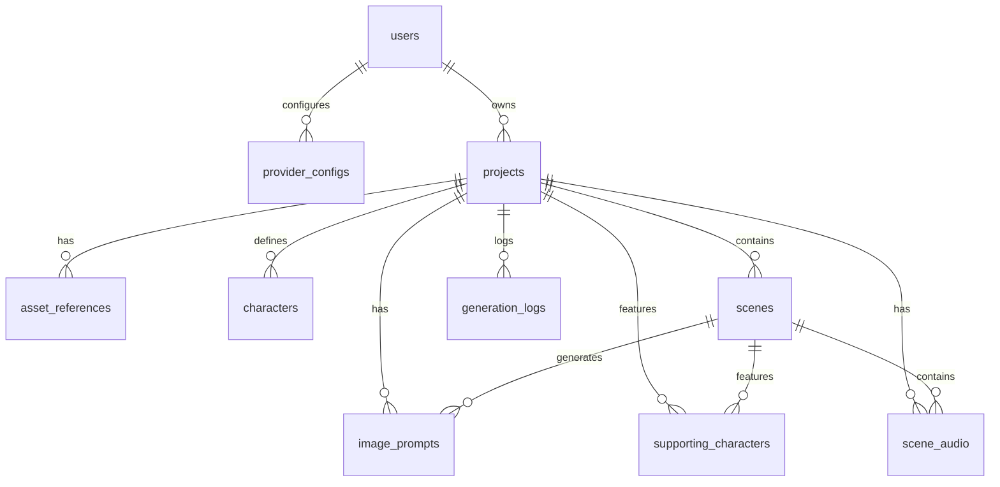

# DATABASE_SCHEMA.md — PromptFlow V3

> **Versi:** 2.0 (V3 Update)
> **Tanggal:** 2026-06-21
> **Database:** SQLite (Turso/libSQL) via Drizzle ORM ^0.38.0
> **ORM Migration:** drizzle-kit generate + drizzle-kit push
> **Deliverable:** Skema database V3 — 9 tabel existing + 1 tabel baru = 10 total
> **Selaras:** SRS.md v2.0 (S4.1-S4.5), PRD.md v2.0 (S7.2), RAG-CONTEXT.md (S3)
> **Prinsip:** Additive migration only — tidak drop kolom V2 (PRD P-07, BRD LIM-V3-01)

---

## 1. Ringkasan Model Data

### 1.1 Jenis Database

| Aspek | Pilihan | Justifikasi |
|---|---|---|
| Engine | SQLite (Turso/libSQL) | Retained V1/V2. Serverless-friendly, edge-compatible |
| Dialect | `turso` | `drizzle.config.ts:18` |
| ORM | Drizzle ORM ^0.38.0 | Retained. Additive migration via drizzle-kit |
| Hosting | Turso (managed) | Free tier MVP. Embedded replicas available |

**Tidak ada perubahan database engine di V3.** Semua perubahan = additive schema migration.

### 1.2 Total Tabel

| Kategori | Jumlah | Tabel |
|---|---|---|
| Existing (V1/V2) | 9 | users, provider_configs, projects, asset_references, characters, scenes, image_prompts, generation_logs, supporting_characters |
| New (V3) | 1 | scene_audio |
| **Total** | **10** | — |

### 1.3 Ringkasan Perubahan V3

| Objek | Tipe | Aksi | Field Ditambah | Fitur PRD |
|---|---|---|---|---|
| `scenes` | Tabel existing | ALTER ADD COLUMN | +11 field | F-V3-02, F-V3-04, F-V3-05 |
| `image_prompts` | Tabel existing | ALTER ADD COLUMN | +5 field | F-V3-03 |
| `projects` | Tabel existing | ALTER ADD COLUMN | +1 field | ASUMSI theme preference |
| `scene_audio` | Tabel baru | CREATE TABLE | 19 field | F-V3-05 |

> **Catatan ASUMSI:** Field berikut merupakan ASUMSI dari orchestrator, tidak eksplisit di PRD/SRS: scene_pacing, scene_mood, composition, lighting, camera, musicGenre, musicMood, musicTempoBpm, musicInstruments, sfxList, ambientType, ambientVolume, themePreference. Ditandai di tiap tabel. Sitasi: `RAG-CONTEXT ASM-2..10`.

---

## 2. Daftar Entitas

| # | Tabel | Deskripsi | V3 Changes |
|---|---|---|---|
| 1 | `users` | User accounts & autentikasi | Tidak ada |
| 2 | `provider_configs` | Konfigurasi LLM provider per user | Tidak ada |
| 3 | `projects` | Proyek prompt package | +1: themePreference (ASUMSI) |
| 4 | `asset_references` | Upload asset (gambar referensi) | Tidak ada |
| 5 | `characters` | Karakter master per proyek | Tidak ada |
| 6 | `scenes` | Adegan dalam proyek | +11: transition(4) + voice(4) + duration + pacing(ASUMSI) + mood(ASUMSI) |
| 7 | `image_prompts` | Prompt gambar per scene | +5: composition(ASUMSI) + lighting(ASUMSI) + camera(ASUMSI) + moodAtmosphere + styleReferences |
| 8 | `generation_logs` | Log generasi LLM | Tidak ada |
| 9 | `supporting_characters` | Karakter pendukung per scene | Tidak ada |
| 10 | `scene_audio` | **BARU** — Spesifikasi audio per scene | New table (19 fields) |

---

## 3. Entity Relationship Diagram (ERD)



**Legenda Relasi:**

| Notasi | Arti | Contoh |
|---|---|---|
| `||--o{` | One-to-Many | 1 project → N scenes |
| Cascade | ON DELETE CASCADE | Hapus project → hapus semua scenes |

---
## 4. Definisi Tabel

### 4.1 `users` — Tidak ada perubahan V3

| Kolom | Tipe | Nullable | Default | Unik | Deskripsi |
|---|---|---|---|---|---|
| `id` | INTEGER | NO | AUTO INCREMENT | PK | User ID |
| `email` | TEXT | NO | — | UNIQUE | Email login |
| `name` | TEXT | YES | — | — | Display name |
| `password_hash` | TEXT | NO | — | — | Bcrypt hash |
| `image` | TEXT | YES | — | — | Avatar URL |
| `role` | TEXT | NO | `'user'` | — | Role: user/admin |
| `created_at` | INTEGER | NO | `unixepoch()` | — | Waktu buat (epoch) |
| `updated_at` | INTEGER | NO | `unixepoch()` | — | Waktu update (epoch) |

### 4.2 `provider_configs` — Tidak ada perubahan V3

| Kolom | Tipe | Nullable | Default | Unik | Deskripsi |
|---|---|---|---|---|---|
| `id` | INTEGER | NO | AUTO INCREMENT | PK | Config ID |
| `user_id` | INTEGER | NO | — | FK → users.id | Pemilik config |
| `provider` | TEXT | NO | — | — | Nama provider (openai, anthropic, dll) |
| `name` | TEXT | NO | — | — | Label config |
| `base_url` | TEXT | NO | — | — | API base URL |
| `model` | TEXT | NO | — | — | Model name |
| `api_key_encrypted` | TEXT | YES | — | — | API key terenkripsi |
| `is_active` | INTEGER | NO | `1` | — | Status aktif (1/0) |
| `created_at` | INTEGER | NO | `unixepoch()` | — | Waktu buat |
| `updated_at` | INTEGER | NO | `unixepoch()` | — | Waktu update |

### 4.3 `projects` — +1 field V3

| Kolom | Tipe | Nullable | Default | Unik | Deskripsi |
|---|---|---|---|---|---|
| `id` | INTEGER | NO | AUTO INCREMENT | PK | Project ID |
| `user_id` | INTEGER | NO | — | FK → users.id | Pemilik project |
| `title` | TEXT | NO | — | — | Judul project |
| `duration_type` | TEXT | NO | — | — | Tipe durasi (short/medium/long) |
| `duration_target_seconds` | INTEGER | NO | — | — | Target durasi detik |
| `style_type` | TEXT | NO | — | — | Gaya visual (3d/2d/anime/dll) |
| `aspect_ratio` | TEXT | NO | — | — | Rasio aspek (16:9, 9:16, 1:1) |
| `result_json` | TEXT | YES | — | — | JSON hasil generate LLM |
| `status` | TEXT | NO | `'draft'` | — | Status: draft/completed |
| `story_description` | TEXT | YES | — | — | Deskripsi cerita (max 500 char) |
| `theme_preference` | TEXT | YES | `'dark'` | — | **V3 ASUMSI** — dark/light/system |
| `created_at` | INTEGER | NO | `unixepoch()` | — | Waktu buat |
| `updated_at` | INTEGER | NO | `unixepoch()` | — | Waktu update |
| `deleted_at` | INTEGER | YES | — | — | Soft delete timestamp |

> **ASUMSI `theme_preference`:** PRD F-V3-01 menyatakan theme = client-side only (next-themes + localStorage). Field ini ASUMSI dari orchestrator sebagai server-side persistence opsional. Sitasi: `PRD FR-V3-01 (Schema: N/A)`.

### 4.4 `asset_references` — Tidak ada perubahan V3

| Kolom | Tipe | Nullable | Default | Unik | Deskripsi |
|---|---|---|---|---|---|
| `id` | INTEGER | NO | AUTO INCREMENT | PK | Asset ID |
| `project_id` | INTEGER | NO | — | FK → projects.id | Project pemilik |
| `tipe` | TEXT | NO | — | — | Tipe asset (reference/character) |
| `filename` | TEXT | NO | — | — | Nama file asli |
| `blob_url` | TEXT | NO | — | — | URL di Vercel Blob |
| `label` | TEXT | YES | — | — | Label deskriptif |
| `mime_type` | TEXT | YES | — | — | MIME type file |
| `size_bytes` | INTEGER | YES | — | — | Ukuran file |
| `ai_classification` | TEXT | YES | — | — | JSON hasil klasifikasi Vision LLM |
| `created_at` | INTEGER | NO | `unixepoch()` | — | Waktu buat |

### 4.5 `characters` — Tidak ada perubahan V3

| Kolom | Tipe | Nullable | Default | Unik | Deskripsi |
|---|---|---|---|---|---|
| `id` | INTEGER | NO | AUTO INCREMENT | PK | Character ID |
| `project_id` | INTEGER | NO | — | FK → projects.id | Project pemilik |
| `nama` | TEXT | NO | — | UNIQUE/project | Nama karakter |
| `gayarambut` | TEXT | NO | — | — | Gaya rambut |
| `wajah_asal` | TEXT | NO | — | — | Deskripsi wajah |
| `pakaian_atas` | TEXT | NO | — | — | Pakaian atas |
| `pakaian_bawah` | TEXT | NO | — | — | Pakaian bawah |
| `alas_kaki` | TEXT | NO | — | — | Alas kaki |
| `deskripsi_latar` | TEXT | NO | — | — | Latar belakang karakter |
| `aksi` | TEXT | NO | — | — | Aksi default |
| `peran` | TEXT | NO | — | — | Peran (protagonis/antagonis/narrator) |
| `created_at` | INTEGER | NO | `unixepoch()` | — | Waktu buat |

### 4.6 `generation_logs` — Tidak ada perubahan V3

| Kolom | Tipe | Nullable | Default | Unik | Deskripsi |
|---|---|---|---|---|---|
| `id` | INTEGER | NO | AUTO INCREMENT | PK | Log ID |
| `project_id` | INTEGER | NO | — | FK → projects.id | Project terkait |
| `provider` | TEXT | NO | — | — | LLM provider |
| `model` | TEXT | NO | — | — | Model name |
| `duration_ms` | INTEGER | YES | — | — | Durasi generasi (ms) |
| `status` | TEXT | NO | — | — | Status: success/error |
| `error_message` | TEXT | YES | — | — | Pesan error |
| `logs_json` | TEXT | YES | — | — | JSON array real-time logs |
| `created_at` | INTEGER | NO | `unixepoch()` | — | Waktu buat |

### 4.7 `supporting_characters` — Tidak ada perubahan V3

| Kolom | Tipe | Nullable | Default | Unik | Deskripsi |
|---|---|---|---|---|---|
| `id` | INTEGER | NO | AUTO INCREMENT | PK | ID |
| `project_id` | INTEGER | NO | — | FK → projects.id | Project pemilik |
| `scene_id` | INTEGER | YES | — | FK → scenes.id | Scene terkait |
| `nama` | TEXT | NO | — | — | Nama karakter pendukung |
| `tipe` | TEXT | NO | — | — | Tipe karakter |
| `aksi` | TEXT | NO | — | — | Aksi karakter |
| `created_at` | INTEGER | NO | `unixepoch()` | — | Waktu buat |

---
### 4.8 `scenes` — +11 field V3

| Kolom | Tipe | Nullable | Default | Unik | Deskripsi |
|---|---|---|---|---|---|
| `id` | INTEGER | NO | AUTO INCREMENT | PK | Scene ID |
| `project_id` | INTEGER | NO | — | FK → projects.id | Project pemilik |
| `order_no` | INTEGER | NO | — | UNIQUE/project | Urutan scene |
| `description` | TEXT | NO | — | — | Deskripsi scene |
| `voiceover_script` | TEXT | NO | — | — | Teks voiceover |
| `created_at` | INTEGER | NO | `unixepoch()` | — | Waktu buat |
| **— V3: Transition (F-V3-02) —** | | | | | |
| `transition_type` | TEXT | NO | `'cut'` | — | Jenis transisi. Enum: `cut`, `dissolve`, `fade_to_black`, `fade_to_white`, `wipe`, `match_cut` |
| `transition_duration_ms` | INTEGER | NO | `0` | — | Durasi transisi (ms). Range: 0-5000 |
| `transition_easing` | TEXT | NO | `'linear'` | — | Easing function. Enum: `linear`, `ease_in`, `ease_out`, `ease_in_out` |
| `transition_direction` | TEXT | NO | `'forward'` | — | Arah transisi. Enum: `forward`, `backward`, `loop` |
| **— V3: Voice (F-V3-04) —** | | | | | |
| `voice_type` | TEXT | NO | `'narrator'` | — | Tipe suara. Enum: `child`, `teen`, `adult_male`, `adult_female`, `elderly_male`, `elderly_female`, `narrator` |
| `voice_emotion` | TEXT | NO | `'neutral'` | — | Emosi suara. Enum: `neutral`, `happy`, `sad`, `excited`, `calm`, `dramatic` |
| `voice_speed` | REAL | NO | `1.0` | — | Kecepatan bicara. Range: 0.5-2.0 |
| `voice_pitch` | TEXT | NO | `'auto'` | — | Pitch suara. Enum: `low`, `medium`, `high`, `auto` |
| **— V3: Duration (F-V3-05) —** | | | | | |
| `duration_seconds` | INTEGER | YES | NULL | — | Durasi scene (detik). Diestimasi dari voiceover length |
| **— V3: Pacing & Mood (ASUMSI) —** | | | | | |
| `scene_pacing` | TEXT | NO | `'normal'` | — | **ASUMSI** — Tempo scene. Enum: `fast`, `normal`, `slow` |
| `scene_mood` | TEXT | YES | NULL | — | **ASUMSI** — Suasana. Enum: `cheerful`, `dramatic`, `tense`, `peaceful`, `mysterious` |

**Drizzle ORM definition (tambahan di `schema.ts`):**

```typescript
// scenes table extensions — V3 additive
// Sitasi: SRS S4.2, PRD S7.2, RAG-CONTEXT S3.2
export const scenes = sqliteTable('scenes', {
  // ... existing V1/V2 fields retained (id, projectId, orderNo, description, voiceoverScript, createdAt) ...

  // V3: Transition (F-V3-02)
  transitionType: text('transition_type').notNull().default('cut'),
  transitionDurationMs: integer('transition_duration_ms').notNull().default(0),
  transitionEasing: text('transition_easing').notNull().default('linear'),
  transitionDirection: text('transition_direction').notNull().default('forward'),

  // V3: Voice (F-V3-04)
  voiceType: text('voice_type').notNull().default('narrator'),
  voiceEmotion: text('voice_emotion').notNull().default('neutral'),
  voiceSpeed: real('voice_speed').notNull().default(1.0),
  voicePitch: text('voice_pitch').notNull().default('auto'),

  // V3: Duration (F-V3-05)
  durationSeconds: integer('duration_seconds'),

  // V3: Pacing & Mood — ASUMSI orchestrator
  scenePacing: text('scene_pacing').notNull().default('normal'),
  sceneMood: text('scene_mood'),
});
```

### 4.9 `image_prompts` — +5 field V3

| Kolom | Tipe | Nullable | Default | Unik | Deskripsi |
|---|---|---|---|---|---|
| `id` | INTEGER | NO | AUTO INCREMENT | PK | Prompt ID |
| `project_id` | INTEGER | NO | — | FK → projects.id | Project pemilik |
| `scene_id` | INTEGER | YES | — | FK → scenes.id | Scene terkait |
| `tipe` | TEXT | NO | — | — | Tipe prompt (main/detail) |
| `target` | TEXT | NO | — | — | Target deskripsi |
| `prompt_text` | TEXT | NO | — | — | Teks prompt (single string, backward compat V1/V2) |
| `reference_filename` | TEXT | YES | — | — | Filename gambar referensi |
| `created_at` | INTEGER | NO | `unixepoch()` | — | Waktu buat |
| **— V3: Structured Layers (ASUMSI) —** | | | | | |
| `composition` | TEXT | YES | NULL | — | **ASUMSI** — JSON: `{foreground, midground, background}` |
| `lighting` | TEXT | YES | NULL | — | **ASUMSI** — JSON: `{key, fill, rim, style}` |
| `camera` | TEXT | YES | NULL | — | **ASUMSI** — JSON: `{angle, lens, depth_of_field}` |
| **— V3: Metadata (SRS S4.4, PRD S7.2) —** | | | | | |
| `mood_atmosphere` | TEXT | YES | NULL | — | Emotional tone + atmosphere |
| `style_references` | TEXT | YES | NULL | — | Comma-separated style references |

> **Catatan:** `promptText` tetap single string (backward compat V1+V2). Field composition/lighting/camera/moodAtmosphere/styleReferences = metadata opsional untuk UI section labels dan export terstruktur. Sitasi: `PRD S7.2, SRS S4.4`.

**Drizzle ORM definition:**

```typescript
export const imagePrompts = sqliteTable('image_prompts', {
  // ... existing V1/V2 fields retained ...

  // V3: Structured Layers — ASUMSI orchestrator
  composition: text('composition'),        // JSON: {foreground, midground, background}
  lighting: text('lighting'),              // JSON: {key, fill, rim, style}
  camera: text('camera'),                  // JSON: {angle, lens, depth_of_field}

  // V3: Metadata — SRS S4.4, PRD S7.2
  moodAtmosphere: text('mood_atmosphere'),
  styleReferences: text('style_references'),
});
```

### 4.10 `scene_audio` — TABEL BARU V3

| Kolom | Tipe | Nullable | Default | Unik | Deskripsi |
|---|---|---|---|---|---|
| `id` | INTEGER | NO | AUTO INCREMENT | PK | Audio entry ID |
| `project_id` | INTEGER | NO | — | FK → projects.id | Project pemilik |
| `scene_id` | INTEGER | NO | — | FK → scenes.id | Scene terkait |
| **— SRS S4.3 Core Fields —** | | | | | |
| `audio_type` | TEXT | NO | — | — | Enum: `background_music`, `sfx`, `ambient`, `music_cue`, `transition_audio` |
| `description` | TEXT | NO | — | — | Deskripsi audio |
| `timing` | TEXT | NO | `'throughout'` | — | Enum: `start`, `throughout`, `end`, `specific_moment` |
| `duration_seconds` | INTEGER | YES | NULL | — | Durasi audio (detik) |
| `volume` | REAL | NO | `0.7` | — | Volume umum. Range: 0.0-1.0 |
| `fade_in_ms` | INTEGER | NO | `0` | — | Fade in (ms). >= 0 |
| `fade_out_ms` | INTEGER | NO | `0` | — | Fade out (ms). >= 0 |
| **— ASUMSI: Music Fields —** | | | | | |
| `music_genre` | TEXT | YES | NULL | — | **ASUMSI** — Genre: orchestral/electronic/ambient/jazz/pop |
| `music_mood` | TEXT | YES | NULL | — | **ASUMSI** — Mood: upbeat/melancholic/tense/peaceful/mysterious |
| `music_tempo_bpm` | INTEGER | YES | NULL | — | **ASUMSI** — Tempo BPM (60-200) |
| `music_instruments` | TEXT | YES | NULL | — | **ASUMSI** — Instrumen (comma-separated: piano,strings,drums) |
| `music_volume` | REAL | YES | `0.7` | — | **ASUMSI** — Volume khusus music. Range: 0.0-1.0 |
| **— ASUMSI: SFX & Ambient —** | | | | | |
| `sfx_list` | TEXT | YES | NULL | — | **ASUMSI** — JSON array: `[{name, timing_ms, volume}]` |
| `ambient_type` | TEXT | YES | NULL | — | **ASUMSI** — Tipe: forest/city/rain/wind/ocean/room |
| `ambient_volume` | REAL | YES | `0.5` | — | **ASUMSI** — Volume ambient. Range: 0.0-1.0 |
| **— Audit —** | | | | | |
| `created_at` | INTEGER | NO | `unixepoch()` | — | Waktu buat |

**Drizzle ORM definition:**

```typescript
export const sceneAudio = sqliteTable('scene_audio', {
  id: integer('id').primaryKey({ autoIncrement: true }),
  projectId: integer('project_id').notNull().references(() => projects.id, { onDelete: 'cascade' }),
  sceneId: integer('scene_id').notNull().references(() => scenes.id, { onDelete: 'cascade' }),

  // SRS S4.3 — Core audio fields
  audioType: text('audio_type').notNull(),
  description: text('description').notNull(),
  timing: text('timing').notNull().default('throughout'),
  durationSeconds: integer('duration_seconds'),
  volume: real('volume').notNull().default(0.7),
  fadeInMs: integer('fade_in_ms').notNull().default(0),
  fadeOutMs: integer('fade_out_ms').notNull().default(0),

  // ASUMSI — Music-specific fields
  musicGenre: text('music_genre'),
  musicMood: text('music_mood'),
  musicTempoBpm: integer('music_tempo_bpm'),
  musicInstruments: text('music_instruments'),
  musicVolume: real('music_volume').default(0.7),

  // ASUMSI — SFX & Ambient fields
  sfxList: text('sfx_list'),
  ambientType: text('ambient_type'),
  ambientVolume: real('ambient_volume').default(0.5),

  // Audit
  createdAt: integer('created_at').default(sql`(unixepoch())`).notNull(),
}, (t) => ({
  projectIdx: index('idx_scene_audio_project_id').on(t.projectId),
  sceneIdx: index('idx_scene_audio_scene_id').on(t.sceneId),
  projectSceneIdx: index('idx_scene_audio_project_scene').on(t.projectId, t.sceneId),
}));
```

> **ASUMSI `scene_audio`:** Field musicGenre, musicMood, musicTempoBpm, musicInstruments, musicVolume, sfxList, ambientType, ambientVolume merupakan ASUMSI orchestrator. SRS S4.3 mendefinisikan tabel dengan audioType/description/timing/volume/fadeIn/fadeOut. Sitasi: `RAG-CONTEXT ASM-5, ASM-10`.

---
## 5. Primary Key, Foreign Key & Relasi

### 5.1 Primary Key

Semua tabel pakai `INTEGER` auto-increment PK (konsisten V1/V2).

| Tabel | PK | Tipe | Auto Increment |
|---|---|---|---|
| users | `id` | INTEGER | YES |
| provider_configs | `id` | INTEGER | YES |
| projects | `id` | INTEGER | YES |
| asset_references | `id` | INTEGER | YES |
| characters | `id` | INTEGER | YES |
| scenes | `id` | INTEGER | YES |
| image_prompts | `id` | INTEGER | YES |
| generation_logs | `id` | INTEGER | YES |
| supporting_characters | `id` | INTEGER | YES |
| scene_audio | `id` | INTEGER | YES |

> **INFO-003 RESOLVED:** Stale ASUMSI note cleaned up 2026-06-21. SRS S4.3 was misread — V3 implementation uses INTEGER `id` (consistent with all 9 existing tables) for `scene_audio`. Implemented in `src/lib/db/schema.ts`. If UUID required in future, switch to `text('id').$defaultFn(() => crypto.randomUUID())`.

### 5.2 Foreign Key

| Tabel | Kolom FK | Referensi | ON DELETE | ON UPDATE |
|---|---|---|---|---|
| provider_configs | `user_id` | users.id | CASCADE | — |
| projects | `user_id` | users.id | CASCADE | — |
| asset_references | `project_id` | projects.id | CASCADE | — |
| characters | `project_id` | projects.id | CASCADE | — |
| scenes | `project_id` | projects.id | CASCADE | — |
| image_prompts | `project_id` | projects.id | CASCADE | — |
| image_prompts | `scene_id` | scenes.id | CASCADE | — |
| generation_logs | `project_id` | projects.id | CASCADE | — |
| supporting_characters | `project_id` | projects.id | CASCADE | — |
| supporting_characters | `scene_id` | scenes.id | SET NULL | — |
| **scene_audio** | **`project_id`** | **projects.id** | **CASCADE** | — |
| **scene_audio** | **`scene_id`** | **scenes.id** | **CASCADE** | — |

### 5.3 Diagram Relasi

```
users (1) ---- (N) provider_configs
users (1) ---- (N) projects
projects (1) ---- (N) asset_references
projects (1) ---- (N) characters
projects (1) ---- (N) scenes
projects (1) ---- (N) image_prompts
projects (1) ---- (N) generation_logs
projects (1) ---- (N) supporting_characters
projects (1) ---- (N) scene_audio       [V3 NEW]
scenes (1) ---- (N) image_prompts
scenes (1) ---- (N) supporting_characters
scenes (1) ---- (N) scene_audio         [V3 NEW]
```

**Relasi V3 baru:**
- `projects` 1:N `scene_audio` — CASCADE delete
- `scenes` 1:N `scene_audio` — CASCADE delete

---

## 6. Index

### 6.1 Index Existing (Retained)

| Tabel | Nama Index | Kolom | Tipe | Alasan |
|---|---|---|---|---|
| provider_configs | `idx_provider_configs_user_name` | user_id, name | UNIQUE | Cepat cari config per user + nama |
| projects | `idx_projects_user_id` | user_id | INDEX | Query project per user |
| projects | `idx_projects_user_created` | user_id, created_at | INDEX | Project list sorted by date |
| asset_references | `idx_asset_refs_project_id` | project_id | INDEX | Asset per project |
| asset_references | `idx_asset_refs_project_tipe` | project_id, tipe | INDEX | Filter asset by type |
| characters | `idx_characters_project_id` | project_id | INDEX | Characters per project |
| characters | `idx_characters_project_nama` | project_id, nama | UNIQUE | Unique name per project |
| scenes | `idx_scenes_project_id` | project_id | INDEX | Scenes per project |
| scenes | `idx_scenes_project_order` | project_id, order_no | UNIQUE | Unique order per project |
| image_prompts | `idx_image_prompts_project_id` | project_id | INDEX | Prompts per project |
| image_prompts | `idx_image_prompts_scene_id` | scene_id | INDEX | Prompts per scene |
| image_prompts | `idx_image_prompts_project_tipe` | project_id, tipe | INDEX | Filter prompts by type |
| image_prompts | `idx_image_prompts_project_scene` | project_id, scene_id | INDEX | Prompts per project+scene |
| generation_logs | `idx_gen_logs_project_id` | project_id | INDEX | Logs per project |
| generation_logs | `idx_gen_logs_project_created` | project_id, created_at | INDEX | Logs sorted by date |
| supporting_characters | `idx_supporting_chars_project_id` | project_id | INDEX | Characters per project |
| supporting_characters | `idx_supporting_chars_scene_id` | scene_id | INDEX | Characters per scene |

### 6.2 Index BARU V3

| Tabel | Nama Index | Kolom | Tipe | Alasan |
|---|---|---|---|---|
| scene_audio | `idx_scene_audio_project_id` | project_id | INDEX | Query audio per project. SRS S4.3 |
| scene_audio | `idx_scene_audio_scene_id` | scene_id | INDEX | **CRITICAL** — Query audio per scene (most common). SRS TC-08 |
| scene_audio | `idx_scene_audio_project_scene` | project_id, scene_id | INDEX | Composite: audio per project+scene |

> **Alasan index:** `scene_id` index wajib karena query paling sering = "get all audio untuk scene X" (API CRUD, UI panel, export). Tanpa index, full scan setiap kali. Sitasi: `SRS TC-08`.

---

## 7. Constraint & Validasi

### 7.1 NOT NULL Constraints

| Tabel | Kolom | NOT NULL | Alasan |
|---|---|---|---|
| scenes | `transition_type` | YES | Default `'cut'` |
| scenes | `transition_duration_ms` | YES | Default `0` |
| scenes | `transition_easing` | YES | Default `'linear'` |
| scenes | `transition_direction` | YES | Default `'forward'` |
| scenes | `voice_type` | YES | Default `'narrator'` |
| scenes | `voice_emotion` | YES | Default `'neutral'` |
| scenes | `voice_speed` | YES | Default `1.0` |
| scenes | `voice_pitch` | YES | Default `'auto'` |
| scenes | `scene_pacing` | YES | Default `'normal'` (ASUMSI) |
| scene_audio | `audio_type` | YES | Enum 5 types |
| scene_audio | `description` | YES | Wajib ada deskripsi |
| scene_audio | `timing` | YES | Default `'throughout'` |
| scene_audio | `volume` | YES | Default `0.7` |
| scene_audio | `fade_in_ms` | YES | Default `0` |
| scene_audio | `fade_out_ms` | YES | Default `0` |

### 7.2 NULLABLE (opsional)

| Tabel | Kolom | Nullable | Alasan |
|---|---|---|---|
| scenes | `duration_seconds` | YES | Tidak semua scene punya durasi eksplisit |
| scenes | `scene_mood` | YES | Mood opsional (ASUMSI) |
| image_prompts | `composition` | YES | JSON metadata opsional |
| image_prompts | `lighting` | YES | JSON metadata opsional |
| image_prompts | `camera` | YES | JSON metadata opsional |
| image_prompts | `mood_atmosphere` | YES | Metadata opsional |
| image_prompts | `style_references` | YES | Metadata opsional |
| scene_audio | `duration_seconds` | YES | Tidak semua audio punya durasi tetap |
| scene_audio | `music_genre` | YES | Hanya untuk audio_type = background_music/music_cue |
| scene_audio | `music_mood` | YES | Hanya untuk background_music/music_cue |
| scene_audio | `music_tempo_bpm` | YES | Hanya untuk background_music/music_cue |
| scene_audio | `music_instruments` | YES | Hanya untuk background_music/music_cue |
| scene_audio | `sfx_list` | YES | Hanya untuk audio_type = sfx |
| scene_audio | `ambient_type` | YES | Hanya untuk audio_type = ambient |
| projects | `theme_preference` | YES | Client-side primary (ASUMSI) |

### 7.3 Enum Constraints (via Zod Validation)

**Scenes — Transition:**

| Field | Enum Values | Default | Zod Schema |
|---|---|---|---|
| transition_type | `cut`, `dissolve`, `fade_to_black`, `fade_to_white`, `wipe`, `match_cut` | `'cut'` | `z.enum([...]).default('cut')` |
| transition_easing | `linear`, `ease_in`, `ease_out`, `ease_in_out` | `'linear'` | `z.enum([...]).default('linear')` |
| transition_direction | `forward`, `backward`, `loop` | `'forward'` | `z.enum([...]).default('forward')` |

**Scenes — Voice:**

| Field | Enum Values | Default | Zod Schema |
|---|---|---|---|
| voice_type | `child`, `teen`, `adult_male`, `adult_female`, `elderly_male`, `elderly_female`, `narrator` | `'narrator'` | `z.enum([...]).default('narrator')` |
| voice_emotion | `neutral`, `happy`, `sad`, `excited`, `calm`, `dramatic` | `'neutral'` | `z.enum([...]).default('neutral')` |
| voice_pitch | `low`, `medium`, `high`, `auto` | `'auto'` | `z.enum([...]).default('auto')` |
| voice_speed | — | `1.0` | `z.number().min(0.5).max(2.0).default(1.0)` |

**Scenes — Pacing & Mood (ASUMSI):**

| Field | Enum Values | Default | Zod Schema |
|---|---|---|---|
| scene_pacing | `fast`, `normal`, `slow` | `'normal'` | `z.enum([...]).default('normal')` |
| scene_mood | `cheerful`, `dramatic`, `tense`, `peaceful`, `mysterious` | NULL | `z.enum([...]).optional()` |

**Scene Audio:**

| Field | Enum Values | Default | Zod Schema |
|---|---|---|---|
| audio_type | `background_music`, `sfx`, `ambient`, `music_cue`, `transition_audio` | — | `z.enum([...])` |
| timing | `start`, `throughout`, `end`, `specific_moment` | `'throughout'` | `z.enum([...]).default('throughout')` |

**Projects:**

| Field | Enum Values | Default | Zod Schema |
|---|---|---|---|
| theme_preference | `dark`, `light`, `system` | `'dark'` | `z.enum([...]).default('dark')` |

### 7.4 CHECK Constraints

| Tabel | Kolom | CHECK | Alasan |
|---|---|---|---|
| scenes | `voice_speed` | `>= 0.5 AND <= 2.0` | Range valid bicara |
| scenes | `transition_duration_ms` | `>= 0 AND <= 5000` | Max 5 detik transisi |
| scene_audio | `volume` | `>= 0.0 AND <= 1.0` | Range volume standar |
| scene_audio | `music_volume` | `>= 0.0 AND <= 1.0` | Range volume musik |
| scene_audio | `ambient_volume` | `>= 0.0 AND <= 1.0` | Range volume ambient |
| scene_audio | `fade_in_ms` | `>= 0` | Tidak negatif |
| scene_audio | `fade_out_ms` | `>= 0` | Tidak negatif |
| scene_audio | `music_tempo_bpm` | `>= 60 AND <= 200` | Range BPM valid |

> **Catatan:** SQLite tidak enforce CHECK constraints di schema Drizzle. Validasi dilakukan di Zod layer (runtime). CHECK di atas = dokumentasi intent.

### 7.5 UNIQUE Constraints

| Tabel | Kolom | Constraint | Alasan |
|---|---|---|---|
| users | `email` | UNIQUE | Satu email per user |
| provider_configs | `user_id`, `name` | UNIQUE INDEX | Satu config name per user |
| characters | `project_id`, `nama` | UNIQUE INDEX | Unique name per project |
| scenes | `project_id`, `order_no` | UNIQUE INDEX | Unique order per project |

---
## 8. Strategi Normalisasi

### 8.1 Normalisasi Existing (V1/V2)

Tabel existing sudah dalam **3NF (Third Normal Form):**
- `users` → 2NF: semua non-key attributes depend on PK
- `projects` → 2NF: FK ke users, non-key depend on project id
- `scenes` → 2NF: FK ke projects, non-key depend on scene id
- `image_prompts` → 2NF: FK ke projects + scenes
- `characters` → 2NF: FK ke projects, unique per project

### 8.2 Denormalisasi yang Disengaja (V3)

| Keputusan | Tipe | Alasan |
|---|---|---|
| Transition fields di `scenes` (bukan new table) | Denormalisasi | 1:1 relationship, cukup MVP. SRS ASM-2. Query simpler |
| Voice fields di `scenes` (bukan new table) | Denormalisasi | 1:1 relationship, cukup MVP. SRS ASM-4 |
| `scene_audio` = new table (bukan fields di scenes) | Normalisasi | 1:N relationship. Multiple audio per scene. SRS ASM-5 |
| `composition`/`lighting`/`camera` sebagai JSON text | Denormalisasi | Flexible schema untuk JSON objects. ASUMSI |
| `sfx_list` sebagai JSON text | Denormalisasi | Array SFX variable-length. JSON cukup untuk MVP |

### 8.3 Normalisasi yang Dipertahankan

- `scene_audio` dipisah dari `scenes` → 1:N (multiple audio per scene)
- `image_prompts` tetap terpisah dari `scenes` → 1:N (multiple prompts per scene)
- `supporting_characters` tetap terpisah → 1:N per scene
- Semua FK pakai CASCADE delete → referential integrity

---

## 9. Migration Plan

### 9.1 Tooling

| Tool | Versi | Fungsi |
|---|---|---|
| `drizzle-kit` | ^0.38.0 | Generate + push migration |
| `drizzle.config.ts` | existing | Dialect: turso |
| Migration file | `drizzle/0001_v3_core_features.sql` | Additive SQL |
| Backfill script | `src/lib/migration/v2-to-v3.ts` | Set defaults ke V2 data |

### 9.2 Urutan Migration (Dependency Order)

```
Step 1: ALTER scenes — tambah 11 kolom (additive)
  +-- transition_type, transition_duration_ms, transition_easing, transition_direction
  +-- voice_type, voice_emotion, voice_speed, voice_pitch
  +-- duration_seconds
  +-- scene_pacing, scene_mood

Step 2: ALTER image_prompts — tambah 5 kolom (additive, all nullable)
  +-- composition, lighting, camera
  +-- mood_atmosphere, style_references

Step 3: ALTER projects — tambah 1 kolom (additive, nullable)
  +-- theme_preference

Step 4: CREATE TABLE scene_audio (new table, 19 fields + 3 indexes)

Step 5: Backfill script v2-to-v3.ts
  +-- For each existing scene: SET V3 defaults
  |   +-- transition_type = 'cut', transition_duration_ms = 0
  |   +-- transition_easing = 'linear', transition_direction = 'forward'
  |   +-- voice_type = 'narrator', voice_emotion = 'neutral'
  |   +-- voice_speed = 1.0, voice_pitch = 'auto'
  |   +-- scene_pacing = 'normal'
  +-- duration_seconds = estimate dari voiceover_script.length / 15
  +-- Dry-run mode: log only, no actual UPDATE
```

### 9.3 Migration SQL (`drizzle/0001_v3_core_features.sql`)

```sql
-- V3 Migration: Additive only — no DROP, no data loss
-- Generated via: pnpm drizzle-kit generate
-- Sitasi: SRS S3.6, PRD FR-V3-06, BRD SCOPE-V3-03..07

-- Step 1: scenes +11 fields
ALTER TABLE scenes ADD COLUMN transition_type TEXT NOT NULL DEFAULT 'cut';
ALTER TABLE scenes ADD COLUMN transition_duration_ms INTEGER NOT NULL DEFAULT 0;
ALTER TABLE scenes ADD COLUMN transition_easing TEXT NOT NULL DEFAULT 'linear';
ALTER TABLE scenes ADD COLUMN transition_direction TEXT NOT NULL DEFAULT 'forward';
ALTER TABLE scenes ADD COLUMN voice_type TEXT NOT NULL DEFAULT 'narrator';
ALTER TABLE scenes ADD COLUMN voice_emotion TEXT NOT NULL DEFAULT 'neutral';
ALTER TABLE scenes ADD COLUMN voice_speed REAL NOT NULL DEFAULT 1.0;
ALTER TABLE scenes ADD COLUMN voice_pitch TEXT NOT NULL DEFAULT 'auto';
ALTER TABLE scenes ADD COLUMN duration_seconds INTEGER;
ALTER TABLE scenes ADD COLUMN scene_pacing TEXT NOT NULL DEFAULT 'normal';
ALTER TABLE scenes ADD COLUMN scene_mood TEXT;

-- Step 2: image_prompts +5 fields (all nullable)
ALTER TABLE image_prompts ADD COLUMN composition TEXT;
ALTER TABLE image_prompts ADD COLUMN lighting TEXT;
ALTER TABLE image_prompts ADD COLUMN camera TEXT;
ALTER TABLE image_prompts ADD COLUMN mood_atmosphere TEXT;
ALTER TABLE image_prompts ADD COLUMN style_references TEXT;

-- Step 3: projects +1 field
ALTER TABLE projects ADD COLUMN theme_preference TEXT DEFAULT 'dark';

-- Step 4: scene_audio new table
CREATE TABLE scene_audio (
  id INTEGER PRIMARY KEY AUTOINCREMENT NOT NULL,
  project_id INTEGER NOT NULL,
  scene_id INTEGER NOT NULL,
  audio_type TEXT NOT NULL,
  description TEXT NOT NULL,
  timing TEXT NOT NULL DEFAULT 'throughout',
  duration_seconds INTEGER,
  volume REAL NOT NULL DEFAULT 0.7,
  fade_in_ms INTEGER NOT NULL DEFAULT 0,
  fade_out_ms INTEGER NOT NULL DEFAULT 0,
  music_genre TEXT,
  music_mood TEXT,
  music_tempo_bpm INTEGER,
  music_instruments TEXT,
  music_volume REAL DEFAULT 0.7,
  sfx_list TEXT,
  ambient_type TEXT,
  ambient_volume REAL DEFAULT 0.5,
  created_at INTEGER NOT NULL,
  FOREIGN KEY (project_id) REFERENCES projects(id) ON DELETE CASCADE,
  FOREIGN KEY (scene_id) REFERENCES scenes(id) ON DELETE CASCADE
);

CREATE INDEX idx_scene_audio_project_id ON scene_audio(project_id);
CREATE INDEX idx_scene_audio_scene_id ON scene_audio(scene_id);
CREATE INDEX idx_scene_audio_project_scene ON scene_audio(project_id, scene_id);
```

### 9.4 Backfill Script (`v2-to-v3.ts`)

```typescript
// Sitasi: SRS S3.11, PRD FR-V3-11, BRD SCOPE-V3-17
export async function migrateV2ToV3(options?: {
  dryRun?: boolean;
  batchSize?: number;
  onProgress?: (p: { processed: number; total: number }) => void;
}): Promise<{
  processed: number;
  updated: number;
  errors: Array<{ sceneId: number; error: string }>;
  dryRun: boolean;
  durationMs: number;
}>;

export async function rollbackV2ToV3(options?: {
  dryRun?: boolean;
}): Promise<{
  reverted: number;
  errors: Array<{ sceneId: number; error: string }>;
  dryRun: boolean;
}>;
```

**Backfill defaults per scene:**

| Field | Default Value | Alasan |
|---|---|---|
| transition_type | `'cut'` | Transisi paling umum, 0ms |
| transition_duration_ms | `0` | Cut = instant |
| transition_easing | `'linear'` | Netral |
| transition_direction | `'forward'` | Default forward |
| voice_type | `'narrator'` | Paling aman untuk semua scene |
| voice_emotion | `'neutral'` | Netral |
| voice_speed | `1.0` | Normal speed |
| voice_pitch | `'auto'` | Biarkan downstream decide |
| scene_pacing | `'normal'` | Default (ASUMSI) |
| duration_seconds | `voiceover_script.length / 15` | Estimasi: 15 char/detik |

### 9.5 Rollback Plan

```sql
-- Rollback: DROP new columns + DROP table (LAST RESORT)
-- CATATAN: V3 dirancang backward compatible. Rollback jarang diperlukan.
ALTER TABLE scenes DROP COLUMN transition_type;
ALTER TABLE scenes DROP COLUMN transition_duration_ms;
ALTER TABLE scenes DROP COLUMN transition_easing;
ALTER TABLE scenes DROP COLUMN transition_direction;
ALTER TABLE scenes DROP COLUMN voice_type;
ALTER TABLE scenes DROP COLUMN voice_emotion;
ALTER TABLE scenes DROP COLUMN voice_speed;
ALTER TABLE scenes DROP COLUMN voice_pitch;
ALTER TABLE scenes DROP COLUMN duration_seconds;
ALTER TABLE scenes DROP COLUMN scene_pacing;
ALTER TABLE scenes DROP COLUMN scene_mood;

ALTER TABLE image_prompts DROP COLUMN composition;
ALTER TABLE image_prompts DROP COLUMN lighting;
ALTER TABLE image_prompts DROP COLUMN camera;
ALTER TABLE image_prompts DROP COLUMN mood_atmosphere;
ALTER TABLE image_prompts DROP COLUMN style_references;

ALTER TABLE projects DROP COLUMN theme_preference;

DROP TABLE scene_audio;
```

> **Catatan:** SQLite support `ALTER TABLE ... DROP COLUMN` sejak 3.35.0 (2021). Turso/libSQL mendukung. Rollback = LAST RESORT. PRD P-07: "V2 project → V3 = auto-migrate, tidak kehilangan data."

---
## 10. Seed Data / Master Data

### 10.1 Tidak Ada Seed Data Wajib

PromptFlow tidak punya master data statis (enum values di-handle via Zod validation, bukan lookup tables). Seed data tidak diperlukan untuk tabel existing.

### 10.2 Default Values (Runtime Seeds)

Default values bertindak sebagai seed data implisit:

| Tabel | Field | Default | Keterangan |
|---|---|---|---|
| projects | `status` | `'draft'` | Semua project baru = draft |
| projects | `theme_preference` | `'dark'` | V3 ASUMSI |
| scenes | `transition_type` | `'cut'` | Default transisi |
| scenes | `transition_duration_ms` | `0` | Instant cut |
| scenes | `transition_easing` | `'linear'` | Netral |
| scenes | `transition_direction` | `'forward'` | Default |
| scenes | `voice_type` | `'narrator'` | Default voice |
| scenes | `voice_emotion` | `'neutral'` | Default emotion |
| scenes | `voice_speed` | `1.0` | Normal speed |
| scenes | `voice_pitch` | `'auto'` | Auto pitch |
| scenes | `scene_pacing` | `'normal'` | ASUMSI |
| scene_audio | `timing` | `'throughout'` | Sepanjang scene |
| scene_audio | `volume` | `0.7` | 70% volume |
| scene_audio | `fade_in_ms` | `0` | No fade in |
| scene_audio | `fade_out_ms` | `0` | No fade out |
| scene_audio | `music_volume` | `0.7` | ASUMSI |
| scene_audio | `ambient_volume` | `0.5` | ASUMSI |

### 10.3 Template Presets (Application-Level)

Untuk UX yang lebih baik, application layer bisa sediakan preset templates:

| Preset | Transition | Voice | Audio | Kegunaan |
|---|---|---|---|---|
| `tutorial` | cut, 0ms | narrator, neutral, 1.0 | background_music(ambient) | Tutorial/edukasi |
| `cinematic` | dissolve, 1500ms | narrator, dramatic, 0.9 | bg_music(orchestral) + ambient | Film pendek |
| `kids` | cut, 0ms | child, happy, 1.1 | bg_music(upbeat) + sfx | Konten anak |
| `documentary` | fade_to_black, 2000ms | narrator, calm, 0.95 | bg_music(piano) + ambient(nature) | Dokumenter |
| `action` | cut, 0ms | adult_male, excited, 1.2 | sfx + music_cue(tension) | Aksi/dramatis |

> **Catatan:** Presets = application-level, bukan DB seed. Disimpan di `src/lib/templates/presets.ts`.

---

## 11. Pertimbangan

### 11.1 Retensi Data

| Aspek | Kebijakan | Alasan |
|---|---|---|
| Soft delete | `projects.deleted_at` | Retained V1/V2. Project bisa dipulihkan |
| Hard delete | Tidak ada | Tidak ada kebutuhan hard delete |
| Retensi log | Tanpa batas | Generation logs untuk debugging + analytics |
| Retensi audio | Tanpa batas | Audio spec = metadata, bukan file. Storage minimal |

### 11.2 Soft Delete Strategy

```
projects.deleted_at = NULL     → Active
projects.deleted_at = timestamp → Soft-deleted (hidden dari UI, data retained)
```

- Query default: `WHERE deleted_at IS NULL`
- Restore: `SET deleted_at = NULL`
- Cascade: Hapus project → CASCADE delete semua children (scenes, image_prompts, scene_audio, dll)

### 11.3 Audit Columns

| Tabel | Kolom | Tipe | Default |
|---|---|---|---|
| Semua tabel | `created_at` | INTEGER | `unixepoch()` |

> `updated_at` hanya di `users` dan `provider_configs`. Tabel lain tidak punya `updated_at`. **ASUMSI:** tidak perlu tambah `updated_at` di V3 — cukup `created_at` untuk audit trail.

### 11.4 Integritas Data

| Mekanisme | Level | Contoh |
|---|---|---|
| NOT NULL | DB | Semua field wajib tidak boleh NULL |
| DEFAULT values | DB | Semua V3 field punya default → backward compatible |
| CASCADE delete | DB | Hapus project → hapus semua children |
| UNIQUE INDEX | DB | Email, character name per project, scene order per project |
| Zod validation | Application | Enum validation, range check (voice_speed, volume) |
| Zod + retry | Application | LLM output divalidasi → retry bila invalid |

### 11.5 Skalabilitas

| Aspek | Strategi | Alasan |
|---|---|---|
| Scene count | Unlimited per project | Tidak ada LIMIT di schema. UI paginate bila perlu |
| Audio entries | Unlimited per scene | 1:N relationship. Index di scene_id |
| JSON fields | Text storage | SQLite TEXT cukup untuk JSON < 1MB |
| Query performance | Index di FK columns | Semua FK punya index. Composite index untuk common queries |
| Migration execution | Additive only | < 5s per project (NFR-V3-P07) |
| Turso embedded replicas | Ready | Read replicas untuk query-heavy scenarios |

### 11.6 Data Type Mapping

| Drizzle Type | SQLite Type | TypeScript | Contoh |
|---|---|---|---|
| `integer()` | INTEGER | `number` | `id`, `order_no`, `duration_ms` |
| `text()` | TEXT | `string` | `email`, `description`, `transition_type` |
| `real()` | REAL | `number` | `voice_speed`, `volume` |
| `integer().primaryKey({ autoIncrement })` | INTEGER PRIMARY KEY AUTOINCREMENT | `number` | `id` semua tabel |
| `integer().references()` | INTEGER + FOREIGN KEY | `number` | `project_id`, `scene_id` |

### 11.7 JSON Field Convention

Field JSON disimpan sebagai `TEXT` di SQLite. Application layer handle parse/stringify.

| Field | Tipe JSON | Contoh Value |
|---|---|---|
| `composition` | Object | `{"foreground":"character","midground":"trees","background":"sky"}` |
| `lighting` | Object | `{"key":"golden hour","fill":"soft ambient","rim":"strong","style":"cinematic"}` |
| `camera` | Object | `{"angle":"low angle","lens":"35mm","depth_of_field":"f/2.8"}` |
| `sfx_list` | Array | `[{"name":"footsteps","timing_ms":0,"volume":0.5}]` |

> **Validasi:** JSON parse di application layer. Zod: `z.string().optional()` atau `z.string().refine(v => { JSON.parse(v); return true; })`.

---

## Lampiran A — Cross-Reference ke Dokumen Lain

| Topik | Sumber Utama | Pendukung |
|---|---|---|
| Schema V3 fields | SRS S4.1-S4.5 | PRD S7.2 |
| Scene transitions | SRS S3.2, S4.2 | PRD FR-V3-02, RAG-CONTEXT S5.3 |
| Voice types | SRS S3.4, S4.2 | PRD FR-V3-04, RAG-CONTEXT S7.2 |
| Audio spec | SRS S3.5, S4.3 | PRD FR-V3-05, RAG-CONTEXT S8.2 |
| Image prompts | SRS S3.3, S4.4 | PRD FR-V3-03, RAG-CONTEXT S6.3 |
| Theme preference | PRD FR-V3-01 | RAG-CONTEXT S9.3 |
| Migration | SRS S3.6, S3.11 | PRD FR-V3-06, FR-V3-11 |
| Zod schemas | SRS S4.5 | PRD FR-V3-08 |
| Enum values | SRS Lampiran B | PRD S7.4 |

## Lampiran B — Enum Values Lengkap

### B.1 Transition Types

| Value | Label ID | Duration Range | Use Case |
|---|---|---|---|
| `cut` | Potong | 0ms | Default, action scenes |
| `dissolve` | Larut | 500-2000ms | Time passage |
| `fade_to_black` | Gelap total | 1000-3000ms | Chapter end |
| `fade_to_white` | Terang total | 1000-3000ms | Dream, flashback |
| `wipe` | Sapu | 500-1000ms | Location change |
| `match_cut` | Potong cocok | 0ms | Visual continuity |

### B.2 Voice Types

| Value | Label ID | Use Case |
|---|---|---|
| `child` | Anak | Karakter anak-anak |
| `teen` | Remaja | Karakter remaja |
| `adult_male` | Pria dewasa | Narator pria |
| `adult_female` | Wanita dewasa | Narator wanita |
| `elderly_male` | Lansia pria | Karakter lansia |
| `elderly_female` | Lansia wanita | Karakter lansia |
| `narrator` | Narator |旁白, non-character |

### B.3 Voice Emotions

| Value | Label ID |
|---|---|
| `neutral` | Netral |
| `happy` | Senang |
| `sad` | Sedih |
| `excited` | Antusias |
| `calm` | Tenang |
| `dramatic` | Dramatis |

### B.4 Audio Types

| Value | Label ID | Description |
|---|---|---|
| `background_music` | Musik latar | Continuous music bed |
| `sfx` | Efek suara | Discrete sounds |
| `ambient` | Suara lingkungan | Environmental atmosphere |
| `music_cue` | Isyarat musik | Specific music moment |
| `transition_audio` | Audio transisi | Sound during transitions |

---

> **Dokumen ini = kontrak skema database V3. Agent eksekutor: baca SRS S4 + PRD S7.2 + dokumen ini sebelum implement schema migration. Semua field V3 punya default → backward compatible. Additive only → zero data loss.**

**Dibuat oleh:** docgen-dbschema subagent
**Tanggal:** 2026-06-21
**Versi:** 2.0 (V3 Update)
