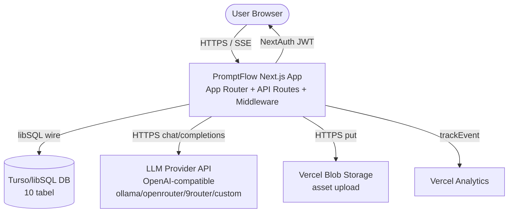
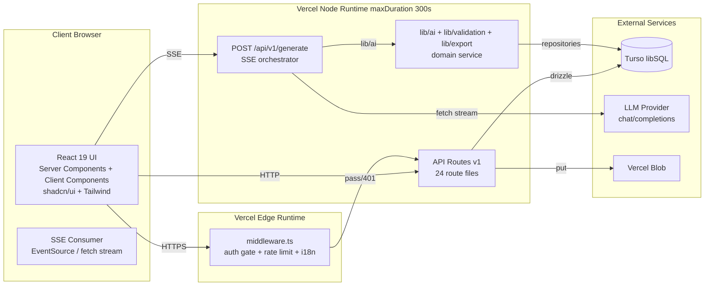
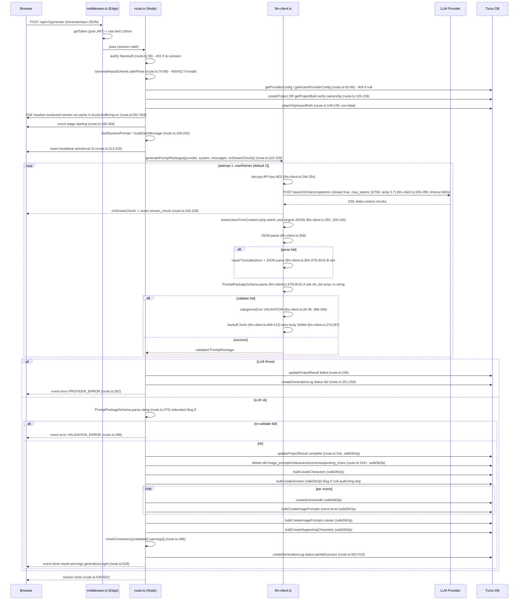
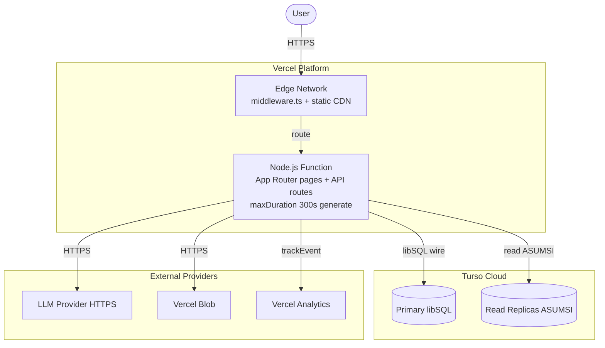

# PROJECT_ARCHITECTURE.md - PromptFlow Project Architecture

> Disusun oleh docgen-architecture. Source of truth: `product-docs/RAG-CONTEXT.md` (retrieval 2026-06-23) + `BRD.md` + `MRD.md` + `PRD.md` + `SRS.md` + `DATABASE_SCHEMA.md`.
> Klaim faktual bertumpu pada RAG (cite file:line). Item tanpa bukti ditandai `ASUMSI`.
> Bahasa naratif: Bahasa Indonesia. Identifier teknis + cuplikan kode apa adanya.
> Fokus: system architecture, component diagrams, layering, folder/module structure, data flow, external integrations, deployment, security, scalability.

---

## 1. Ringkasan Arsitektur + Gaya Arsitektur

PromptFlow = **monolith Next.js 15 App Router** (TypeScript strict) berjalan di Vercel (Node runtime, `maxDuration=300s` untuk `/api/v1/generate`) (`RAG S3.2`, `route.ts:19-21`). Tidak ada service terpisah / microservice. State di DB **Turso/libSQL** (SQLite-compatible hosted) (`RAG S2`, `client.ts:2-13`). Blob storage via Vercel Blob (`RAG S3.6`). Auth edge-safe via NextAuth v5 + jose JWT (`RAG S10.1, S10.4`).

Pipeline generasi = endpoint SSE tunggal `POST /api/v1/generate` (`route.ts:53-564`) yang mengorkestrasi: auth -> validasi input -> resolve provider -> resolve/create project -> build prompt -> call LLM (stream) -> extract JSON -> repair -> Zod validate -> retry loop -> persist DB (partial safe) -> consistency check -> SSE done event (`RAG S5`).

**Gaya arsitektur**: **layered monolith** (presentation / api / domain-service / data-access / infrastructure) dengan pola **repository** di data-access layer dan **service-orchestrator** di route handler generasi. Justifikasi monolith: tim kecil, deploy tunggal Vercel, DB hosted zero-ops Turso, latensi LLM dominan (bukan DB) (`SRS S1.1`).

| Aspek | Nilai | Citation |
|---|---|---|
| Gaya | Layered monolith + repository pattern | `RAG S3` |
| Framework | Next.js ^15.1.0 App Router | `package.json:50` |
| Runtime utama | Node.js (route generate) + Edge (middleware) | `route.ts:19`, `middleware.ts` |
| DB | Turso/libSQL (SQLite wire-compatible) - BUKAN Postgres | `client.ts:2`, `drizzle.config.ts:18` |
| ORM | drizzle-orm ^0.38.0 sqlite-core | `package.json:47`, `schema.ts:2` |
| Auth | NextAuth v5 beta Credentials + JWT jose | `config.ts:11-38`, `middleware.ts:83-87` |
| Encryption | AES-256-GCM API key at rest | `aes.ts:4-43` |
| Validation | Zod single source PromptPackageSchema | `schemas.ts:106-124` |
| i18n | next-intl v3.26 id/en | `next.config.ts:2`, `middleware.ts:40` |
| Package manager | pnpm >=9 (locked pnpm@11.7.0) | `package.json:88-90` |
| Node | >=20.0.0 | `package.json:86-88` |

---

## 2. Diagram Arsitektur Tingkat Tinggi (System Context)



Konteks: User berinteraksi via browser dengan Next.js app (Server Components + API routes). NextAuth session = JWT edge-safe jose (`middleware.ts:83-87`). DB Turso diakses via `@libsql/client` (`client.ts:2`). LLM provider = external HTTP OpenAI-compatible endpoint (`llm-client.ts:256-257`). Blob = Vercel Blob untuk asset upload (`next.config.ts:13`).

---

## 3. Container Diagram



Container utama:
1. **Next.js App** (App Router pages + API routes + middleware) - single deployable.
2. **Turso DB** - external hosted SQLite-compatible.
3. **LLM Provider API** - external OpenAI-compatible (ollama/openrouter/9router/custom via `custom`, `RAG S12 G8`).
4. **Vercel Blob** - external object storage.
5. **Client Browser** - React 19 UI + SSE consumer.

---

## 4. Component Diagram (modul lib)

```mermaid
graph TB
    subgraph ai[lib/ai - 13 file .ts]
        LLMClient[llm-client.ts<br/>generatePromptPackage<br/>retry loop + extract + repair + validate]
        PromptBuilder[prompt-builder.ts<br/>buildSystemPrompt + buildUserMessage]
        ResponseParser[response-parser.ts<br/>LEGACY tryExtractJson]
        ProviderRegistry[provider-registry.ts<br/>OpenAI-compatible adapter]
        ConsistencyChecker[consistency-checker.ts<br/>character ref mismatch]
        LogBuffer[log-buffer.ts<br/>FIFO max 500 entries]
        ImageClassifier[image-classifier.ts<br/>V2 Vision tag]
        PromptsShim[prompts/*.system.ts<br/>shim re-export prompt-builder]
    end

    subgraph db[lib/db]
        Client[client.ts<br/>single drizzle instance]
        Schema[schema.ts<br/>10 tabel sqlite-core]
        Repos[repositories/*.ts<br/>12 file per entitas]
    end

    subgraph auth[lib/auth]
        AuthConfig[config.ts<br/>NextAuth v5 Credentials + bcrypt]
        AuthMiddleware[middleware.ts<br/>requireSession]
        Edge[edge/<br/>authConfig edge-safe ASUMSI]
    end

    subgraph crypto[lib/crypto]
        AES[aes.ts<br/>AES-256-GCM encrypt/decrypt/mask]
    end

    subgraph validation[lib/validation]
        Schemas[schemas.ts<br/>PromptPackageSchema + sub-schema]
    end

    subgraph exportMod[lib/export]
        MDTemplate[markdown.template.ts<br/>render PromptPackage ke MD]
    end

    subgraph i18n[lib/i18n]
        I18nRequest[request.ts<br/>message loader]
        I18nConfig[config.ts<br/>routing id/en]
    end

    subgraph storage[lib/storage ASUMSI]
        BlobHelper[blob helper<br/>Vercel Blob put/del]
    end

    subgraph analytics[lib/analytics]
        Events[events.ts<br/>trackEvent Vercel Analytics]
    end

    subgraph templates[lib/templates]
        Presets[presets.ts<br/>5 preset: tutorial/cinematic/kids/documentary/action]
        Titles[titles.ts ASUMSI]
    end

    subgraph migration[lib/migration]
        V2V3[v2-to-v3.ts<br/>backfill + rollback]
    end

    subgraph apiError[lib/api]
        ErrorHelper[error.ts<br/>errorResponse envelope ASUMSI]
    end

    GenerateRoute --> LLMClient
    GenerateRoute --> PromptBuilder
    GenerateRoute --> ConsistencyChecker
    GenerateRoute --> LogBuffer
    LLMClient --> AES
    LLMClient --> Schemas
    LLMClient --> ProviderRegistry
    ProviderRegistry --> AES
    GenerateRoute --> Repos
    Repos --> Client
    Client --> Schema
    AuthConfig --> Repos
    Middleware --> Edge
    Middleware --> AuthConfig
```



Citation komponen: `RAG S3.1, S3.3, S3.4`. Detail modul lihat SRS S1.3 tabel modul.

---
## 5. Layer / Lapisan + Tanggung Jawab

| Layer | Lokasi | Tanggung jawab | Citation |
|---|---|---|---|
| Presentation | `src/app/[locale]/**` pages + `src/components/generate/*.tsx` (9 file) | Server Components render UI, Client Components interaktif (form, SSE consumer, log-viewer, result-tabs, audio-panel, scene-transition-card, voice-type-selector, template-picker, image-prompt-display, dropzone-uploader) | `RAG S3.1` |
| API | `src/app/api/v1/**` (24 route files) + `src/app/api/auth/[...nextauth]` | Route handlers REST + SSE. Boundary validation (Zod safeParse), auth gate via `auth()`, ownership check, orchestrate service layer. Endpoint generasi = SSE orchestrator. | `RAG S3.2`, `route.ts:53-564` |
| Domain / Service | `src/lib/ai/**` + `src/lib/validation/**` + `src/lib/export/**` + `src/lib/templates/**` + `src/lib/migration/**` | Logika domain: build prompt, call LLM, extract+repair JSON, validate PromptPackage, consistency check, render markdown, template presets, v2->v3 backfill. Tidak tahu detail transport (HTTP/SSE) - pure function. | `RAG S3.1` |
| Data Access | `src/lib/db/client.ts` + `src/lib/db/schema.ts` + `src/lib/db/repositories/*.ts` (12 file) | Repository pattern: per-entitas CRUD. Single drizzle instance. snake_case casing. Tidak ada transaction (safeDbOp continue-on-error, `RAG S11 Bug D`). | `RAG S3.3`, `DATABASE_SCHEMA S10.4` |
| Infrastructure | `src/lib/crypto/aes.ts` + `src/lib/storage/**` + `src/lib/auth/**` + `src/lib/analytics/events.ts` + `src/lib/i18n/**` + `src/lib/api/error.ts` | Cross-cutting infra: encryption, blob storage, auth config + middleware, analytics event, i18n routing+messages, error envelope helper. | `RAG S3.1, S3.4, S3.5, S3.6` |

Dependency rule: Presentation -> API -> Domain/Service -> Data Access -> Infrastructure. Domain tidak bergantung Presentation/API (pure). Data Access tidak bergantung Domain (hanya schema + client). Infrastructure dipakai semua layer.

---

## 6. Struktur Folder / Modul Proyek

```
src/
  app/
    api/
      v1/                                # 24 route files (RAG S3.2)
        generate/route.ts                # SSE generation (POST, nodejs, maxDuration 300, force-dynamic)
        upload/route.ts                  # asset upload -> Vercel Blob
        upload/classify/route.ts         # V2 Vision classification
        diagnose/route.ts                # DB+env+auth+provider check
        health/route.ts                  # health check (public)
        register/route.ts                # user register (bcrypt.hash ASUMSI)
        dashboard/stats/route.ts         # aggregate stats
        settings/providers/route.ts      # provider config CRUD
        settings/providers/[id]/route.ts
        settings/providers/[id]/delete/route.ts
        settings/providers/[id]/test/route.ts
        projects/route.ts                # project CRUD + list
        projects/[id]/route.ts
        projects/bulk-delete/route.ts
        projects/[id]/theme/route.ts     # themePreference V3
        projects/[id]/image-prompts/route.ts
        projects/[id]/delete/route.ts
        projects/[id]/characters/route.ts
        projects/[id]/scenes/route.ts
        projects/[id]/export/route.ts    # Markdown export
        projects/[id]/logs/route.ts      # generation logs list
        projects/[id]/scenes/[sceneId]/audio/route.ts
        projects/[id]/scenes/[sceneId]/audio/[audioId]/route.ts
      auth/[...nextauth]/route.ts        # NextAuth v5 Credentials flow
    [locale]/                            # i18n segment id|en (middleware.ts:38-42)
      page.tsx, layout.tsx, dll          # Server Components per locale
  components/
    generate/                            # 9 .tsx (generate-form, log-viewer, result-tabs,
                                         #   audio-panel, scene-transition-card, voice-type-selector,
                                         #   template-picker, image-prompt-display, dropzone-uploader)
    ui/                                  # shadcn/ui primitives (radix-based)
  lib/
    ai/                                  # 13 .ts
      llm-client.ts                      # generatePromptPackage (retry, extract, repair, validate)
      prompt-builder.ts                  # buildSystemPrompt + buildUserMessage
      response-parser.ts                 # LEGACY tryExtractJson (tidak dipakai route.ts)
      provider-registry.ts               # OpenAI-compatible adapter
      consistency-checker.ts             # character ref mismatch warning
      log-buffer.ts                      # FIFO max 500 entries
      image-classifier.ts                # V2 Vision tag (upload/classify)
      prompts/                           # 5 shim re-export prompt-builder
        scenes.system.ts, character.system.ts, voiceover.system.ts,
        image-prompts.system.ts, moral.system.ts
    auth/
      config.ts                          # NextAuth v5 Credentials + bcrypt.compare
      middleware.ts                      # requireSession helper
      edge/                              # authConfig edge-safe (ASUMSI: pages.signIn + callbacks)
    crypto/
      aes.ts                             # AES-256-GCM encrypt/decrypt/maskApiKey
    db/
      client.ts                          # single drizzle + libsql instance, snake_case
      schema.ts                          # 10 tabel sqlite-core (users, provider_configs, projects,
                                         #   asset_references, characters, scenes, image_prompts,
                                         #   generation_logs, supporting_characters, scene_audio)
      repositories/                      # 12 .ts (user, project, scene, character, image-prompt,
                                         #   supporting-character, asset-reference, generation-log,
                                         #   provider-config, scene-audio, dashboard, + project.repo.test)
    templates/
      presets.ts                         # 5 preset (tutorial, cinematic, kids, documentary, action)
      titles.ts                          # ASUMSI
    export/
      markdown.template.ts               # render PromptPackage -> Markdown
    migration/
      v2-to-v3.ts                        # backfill + rollback V2->V3
    analytics/
      events.ts                          # trackEvent (Vercel Analytics)
    i18n/
      request.ts                         # next-intl message loader
      config.ts                          # routing id/en (diimpor middleware.ts:4)
    api/
      error.ts                           # errorResponse envelope (ASUMSI shape {error:{code,message,details}})
    storage/                             # ASUMSI blob helper (next.config.ts:13 remotePattern)
  middleware.ts                          # Edge: auth gate + i18n localize + rate limit 10/min generate
messages/                                # id.json, en.json (ASUMSI isi)
product-docs/                            # SOURCE OF TRUTH docs (BRD/MRD/PRD/SRS/DB_SCHEMA/ARCH/UIUX/API/RULES/TEST/AGENTS)
drizzle/                                 # migration SQL (0000, 0001, 0002 + meta/_journal.json)
```

Annotation per folder: lihat citation `RAG S3.1`. Repository = per-entitas (bukan generic) untuk query spesifik + ownership filter.

---
## 7. Alur Data Utama (DEEP - Generation Pipeline)

### 7.1 Use case kunci: POST /api/v1/generate



### 7.2 Penanda Bug di alur

| Bug | Lokasi di alur | Citation |
|---|---|---|
| Bug A (VALIDATION sfx_list array vs string) | `llm-client.ts:379` PromptPackageSchema.parse - schema `schemas.ts:52` z.string() reject array dari LLM | `RAG S11 Bug A` |
| Bug B (JSON_PARSE malformed/escape rusak) | `llm-client.ts:364-375` repairTruncatedJson fail - tidak handle newline mentah/control char/trailing data | `RAG S11 Bug B`, `RAG S8.2.2` |
| Bug C (extractJson pick largest salah) | `llm-client.ts:157` sort by length desc - pick rusak vs valid kecil | `RAG S11 Bug C` |
| Bug D (safeDbOp swallow, partial silent) | `route.ts:35-51` return null on error - status tetap complete (route.ts:316) walau scene hilang | `RAG S11 Bug D` |
| Bug E (double validation redundant) | `llm-client.ts:379` + `route.ts:270` parse ulang pkg sudah validated | `RAG S11 Bug E` |
| Bug F (schema duplikat inkonsisten) | `schemas.ts:39-55` vs `83-99` default volume 0.5 vs 0.7 | `RAG S11 Bug F` |

### 7.3 Use case sekunder: GET /api/v1/projects/[id]/export

Request -> middleware auth gate -> route handler -> `getProjectById` verify ownership -> parse `resultJson` (JSON string PromptPackage) -> `markdown.template.ts:4-173` render -> response `text/markdown`. Tidak call LLM. Citation `RAG S4 F16`, `SRS S3.3.1`.

---

## 8. Integrasi Eksternal / API Pihak Ketiga

| Integrasi | Protokol | Endpoint / Cara konsumsi | Auth | Citation |
|---|---|---|---|---|
| LLM Provider (ollama/openrouter/9router/custom) | HTTPS POST SSE | `${baseUrl}/chat/completions`, body `{model, messages, max_tokens, temperature, stream}`, header `Authorization: Bearer <apiKey>` (decrypt AES) | API key AES-256-GCM at rest, decrypt di `llm-client.ts:244-254` | `llm-client.ts:256-274`, `provider-registry.ts:2,12-16,29` |
| Turso/libSQL DB | libSQL wire (HTTPS) | `@libsql/client createClient({url, authToken})`, drizzle ORM sqlite-core | `TURSO_AUTH_TOKEN` env | `client.ts:2-13`, `drizzle.config.ts:18` |
| NextAuth | internal | `auth()` di route, `getToken` jose di middleware | `NEXTAUTH_SECRET` JWT, Credentials provider bcrypt | `config.ts:11-38`, `middleware.ts:83-87` |
| Vercel Blob | HTTPS put | `@vercel/blob` (ASUMSI via `src/lib/storage/`), remotePattern `**.public.blob.vercel-storage.com` | `BLOB_READ_WRITE_TOKEN` env, toggle `USE_VERCEL_BLOB` | `next.config.ts:13`, `.env.example:13-14` |
| Vercel Analytics | internal | `trackEvent(event, props)` `events.ts:1-22` | injected by `@vercel/analytics` | `package.json:40`, `events.ts:1-22` |
| OpenRouter referer | HTTP header | `NEXT_PUBLIC_APP_URL` sebagai referer header (`provider-registry.ts:36`) | env | `RAG S10.5` |

Tidak ada webhook inbound. Tidak ada message queue. Tidak ada cron (ASUMSI: retensi `generation_logs` purge = manual / future, `DATABASE_SCHEMA S10.3`).

---
## 9. Manajemen Konfigurasi & Environment

Env vars (`.env.example:1-17`, `RAG S10.5`, `SRS S6.10`). **TIDAK ada nilai asli di repo** (`RAG S12 G3`).

| Var | Purpose | Wajib | Citation |
|---|---|---|---|
| `TURSO_DATABASE_URL` | DB URL libSQL | YA | `client.ts:9` |
| `TURSO_AUTH_TOKEN` | DB auth token | YA | `client.ts:10` |
| `ENCRYPTION_KEY` | AES-256-GCM key, 32 byte base64 | YA | `aes.ts:8` |
| `NEXTAUTH_SECRET` | JWT sign secret | YA | `config.ts:9` |
| `NEXTAUTH_URL` | Auth base URL | YA | `config.ts` implicit |
| `NEXT_PUBLIC_APP_URL` | public app URL, OpenRouter referer | YA | `provider-registry.ts:36` |
| `BLOB_READ_WRITE_TOKEN` | Vercel Blob write | opsional (`USE_VERCEL_BLOB=false`) | `.env.example:13` |
| `USE_VERCEL_BLOB` | toggle blob storage | opsional | `.env.example:14` |

Config management: env via Vercel project settings (prod) + `.env.local` (dev, tidak di-commit). `drizzle.config.ts:6-7` load dotenv `.env.local` fallback `.env` untuk migration CLI. Runtime app pakai `process.env` langsung (Next.js auto-load `.env.local`).

Secrets: `ENCRYPTION_KEY`, `NEXTAUTH_SECRET`, `TURSO_AUTH_TOKEN`, `BLOB_READ_WRITE_TOKEN` = server-only (tidak `NEXT_PUBLIC_*`). `server-only` package (`package.json:58`) guard modul server tidak ter-import client.

---

## 10. Strategi Keamanan Arsitektural

| Boundary | Mekanisme | Citation |
|---|---|---|
| Auth gate edge | `middleware.ts` cek JWT via `getToken` jose (edge-safe), 401 non-public path tanpa session. Public paths: `/`, `/login`, `/register`, `/api/auth`, `/api/v1/auth`, `/api/v1/health`, `/_next` (`middleware.ts:6-16`) | `RAG S10.4`, `SRS SEC-05` |
| Rate limit | In-memory Map single-instance, 10 req/min per user/IP untuk `/api/v1/generate` (`middleware.ts:18-36,109-127`). ASUMSI prod needs Redis (`middleware.ts:18` comment) - out-of-scope release ini | `SRS SEC-04` |
| API key at rest | AES-256-GCM (`aes.ts:4-43`), key dari `ENCRYPTION_KEY` 32 byte base64, IV 12 byte + auth tag. Dipakai: `provider-registry.ts:29`, `llm-client.ts:7,244-254`, `provider-config.repo.ts:5`. `maskApiKey` `****`+last4 untuk display | `SRS SEC-01` |
| Password hash | bcrypt (register `bcrypt.hash` ASUMSI `RAG G4`, authorize `bcrypt.compare` `config.ts:31`) | `SRS SEC-02` |
| Session | NextAuth v5 JWT edge-safe jose, secureCookie dinamis `__Secure-` prefix prod HTTPS / no prefix localhost HTTP (`middleware.ts:80-86`). Session augmentation `user.id: number` (`config.ts:42-50`) | `SRS SEC-03, SEC-08, SEC-10` |
| Ownership check | Setiap project/provider/log endpoint verify `project.userId === session.user.id` (route handler) | `SRS SEC-06`, `RAG S5` step 5 |
| Input validation | Zod `safeParse` di API boundary (`route.ts:70-88`). `PromptPackageSchema.parse` di llm-client + route (double, Bug E) | `SRS SEC-implicit` |
| CSRF | NextAuth v5 Credentials flow + JWT + same-site cookie | `SRS SEC-03` |
| No secrets in repo | `.env.local` tidak di-commit, `.env.example` hanya nama key | `SRS SEC-07` |
| server-only guard | package `server-only` cegah modul server di-import client | `SRS SEC-09` |
| Encryption transit | HTTPS (Vercel auto), libSQL HTTPS, LLM HTTPS | implicit |

---

## 11. Skalabilitas, Caching, Performa, Observability

### 11.1 Skalabilitas

| Concern | Status | Rekomendasi | Citation |
|---|---|---|---|
| DB concurrent write | Turso/libSQL = single-writer multi-reader via replication. Scale >100 concurrent generate = eval migrasi Postgres (out of scope v0.1.0) | `DATABASE_SCHEMA S10.5` |
| Turso read replicas | Turso support read replicas multi-region (edge read dekat user). ASUMSI: belum dikonfigurasi eksplisit di repo | Turso docs |
| Edge runtime candidates | middleware edge. Route generate = nodejs (perlu `fetch` stream + AbortSignal + drizzle). Candidate edge: `/api/v1/health`, `/api/v1/diagnose` (bila tidak query DB berat) | `route.ts:19` |
| LLM call latency | ~110s teramati di log user (Bug B context, output panjang). `maxDuration=300` Vercel Pro, fetch timeout 600s (`llm-client.ts:288`). ASUMSI: samakan fetch timeout ke 300s match Vercel (`NFR-PERF-05`) | `RAG S11 Bug B`, `SRS S6.6` |
| SSE timeout | Vercel maxDuration 300s = hard ceiling. Heartbeat 2s (`route.ts:213-220`) keep connection alive. Bila LLM >300s = abort + error TIMEOUT | `route.ts:20,213-220` |

### 11.2 Caching

Tidak ada cache layer eksplisit (no Redis, no in-memory cache app-level selain rate-limit Map). Vercel CDN cache static asset (`_next/static`). `force-dynamic` di route generate (`route.ts:21`) bypass cache. ASUMSI: read-heavy (dashboard, project list) bisa manfaatkan Turso read replica + Next.js `unstable_cache` (future).

### 11.3 Performa

| Item | Catatan |
|---|---|
| LLM dominan | Latensi 95%+ dari LLM call. Heartbeat + SSE stage events untuk UX. |
| DB query | Index FK sudah ada (`DATABASE_SCHEMA S5.1`). Composite index tambahan direkomendasi (`DATABASE_SCHEMA S5.2`). |
| JSON parse | Output LLM 15-50KB+, `extractJsonFromContent` + `repairTruncatedJson` = O(n) string scan. Tidak bottleneck vs LLM. |
| Double validation (Bug E) | Redundant `PromptPackageSchema.parse` 2x. Boros CPU payload besar tapi minor vs LLM. |

### 11.4 Observability

| Kanal | Mekanisme | Citation |
|---|---|---|
| `console.log/error` | Server log Vercel. Prefix `[generate]`, `[llm]`. Stage events, payload size, duration, error categorize. | `route.ts`, `llm-client.ts` |
| `log-buffer.ts` | In-memory FIFO max 500 entries, observability real-time tanpa DB query. Drain ke `generation_logs.logsJson`. | `RAG S4 F18`, `log-buffer.ts:1-34` |
| `generation_logs` tabel | Audit log persist: provider, model, durationMs, status (success/partial/fail), errorMessage `[CATEGORY] msg`, logsJson array. | `schema.ts:147-160`, `RAG S9.8` |
| Vercel Analytics | `trackEvent` events: generate_start/success/fail, export, provider_switch, register. | `events.ts:1-22`, `RAG S4 F21` |
| `/api/v1/diagnose` | Self-check DB+env+auth+provider. ASUMSI isi. | `RAG S12 G18` |
| `/api/v1/health` | Public health check. | `RAG S3.2` |

Error categorize (`llm-client.ts:18-44`): `TIMEOUT`, `NETWORK`, `VALIDATION`, `HTTP`, `JSON_PARSE`, `UNKNOWN`. SRS extend `DB_ERROR` untuk DB failure (`FR-GEN-06`).

---
## 12. Strategi Deployment + Topologi Runtime



| Item | Detail | Citation |
|---|---|---|
| Platform | Vercel (vercel.json ASUMSI ada `RAG S12 G14`) | `RAG S12 G14` |
| Build | `pnpm build` (Next.js build). TypeScript strict, eslint, prettier. | `package.json:86-90` |
| Runtime | Edge (middleware) + Node.js (pages + API). `maxDuration=300` route generate (`route.ts:20`). | `route.ts:19-21` |
| DB migration | `pnpm db:generate` (CI) -> `pnpm db:migrate` (deploy step). **JANGAN `db:push` prod**. Drizzle Kit dialect turso. | `DATABASE_SCHEMA S8.2` |
| Env | Vercel project settings (prod) + `.env.local` (dev). | `SRS S6.10` |
| CDN | Vercel Edge Network cache `_next/static`. `force-dynamic` route generate. | `route.ts:21` |
| Container | Tidak ada Docker (Vercel managed). ASUMSI: bisa self-host via `next start` bila perlu. | - |
| Rollback | Vercel instant rollback per-deploy. DB migration = Drizzle Kit (forward-only, rollback manual via `v2-to-v3.ts:59-142` pattern). | - |

Deployment workflow rekomendasi:
1. Dev: ubah `schema.ts` -> `pnpm db:generate` -> review `drizzle/000X_*.sql` -> `pnpm db:migrate` local.
2. CI: `pnpm lint && pnpm format && pnpm test --coverage && pnpm build`.
3. Prod deploy: Vercel auto-deploy git push -> `pnpm db:migrate` di deploy hook (ASUMSI konfigurasi).

---

## 13. Cross-cutting Concerns

| Concern | Implementasi | Citation |
|---|---|---|
| i18n | next-intl v3.26, plugin `createNextIntlPlugin('./src/lib/i18n/request.ts')` (`next.config.ts:2`). Routing `routing` dari `@/lib/i18n/config` (`middleware.ts:4`). Lokal `id`, `en` (`middleware.ts:40`). Path segment `[locale]`. Messages `messages/id.json`, `messages/en.json` (ASUMSI isi `RAG G12`). Locale strip + localize di middleware (`middleware.ts:38-54`). | `RAG S3.5`, `SRS S3.8` |
| Logging | Server `console.log/error` prefix `[generate]`/`[llm]`. In-memory `log-buffer.ts` FIFO 500 entries. Persist `generation_logs.logsJson` (array entries). | `RAG S4 F18`, `log-buffer.ts:1-34` |
| Analytics events | `events.ts:1-22` trackEvent Vercel Analytics. Events: generate_start/success/fail, export, provider_switch, register. | `RAG S4 F21` |
| Error handling | `lib/api/error.ts` `errorResponse(code, status, msg, details)` ASUMSI shape `{error:{code,message,details}}`. Kategori `categorizeError` (`llm-client.ts:18-44`). Unhandled catch route generate -> event error PROVIDER_ERROR (SRS extend spesifik). | `route.ts:4`, `SRS S5.7` |
| Validation | Zod `schemas.ts` single source. safeParse di API boundary, parse di service (llm-client + route double Bug E). | `schemas.ts:106-124` |
| Auth | NextAuth v5 + bcrypt + jose JWT edge. Middleware gate + rate limit. Ownership check route handler. | `RAG S10` |
| Encryption | AES-256-GCM API key at rest (`aes.ts`). | `RAG S10.3` |
| Theming | next-themes dark/light/system. `projects.themePreference` V3. | `RAG S4 F20`, `schema.ts:44` |
| Migration | `migration/v2-to-v3.ts` backfill + rollback. Drizzle Kit for schema. | `RAG S4 F17` |

---

## 14. Keputusan Arsitektur Penting (ADR ringkas)

### ADR-01: Monolith Next.js App Router vs microservices

- **Konteks**: Tim kecil, deliverable v0.1.0, latensi LLM dominan, deploy tunggal Vercel.
- **Keputusan**: Layered monolith Next.js App Router. Tidak ada service terpisah.
- **Alasan**: (a) deploy tunggal = simple CI/CD; (b) shared code (Zod schema, drizzle) lintas route tanpa RPC overhead; (c) latensi LLM 110s+ dominan, overhead network antar-service tidak signifikan; (d) Turso hosted zero-ops; (e) SSE orchestrator di single route handler = koherensi state. Trade-off: coupling tinggi, scale = scale whole app.

### ADR-02: Turso/libSQL vs Postgres

- **Konteks**: Butuh DB hosted zero-ops, edge-read, SQLite wire-compatible. Asumsi awal orchestrator Postgres/Neon (`RAG S2` koreksi).
- **Keputusan**: Turso/libSQL (SQLite wire-compatible) + drizzle-orm sqlite-core.
- **Alasan**: (a) zero-ops managed; (b) libSQL = SQLite extended native replication; (c) tipe data sederhana (integer/text/real) cukup untuk domain; (d) edge-read dekat user. Trade-off: single-writer concurrency terbatas, no `jsonb`/`enum`/`CHECK` kompleks (validasi di app layer Zod). Scale >100 concurrent write = eval migrasi Postgres (out of scope).

### ADR-03: SSE route handler vs server action untuk generasi

- **Konteks**: Generasi butuh streaming progress + chunk LLM real-time.
- **Keputusan**: SSE route handler `POST /api/v1/generate` (`text/event-stream`), bukan server action.
- **Alasan**: (a) SSE = standard streaming progress events; (b) server action tidak native stream chunk; (c) route handler kontrol headers `X-Accel-Buffering: no` + `no-cache`; (d) `maxDuration=300` Vercel. Trade-off: tidak idempotent (POST), perlu rate limit eksplisit.

### ADR-04: safeDbOp continue-on-error vs transaction

- **Konteks**: Persist PromptPackage = multi-tabel cascade (project -> characters -> scenes -> image_prompts -> scene_audio -> supporting_chars). Turso single-writer + SQLite transaction terbatas.
- **Keputusan**: `safeDbOp` (`route.ts:35-51`) wrap per-op, swallow error, return null, continue. Tidak ada rollback. Status `complete` walau partial (Bug D).
- **Alasan**: (a) SQLite concurrency write terbatas, rollback kompleks multi-tabel cascade; (b) by design existing - partial success acceptable; (c) `generation_logs` audit untuk recovery. Trade-off: silent partial (Bug D). SRS FR-GEN-06 extend: track `partialSceneIds`, status `partial`, UI warning.

### ADR-05: AES-256-GCM API key vs env-only

- **Konteks**: Multi-provider per user, API key per provider config perlu persist (user input via UI).
- **Keputusan**: AES-256-GCM encrypt API key sebelum persist `provider_configs.apiKeyEncrypted` (`aes.ts`). Key dari `ENCRYPTION_KEY` env.
- **Alasan**: (a) support multi-provider per user tanpa re-input; (b) encrypt at rest = bila DB leak, key tidak plaintext; (c) AES-GCM = auth tag, integrity. Trade-off: `ENCRYPTION_KEY` rotate = re-encrypt all rows.

### ADR-06: Zod single source PromptPackageSchema vs DB schema validation

- **Konteks**: SQLite tidak enforce enum/JSON/complex constraint. Output LLM = JSON harus valid sebelum persist.
- **Keputusan**: Zod `PromptPackageSchema` (`schemas.ts:106-124`) = single source validasi domain. DB schema = storage shape. Coercion di app layer (mis. `color_palette` union -> `JSON.stringify`, `sfx_list` target union -> normalizer).
- **Alasan**: (a) SQLite no enum/JSONB; (b) Zod type-safe lintas route + service; (c) LLM output longgar, DB strict, normalizer jembatan. Trade-off: Bug A (schema `z.string()` vs LLM array) - fix SRS FR-GEN-02 union + normalizer.

### ADR-07: Edge middleware JWT (jose) vs full NextAuth session DB lookup

- **Konteks**: Middleware edge runtime tidak bisa pakai Node crypto / DB query berat.
- **Keputusan**: `getToken` jose edge-safe (`middleware.ts:83-87`) decode JWT tanpa DB. Full session lookup `auth()` di route handler (Node runtime) bila perlu user fresh.
- **Alasan**: (a) edge = low latency gate; (b) jose pure JS, edge-compatible; (c) rate limit in-memory Map edge. Trade-off: JWT revoke = cookie expiry (no server-side session store).

---
## 15. ASUMSI (tidak ada bukti di repo)

| # | Item | Alasan | Citation |
|---|---|---|---|
| A1 | `authConfig` edge config isi (pages.signIn + callbacks + jwt) | `src/lib/auth/edge` diimpor `config.ts:6` tapi tidak dibaca | `RAG G5` |
| A2 | Register route `bcrypt.hash` | `register/route.ts` ada tapi tidak dibaca | `RAG G4` |
| A3 | `src/lib/storage/` blob helper path | next.config.ts:13 remotePattern vercel blob, path helper tidak diverifikasi | `RAG G9` |
| A4 | `src/lib/api/error.ts` shape `{error:{code,message,details}}` | diimpor `route.ts:4`, implementasi tidak dibaca | `RAG G11` |
| A5 | `messages/id.json`, `en.json` isi lengkap | README.md:55 sebut ada, isi tidak dibaca | `RAG G12` |
| A6 | `vercel.json` ada + konfigurasi | Terlihat di root listing, isi tidak dibaca | `RAG G14` |
| A7 | Turso read replicas belum dikonfigurasi eksplisit | Tidak ada config replica di repo | - |
| A8 | Provider "tokenrouter" + "MiniMax-M3" = disimpan sebagai `custom` | Tidak ada di ProviderEnum schema (`schemas.ts:159`), dari log user | `RAG G8` |
| A9 | `PRAGMA foreign_keys = ON` di client.ts | Tidak diverifikasi, SQLite default OFF | `DATABASE_SCHEMA A5` |
| A10 | Dashboard stats / diagnose / test endpoint isi | File ada, isi tidak dibaca | `RAG G18-G20` |

---

## 16. Citation Index (RAG-CONTEXT.md / file:line)

| Klaim | Citation |
|---|---|
| DB Turso/libSQL BUKAN Postgres | `RAG S2`, `client.ts:2-13`, `drizzle.config.ts:18`, `schema.ts:2` |
| App Router struktur + 24 route | `RAG S3.1, S3.2`, `next.config.ts:1-17`, glob `src/app/api/**/*.ts` |
| Generation pipeline end-to-end | `RAG S5`, `route.ts:53-564`, `llm-client.ts:237-424` |
| Bug A sfx_list VALIDATION | `RAG S6.4, S11 Bug A`, `schemas.ts:52`, `prompt-builder.ts:75-97,152` |
| Bug B JSON_PARSE repair fail | `RAG S8.2.2, S11 Bug B`, `llm-client.ts:50-100,274,287,284-289` |
| Bug D safeDbOp partial silent | `RAG S11 Bug D`, `route.ts:35-51,316` |
| Bug E double validation | `RAG S11 Bug E`, `llm-client.ts:379`, `route.ts:270` |
| Bug F schema duplikat | `RAG S11 Bug F`, `schemas.ts:39-55,83-99` |
| Auth NextAuth v5 + bcrypt + jose | `RAG S10.1, S10.2, S10.4`, `config.ts:11-38`, `middleware.ts:56-140` |
| AES-256-GCM | `RAG S10.3`, `aes.ts:4-43` |
| Rate limit 10/min | `RAG S10.4`, `middleware.ts:18-36,109-127` |
| i18n id/en | `RAG S3.5`, `next.config.ts:2`, `middleware.ts:38-54` |
| Vercel Blob | `RAG S3.6`, `next.config.ts:13`, `.env.example:13-14` |
| Env vars | `RAG S10.5`, `.env.example:1-17` |
| 10 tabel DB schema | `RAG S9`, `schema.ts:5-201`, `DATABASE_SCHEMA S3` |
| Repository pattern 12 file | `RAG S3.3`, `src/lib/db/repositories/*.ts` |
| Export Markdown | `RAG S4 F16`, `markdown.template.ts:4-173` |
| Consistency checker | `RAG S4 F19`, `consistency-checker.ts:19-38`, `route.ts:496` |
| log-buffer FIFO 500 | `RAG S4 F18`, `log-buffer.ts:1-34` |
| Analytics events | `RAG S4 F21`, `events.ts:1-22` |
| Template presets | `RAG S4 F15`, `presets.ts:53-224` |
| V2->V3 migration | `RAG S4 F17`, `v2-to-v3.ts:59-142` |
| categorizeError | `RAG S8.2.3`, `llm-client.ts:18-44` |
| extractJsonFromContent | `RAG S8.2.1`, `llm-client.ts:106-165` |
| repairTruncatedJson | `RAG S8.2.2`, `llm-client.ts:50-100` |
| PromptPackageSchema | `RAG S6`, `schemas.ts:106-124` |

---

> Dokumen ini fokus pada ARSITEKTUR: system context, container, component, layering, folder structure, data flow, external integrations, deployment, security boundaries, scalability, cross-cutting concerns, ADR. Selaras BRD (why) + MRD (who) + PRD (what) + SRS (how) + DATABASE_SCHEMA (data). Dokumen turunan: UIUX_SPEC, API_CONTRACT, CODING_RULES, TEST_PLAN, AGENTS.md.
