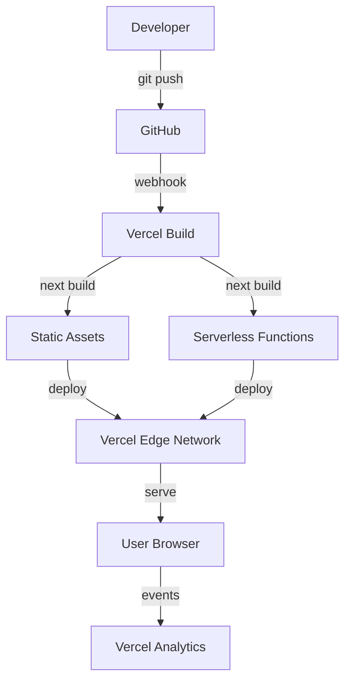

# PROJECT_ARCHITECTURE.md — PromptFlow Landing Page

> **Versi:** 1.0
> **Tanggal:** 2026-06-20
> **Deliverable:** Landing page `src/app/[locale]/page.tsx` — redesign total
> **Status:** Draft
> **Selaras:** SRS.md (teknis), RAG-CONTEXT.md (fakta), AGENTS.md (build guide)

---

## Daftar Isi

1. [Ringkasan Arsitektur](#1-ringkasan-arsitektur)
2. [System Context Diagram](#2-system-context-diagram)
3. [Container Diagram](#3-container-diagram)
4. [Component Diagram](#4-component-diagram)
5. [Layer / Tanggung Jawab](#5-layer--tanggung-jawab)
6. [Folder / Module Structure](#6-folder--module-structure)
7. [Data Flow](#7-data-flow)
8. [Integrasi Eksternal](#8-integrasi-eksternal)
9. [Manajemen Konfigurasi & Environment](#9-manajemen-konfigurasi--environment)
10. [Strategi Keamanan](#10-strategi-keamanan)
11. [Skalabilitas, Caching, Performa, Observability](#11-skalabilitas-caching-performa-observability)
12. [Deployment](#12-deployment)
13. [Keputusan Arsitektur (ADR)](#13-keputusan-arsitektur-adr)

---

## 1. Ringkasan Arsitektur

**Gaya arsitektur:** Server Component-first + Client Component hybrid (Next.js App Router pattern).

**Justifikasi:** Landing page = konten statis dengan animasi interaktif. Server Component untuk initial render cepat + SEO. Client Component hanya untuk komponen yang butuh Framer Motion, state lokal (FAQ toggle, scroll detection, counter animation). Tanpa backend/database — full frontend static site.

**Karakteristik:**
- Zero server-side data fetching di landing page
- Semua teks via i18n (next-intl)
- Animasi = Framer Motion (scroll-triggered, hover, counter)
- Analytics = @vercel/analytics (no PII)
- Deploy = Vercel edge network (static + ISR)

**ASUMSI:** Landing page berdiri sendiri dari web app utama PromptFlow. Shared component (shadcn/ui) + shared design tokens (globals.css), tetapi landing page = route terpisah `[locale]/page.tsx` tanpa dependensi ke backend API.

---

## 2. System Context Diagram

```
+------------------------------------------------------------------+
|                        PROMPTFLOW LANDING PAGE                    |
|                                                                  |
|  User (Browser/Mobile)                                           |
|       |                                                          |
|       | HTTPS                                                    |
|       v                                                          |
|  +------------------------------------------------------------+  |
|  |  Vercel Edge Network                                       |  |
|  |  - Static assets (HTML, CSS, JS, images)                  |  |
|  |  - Next.js serverless functions (SSR/ISR)                 |  |
|  +------------------------------------------------------------+  |
|       |                    |                    |                 |
|       v                    v                    v                 |
|  [Landing Page]    [Vercel Analytics]    [Google Fonts CDN]       |
|  /[locale]/page    (event tracking)     (Inter, JetBrains Mono)  |
+------------------------------------------------------------------+

Sumber: SRS.md S2, RAG-CONTEXT.md S1
```

**Aktor:**
- **User** — Browser/mobile, mengakses landing page via HTTPS
- **Vercel** — Hosting, edge CDN, serverless functions, analytics
- **Google Fonts** — Font CDN (Inter via system-ui, JetBrains Mono)

---

## 3. Container Diagram

```
+-------------------------------------------------------------------+
|  Vercel Platform                                                   |
|                                                                    |
|  +------------------+  +------------------+  +------------------+  |
|  | Edge Network     |  | Serverless Fn    |  | Analytics        |  |
|  | (CDN + Cache)    |  | (Next.js SSR)    |  | (@vercel/        |  |
|  |                  |  |                  |  |  analytics)      |  |
|  | - Static HTML    |  | - /[locale]/     |  |                  |  |
|  | - CSS/JS bundle  |  |   page.tsx       |  | - page views     |  |
|  | - Image assets   |  | - Layout SSR     |  | - custom events  |  |
|  | - OG image       |  | - i18n resolve   |  | - no PII         |  |
|  +------------------+  +------------------+  +------------------+  |
+-------------------------------------------------------------------+
           |                     |                      |
           v                     v                      v
+------------------+  +------------------+  +------------------+
| Browser (Client) |  | Browser (Client) |  | Browser (Client) |
|                  |  |                  |  |                  |
| - Framer Motion  |  | - FAQ state      |  | - Analytics SDK  |
| - Scroll detect  |  | - Counter anim   |  | - Event dispatch |
| - Nav sticky     |  | - Hover effects  |  | - Session track  |
+------------------+  +------------------+  +------------------+
```

**Container:**
1. **Vercel Edge Network** — Static asset serving + CDN cache
2. **Vercel Serverless** — Next.js SSR/ISR untuk server components + i18n
3. **Vercel Analytics** — Event tracking tanpa PII
4. **Browser Client** — Framer Motion runtime + client state + analytics SDK

---

## 4. Component Diagram

### 4.1 Landing Page Component Tree

```
src/app/[locale]/page.tsx  (Server Component — root orchestrator)
  |
  +-- Navbar               (Client — sticky + scroll bg detection)
  |     +-- LogoPlaceholder (Server — text-based "PromptFlow")
  |     +-- LanguageToggle  (Client — next-intl switchLocale)
  |     +-- CTA Button      (shadcn/ui Button)
  |
  +-- Hero                 (Client — Framer Motion entrance)
  |     +-- Headline (animated)
  |     +-- Subheadline
  |     +-- CTA Primary (Button violet filled)
  |     +-- CTA Secondary (Button outline)
  |     +-- BrowserMockup  (Client — generate form mockup)
  |
  +-- SocialProofBar       (Client — logo row + counter)
  |     +-- LogoPlaceholder[] (Server — grayscale brand SVGs)
  |     +-- AnimatedCounter   (Client — useMotionValue 0->100+)
  |
  +-- ProblemSolution      (Client — 2 kolom pain/solution)
  |     +-- FeatureCard[]  (Client — stagger fade-in)
  |
  +-- HowItWorks           (Client — 3 step connector)
  |     +-- StepCard[]     (Client — number + icon + text)
  |     +-- Connector arrows
  |
  +-- FeaturesBento        (Client — bento asymmetric grid)
  |     +-- FeatureCard[]  (Client — whileHover scale 1.02)
  |     +-- lucide-react icons
  |
  +-- ProductDemo          (Client — browser mockup animated)
  |     +-- BrowserMockup  (Client — typing + loading + JSON)
  |
  +-- Testimonials         (Client — 3 card grid)
  |     +-- TestimonialCard[] (Client — avatar initials + quote)
  |
  +-- FAQ                  (Client — accordion)
  |     +-- FaqItem[]      (Client — shadcn Accordion)
  |
  +-- FinalCTA             (Client — gradient section)
  |     +-- Headline + CTA + disclaimer
  |
  +-- Footer               (Server — static)
        +-- Brand + Links + Social + Copyright
```

### 4.2 Reusable Components

| Component | File | Type | Fungsi |
|---|---|---|---|
| SectionWrapper | `src/components/landing/section-wrapper.tsx` | Client | Framer Motion whileInView + stagger wrapper |
| AnimatedCounter | `src/components/landing/animated-counter.tsx` | Client | Counter animation 0 ke target |
| BrowserMockup | `src/components/landing/browser-mockup.tsx` | Client | Browser chrome frame (3 dot + address bar) |
| FeatureCard | `src/components/landing/feature-card.tsx` | Client | 1 feature card + icon + hover scale |
| TestimonialCard | `src/components/landing/testimonial-card.tsx` | Client | 1 testimonial card + initials avatar |
| FaqItem | `src/components/landing/faq-item.tsx` | Client | 1 accordion item + chevron rotate |
| LogoPlaceholder | `src/components/landing/logo-placeholder.tsx` | Server | Text-based logo PromptFlow violet |

---

## 5. Layer / Tanggung Jawab

| Layer | Lokasi | Tanggung Jawab | Contoh |
|---|---|---|---|
| **Presentation** | `src/components/landing/` | UI rendering, animasi, event handler | Hero, FeaturesBento, FaqItem |
| **Shared UI** | `src/components/ui/` | shadcn/ui primitives | Button, Accordion, Card |
| **App Shell** | `src/app/[locale]/page.tsx` | Route composition, i18n, metadata | Root orchestrator server component |
| **Layout** | `src/app/layout.tsx` | HTML root, providers, Analytics, global CSS | next-intl provider, dark mode class |
| **Data/Config** | `src/lib/landing/` | Static config, section definitions | sections.ts, features.ts |
| **Analytics** | `src/lib/analytics/` | Event types, tracking helpers | events.ts |
| **Styling** | `src/app/globals.css` | Design tokens, Tailwind v4, dark mode | --primary, --bg, spacing |
| **i18n** | `messages/id.json`, `messages/en.json` | Translations 60+ keys | landing.heroTitle, landing.faq.q1 |
| **Middleware** | `src/middleware.ts` | Locale routing, redirects | /[locale]/ pattern match |

**Tidak ada layer:** Data access, API, Business Logic, Domain — landing page = frontend static.

---

## 6. Folder / Module Structure

```
PromptFlow/
  product-docs/                         # Rujukan (read-only)
    PROJECT_ARCHITECTURE.md             # <-- Dokumen ini
  messages/
    id.json                             # i18n Bahasa Indonesia (60+ keys landing.*)
    en.json                             # i18n English (60+ keys landing.*)
  public/
    og/
      og-image.jpg                      # OG image 1200x630 (violet gradient)
    references/
      logo_agrinode-*.png               # Logo existing (bukan logo PromptFlow)
  src/
    app/
      globals.css                       # Tailwind v4 + design tokens (dark mode default)
      layout.tsx                        # Root: HTML lang, <Analytics/>, Metadata OG
      page.tsx                          # Redirect ke /[locale]/
      [locale]/
        layout.tsx                      # next-intl provider wrapper
        page.tsx                        # LANDING PAGE ROOT - overwrite 41 baris
    components/
      ui/                               # shadcn/ui (sudah ada, reuse)
        button.tsx
        accordion.tsx
        card.tsx
        ...
      landing/                          # FOLDER BARU - 18 komponen landing page
        navbar.tsx                      # Client - sticky + scroll bg
        hero.tsx                        # Client - headline + CTA + gradient
        social-proof-bar.tsx            # Client - logo row + counter
        problem-solution.tsx            # Client - 2 kolom pain/solution
        how-it-works.tsx                # Client - 3 step connector
        features-bento.tsx              # Client - bento grid 6 card
        product-demo.tsx                # Client - browser mockup animated
        testimonials.tsx                # Client - 3 card grid
        faq.tsx                         # Client - accordion wrapper
        final-cta.tsx                   # Client - gradient CTA section
        footer.tsx                      # Server - static footer
        section-wrapper.tsx             # Client - FM whileInView wrapper
        animated-counter.tsx            # Client - counter animation
        browser-mockup.tsx              # Client - browser chrome frame
        feature-card.tsx                # Client - 1 feature card
        testimonial-card.tsx            # Client - 1 testimonial card
        faq-item.tsx                    # Client - 1 accordion item
        logo-placeholder.tsx            # Server - text-based logo
    lib/
      landing/                          # FOLDER BARU - config statis
        sections.ts                     # Section IDs + nav config
        features.ts                     # Feature card config (icon, key, colSpan)
      analytics/
        events.ts                       # Event type definitions
    middleware.ts                        # Locale routing + redirect
  components.json                        # shadcn/ui config
  package.json                           # Dependencies
  tsconfig.json                          # TypeScript strict
  next.config.ts                         # Next.js config
```

**Total file baru:** 22 files (18 components + 3 config + 1 OG image)
**Total file overwrite:** 1 (`page.tsx`)
**Total file expand:** 2 (`id.json`, `en.json`)
**Total file modify:** 1 (`layout.tsx` - tambah Analytics + Metadata)

---

## 7. Data Flow

### 7.1 Initial Page Load (SSR + Static)

```
User Request (GET /[locale]/)
  |
  v
Vercel Edge (CDN check)
  |
  +-- HIT cache -> serve cached HTML
  |
  +-- MISS -> Next.js Serverless Function
        |
        v
      layout.tsx (Server Component)
        |-- HTML root + <head> metadata
        |-- <Analytics /> script injection
        |-- next-intl provider
        |
        v
      page.tsx (Server Component)
        |-- getTranslations('landing') -> load id.json/en.json
        |-- Pass i18n keys as props ke child components
        |
        v
      Render Section Components
        |-- SectionWrapper: Framer Motion viewport detection
        |-- Client Hydrate: Framer Motion animations activate
        |
        v
      HTML Response -> Vercel Cache -> User Browser
```

### 7.2 Client-Side Animation Flow

```
Page Loaded (Server-rendered HTML)
  |
  v
Client Hydration (React 19)
  |
  +-- Framer Motion initializes
  |     |-- IntersectionObserver per SectionWrapper
  |     |-- Scroll detection di Navbar (useScroll)
  |     |-- Reduced motion check (useReducedMotion)
  |
  v
User Scrolls Down
  |
  +-- Section enters viewport -> whileInView triggers
  |     |-- opacity: 0->1, y: 20->0
  |     |-- staggerChildren for child cards
  |
  +-- Counter enters viewport -> animate 0->target
  |
  +-- Navbar: scroll > 50px -> bg-background/80 + backdrop-blur
  |
  +-- FAQ: click -> accordion expand + chevron rotate
  |
  +-- Feature cards: hover -> scale 1.02 + violet glow
```

### 7.3 Analytics Event Flow

```
User Action
  |
  +-- Click CTA (Hero/Final) -> track('cta_hero_click', { locale })
  +-- Click FAQ item -> track('faq_expand', { locale, faqIndex })
  +-- Toggle language -> track('language_toggle', { from, to })
  +-- Scroll >= 75% -> track('scroll_75', { locale })
  |
  v
@vercel/analytics SDK
  |
  v
Vercel Analytics Dashboard (no PII collected)
```

---

## 8. Integrasi Eksternal

| # | Service | Package | Endpoint | Kegunaan | Sitasi |
|---|---|---|---|---|---|
| 1 | **Vercel Hosting** | - | Vercel platform | Edge CDN, serverless, deploy | SRS S5, AGENTS.md S1 |
| 2 | **Vercel Analytics** | `@vercel/analytics` ^latest | `https://va.vercel-scripts.com/v1/script.debug.js` | Event tracking, page views, no PII | BRD SCOPE-15 |
| 3 | **Google Fonts CDN** | - (system-ui fallback) | `fonts.googleapis.com` | Inter + JetBrains Mono font files | globals.css:27-28 |
| 4 | **GitHub** | - | `github.com/agrianwahab29/promptflow` | Source code, social link footer | AGENTS.md S1 |

**Tidak ada integrasi API** — landing page = frontend static, tidak fetch data dari backend.

### 8.1 Cara Konsumsi

**Vercel Analytics:**
```tsx
// src/app/layout.tsx
import { Analytics } from '@vercel/analytics/react';
// di dalam <body>:
<Analytics />
```

**Google Fonts:** Via CSS `system-ui` stack — tidak ada fetch ke Google Fonts CDN secara eksplisit. Font Inter = system default.

**Event Tracking:**
```ts
// src/lib/analytics/events.ts
import { track } from '@vercel/analytics/react';
track('cta_hero_click', { locale: currentLocale });
```

---

## 9. Manajemen Konfigurasi & Environment

### 9.1 Environment Variables

| Key | Wajib | Nilai | Keterangan | Sitasi |
|---|---|---|---|---|
| `NEXT_PUBLIC_APP_URL` | YA | - | URL publik untuk canonical/OG | CODING_RULES S2.1 |
| `NEXTAUTH_SECRET` | YA | - | Shared secret dengan web app utama | AGENTS.md S12 |

**Catatan:** Landing page hanya butuh 2 env vars. Tidak ada TURSO, BLOB, ENCRYPTION_KEY, AI_SDK_KEY — semua untuk web app utama, bukan landing page.

### 9.2 Static Config Files

| File | Isi | Mutabilitas |
|---|---|---|
| `src/lib/landing/sections.ts` | Section IDs + nav labels | Static (compile-time) |
| `src/lib/landing/features.ts` | Feature cards config | Static (compile-time) |
| `src/lib/analytics/events.ts` | Event type definitions | Static (compile-time) |
| `src/app/globals.css` | Design tokens (primary, bg, spacing) | Static per deploy |
| `messages/id.json` | Translations Indonesia | Static per deploy |
| `messages/en.json` | Translations English | Static per deploy |

### 9.3 Design Tokens (dari globals.css)

| Token | Light | Dark (Default) | Sitasi |
|---|---|---|---|
| `--primary` | `#7c3aed` | `#a78bfa` | globals.css:10,56 |
| `--background` | `#ffffff` | `#0a0a0a` | globals.css:4,50 |
| `--foreground` | `#0a0a0a` | `#fafafa` | globals.css:5,51 |
| `--accent` | `#ede9fe` | `#3b0764` | globals.css:16,62 |
| `--muted-foreground` | `#71717a` | `#a1a1aa` | globals.css:14,57 |
| `--border` | `#e4e4e7` | - | globals.css:23 |
| `--font-sans` | Inter, system-ui | - | globals.css:27 |
| `--font-mono` | JetBrains Mono | - | globals.css:28 |
| `--radius` | `6px` | - | globals.css:26 |

**Tidak ada .env asli** — semua environment variable hanya didefinisikan di documentation.

---

## 10. Strategi Keamanan

| # | Area | Strategi | Detail | Sitasi |
|---|---|---|---|---|
| 1 | **CSP Headers** | Vercel `next.config.ts` headers | `Content-Security-Policy` restrict script-src ke self + Vercel analytics | Best practice |
| 2 | **X-Frame-Options** | `DENY` atau `SAMEORIGIN` | Prevent clickjacking | Best practice |
| 3 | **X-Content-Type-Options** | `nosniff` | Prevent MIME sniffing | Best practice |
| 4 | **Referrer-Policy** | `strict-origin-when-cross-origin` | Limit referrer info | Best practice |
| 5 | **Permissions-Policy** | Disable camera, microphone, geolocation | Landing page tidak butuh | Best practice |
| 6 | **No Secrets** | Tidak ada API key / token | Landing page = pure frontend | L07 CODING_RULES |
| 7 | **No PII** | @vercel/analytics no PII | Track events saja, tidak track user data | BRD NFR-S04 |
| 8 | **HTTPS Only** | Vercel default | All traffic encrypted | AGENTS.md SEC-09 |
| 9 | **i18n Injection** | Zod-safe i18n keys | Tidak ada user input di i18n | L09 CODING_RULES |
| 10 | **XSS Prevention** | React auto-escape + no dangerouslySetInnerHTML | Standard React protection | OWASP |

### 10.1 Security Headers Config (next.config.ts)

```ts
// ASUMSI - contoh config, bukan actual code
const securityHeaders = [
  { key: 'X-Frame-Options', value: 'DENY' },
  { key: 'X-Content-Type-Options', value: 'nosniff' },
  { key: 'Referrer-Policy', value: 'strict-origin-when-cross-origin' },
  { key: 'Permissions-Policy', value: 'camera=(), microphone=(), geolocation=()' },
];
```

---

## 11. Skalabilitas, Caching, Performa, Observability

### 11.1 Skalabilitas

| Aspek | Strategi | Detail |
|---|---|---|
| **CDN Edge** | Vercel Edge Network | Static assets served from nearest edge location globally |
| **ISR/SSG** | Static generation + revalidation | Landing page bisa SSG (static) - tidak perlu ISR karena tidak ada data dinamis |
| **Bundle Splitting** | Next.js automatic code splitting | Framer Motion hanya load jika komponen Client render |
| **Code Split** | Lazy load below-fold | ProductDemo + Testimonials bisa dynamic import |

**Catatan:** Landing page = static content, scalability = Vercel CDN. Tidak perlu horizontal scaling / load balancing manual.

### 11.2 Caching

| Layer | Strategi | TTL |
|---|---|---|
| **Vercel CDN** | Static assets (HTML, CSS, JS, images) | `s-maxage=31536000, immutable` untuk hashed assets |
| **Browser** | Service worker (opsional) | - |
| **ISR** | Next.js revalidation | Tidak applicable (landing page = static) |

### 11.3 Performa Targets

| Metric | Target | Strategi | Sitasi |
|---|---|---|---|
| Lighthouse Performance | >= 85 | Static generation + optimized bundle | BRD KPI-08 |
| LCP | <= 2.5s | Hero text inline, no render-blocking resources | BRD KPI-09 |
| CLS | <= 0.1 | No layout shift from animations, font-display: swap | BRD KPI-10 |
| TBT | <= 200ms | Minimize JS execution, GPU-accel animations | PRD NFR-P04 |
| FCP | <= 1.8s | Critical CSS inline, font preload | PRD NFR-P07 |
| Bundle tambahan | <= 50KB gzipped | FM ~30KB + analytics ~5KB = ~35KB | PRD NFR-P05 |

### 11.4 Animation Performance Rules

| Rule | Implementasi | Sitasi |
|---|---|---|
| GPU-accelerated only | Hanya `transform` + `opacity` - tidak `width`, `height`, `top` | RAG-CONTEXT S7.3 |
| Respect reduced-motion | `useReducedMotion()` - disable semua animasi | globals.css:74-80 |
| Lazy load animations | Below-fold -> on intersection, bukan eager load | RAG-CONTEXT S7.3 |
| No CLS | Animasi tidak mengubah layout dimensions | Core Web Vitals |

### 11.5 Observability

| Tool | Package | Kegunaan | Sitasi |
|---|---|---|---|
| **Vercel Analytics** | `@vercel/analytics` | Page views, custom events, Web Vitals | BRD SCOPE-15 |
| **Vercel Speed Insights** | `@vercel/speed-insights` (opsional) | Core Web Vitals real-user monitoring | Best practice |
| **Lighthouse CI** | - | Performance gate di CI/CD | SRS S8.2 |

**Events yang di-track:**
- `cta_hero_click` — Klik CTA di hero
- `cta_final_click` — Klik CTA di final section
- `faq_expand` — Expand FAQ item (dengan index)
- `scroll_75` — Scroll >= 75% halaman
- `language_toggle` — Toggle bahasa ID/EN

**Tidak ada PII** — tidak track user ID, email, IP, atau data personal (BRD NFR-S04).

---

## 12. Deployment

### 12.1 Topologi Runtime

```
Developer Local (Laragon)
  |
  | pnpm dev / pnpm build
  v
GitHub Repository
  |
  | git push
  v
Vercel Platform
  |
  +-- Build: next build (serverless + static)
  |
  +-- Deploy:
        |
        +-- Edge Network (CDN)
        |     |-- Static: HTML, CSS, JS, images, OG
        |     |-- Cache: immutable for hashed assets
        |
        +-- Serverless Functions
        |     |-- /[locale]/page.tsx (SSR)
        |     |-- /layout.tsx (Server Component)
        |     |-- Middleware (locale routing)
        |
        +-- Analytics
              |-- @vercel/analytics data pipeline
              |-- Web Vitals reporting
```

### 12.2 Deploy Flow



### 12.3 Deploy Configuration

| Setting | Nilai | Catatan |
|---|---|---|
| Framework | Next.js | Auto-detected |
| Build command | `pnpm build` | Default |
| Output | Standalone | Untuk serverless functions |
| Node.js version | 20.x | Vercel default |
| Region | `sin1` (Singapore) | ASUMSI - target Asia Tenggara |
| Branch | `main` | Production deploy |

### 12.4 Environment Variables (Deploy)

| Key | Environment | Nilai |
|---|---|---|
| `NEXT_PUBLIC_APP_URL` | Production | `https://promptflow.vercel.app` (ASUMSI) |
| `NEXTAUTH_SECRET` | Production | Shared dengan web app utama |

---

## 13. Keputusan Arsitektur (ADR)

### ADR-01: Server Component-First Pattern

| | |
|---|---|
| **Konteks** | Landing page harus cepat render + SEO-friendly. Ada animasi interaktif yang butuh client state. |
| **Keputusan** | page.tsx = Server Component. Navbar, Hero, dll = Client Component hanya bila butuh Framer Motion / state. Footer = Server Component (static). |
| **Alasan** | Server Component = smaller JS bundle, faster FCP, better SEO. Client Component = interaktif. |
| **Alternatif** | Semua Client Component -> bundle lebih besar, TBT lebih tinggi. |

### ADR-02: Framer Motion sebagai Animation Library

| | |
|---|---|
| **Konteks** | Butuh animasi scroll-triggered, hover, counter, stagger. |
| **Keputusan** | Install framer-motion ^11.x (~30KB gzipped). |
| **Alasan** | Standard React animation. API `whileInView`, `useScroll`, `useMotionValue` lengkap. Community besar. Kompatibel React 19. |
| **Alternatif** | CSS scroll-driven animations (0KB) -> terlalu basic. GSAP (~25KB) -> overkill. Intersection Observer -> tidak ada spring physics. |

### ADR-03: Dark Mode Default

| | |
|---|---|
| **Konteks** | PromptFlow = AI tool, target kreator animasi AI. Brand violet #7c3aed. |
| **Keputusan** | Dark mode default (#0a0a0a bg). Force via class="dark" di HTML root. |
| **Alasan** | Techno-futurist aesthetic. Purple accent lebih vibrant di dark bg. AI tools convention (Linear, Vercel). |
| **Alternatif** | Light mode -> violet kurang menonjol. Toggle dark/light -> scope tambahan OOS. |

### ADR-04: Static Landing Page (No Backend)

| | |
|---|---|
| **Konteks** | Landing page = marketing page untuk konversi user. Web app utama ada backend + DB. |
| **Keputusan** | Landing page = pure frontend static. Tidak fetch data dari API. Semua konten dari i18n + hardcoded config. |
| **Alasan** | Performance (no network round-trip), simplicity, zero server cost. CTA navigasi ke /register (sudah ada). |
| **Alternatif** | Fetch testimonials/stats dari API -> dependency ke backend, slower FCP. |

### ADR-05: Vercel Analytics Tanpa PII

| | |
|---|---|
| **Konteks** | Perlu track conversion (CTA clicks, FAQ engagement, scroll depth). Tidak boleh collect PII. |
| **Keputusan** | @vercel/analytics dengan custom events. Hanya track locale + event name + index. |
| **Alasan** | Zero-config, no PII, Web Vitals built-in. Comply NFR-S04. |
| **Alternatif** | GA4 -> butuh cookie consent, PII concerns. Custom analytics -> build overhead. |

### ADR-06: Text-Based Logo (No Image Asset)

| | |
|---|---|
| **Konteks** | Tidak ada logo PromptFlow khusus. Hanya logo AgriNode. |
| **Keputusan** | Logo = text "PromptFlow" dengan violet styling + font weight 700. Tidak pakai gambar. |
| **Alasan** | Branding cukup untuk MVP. Scalable, no asset loading. Consistent dengan dark mode. |
| **Alternatif** | Buat logo SVG -> perlu design process, OOS. |

### ADR-07: Placeholder Social Proof

| | |
|---|---|
| **Konteks** | Tidak ada data testimonial / user count real. |
| **Keputusan** | Placeholder data: "100+ kreator AI", 3 testimonial fictitious, logo row brand SVG teks. Label transparansi "Cerita dari beta tester". |
| **Alasan** | Landing page tetap terisi. Transparansi placeholder = ethical. Data bisa di-update nanti tanpa code change (edit i18n). |
| **Alternatif** | Tanpa social proof -> page terasa kosong. |

---

## Lampiran — Mapping ke SRS

| SRS Section | Arsitektur Section | Keterangan |
|---|---|---|
| S1 Tech Stack | S1 Ringkasan + S9.3 | Stack verified |
| S2 Arsitektur | S2-4 Diagrams | Context, Container, Component |
| S3 Fungsional | S6 Folder + S7 Flow | File structure + data flow |
| S5 Interface | S8 Integrasi | Vercel, Analytics, Fonts |
| S6 File Format | S6 Folder Structure | 22 file baru, 1 overwrite, 2 expand |
| S9 Constraints | S10-11 Security + Performance | Headers, targets |

---

> **Dokumen ini = blueprint arsitektur landing page PromptFlow. Eksekutor baca + ikuti struktur folder, component tree, dan deployment config.**

**Dibuat oleh:** docgen-architecture subagent
**Tanggal:** 2026-06-20
**Versi:** 1.0 (Landing Page Focus)
