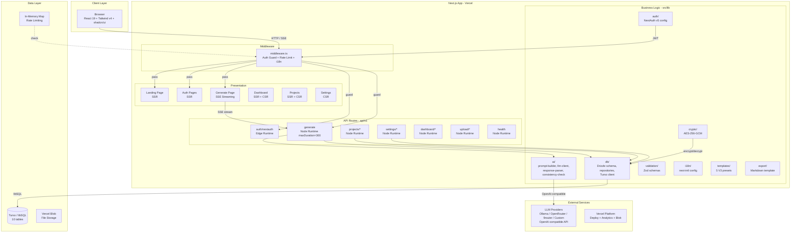
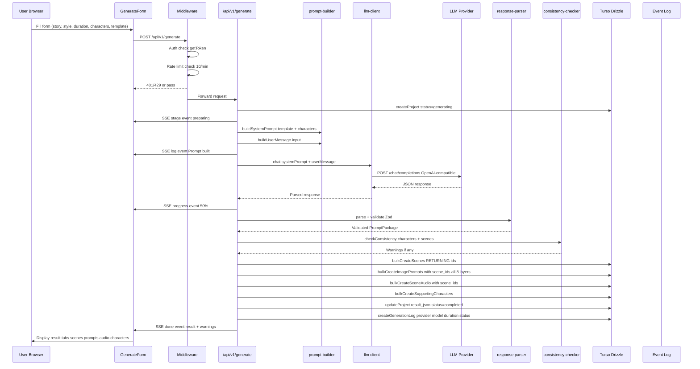
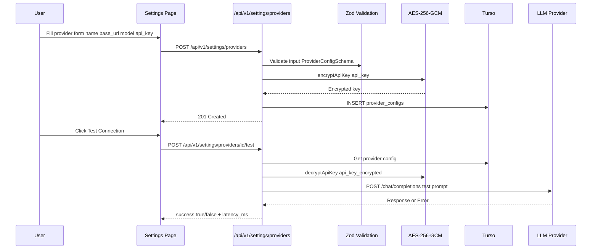
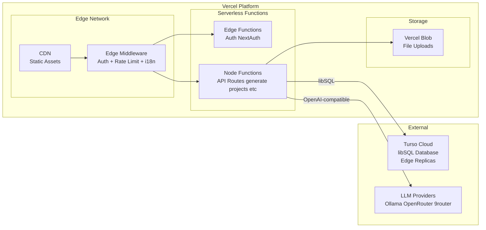

# PROJECT_ARCHITECTURE.md — PromptFlow V3

**Version:** 3.0
**Date:** 2026-06-22
**Status:** Draft
**Source:** SRS.md, DATABASE_SCHEMA.md, RAG-CONTEXT.md, live codebase scan

---

## 1. Architecture Summary

### Architectural Style: Modular Monolith (Next.js App Router)

PromptFlow V3 is a **modular monolith** built on Next.js 15 App Router. Single deployable unit, internally layered with clear module boundaries. No microservices — the app scope (single-user workflow engine) does not justify distributed complexity.

**Justification:**

| Factor | Rationale |
|--------|-----------|
| Team size | Solo developer / small team — monolith reduces ops overhead |
| User scale | Single-user / small-scale — no horizontal scaling pressure |
| Deployment | Vercel serverless — automatic scaling per-request, no infra management |
| Feature scope | Focused workflow (prompt generation) — no domain boundary pressure for services |
| Development speed | App Router SSR/SSG + API routes in one codebase = fast iteration |

### High-Level Architecture Diagram



---

## 2. Layers / Tiers

| Layer | Location | Responsibilities |
|-------|----------|-----------------|
| **Presentation** | `src/app/`, `src/components/` | SSR pages, React components, SSE event handling, form state, UI theming |
| **Middleware** | `src/middleware.ts` | Auth guard (Edge), rate limiting (in-memory), i18n locale redirect |
| **API Routes** | `src/app/api/v1/` | HTTP endpoints, request validation, response formatting, SSE streaming |
| **Business Logic** | `src/lib/ai/`, `src/lib/templates/`, `src/lib/export/` | LLM prompt construction, response parsing, consistency checking, template presets |
| **Data Access** | `src/lib/db/` | Drizzle ORM schema, repository pattern, Turso client, caching |
| **Validation** | `src/lib/validation/` | Zod schemas for all entities, LLM output parsing, input sanitization |
| **Infrastructure** | `src/lib/auth/`, `src/lib/crypto/`, `src/lib/i18n/`, `src/lib/storage/` | Auth config, encryption, i18n routing, blob storage |

### Dependency Flow

```
Presentation -> API Routes -> Business Logic -> Data Access -> Database
                     |              |
              Validation      Infrastructure (auth, crypto, i18n, storage)
```

Rules:
- Presentation never accesses Data Access directly (always through API or Server Components)
- Business Logic depends on Validation and Infrastructure
- Data Access depends only on Drizzle ORM and Turso client
- Infrastructure has no upward dependencies

---

## 3. Project Folder / Module Structure

```
PromptFlow/
+-- src/
|   +-- app/                              # Next.js App Router
|   |   +-- layout.tsx                    # Root layout: metadata, Analytics, bg/foreground
|   |   +-- globals.css                   # Tailwind v4 @theme tokens + .dark overrides
|   |   +-- [locale]/                     # i18n segment (id/en)
|   |   |   +-- layout.tsx                # NextIntlClientProvider + Providers + AppHeader
|   |   |   +-- page.tsx                  # Landing page (SSR)
|   |   |   +-- login/page.tsx            # Login form
|   |   |   +-- register/page.tsx         # Register form
|   |   |   +-- generate/page.tsx         # Generate prompt (SSE streaming UI)
|   |   |   +-- projects/
|   |   |   |   +-- page.tsx              # Project list
|   |   |   |   +-- [id]/
|   |   |   |       +-- page.tsx          # Project detail
|   |   |   |       +-- history/page.tsx  # Generation history
|   |   |   +-- dashboard/page.tsx        # Analytics dashboard
|   |   |   +-- settings/page.tsx         # Provider settings
|   |   +-- api/                          # API routes
|   |       +-- auth/[...nextauth]/route.ts  # NextAuth handler (Edge)
|   |       +-- v1/
|   |           +-- health/route.ts       # DB health check
|   |           +-- register/route.ts     # User registration
|   |           +-- generate/route.ts     # SSE streaming generate (Node, maxDuration=300)
|   |           +-- upload/
|   |           |   +-- route.ts          # Vercel Blob upload
|   |           |   +-- classify/route.ts # AI image classification
|   |           +-- projects/
|   |           |   +-- route.ts          # List / Create
|   |           |   +-- [id]/
|   |           |       +-- route.ts      # Get / Update / Delete
|   |           |       +-- delete/route.ts
|   |           |       +-- theme/route.ts
|   |           |       +-- scenes/
|   |           |       |   +-- route.ts
|   |           |       |   +-- [sceneId]/audio/
|   |           |       |       +-- route.ts
|   |           |       |       +-- [audioId]/route.ts
|   |           |       +-- characters/route.ts
|   |           |       +-- image-prompts/route.ts
|   |           |       +-- logs/route.ts
|   |           |       +-- export/route.ts
|   |           +-- settings/providers/
|   |           |   +-- route.ts
|   |           |   +-- [id]/
|   |           |       +-- route.ts
|   |           |       +-- test/route.ts
|   |           |       +-- delete/route.ts
|   |           +-- dashboard/stats/route.ts
|   +-- components/                       # React components
|   |   +-- providers.tsx                 # ThemeProvider + SessionProvider
|   |   +-- common/                       # Shared: AppHeader, ThemeToggle, LanguageToggle, CopyButton, Pagination, Skeleton, ErrorBoundary
|   |   +-- generate/                     # GenerateForm, ResultTabs, SceneTransitionCard, VoiceTypeSelector, AudioPanel, ImagePromptDisplay, TemplatePicker, DropzoneUploader, LogViewer
|   |   +-- settings/                     # ProviderConfigForm, ProviderCard
|   |   +-- dashboard/                    # MetricCard, WeeklyTrendChart, SuccessFailBarChart, PerProviderBreakdownTable, RecentActivityTable
|   |   +-- projects/                     # ProjectCard, DeleteProjectButton
|   |   +-- landing/                      # 14 landing page components (Hero, Features, FAQ, CTA, etc.)
|   |   +-- ui/                           # shadcn/ui primitives (Button, Card, Dialog, Input, etc.)
|   +-- lib/                              # Business logic and infrastructure
|   |   +-- ai/                           # LLM integration
|   |   |   +-- prompt-builder.ts         # V3 system prompt + user message builder
|   |   |   +-- llm-client.ts             # OpenAI-compatible fetch with retry (240s timeout, 2 retries)
|   |   |   +-- provider-registry.ts      # Provider presets (ollama, openrouter, 9router, custom)
|   |   |   +-- response-parser.ts        # JSON extraction + Zod validation
|   |   |   +-- consistency-checker.ts    # Character identity cross-scene check
|   |   |   +-- image-classifier.ts       # Vision LLM image classification
|   |   |   +-- log-buffer.ts             # Real-time log buffering for SSE
|   |   |   +-- prompts/                  # System prompt re-exports
|   |   +-- db/                           # Data layer
|   |   |   +-- schema.ts                 # 10 Drizzle ORM tables
|   |   |   +-- client.ts                 # Turso libSQL connection
|   |   |   +-- cache.ts                  # Query caching
|   |   |   +-- repositories/             # 10 repository files
|   |   +-- validation/
|   |   |   +-- schemas.ts               # 272 lines Zod schemas (all V3 entities)
|   |   +-- crypto/
|   |   |   +-- aes.ts                   # AES-256-GCM encrypt/decrypt for API keys
|   |   +-- auth/
|   |   |   +-- config.ts                # NextAuth v5 Credentials provider
|   |   |   +-- edge.ts                  # Edge-safe auth config
|   |   |   +-- middleware.ts            # Auth middleware helpers
|   |   +-- i18n/
|   |   |   +-- config.ts                # locales: id, en. default: id
|   |   |   +-- request.ts               # Server-side i18n request handler
|   |   +-- templates/
|   |   |   +-- presets.ts               # 5 V3 template presets
|   |   |   +-- titles.ts                # Template title suggestions
|   |   +-- export/
|   |   |   +-- markdown.template.ts     # Markdown export with V3 sections
|   |   +-- migration/
|   |   |   +-- v2-to-v3.ts              # migrateV2ToV3 + rollbackV2ToV3
|   |   +-- storage/
|   |   |   +-- blob.ts                  # Vercel Blob integration
|   |   +-- landing/
|   |   |   +-- features.ts              # Feature definitions
|   |   |   +-- sections.ts              # Landing page section data
|   |   +-- analytics/
|   |   |   +-- events.ts                # V3 analytics event tracking
|   |   +-- api/
|   |   |   +-- error.ts                 # errorResponse/successResponse helpers
|   |   +-- utils.ts                     # General utilities
|   +-- middleware.ts                     # Next.js Edge middleware
+-- messages/                             # i18n message files
|   +-- id.json                           # Indonesian (291 lines)
|   +-- en.json                           # English (291 lines)
+-- drizzle/                              # SQL migrations
|   +-- 0000_gigantic_genesis.sql         # Initial schema (9 tables)
|   +-- 0001_v3_core_features.sql         # V3 ALTER TABLEs + scene_audio
+-- e2e/                                  # Playwright E2E tests
|   +-- login.spec.ts
+-- tests/
|   +-- stubs/
|       +-- server-only.ts               # Vitest stub
+-- drizzle.config.ts                     # Drizzle Kit config
+-- next.config.ts                        # Next.js config
+-- vercel.json                           # Vercel deployment config
+-- vitest.config.ts                      # Vitest config (80% threshold)
+-- playwright.config.ts                  # Playwright config (Chromium, 120s timeout)
+-- tsconfig.json                         # TypeScript strict mode
+-- components.json                       # shadcn/ui config
+-- tailwind.config.ts                    # Tailwind v4 config
+-- package.json                          # Dependencies (pnpm)
```

### Folder Role Summary

| Folder | Role | Key Pattern |
|--------|------|-------------|
| `app/[locale]/` | Page-level SSR/CSR components | Next.js App Router file-based routing |
| `app/api/v1/` | REST API endpoints | Route handlers, one file per resource |
| `components/generate/` | Generate workflow UI | SSE event source, form state, result display |
| `components/common/` | Shared UI | Theme, language, navigation, error handling |
| `components/ui/` | Design system primitives | shadcn/ui, unmodified, Tailwind-native |
| `lib/ai/` | LLM integration | Prompt build -> LLM call -> parse -> validate |
| `lib/db/repositories/` | Data access | Repository pattern, Drizzle queries |
| `lib/validation/` | Schema validation | Zod schemas, shared across API + LLM parsing |
| `lib/auth/` | Authentication | NextAuth v5, JWT sessions, Edge-safe |
| `lib/crypto/` | Encryption | AES-256-GCM for API keys |

---

## 4. Main Data Flows

### 4.1 Generate Animation Brief (SSE Streaming)



### 4.2 Provider Configuration + Test



---

## 5. External Integrations

### 5.1 LLM Providers (OpenAI-compatible)

| Provider | Default Base URL | Auth | Notes |
|----------|-----------------|------|-------|
| Ollama | `https://ollama.com/v1` | API key | Local/self-hosted option |
| OpenRouter | `https://openrouter.ai/api/v1` | API key | Multi-model gateway |
| 9router | `http://localhost:20128/v1` | API key | Local proxy |
| Custom | User-defined | API key | Any OpenAI-compatible endpoint |

**Integration pattern:**
- Endpoint: `${baseUrl}/chat/completions`
- All providers use OpenAI-compatible request/response format
- API keys encrypted AES-256-GCM before storage, decrypted at runtime
- Timeout: 240s, retries: 2 with exponential backoff (2s, 4s, max 8s)
- max_tokens: 32768, temperature: 0.7, stream: false (SSE to client is separate)

**Source:** `src/lib/ai/llm-client.ts`, `src/lib/ai/provider-registry.ts`

### 5.2 Vercel Blob Storage

- Purpose: File upload (character reference images, backgrounds, videos)
- Endpoint: Vercel Blob SDK (`@vercel/blob`)
- Auth: `BLOB_READ_WRITE_TOKEN` env var
- URL pattern: `**.public.blob.vercel-storage.com`
- AI classification of uploaded images via Vision LLM

**Source:** `src/lib/storage/blob.ts`, `next.config.ts:13`

### 5.3 Vercel Platform

| Service | Usage |
|---------|-------|
| Deployment | Serverless, auto-scaling per-request |
| Analytics | `@vercel/analytics` for page views |
| Blob Storage | File uploads |
| Edge Network | CDN for static assets |

---

## 6. Configuration and Environment Management

### 6.1 Environment Variables

| Variable | Purpose | Required |
|----------|---------|----------|
| `TURSO_DATABASE_URL` | Turso DB connection URL | Yes |
| `TURSO_AUTH_TOKEN` | Turso auth token | Yes |
| `ENCRYPTION_KEY` | 32-byte base64 key for AES-256-GCM | Yes |
| `NEXTAUTH_SECRET` | NextAuth JWT signing secret | Yes |
| `NEXTAUTH_URL` | Base URL for NextAuth callbacks | Yes |
| `BLOB_READ_WRITE_TOKEN` | Vercel Blob storage token | Optional |
| `USE_VERCEL_BLOB` | Enable/disable blob storage | Optional |
| `NEXT_PUBLIC_APP_URL` | Public app URL (client-side) | Yes |
| `NEXT_PUBLIC_SITE_URL` | SEO metadata base URL | Yes |

### 6.2 Configuration Files

| File | Purpose |
|------|---------|
| `next.config.ts` | Next.js config: reactStrictMode, serverExternalPackages, bodySizeLimit (10mb), image remotePatterns |
| `vercel.json` | Vercel build/install commands, framework preset |
| `drizzle.config.ts` | Drizzle Kit: schema path, output dir, dialect: sqlite |
| `tsconfig.json` | TypeScript strict mode, ES2022 target |
| `vitest.config.ts` | Test config: v8 coverage, 80% thresholds |
| `playwright.config.ts` | E2E: Chromium, 120s timeout, localhost:3000 |
| `components.json` | shadcn/ui config: default style, Tailwind CSS |
| `tailwind.config.ts` | Tailwind v4 theme config |

### 6.3 Secrets Management

- API keys: Encrypted AES-256-GCM at rest in DB, decrypted only at runtime
- Encryption key: 32-byte base64 from `ENCRYPTION_KEY` env var, never committed
- NextAuth secret: JWT signing, env-only
- Turso token: Database access, env-only
- No `.env` committed; `.env.example` as template

---

## 7. Architectural Security Strategy

### 7.1 Authentication

| Aspect | Implementation |
|--------|---------------|
| Provider | NextAuth v5 (beta.25) with Credentials provider |
| Password | bcryptjs hashing |
| Session | JWT (Edge-safe via jose library) |
| Cookie | `__Secure-` prefixed in production (HTTPS) |
| Edge safety | `getToken()` from `next-auth/jwt` for middleware |

### 7.2 Authorization

- All `/api/v1/*` routes (except health, register, auth) require valid JWT
- Middleware checks `getToken()` on every request
- User-scoped data: all queries filter by `user_id` from JWT `token.userId`
- No admin-specific routes yet (role field exists but unused)

### 7.3 Input Validation

| Layer | Tool | Scope |
|-------|------|-------|
| API input | Zod schemas | All request bodies validated before processing |
| LLM output | Zod + response-parser | JSON extraction + schema validation from LLM response |
| File upload | MIME type check, size limit (10mb) | Server Actions bodySizeLimit |
| SQL injection | Drizzle ORM parameterized queries | All DB operations |

### 7.4 Data Protection

| Data | Protection |
|------|-----------|
| API keys | AES-256-GCM encryption at rest |
| Passwords | bcryptjs hash (never stored plain) |
| Sessions | JWT signed with NEXTAUTH_SECRET |
| Rate limiting | 10 req/min per user on generate endpoint |
| CORS | Same-origin by default (Next.js API routes) |

### 7.5 Security Headers

- Content-Type: application/json for API responses
- Rate limit headers: X-RateLimit-Limit, X-RateLimit-Remaining, X-RateLimit-Reset, Retry-After

---

## 8. Scalability, Caching, Performance, Observability

### 8.1 Scalability

| Aspect | Strategy |
|--------|---------|
| Compute | Vercel serverless auto-scaling per-request |
| Database | Turso edge replication — read replicas at edge nodes, write forwarding |
| Static assets | Vercel CDN |
| LLM calls | 240s timeout + 2 retries — long-running by nature |
| File storage | Vercel Blob (managed, auto-scaling) |

### 8.2 Caching

| Layer | Strategy |
|-------|---------|
| DB query cache | `src/lib/db/cache.ts` — application-level caching |
| Turso edge | Automatic read replication to edge |
| Static pages | Next.js SSG where applicable |
| Rate limit | In-memory Map (single-instance) |

### 8.3 Performance

| Concern | Mitigation |
|---------|-----------|
| LLM latency (30-240s) | SSE streaming to client — progressive UI updates |
| Bundle size | Tree-shaking (lucide-react), dynamic imports for heavy components |
| DB queries | Indexed on all FK + frequent query patterns (21 indexes) |
| Image optimization | Next.js Image component + Vercel Blob CDN |

### 8.4 Observability

| Aspect | Implementation |
|--------|---------------|
| Generation logs | `generation_logs` table — provider, model, duration, status, error |
| Real-time logs | `log-buffer.ts` — SSE log events during generation |
| Analytics | `@vercel/analytics` page views + custom events (`src/lib/analytics/events.ts`) |
| Error responses | Structured JSON: `{ error: { code, message, details }, traceId }` |
| Health check | `GET /api/v1/health` — DB connectivity check |

---

## 9. Deployment Strategy

### 9.1 Runtime Topology



### 9.2 Build and Deploy

| Step | Command / Config |
|------|-----------------|
| Package manager | pnpm 11.7.0 (frozen lockfile) |
| Install | `pnpm install --frozen-lockfile` |
| Build | `pnpm build` |
| Framework | nextjs (vercel.json) |
| Runtime constraint | Generate endpoint: `maxDuration = 300s` (Vercel Hobby limit) |
| External packages | `@libsql/client` (serverExternalPackages) |

### 9.3 Database Deployment

| Step | Tool |
|------|------|
| Generate migration | `npx drizzle-kit generate` |
| Apply migration | `npx drizzle-kit migrate` |
| Dev push | `npx drizzle-kit push` |
| Visual inspect | `npx drizzle-kit studio` |
| V2 to V3 custom | `src/lib/migration/v2-to-v3.ts` (migrateV2ToV3 + rollback) |

### 9.4 Environment Tiers

| Tier | DB | Blob | Domain |
|------|----|------|--------|
| Local dev | Turso local / libSQL file | Disabled (USE_VERCEL_BLOB=false) | localhost:3000 |
| Preview | Turso cloud (dev) | Vercel Blob (preview) | *.vercel.app |
| Production | Turso cloud (prod) | Vercel Blob (prod) | Custom domain |

---

## 10. Key Architectural Decisions

### ADR-01: Modular Monolith over Microservices

| | |
|---|---|
| **Context** | Single-user workflow engine, solo developer, Vercel deployment |
| **Decision** | Modular monolith with Next.js App Router |
| **Reason** | Simpler ops, single deploy, shared DB, no network overhead between modules. App scope does not require independent scaling of services |

### ADR-02: Turso/libSQL over PostgreSQL

| | |
|---|---|
| **Context** | Need edge-compatible DB with low latency, free tier for small user base |
| **Decision** | Turso (libSQL / SQLite) with Drizzle ORM |
| **Reason** | Edge replication less than 50ms, free tier sufficient for less than 1000 users, Drizzle first-class SQLite support. Migration path to PostgreSQL exists if scale demands |

### ADR-03: SSE Streaming over WebSocket for Generate

| | |
|---|---|
| **Context** | Generate flow takes 30-240s, user needs progress updates |
| **Decision** | Server-Sent Events (SSE) via Next.js Route Handler |
| **Reason** | HTTP-based, no upgrade needed, works through proxies/CDN, simpler than WebSocket for uni-directional server-to-client updates. Vercel supports SSE in Node runtime |

### ADR-04: In-Memory Rate Limiting (Temporary)

| | |
|---|---|
| **Context** | Need rate limit on expensive generate endpoint |
| **Decision** | In-memory Map in middleware (not Redis) |
| **Reason** | Zero infrastructure cost for single-instance deployment. Acknowledged limitation: resets on cold start. Planned upgrade to Redis for multi-instance (phase: fase akhir) |

### ADR-05: AES-256-GCM for API Key Encryption

| | |
|---|---|
| **Context** | User-provided LLM API keys must be stored securely |
| **Decision** | AES-256-GCM encryption at application level |
| **Reason** | Authenticated encryption (confidentiality + integrity), no DB-level encryption dependency, 32-byte key from env var. Decrypted only at runtime for LLM calls |

### ADR-06: Repository Pattern for Data Access

| | |
|---|---|
| **Context** | Multiple API routes need consistent DB access patterns |
| **Decision** | Repository pattern with Drizzle ORM (10 repo files) |
| **Reason** | Encapsulates query logic, enables testing via mocking, consistent soft-delete filtering, reusable across API routes |

### ADR-07: Zod as Single Source of Truth for Validation

| | |
|---|---|
| **Context** | Input validation (API) and output validation (LLM) need consistent schemas |
| **Decision** | Zod schemas in `src/lib/validation/schemas.ts` shared across all layers |
| **Reason** | TypeScript type inference from schemas, runtime validation for LLM JSON output, single source eliminates schema drift between API input and DB constraints |

### ADR-08: next-intl with locale Segment

| | |
|---|---|
| **Context** | Indonesian-first product with English support |
| **Decision** | next-intl with [locale] dynamic segment, default locale id |
| **Reason** | App Router native integration, namespace-based message organization, middleware locale redirect |

### ADR-09: Non-Streaming LLM Call with Client SSE

| | |
|---|---|
| **Context** | LLM response is large JSON, needs structured parsing |
| **Decision** | LLM call with stream: false, SSE to client is application-level |
| **Reason** | Full JSON response needed for Zod validation + consistency checking before DB write. Partial streaming would complicate parsing. Application-level SSE provides progress updates (stages, logs) which is more useful than raw token streaming |

---

## Appendix: Technology Version Matrix

| Technology | Version | Role |
|-----------|---------|------|
| Next.js | ^15.1.0 | Framework (App Router, SSR, API Routes, Middleware) |
| React | ^19.0.0 | UI library (Server Components, Concurrent features) |
| TypeScript | ^5.7.0 | Language (strict mode) |
| Tailwind CSS | ^4.0.0 | Styling (utility-first, @theme tokens) |
| shadcn/ui | latest | UI primitives (accessible, customizable) |
| Drizzle ORM | ^0.38.0 | ORM (type-safe SQL, SQLite support) |
| Drizzle Kit | ^0.30.0 | Migration tooling |
| Turso/libSQL | ^0.14.0 | Database (edge SQLite) |
| NextAuth | 5.0.0-beta.25 | Authentication (Credentials, JWT) |
| next-intl | ^3.26.0 | Internationalization (id/en) |
| next-themes | ^0.4.6 | Theme switching (light/dark/system) |
| Zod | ^3.24.0 | Schema validation |
| Vercel AI SDK | ^4.0.0 | AI/LLM integration helpers |
| @ai-sdk/openai-compatible | ^1.0.0 | OpenAI-compatible provider |
| framer-motion | ^12.40.0 | UI animations |
| lucide-react | ^0.468.0 | Icons |
| react-hook-form | ^7.54.0 | Form state management |
| recharts | ^3.8.1 | Dashboard charts |
| sonner | ^1.7.0 | Toast notifications |
| bcryptjs | ^2.4.3 | Password hashing |
| Vitest | ^2.1.0 | Unit testing |
| Playwright | ^1.49.0 | E2E testing |
| pnpm | 11.7.0 | Package manager |
| Node.js | >=20.0.0 | Runtime |

---

*Document grounded in SRS.md, DATABASE_SCHEMA.md, RAG-CONTEXT.md, and live codebase scan. All technical claims have source citations in RAG-CONTEXT.md.*
