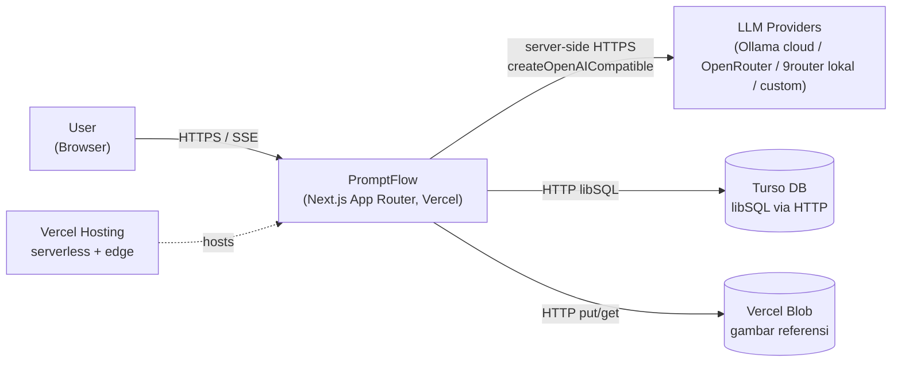
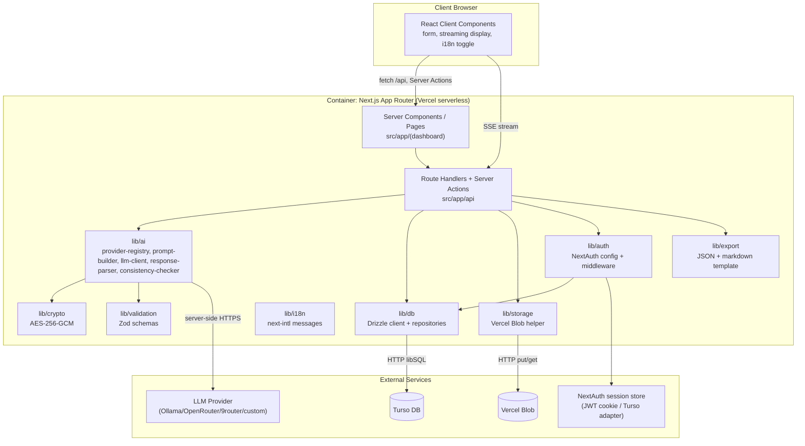
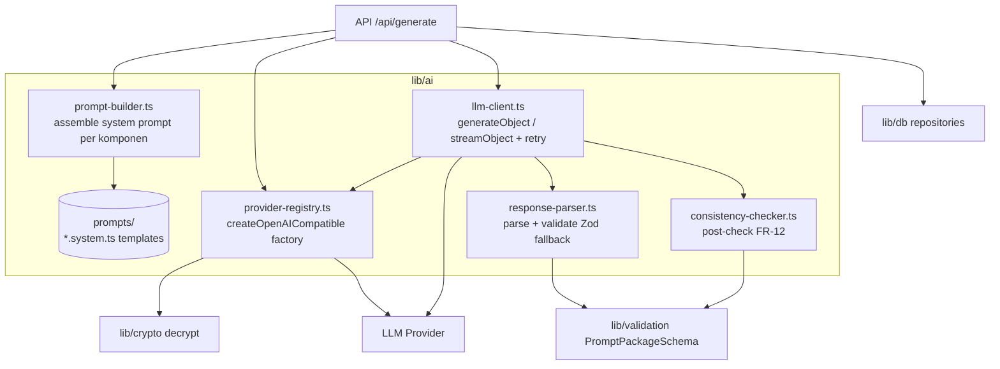
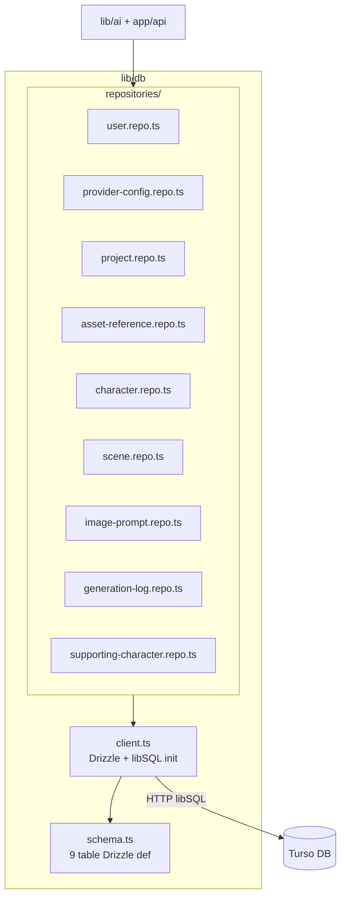
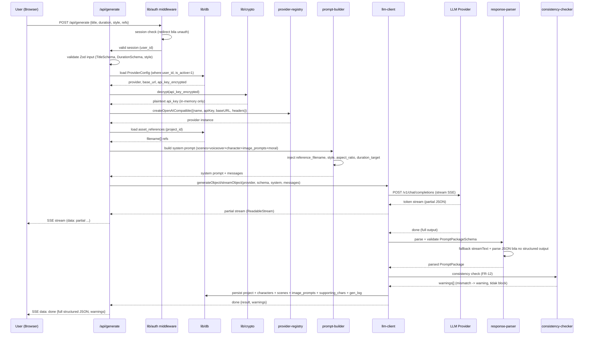
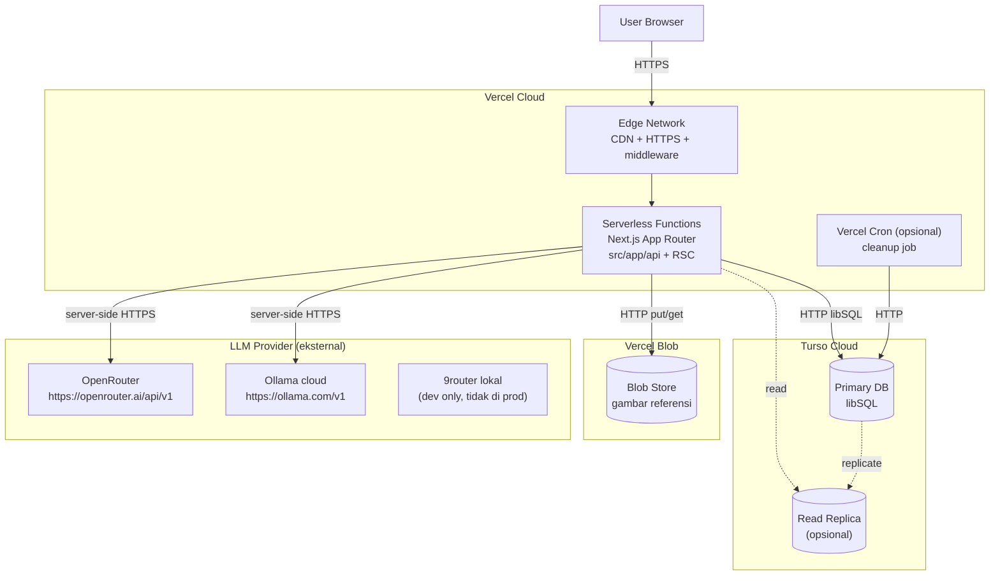

# Project Architecture — PromptFlow

> **Versi:** 1.0
> **Dibuat:** 2026-06-19
> **Status:** Draft
> **Pemilik:** Bos Agrian
> **Sumber kebenaran:** `product-docs/RAG-CONTEXT.md` + `product-docs/SRS.md` + `product-docs/DATABASE_SCHEMA.md` (bersitasi per klaim penting)
> **Root proyek:** `C:\laragon\www\PromptFlow`
> **GitHub:** https://github.com/agrianwahab29/promptflow.git
> **Catatan:** Dokumen ini menurunkan SRS §3 (Arsitektur High-Level), §4 (Tech Stack), §8 (Constraint), §9 (Keamanan), §10 (Tahapan) menjadi blueprint arsitektur konkret + struktur proyek siap eksekusi agent. Skema data penuh di `DATABASE_SCHEMA.md`, kontrak API penuh di `API_CONTRACT.md`, aturan kode di `CODING_RULES.md`.

---

## Daftar Isi

1. Pendahuluan & Ringkasan Arsitektur
2. System Context (C4 Level 1)
3. Container Diagram (C4 Level 2)
4. Component Diagram (C4 Level 3)
5. Folder / Module Structure
6. Data Flow (Alur Generate Prompt)
7. External Integrations Detail
8. Deployment Topology
9. Security Boundaries
10. Scalability & Performance
11. Observability
12. Cross-cutting Concerns
13. Asumsi Arsitektur & Referensi

---

## 1. Pendahuluan & Ringkasan Arsitektur

### 1.1 Tujuan Dokumen

Mengubah tech stack & pendekatan teknis SRS menjadi blueprint arsitektur konkret
+ struktur proyek siap dipakai agent eksekutor membangun kode. Diagram Mermaid
(C4 style) memetakan komponen, hubungan, alur data, deployment, security
boundary. Sitasi ke RAG/SRS/DB_SCHEMA per klaim penting.

- Sitasi: `SRS.md 1.1, 3` ; `RAG-CONTEXT.md 2.1`

### 1.2 Gaya Arsitektur

| Aspek | Nilai | Justifikasi | Bukti |
|---|---|---|---|
| Gaya | **Modular Monolith** (Next.js App Router fullstack, satu repo, satu deploy) | Fase awal: kompleksitas microservice tidak sepadan. Next.js App Router = frontend + backend satu deploy. Tidak ada service terpisah. | `SRS.md 3.1` ; `RAG-CONTEXT.md 2.1` |
| Sub-gaya | **Layered + Feature-oriented** (presentation -> api -> lib -> external) | Pemisahan tanggung jawab jelas, server-only boundary di `lib/*`, tetap type-safe. | `SRS.md 3.2` |
| Deploy | **Serverless** (Vercel Functions) | Auto-scale, pay-per-use, native Next.js. Constraint: filesystem tidak persisten -> DB remote HTTP wajib. | `RAG-CONTEXT.md 2.1, 2.2, 5.4` |
| Data | **Turso/libSQL** (SQLite-compatible via HTTP) | Vercel FS tidak persisten. Turso = remote HTTP, serverless-safe, resmi Vercel Marketplace. | `RAG-CONTEXT.md 2.2, 5.4` ; `DATABASE_SCHEMA.md 1` |
| Orkestrasi AI | **Vercel AI SDK v6** + `@ai-sdk/openai-compatible` `createOpenAICompatible` | Multi-provider OpenAI-compatible, structured output (`generateObject` + Zod), streaming. | `RAG-CONTEXT.md 5.1` ; `SRS.md 4.1` |
| TIDAK microservice | Single repo, single deploy | Fase awal fokus adoption, bukan skalabilitas horizontal service. | `SRS.md 2.2 OOS` |

### 1.3 Prinsip Arsitektur

1. **Server-only boundary**: semua panggilan LLM, decrypt API key, akses DB
   lewat `lib/*` yang diawasi `import 'server-only'`. TIDAK ada panggilan LLM
   atau decrypt dari Client Component. `SRS.md 9.1 SEC-03`.
2. **Structured output first**: `generateObject` + Zod `PromptPackageSchema`
   sebagai default. Fallback `streamText` + parse manual bila provider tidak
   dukung `supportsStructuredOutputs`. `SRS.md 4.2 #2, 8.3, 8.7`.
3. **Streaming anti-timeout**: generasi panjang via SSE (`streamObject`/`streamText`)
   supaya token mulai mengalir < 10s (NFR-P3) dan hindari Vercel function timeout.
   `SRS.md 8.1, ASUMSI SRS-A6`.
4. **Ownership RBAC dasar**: semua resource scoped per `user_id` (session).
   User hanya akses resource miliknya. `SRS.md 9.1 SEC-07`.
5. **Encrypt-at-rest API key**: AES-256-GCM via env `ENCRYPTION_KEY`. TIDAK
   pernah plaintext di DB atau expose ke client. `SRS.md 9.1 SEC-01/SEC-02`,
   `DATABASE_SCHEMA.md 11.1`.

---

## 2. System Context (C4 Level 1)

PromptFlow di tengah ekosistem: User (browser), LLM provider, Turso DB, Vercel
Blob, Vercel hosting.



| Aktor/Sistem Eksternal | Peran | Interaksi | Bukti |
|---|---|---|---|
| User (Browser) | Operator: input judul/durasi/style, upload referensi, konfigurasi provider, lihat/export hasil | HTTPS request -> Server Components + Client Components. Streaming SSE untuk generate. | `SRS.md 1.2, 3.2` ; `RAG-CONTEXT.md 7` |
| LLM Provider (multi) | Generate paket prompt terstruktur dari input | Server-side call via `createOpenAICompatible`. Ollama cloud `https://ollama.com/v1`, OpenRouter `https://openrouter.ai/api/v1`, 9router `http://localhost:20128/v1` (dev lokal only), custom. | `RAG-CONTEXT.md 5.1, 5.2` ; `SRS.md 5 (FR-13)` |
| Turso DB (libSQL) | Persistensi data: 9 entitas (users, projects, characters, scenes, dll) | HTTP libSQL via Drizzle ORM. Remote (Vercel FS tidak persisten). | `DATABASE_SCHEMA.md 1` ; `SRS.md 8.2` |
| Vercel Blob | Storage gambar referensi upload (prod) | HTTP `put`/`get` via `@vercel/blob`. URL publik rujuk nama file di prompt. | `SRS.md 8.5` ; ASUMSI SRS-A5 |
| Vercel Hosting | Hosting serverless + edge + HTTPS | Deploy Next.js App Router native. | `RAG-CONTEXT.md 2.1` |

---

## 3. Container Diagram (C4 Level 2)

Container = unit deployable/komponen tingkat tinggi. PromptFlow = 1 container
Next.js App Router. Di dalamnya ada sub-modul `lib/*` (server-only boundary).



| Container/Sub-modul | Tanggung jawab | Bukti |
|---|---|---|
| Server Components / Pages (`src/app/(dashboard)`) | Render SSR/ISR, data fetch list/detail project, layout, i18n. | `SRS.md 3.2 Layer 1` |
| Route Handlers + Server Actions (`src/app/api`) | Endpoint REST + mutation. `/api/generate` SSE, `/api/projects` CRUD, `/api/settings/providers`, `/api/upload`, `/api/export`, `/api/auth/*`. | `SRS.md 3.2 Layer 2, 7.1` |
| `lib/ai` | Orkestrasi LLM: provider registry, prompt builder, llm client, response parser, consistency checker. Server-only. | `SRS.md 3.2 Layer 3, 5 (FR-03..FR-12)` |
| `lib/db` | Drizzle client + schema + repositories per entitas. Query helper. Server-only. | `SRS.md 3.2 Layer 3, 6` ; `DATABASE_SCHEMA.md 8` |
| `lib/storage` | Vercel Blob helper (upload, get URL, delete). Dev: FS `public/references/`. | `SRS.md 3.2 Layer 3, 5 (FR-17)` |
| `lib/auth` | NextAuth config (providers, session, callbacks) + middleware protected routes. | `SRS.md 3.2 Layer 3, 5 (FR-18), 9.1 SEC-11` |
| `lib/crypto` | AES-256-GCM encrypt/decrypt API key + mask. Server-only. | `SRS.md 3.2 Layer 3, 5 (FR-14), 9.1 SEC-01` |
| `lib/i18n` | next-intl messages (id/en). | `SRS.md 3.2 (i18n), 5 (FR-19)` ; ASUMSI SRS-A2 |
| `lib/validation` | Zod schemas (input form + LLM structured output `PromptPackageSchema`). | `SRS.md 3.2 Layer 3, 8.7` |
| `lib/export` | Template transform JSON -> markdown. | `SRS.md 5 (FR-16)` |

---

## 4. Component Diagram (C4 Level 3)

Detail komponen internal `lib/ai` dan `lib/db` (komponen paling kompleks).

### 4.1 Komponen `lib/ai`



| Komponen | Tanggung jawab | Input | Output | Bukti |
|---|---|---|---|---|
| `provider-registry.ts` | Init `createOpenAICompatible({name, apiKey, baseURL, headers})`. Decrypt API key server-side. Map provider -> base URL preset. | `provider`, `base_url`, `api_key_encrypted` | instance provider AI SDK | `SRS.md 5 (FR-13), 9.1 SEC-03` ; `RAG-CONTEXT.md 5.1` |
| `prompt-builder.ts` | Assemble system prompt per komponen (scenes, voiceover, character, image_prompts, moral). Inject `reference_filename`, `style`, `aspect_ratio`, `duration_target`. | input form + asset refs | system prompt string | `SRS.md 5 (FR-03..FR-11), 8.7` |
| `llm-client.ts` | Panggil `generateObject`/`streamObject` dengan `PromptPackageSchema`. Retry 3x backoff (NFR-R3). SSE stream -> client. | provider, system, messages, schema | partial/full structured JSON | `SRS.md 5 (FR-03), 8.1, ASUMSI SRS-A14` |
| `response-parser.ts` | Validate Zod. Fallback: bila provider tidak dukung `supportsStructuredOutputs` -> `streamText` + parse JSON manual + validasi Zod. | raw LLM output | parsed `PromptPackage` | `SRS.md 4.2 #2, 8.3` ; `RAG-CONTEXT.md 5.1, 11 #1` |
| `consistency-checker.ts` | Post-check FR-12: banding `character_profiles` identitas vs `image_prompts.target` reference di `scenes[]`. Mismatch -> warning (tidak block save). | parsed package | warnings[] | `SRS.md 5 (FR-12), 6.2 #1` ; `DATABASE_SCHEMA.md 12.1` |
| `prompts/*.system.ts` | Template system prompt per komponen (scenes, voiceover, character, image_prompts, moral). | params | string template | `SRS.md 3.2 (lib/ai/prompts)` |

### 4.2 Komponen `lib/db`



| Komponen | Tanggung jawab | Bukti |
|---|---|---|
| `client.ts` | Init `createClient` (@libsql/client) + `drizzle` instance. Baca env `TURSO_DATABASE_URL` + `TURSO_AUTH_TOKEN`. | `DATABASE_SCHEMA.md 8.1, 8.3` ; `SRS.md 8.2` |
| `schema.ts` | Definisi 9 tabel Drizzle (users, provider_configs, projects, asset_references, characters, scenes, image_prompts, generation_logs, supporting_characters). | `DATABASE_SCHEMA.md 8.3` |
| `repositories/*.repo.ts` | Query helper per entitas: CRUD + ownership filter `user_id` + paginate + komposit index query. | `DATABASE_SCHEMA.md 5` ; `SRS.md 5 (FR-15)` |

---

## 5. Folder / Module Structure

Struktur folder konkret sesuai framework (Next.js App Router + Drizzle + shadcn/ui).

```text
PromptFlow/
  product-docs/                      # dokumen (BRD/MRD/PRD/SRS/DB_SCHEMA/ARCH/...)
  drizzle/                           # output migration SQL (drizzle-kit generate)
  messages/                          # i18n messages (next-intl)
    id.json
    en.json
  public/
    references/                      # dev-only upload gambar (ASUMSI, tidak persisten Vercel)
  src/
    app/
      api/
        auth/
          [...nextauth]/route.ts     # NextAuth handler
        projects/
          route.ts                   # GET list, POST create
          [id]/route.ts              # GET, PUT, DELETE
        generate/route.ts            # POST streaming SSE
        settings/
          providers/
            route.ts                 # GET list, POST save
            [id]/route.ts            # PUT, DELETE
        upload/route.ts              # POST multipart -> Vercel Blob
        export/route.ts              # GET JSON / markdown
      (dashboard)/
        layout.tsx
        generate/page.tsx
        projects/page.tsx
        projects/[id]/page.tsx
        settings/page.tsx
      (auth)/
        login/page.tsx
      layout.tsx                     # root layout + i18n provider
      page.tsx                        # redirect /generate atau /login
      globals.css                     # Tailwind v4
    components/
      ui/                             # shadcn/ui (copy-paste)
      generate/                       # form + streaming display
      projects/                       # list + detail
      settings/                       # provider form
      common/                         # header, footer, error boundary
    lib/
      ai/
        provider-registry.ts
        prompt-builder.ts
        llm-client.ts
        response-parser.ts
        consistency-checker.ts
        prompts/
          scenes.system.ts
          voiceover.system.ts
          character.system.ts
          image-prompts.system.ts
          moral.system.ts
      db/
        client.ts
        schema.ts
        repositories/
          user.repo.ts
          provider-config.repo.ts
          project.repo.ts
          asset-reference.repo.ts
          character.repo.ts
          scene.repo.ts
          image-prompt.repo.ts
          generation-log.repo.ts
          supporting-character.repo.ts
      storage/
        blob.ts                       # Vercel Blob helper
      auth/
        config.ts                     # NextAuth providers, session, callbacks
        middleware.ts                 # protected routes
      crypto/
        aes.ts                        # AES-256-GCM encrypt/decrypt/mask
      i18n/
        config.ts                     # next-intl config
        request.ts                    # locale resolver
      validation/
        schemas.ts                    # Zod input + PromptPackageSchema
      export/
        markdown.template.ts
    middleware.ts                     # NextAuth + i18n + rate limit middleware
  drizzle.config.ts                   # Drizzle Kit config
  next.config.ts                      # Next.js config (i18n, experimental)
  tailwind.config.ts                  # Tailwind v4 (atau CSS-first v4)
  components.json                     # shadcn/ui config
  package.json
  tsconfig.json
  .env.local                          # dev (TIDAK commit)
  .env.example                        # dokumentasi env tanpa value asli
  .gitignore
  README.md
```

| Folder | Peran | Bukti |
|---|---|---|
| `src/app` | Next.js App Router: pages (Server Components) + `api/` Route Handlers. | `SRS.md 3.2, 3.4` |
| `src/app/api` | Backend endpoints. SSE generate, CRUD, upload, export, auth. | `SRS.md 7.1` |
| `src/components` | UI: shadcn/ui + custom (generate form, streaming display, project list/detail, settings). | `SRS.md 3.2 Layer 1` |
| `src/lib/ai` | Orkestrasi LLM server-only. | `SRS.md 3.2 Layer 3` ; §4.1 dokumen ini |
| `src/lib/db` | Drizzle client + schema + repositories. | `DATABASE_SCHEMA.md 8` ; §4.2 dokumen ini |
| `src/lib/storage` | Vercel Blob helper. | `SRS.md 3.2 Layer 3` |
| `src/lib/auth` | NextAuth config + middleware. | `SRS.md 3.2 Layer 3, 9.1 SEC-11` |
| `src/lib/crypto` | AES-256-GCM. | `SRS.md 9.1 SEC-01` |
| `src/lib/i18n` | next-intl config + locale resolver. | `SRS.md 5 (FR-19)` ; ASUMSI SRS-A2 |
| `src/lib/validation` | Zod schemas. | `SRS.md 8.7` |
| `src/lib/export` | Markdown template transform. | `SRS.md 5 (FR-16)` |
| `messages/` | i18n message bundles (id/en). | `SRS.md 5 (FR-19)` |
| `drizzle/` | Output migration SQL. | `DATABASE_SCHEMA.md 8.1` |
| `public/references/` | Dev-only upload FS (ASUMSI, tidak persisten Vercel prod). | ASUMSI SRS-A17 |

---

## 6. Data Flow (Alur Generate Prompt)

Use case kunci: POST `/api/generate` streaming SSE. Alur request -> response.



| Tahap | Aksi | Komponen | Bukti |
|---|---|---|---|
| 1. Auth | Middleware cek session. Redirect `/login` bila unauth. | `lib/auth/middleware.ts` | `SRS.md 9.1 SEC-11` |
| 2. Validate | Zod parse input (title, duration, style, aspect_ratio, refs). 400 bila invalid. | `lib/validation/schemas.ts` | `SRS.md 5 (FR-01, FR-02, FR-10), 8.7` |
| 3. Load config | Query `provider_configs` where `user_id=session.user.id AND is_active=1`. | `lib/db/repositories/provider-config.repo.ts` | `SRS.md 5 (FR-13), 9.1 SEC-07` |
| 4. Decrypt key | `decrypt({iv, ciphertext, tag})` server-side. Plaintext hanya in-memory. | `lib/crypto/aes.ts` | `SRS.md 5 (FR-14), 9.1 SEC-01/SEC-03` |
| 5. Init provider | `createOpenAICompatible({name, apiKey, baseURL, headers})`. Header OpenRouter: `HTTP-Referer`, `X-OpenRouter-Title` opsional. | `lib/ai/provider-registry.ts` | `RAG-CONTEXT.md 5.1, 5.3` |
| 6. Build prompt | Assemble system prompt dari templates + inject refs/style/duration. | `lib/ai/prompt-builder.ts` | `SRS.md 5 (FR-03..FR-11)` |
| 7. Call LLM | `generateObject` (structured) atau `streamObject` (SSE partial). Retry 3x backoff. | `lib/ai/llm-client.ts` | `SRS.md 4.2 #2, 8.1, ASUMSI SRS-A14` |
| 8. Stream | SSE response `text/event-stream` -> client render real-time per komponen. Token < 10s. | `/api/generate` | `SRS.md 7.2, 8.1, NFR-P3` |
| 9. Parse | Validate `PromptPackageSchema`. Fallback parse JSON manual bila provider tidak dukung structured output. | `lib/ai/response-parser.ts` | `SRS.md 8.3, 8.7` |
| 10. Consistency | Post-check FR-12: identitas karakter match `character_profiles` vs `scenes[].image_prompts.target`. Mismatch -> warning. | `lib/ai/consistency-checker.ts` | `SRS.md 5 (FR-12), 6.2 #1` |
| 11. Persist | Save `projects.result_json` (snapshot) + entitas terpisah (characters, scenes, image_prompts, supporting_chars) + `generation_logs`. | `lib/db/repositories/*` | `DATABASE_SCHEMA.md 12.3, 4.1-4.9` |
| 12. Return | SSE `data: done {result, warnings}`. Client tampilkan paket + tombol export. | `/api/generate` | `SRS.md 7.2, 3.3` |

---

## 7. External Integrations Detail

### 7.1 LLM Provider (Multi)

| Provider | Base URL | Auth | Header khusus | Constraint | Bukti |
|---|---|---|---|---|---|
| Ollama cloud | `https://ollama.com/v1` | Bearer API key (ollama.com) | — | Pakai OpenAI-compat `/v1/chat/completions` (bukan native `/api`). Cek `supportsStructuredOutputs`. | `RAG-CONTEXT.md 5.2, 5.3` ; https://ollama.com/blog/openai-compatibility |
| OpenRouter | `https://openrouter.ai/api/v1` | Bearer API key | `HTTP-Referer` (opsional), `X-OpenRouter-Title` (opsional) | OpenAI-compatible unified. | `RAG-CONTEXT.md 5.2, 5.3` ; https://openrouter.ai/docs/api/reference/authentication |
| 9router | `http://localhost:20128/v1` | ASUMSI Bearer/none | — | **Lokal dev only**. Tidak reachable dari Vercel prod. Server-side call only. | ASUMSI SRS-A7 `RAG-CONTEXT.md 5.2, 9 G4` |
| custom | (user input) | (user input) | — | Bebas. Validasi URL di Zod. | `PRD.md 5 (FR-13)` |

**Cara konsumsi:** `lib/ai/provider-registry.ts` init via
`createOpenAICompatible({ name, apiKey, baseURL, headers })`. Panggil via
`lib/ai/llm-client.ts` (`generateObject`/`streamObject`). Semua server-side
(`import 'server-only'`).

```ts
// contoh provider-registry.ts
import 'server-only';
import { createOpenAICompatible } from '@ai-sdk/openai-compatible';
import { decrypt } from '@/lib/crypto/aes';

export function buildProvider(cfg: {
  provider: string; baseUrl: string; model: string;
  apiKeyEncrypted: { iv: string; ciphertext: string; tag: string } | null;
}) {
  const apiKey = cfg.apiKeyEncrypted ? decrypt(cfg.apiKeyEncrypted) : '';
  const headers: Record<string,string> = {};
  if (cfg.provider === 'openrouter') {
    headers['HTTP-Referer'] = process.env.NEXT_PUBLIC_APP_URL ?? 'https://promptflow.app';
    headers['X-OpenRouter-Title'] = 'PromptFlow';
  }
  const p = createOpenAICompatible({
    name: cfg.provider, apiKey, baseURL: cfg.baseUrl, headers,
  });
  return p(cfg.model);
}
```

- Sitasi: `RAG-CONTEXT.md 5.1` ; `SRS.md 5 (FR-13)`

### 7.2 Turso DB (libSQL)

| Aspek | Detail | Bukti |
|---|---|---|
| Engine | Turso (libSQL, SQLite-compatible via HTTP) | `DATABASE_SCHEMA.md 1.1` |
| Client | `@libsql/client` + `drizzle-orm/libsql` | `DATABASE_SCHEMA.md 8.3` |
| Env | `TURSO_DATABASE_URL`, `TURSO_AUTH_TOKEN` | `SRS.md 8.2` ; `DATABASE_SCHEMA.md 11.4` |
| Cara panggil | `createClient({ url, authToken })` -> `drizzle(client)`. Query via repositories. | `DATABASE_SCHEMA.md 8.3` |
| Constraint | Akses via HTTP. Hindari fitur PostgreSQL-specific. Tipe SQLite (`integer`, `text`, `real`, `blob`). | `SRS.md 8.2` ; `DATABASE_SCHEMA.md 1.3` |

### 7.3 Vercel Blob (gambar referensi)

| Aspek | Detail | Bukti |
|---|---|---|
| Env | `BLOB_READ_WRITE_TOKEN` | `SRS.md 8.5` ; `DATABASE_SCHEMA.md 11.4` |
| Cara panggil | `@vercel/blob` `put(pathname, file)` -> `url`. `del(url)`. `head(url)`. | ASUMSI https://vercel.com/docs/vercel-blob |
| Dev fallback | FS `public/references/` (ASUMSI, flag `USE_VERCEL_BLOB`). Tidak persisten Vercel prod. | ASUMSI SRS-A17 |
| Output | `blob_url` + `filename` di `asset_references`. `reference_filename` di-inject ke `image_prompts.prompt_text`. | `DATABASE_SCHEMA.md 4.4, 4.7` ; `RAG-CONTEXT.md 6` |

### 7.4 NextAuth.js

| Aspek | Detail | Bukti |
|---|---|---|
| Versi | v5+ (Auth.js) | `SRS.md 4.1` ; ASUMSI SRS-A1 |
| Provider | Credentials sederhana fase awal (ASUMSI). Bisa ekstensi OAuth nanti. | ASUMSI SRS-A1 `RAG-CONTEXT.md 9 G2` |
| Session | JWT cookie (atau Turso adapter bila pakai DB session). | `DATABASE_SCHEMA.md 4.1 catatan NextAuth` |
| Env | `NEXTAUTH_SECRET`, `NEXTAUTH_URL` | `SRS.md 9.1 SEC-12` |
| Endpoint | `/api/auth/[...nextauth]/route.ts` | `SRS.md 7.1` |
| Middleware | `lib/auth/middleware.ts` protected: `/projects`, `/settings`, `/generate`, `/api/*` (kecuali `/api/auth`). | `SRS.md 9.1 SEC-11` |

### 7.5 Vercel Hosting

| Aspek | Detail | Bukti |
|---|---|---|
| Platform | Vercel (serverless + edge) | `RAG-CONTEXT.md 2.1` |
| Build | `next build` | `SRS.md 11.1` |
| Runtime | Node.js versi didukung Vercel stabil terkini | ASUMSI SRS-A20 |
| HTTPS | Default Vercel | `SRS.md 9.1 SEC-09` |
| Function timeout | Hobby 10s, Pro 60s/300s (ASUMSI plan-specific). Mitigasi streaming SSE. | `SRS.md 8.1` ; ASUMSI SRS-A19 |

---

## 8. Deployment Topology



| Aspek | Detail | Bukti |
|---|---|---|
| Hosting | Vercel serverless (Next.js App Router native). Auto-scale per request. | `RAG-CONTEXT.md 2.1` |
| Region | Default Vercel region (ASUMSI: `iad1` / global edge). Bisa override per function. | ASUMSI |
| DB | Turso Cloud (remote HTTP). Primary + opsional read replica untuk read scaling. | `DATABASE_SCHEMA.md 1` ; `RAG-CONTEXT.md 2.2` |
| Storage | Vercel Blob (gambar referensi prod). | ASUMSI SRS-A5 |
| Build command | `next build` (Next.js) + `drizzle-kit generate` (migration, lokal/dev). | `SRS.md 11.1` ; `DATABASE_SCHEMA.md 8.4` |
| Env vars (Vercel) | `TURSO_DATABASE_URL`, `TURSO_AUTH_TOKEN`, `ENCRYPTION_KEY` (32 byte base64), `NEXTAUTH_SECRET`, `NEXTAUTH_URL`, `BLOB_READ_WRITE_TOKEN`, `NEXT_PUBLIC_APP_URL`. | `DATABASE_SCHEMA.md 11.4` ; `SRS.md 8.2, 8.4, 8.5, 9.1` |
| Migration apply | Dev: `drizzle-kit push`. Prod: SQL migration manual via `turso db shell`. | `DATABASE_SCHEMA.md 8.4` |
| Cron (opsional) | Cleanup `projects.deleted_at < now-30d` + `generation_logs < now-90d`. Butuh plan Pro+. | ASUMSI `DATABASE_SCHEMA.md 10.3` |
| 9router | **TIDAK di prod** (localhost only). Prod: user pakai Ollama cloud/OpenRouter/custom. | ASUMSI SRS-A7 `RAG-CONTEXT.md 5.2` |

---

## 9. Security Boundaries

| ID | Boundary | Implementasi | Bukti |
|---|---|---|---|
| SB-01 | Server-only provider call | `lib/ai/provider-registry.ts`, `llm-client.ts`, `prompt-builder.ts`, `response-parser.ts`, `consistency-checker.ts` wajib `import 'server-only'`. TIDAK ada panggilan LLM dari Client Component. | `SRS.md 9.1 SEC-03` |
| SB-02 | Server-only crypto | `lib/crypto/aes.ts` `import 'server-only'`. Decrypt hanya di `provider-registry.ts`. | `SRS.md 9.1 SEC-01/SEC-03` |
| SB-03 | API key encryption at rest | AES-256-GCM. `provider_configs.api_key_encrypted` = JSON `{iv, ciphertext, tag}`. TIDAK ada kolom plaintext. | `DATABASE_SCHEMA.md 4.2, 11.1` ; `SRS.md 9.1 SEC-01` |
| SB-04 | API key tidak expose ke client | Response API mask `****` + 4 char terakhir. Helper `mask()` di `lib/crypto/aes.ts`. | `SRS.md 5 (FR-14), 9.1 SEC-02` ; `DATABASE_SCHEMA.md 11.2` |
| SB-05 | RBAC ownership dasar | Semua query project/provider filter `user_id = session.user.id`. Server check di repo + API. | `SRS.md 9.1 SEC-07` ; `DATABASE_SCHEMA.md 11.3` |
| SB-06 | Protected routes | `lib/auth/middleware.ts`. `/projects`, `/settings`, `/generate`, `/api/*` (kecuali `/api/auth`) wajib session. | `SRS.md 9.1 SEC-11` |
| SB-07 | CSRF protection | Next.js built-in CSRF Server Actions + Route Handlers. NextAuth CSRF token. | `SRS.md 9.1 SEC-05` |
| SB-08 | Input sanitization (XSS) | Zod validate + escape HTML (`<>"'&`) pada `title` & field teks sebelum render/prompt. | `SRS.md 9.1 SEC-06` |
| SB-09 | Env secret management | `ENCRYPTION_KEY`, `TURSO_AUTH_TOKEN`, `BLOB_READ_WRITE_TOKEN`, `NEXTAUTH_SECRET` di Vercel env. `.env.example` tanpa value asli. | `SRS.md 9.1 SEC-08` ; `DATABASE_SCHEMA.md 11.4` |
| SB-10 | HTTPS only | Vercel default HTTPS. | `SRS.md 9.1 SEC-09` |
| SB-11 | 9router localhost only | `http://localhost:20128/v1` tidak reachable dari Vercel prod. Validasi: hanya user dev lokal pakai. Server-side call only. | ASUMSI SRS-A7 `RAG-CONTEXT.md 5.2, 9 G4` |
| SB-12 | Rate limit generate | ASUMSI 10 req/min/user. Middleware rate limit. | ASUMSI SRS-A15 `SRS.md 9.1 SEC-10` |
| SB-13 | NextAuth secret | `NEXTAUTH_SECRET` env wajib. | `SRS.md 9.1 SEC-12` |

---

## 10. Scalability & Performance

| Aspek | Strategi | Bukti |
|---|---|---|
| Auto-scale | Vercel serverless auto-scale per request. Tidak ada capacity planning manual. | `RAG-CONTEXT.md 2.1` |
| Streaming SSE anti-timeout | `streamObject`/`streamText` -> SSE. Token mulai mengalir < 10s (NFR-P3). Hindari Vercel function timeout (Hobby 10s, Pro 60s/300s). Pecah generate per komponen bila perlu. | `SRS.md 7.2, 8.1` ; ASUMSI SRS-A6, SRS-A19 |
| DB read replica | Turso mendukung read replica. Read scaling: query read ke replica (ASUMSI, fase awal cukup primary). | `RAG-CONTEXT.md 2.2` (turso.tech/blog/serverless) |
| Connection pooling | Drizzle + `@libsql/client` handle pool internal. Tidak perlu manual pool di app. | `DATABASE_SCHEMA.md 8.3` |
| Query optimization | Index komposit di tabel kunci (`idx_projects_user_created`, `idx_scenes_project_order`, `idx_characters_project_nama`, `idx_image_prompts_project_scene`). | `DATABASE_SCHEMA.md 5` |
| Caching (opsional) | Fase awal: tidak ada cache layer (ASUMSI). Bila perlu: `unstable_cache` Next.js untuk list project. LLM response TIDAK di-cache (dynamic). | ASUMSI |
| Latency target | Shorts <= 60s end-to-end (NFR-P1), Tutorial <= 180s (NFR-P2), token < 10s (NFR-P3), query < 500ms (NFR-P5). | `SRS.md ASUMSI SRS-A12, NFR` |
| Retry LLM | 3x backoff (NFR-R3). | ASUMSI SRS-A14 |
| Rate limit | 10 req/min/user endpoint generate (ASUMSI). | ASUMSI SRS-A15 |
| Export cepat | `projects.result_json` snapshot -> export tanpa re-query 9 tabel. | `DATABASE_SCHEMA.md 12.3` |
| Result snapshot + entitas | KEDUA disimpan. `result_json` = export cepat. Entitas = query/filter. Trade-off storage vs query speed. | `DATABASE_SCHEMA.md 7.2, 12.3` |

---

## 11. Observability

| Aspek | Strategi | Bukti |
|---|---|---|
| Platform logs | Vercel logs (runtime + build). Default. | `RAG-CONTEXT.md 2.1` |
| Structured log DB | `generation_logs` tabel: `provider`, `model`, `duration_ms`, `status` (success/fail/partial), `error_message`, `created_at`. Query history per project. | `DATABASE_SCHEMA.md 4.8` ; KPI K5 `BRD.md 3.2` |
| Telemetri KPI | Log setiap generate untuk KPI K1-K7 (BRD). Dashboard sederhana fase akhir (ASUMSI). | `SRS.md 10 F3-05` ; `BRD.md 3.2` |
| Error tracking | `generation_logs.error_message` + Vercel logs. ASUMSI integrasi Sentry/Datadog opsional fase akhir. | ASUMSI |
| Monitoring (opsional) | Vercel Analytics (built-in) untuk web vitals. ASUMSI. | ASUMSI |
| Audit trail | `created_at`/`updated_at` di semua tabel. `generation_logs` = audit generate. Soft delete `projects.deleted_at`. | `DATABASE_SCHEMA.md 4, 10` |
| Tracing (opsional) | ASUMSI OpenTelemetry via Vercel bila perlu fase akhir. TIDAK ADA BUKTI preferensi. | ASUMSI |

---

## 12. Cross-cutting Concerns

| Concern | Implementasi | Bukti |
|---|---|---|
| i18n (dwibahasa ID+EN) | `next-intl` (ASUMSI). `messages/id.json`, `messages/en.json`. `src/lib/i18n/config.ts` + `request.ts`. Toggle di header, persist cookie. Scope: UI label, error, placeholder. Konten LLM bahasa ikut judul (ASUMSI NFR-I2). | `SRS.md 5 (FR-19)` ; ASUMSI SRS-A2 ; `RAG-CONTEXT.md 9 G5` |
| Error handling envelope | ASUMSI format `{ error: { code, message, details } }`. HTTP status 400/401/404/429/500/502/504. Code: `VALIDATION_ERROR`/`PROVIDER_ERROR`/`AUTH_ERROR`/`TIMEOUT`/`INTERNAL`. Bahasa aktif (FR-19). | `SRS.md 7.3` |
| Validation (Zod) | `lib/validation/schemas.ts`: input form (`TitleSchema`, `DurationSchema`, `StyleSchema`, `AspectRatioSchema`, `ProviderConfigSchema`) + LLM structured output (`PromptPackageSchema` per SRS §8.7). | `SRS.md 8.7` |
| Logging | `console.*` -> Vercel logs. `generation_logs` DB untuk telemetri generate. ASUMSI structured JSON log format. | `DATABASE_SCHEMA.md 4.8` |
| Config env | Env var via Vercel. `.env.example` dokumentasi. `lib/config` (opsional) atau baca `process.env` langsung di `client.ts`/`config.ts`. | `SRS.md 9.1 SEC-08` ; `DATABASE_SCHEMA.md 11.4` |
| Consistency check (FR-12) | `lib/ai/consistency-checker.ts` post-generate. Cross-cutting: dipanggil di pipeline generate, result warnings ke client. | `SRS.md 5 (FR-12)` |
| Soft delete | `projects.deleted_at`. Semua query project WAJIB filter `WHERE deleted_at IS NULL` (Drizzle scope helper). | `DATABASE_SCHEMA.md 10.1` |
| Batas tokoh 10 | App-layer Zod + count check sebelum insert `characters`. BUKAN DB CHECK (SQLite terbatas). | ASUMSI SRS-A10 `DATABASE_SCHEMA.md 6.2, 12.6` |
| Export format | `lib/export/markdown.template.ts` transform JSON -> markdown. `/api/export?format=json|markdown`. | `SRS.md 5 (FR-16)` |
| Rate limit | Middleware rate limit endpoint generate (ASUMSI 10/min/user). | ASUMSI SRS-A15 |

---

## 13. Asumsi Arsitektur & Referensi

### 13.1 Asumsi Arsitektur

| ID | Asumsi | Status Bukti | Dampak | Sitasi |
|---|---|---|---|---|
| ARCH-A1 | Gaya = Modular Monolith (Next.js App Router, single repo+deploy) | DIKONFIRMASI SRS | Fase awal cukup, tidak microservice | `SRS.md 3.1` |
| ARCH-A2 | ORM = Drizzle (bukan Prisma/raw libsql) | TIDAK ADA BUKTI preferensi user | RAG menyebut raw/Prisma alternatif | `RAG-CONTEXT.md 9 G7` ; ASUMSI SRS-A3 |
| ARCH-A3 | Enkripsi API key = AES-256-GCM via env `ENCRYPTION_KEY` | TIDAK ADA BUKTI mekanisme spesifik | Bisa defer ke secret manager | `RAG-CONTEXT.md 11 #4` ; ASUMSI SRS-A4 |
| ARCH-A4 | Storage gambar prod = Vercel Blob | ASUMSI rekomendasi | Bisa S3/R2 | `RAG-CONTEXT.md 9 G3` ; ASUMSI SRS-A5 |
| ARCH-A5 | Auth = NextAuth credentials provider | TIDAK ADA BUKTI preferensi | Bisa OAuth nanti | `RAG-CONTEXT.md 9 G2` ; ASUMSI SRS-A1 |
| ARCH-A6 | i18n = next-intl | TIDAK ADA BUKTI preferensi lib | Bisa native App Router i18n | `RAG-CONTEXT.md 9 G5` ; ASUMSI SRS-A2 |
| ARCH-A7 | Streaming SSE untuk generasi panjang | ASUMSI | Hindari Vercel timeout | `RAG-CONTEXT.md 5.4, 9 G6` ; ASUMSI SRS-A6 |
| ARCH-A8 | 9router localhost only, Bearer/none auth | TIDAK ADA BUKTI eksternal | Hanya dev lokal | `RAG-CONTEXT.md 5.2, 9 G4` ; ASUMSI SRS-A7 |
| ARCH-A9 | Vercel region default (`iad1`/global edge) | ASUMSI | Bisa override per function | ASUMSI |
| ARCH-A10 | No cache layer fase awal | ASUMSI | Bila perlu `unstable_cache` Next.js | ASUMSI |
| ARCH-A11 | Rate limit 10 req/min/user | ASUMSI | Middleware | ASUMSI SRS-A15 |
| ARCH-A12 | Cron cleanup butuh Vercel Pro+ | ASUMSI | Fase awal manual cleanup | ASUMSI `DATABASE_SCHEMA.md 10.3` |
| ARCH-A13 | NextAuth session = JWT cookie (bukan DB adapter) | ASUMSI | Bisa pakai Turso adapter | `DATABASE_SCHEMA.md 4.1 catatan` |

### 13.2 Referensi Internal

| Dokumen | Path |
|---|---|
| RAG-CONTEXT (sumber kebenaran) | `C:\laragon\www\PromptFlow\product-docs\RAG-CONTEXT.md` |
| SRS | `C:\laragon\www\PromptFlow\product-docs\SRS.md` |
| DATABASE_SCHEMA | `C:\laragon\www\PromptFlow\product-docs\DATABASE_SCHEMA.md` |
| GitHub repo | https://github.com/agrianwahab29/promptflow.git |

### 13.3 Sitasi Eksternal Kunci

| Sitasi | Klaim didukung | Bagian |
|---|---|---|
| https://ai-sdk.dev/providers/openai-compatible-providers | `createOpenAICompatible`, structured output, streaming, tool calling | 1.2, 4.1, 7.1 |
| https://openrouter.ai/docs/api/reference/authentication | OpenRouter base URL, Bearer, header opsional | 7.1 |
| https://ollama.com/blog/openai-compatibility | Ollama OpenAI-compat `https://ollama.com/v1` | 7.1 |
| https://docs.turso.tech/sdk/ts/guides/nextjs | Turso + Next.js setup, `@libsql/client` | 7.2 |
| https://turso.tech/blog/serverless | Vercel FS tidak persisten -> Turso | 1.2, 8, 10 |
| https://vercel.com/marketplace/tursocloud | Turso resmi Vercel Marketplace | 1.2 |
| https://vercel.com/docs/vercel-blob | Vercel Blob storage | 7.3 |
| https://ui.shadcn.com/docs/installation/next | shadcn/ui Next.js | 5 |
| https://ui.shadcn.com/docs/tailwind-v4 | shadcn/ui Tailwind v4 | 5 |

---

**Dokumen ini fokus pada BLUEPRINT ARSITEKTUR konkret siap eksekusi. Tujuan
bisnis di BRD, pasar di MRD, produk di PRD, spesifikasi teknis di SRS, skema
data penuh di DATABASE_SCHEMA, kontrak API penuh di API_CONTRACT, aturan kode
di CODING_RULES. PROJECT_ARCHITECTURE tidak membangun deliverable akhir /
menulis kode — hanya blueprint.**

> **Dibuat oleh:** docgen-architecture subagent
> **Tanggal:** 2026-06-19
> **Versi:** 1.0
