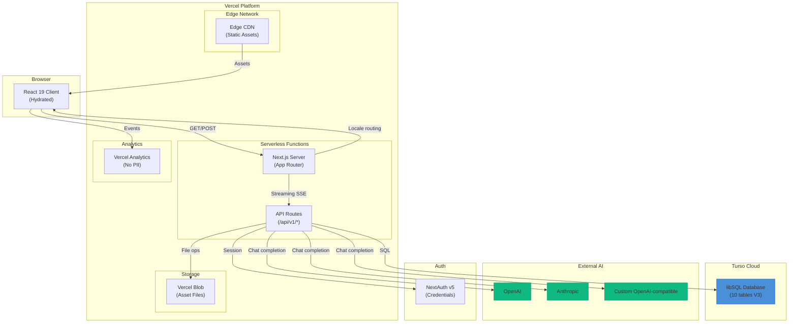
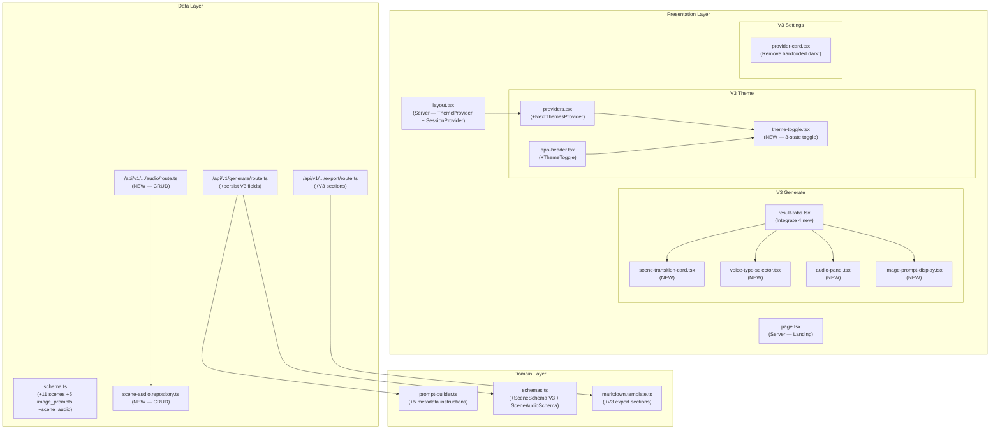
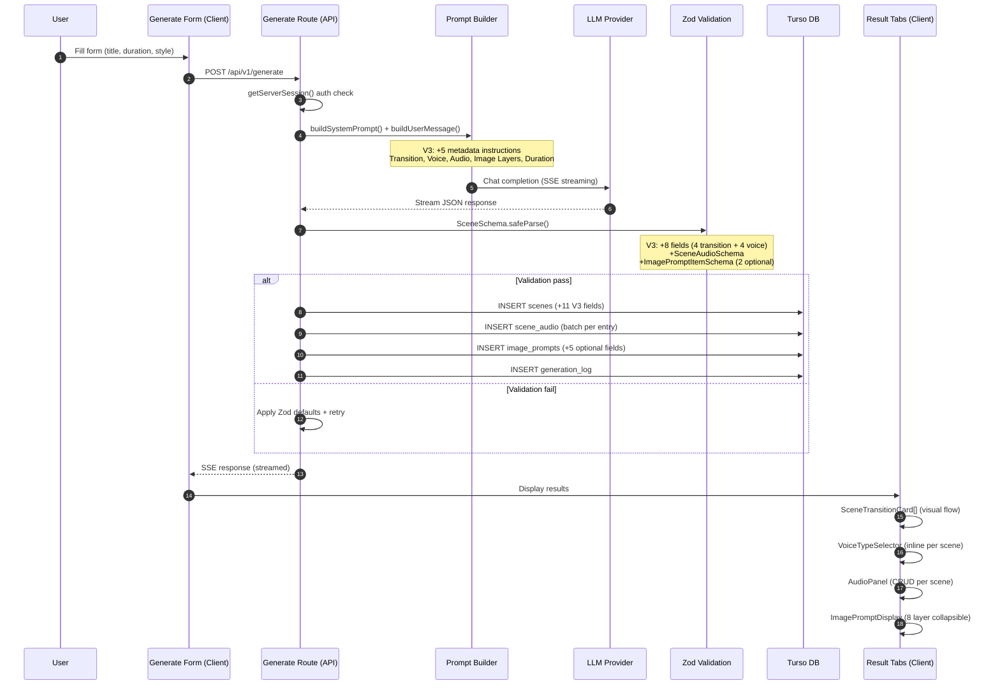
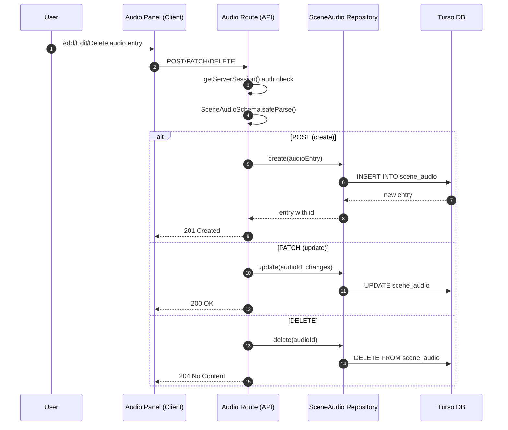
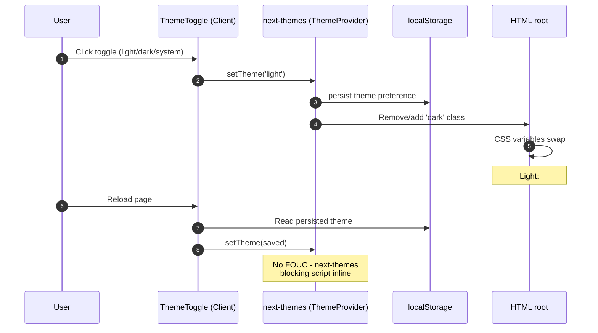
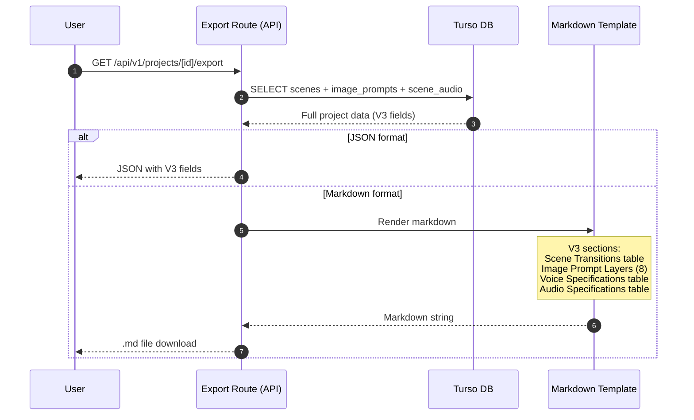
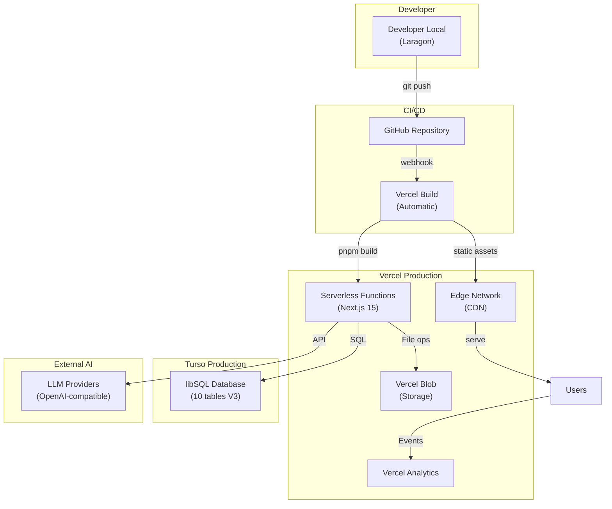
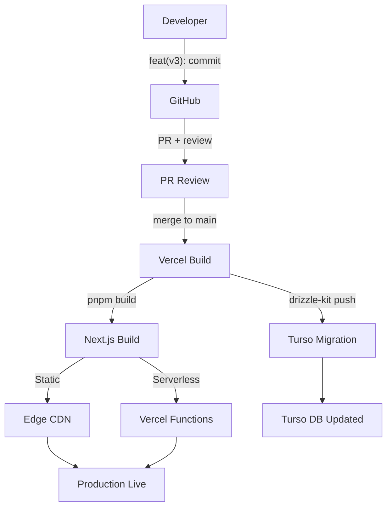

# PROJECT_ARCHITECTURE.md — PromptFlow V3

> **Versi:** 2.0 (V3 Update)
> **Tanggal:** 2026-06-21
> **Deliverable:** 5 fitur V3 — Light Theme, Scene Transition, Complex Image Prompts, Voiceover Voice Type, Supporting Audio
> **Status:** Draft untuk review
> **Selaras:** SRS.md v2.0, DATABASE_SCHEMA.md v2.0, RAG-CONTEXT.md (refreshed), BRD/PRD/MRD v2.0

---

## Daftar Isi

1. [Ringkasan Arsitektur](#1-ringkasan-arsitektur)
2. [System Context Diagram](#2-system-context-diagram)
3. [Container Diagram](#3-container-diagram)
4. [Component Diagram](#4-component-diagram)
5. [Layer / Tanggung Jawab](#5-layer--tanggung-jawab)
6. [Folder / Module Structure](#6-folder--module-structure)
7. [Data Flow](#7-data-flow)
8. [Integrasi Eksternal](#8-integrasi-eksternal)
9. [Manajemen Konfigurasi & Environment](#9-manajemen-konfigurasi--environment)
10. [Strategi Keamanan](#10-strategi-keamanan)
11. [Skalabilitas, Caching, Performa, Observability](#11-skalabilitas-caching-performa-observability)
12. [Deployment](#12-deployment)
13. [Keputusan Arsitektur (ADR)](#13-keputusan-arsitektur-adr)

---

## 1. Ringkasan Arsitektur

**Gaya arsitektur:** Modular Monolith (Next.js App Router) — Server Component-first + Client Component hybrid.

**Justifikasi:** PromptFlow adalah fullstack web app dengan frontend React (Next.js 15), backend API Routes, database Turso (SQLite serverless), dan AI SDK. V3 memperkaya fitur secara additive — tidak mengubah arsitektur dasar. Setiap layer (presentation, application, data) diperkaya tanpa refactor fundamental.

**Karakteristik V3:**
- **Next.js 15 App Router** — Server Components default, Client Components untuk interaksi
- **Turso/libSQL** — Serverless SQLite, additive schema migration V2 ke V3
- **Vercel AI SDK v4** — SSE streaming, multi-provider LLM (TIDAK upgrade ke v6)
- **next-themes** — Satu-satunya dependency baru V3 (~2KB gzipped)
- **framer-motion** — Animasi UI (retained V2)
- **shadcn/ui + Tailwind v4** — Design token + CSS variable, auto light/dark support
- **Drizzle ORM** — Schema-first, `drizzle-kit generate` + `drizzle-kit push`
- **next-intl** — i18n dwibahasa ID+EN

**Tidak ada perubahan arsitektur fundamental di V3.** Semua perubahan = additive (new fields, new table, new components, extended prompts).

**Sitasi:** `SRS.md S1, RAG-CONTEXT.md S2, DATABASE_SCHEMA.md S1`

---

## 2. System Context Diagram

```mermaid
graph TB
    subgraph "User"
        User["User (Browser/Mobile)"]
    end

    subgraph "PromptFlow V3 System"
        NextApp["Next.js 15 App<br/>(Server + Client)"]
    end

    subgraph "External Services"
        LLM["LLM Provider<br/>(OpenAI-compatible)"]
        Turso["Turso/libSQL<br/>(Serverless SQLite)"]
        Blob["Vercel Blob<br/>(File Storage)"]
        Analytics["Vercel Analytics<br/>(No PII)"]
        NextAuth["NextAuth v5<br/>(Authentication)"]
    end

    subgraph "Third-Party (Not Integrated V3)"
        TTS["TTS Service<br/>(Voiceover — OOS)"]
        ImageGen["Image Gen API<br/>(AI Image — OOS)"]
        AudioGen["Audio Gen API<br/>(Music/SFX — OOS)"]
    end

    User -->|"HTTPS"| NextApp
    NextApp -->|"API calls"| LLM
    NextApp -->|"SQL queries"| Turso
    NextApp -->|"File upload/download"| Blob
    NextApp -->|"Event tracking"| Analytics
    NextApp -->|"Auth flow"| NextAuth
    NextApp -.->|"V3 = spec only"| TTS
    NextApp -.->|"V3 = prompt only"| ImageGen
    NextApp -.->|"V3 = spec only"| AudioGen

    style TTS fill:#333,stroke:#666,stroke-dasharray: 5 5
    style ImageGen fill:#333,stroke:#666,stroke-dasharray: 5 5
    style AudioGen fill:#333,stroke:#666,stroke-dasharray: 5 5
```

**Catatan V3:** TTS, Image Gen, dan Audio Gen = **out of scope** (OOS). V3 hanya menghasilkan **spec/metadata** — voice type, audio cue, transition, image prompt structured layers. Integrasi actual TTS/image/audio generation = V4+. Sitasi: `BRD OOS-V3-01..04`

**Aktor:**

| # | Actor | Tipe | Interaksi V3 |
|---|---|---|---|
| 1 | User | Human | Generate prompt, toggle theme, CRUD audio specs |
| 2 | LLM Provider | AI | Generate JSON dengan 5 metadata V3 (transition, voice, audio, image layers, duration) |
| 3 | Turso | DB | Store 10 tables (+1 new scene_audio), V3 schema fields |
| 4 | Vercel Blob | Storage | Upload asset references (existing) |
| 5 | Vercel Analytics | Observability | Track 5 event baru V3 |

---

## 3. Container Diagram



**Container V3:**

| # | Container | Teknologi | Tanggung Jawab V3 |
|---|---|---|---|
| 1 | Edge CDN | Vercel Edge | Static assets, cached HTML, CSS, JS |
| 2 | Serverless Functions | Next.js 15 | SSR, Server Components, locale routing, ThemeProvider |
| 3 | API Routes | Next.js Route Handlers | `/api/v1/generate` extended (V3 fields), new `/api/v1/projects/[id]/scenes/[sceneId]/audio` CRUD |
| 4 | Database | Turso/libSQL | 10 tables: +1 scene_audio, scenes +11 fields, image_prompts +5 fields, projects +1 field |
| 5 | Blob Storage | Vercel Blob | Asset file uploads (retained V1/V2) |
| 6 | Analytics | @vercel/analytics | +5 V3 events: theme_change, transition_generated, voice_assigned, audio_generated, image_layers |
| 7 | Auth | NextAuth v5 | Credentials provider (retained) |
| 8 | LLM | @ai-sdk/openai-compatible | Multi-provider AI SDK v4 — generate dengan V3 metadata |
| 9 | Browser Client | React 19 | ThemeProvider, ThemeToggle, SceneTransitionCard, VoiceTypeSelector, AudioPanel, ImagePromptDisplay |

---

## 4. Component Diagram

### 4.1 Application Component Tree (V3 Update)



### 4.2 Reusable Components V3

| # | Component | Path | Type | Fungsi | Fitur |
|---|---|---|---|---|---|
| 1 | `ThemeToggle` | `src/components/common/theme-toggle.tsx` | Client | Dropdown 3-state (light/dark/system). Icon Sun/Moon/Monitor. Pakai `useTheme()` dari next-themes | F-V3-01 |
| 2 | `SceneTransitionCard` | `src/components/generate/scene-transition-card.tsx` | Client | Scene card + transition icon Lucide + duration badge + flow arrow | F-V3-02 |
| 3 | `VoiceTypeSelector` | `src/components/generate/voice-type-selector.tsx` | Client | Dropdown voice type + emotion + speed slider + pitch dropdown | F-V3-04 |
| 4 | `AudioPanel` | `src/components/generate/audio-panel.tsx` | Client | CRUD audio entries per scene. Dialog add/edit/delete, volume/fade | F-V3-05 |
| 5 | `ImagePromptDisplay` | `src/components/generate/image-prompt-display.tsx` | Client | Collapsible 8 layer labels + copy per-section | F-V3-03 |
| 6 | `ChangelogBanner` | `src/components/common/changelog-banner.tsx` | Client | V3 announcement untuk V2 users. Dismissable | MRD |

### 4.3 Mapping Fitur ke Komponen

| Fitur | Komponen UI | DB Change | API Change | Prompt Change |
|---|---|---|---|---|
| Light Theme | ThemeToggle, Providers, Layout | N/A | N/A | N/A |
| Scene Transition | SceneTransitionCard, ResultTabs | scenes +4 fields | generate route +4 fields | +transition instructions |
| Complex Image Prompts | ImagePromptDisplay, ResultTabs | image_prompts +5 fields | N/A | +8-layer formula |
| Voiceover Voice Type | VoiceTypeSelector, ResultTabs | scenes +4 fields | generate route +4 fields | +voice instructions |
| Supporting Audio | AudioPanel, ResultTabs, SceneAudioRepo | scene_audio NEW table, scenes +1 field | +4 CRUD routes | +audio cue instructions |
| Export Extension | MarkdownTemplate, ExportRoute | N/A | export route extended | N/A |

---

## 5. Layer / Tanggung Jawab

| Layer | Lokasi | Tanggung Jawab V3 |
|---|---|---|
| **Presentation** | `src/components/` | UI rendering, theme toggle, scene transition display, voice selector, audio panel, image prompt display, i18n |
| **Application** | `src/app/[locale]/`, `src/components/generate/` | Page composition, form orchestration, result display integration |
| **Domain** | `src/lib/ai/`, `src/lib/validation/`, `src/lib/export/` | Prompt building (5 metadata V3), Zod schema extension, Markdown export extension |
| **Data Access** | `src/lib/db/`, `src/app/api/v1/` | Drizzle schema extension, repository pattern (new scene-audio.repository), API route CRUD |
| **Migration** | `src/lib/migration/`, `drizzle/` | V2 ke V3 additive migration, backfill script, rollback |
| **Cross-Cutting** | `src/lib/analytics/`, `src/lib/auth/`, `src/lib/i18n/` | 5 new analytics events, auth retained, 55 new i18n keys |
| **Styling** | `src/app/globals.css` | Light/dark design tokens (retained), semantic color tokens |
| **Providers** | `src/components/providers.tsx` | ThemeProvider (next-themes) + SessionProvider (NextAuth) |

**Ketergantungan:** Presentation → Application → Domain → Data Access. Cross-cutting dipakai semua layer.

---

## 6. Folder / Module Structure

### 6.1 Struktur Folder V3 (Update)

```
PromptFlow/
  product-docs/                              # Dokumen produk (read-only)
    PROJECT_ARCHITECTURE.md                  # <-- Dokumen ini
    SRS.md                                   # V3 spec
    DATABASE_SCHEMA.md                       # V3 schema
    RAG-CONTEXT.md                           # Factual context
    AGENTS.md                                # Build guide

  drizzle/
    0000_gigantic_genesis.sql                # V1/V2 initial (retained)
    0001_v3_core_features.sql                # NEW — additive V3 migration

  messages/
    id.json                                  # MODIFY — +55 V3 keys
    en.json                                  # MODIFY — +55 V3 keys parallel

  public/
    references/                              # Existing assets
    og/                                      # OG images (retained)

  src/
    app/
      globals.css                            # Tailwind v4 + design tokens (light/dark)
      layout.tsx                             # MODIFY — remove hardcoded className="dark"
      [locale]/
        layout.tsx                           # Server — wrap ThemeProvider + SessionProvider
          html lang="id" suppressHydrationWarning
        page.tsx                             # MODIFY — remove hardcoded div.dark wrap
        (workspace)/
          generate/
            page.tsx                         # Server — generate page
            generate-form.tsx                # Client — input form
            result-tabs.tsx                  # MODIFY — integrate 4 new V3 components
          projects/
            [id]/
              page.tsx                       # Server — project detail

    components/
      providers.tsx                          # MODIFY — add NextThemesProvider
      ui/                                    # shadcn/ui (12 files, retained)
      common/
        app-header.tsx                       # MODIFY — add ThemeToggle
        theme-toggle.tsx                     # NEW — 3-state light/dark/system
        changelog-banner.tsx                 # NEW — V3 announcement
      generate/
        generate-form.tsx                    # Client — input form (retained)
        result-tabs.tsx                      # MODIFY — integrate V3 components
        scene-transition-card.tsx            # NEW — scene + transition flow
        voice-type-selector.tsx              # NEW — voice type dropdown + controls
        audio-panel.tsx                      # NEW — CRUD audio per scene
        image-prompt-display.tsx             # NEW — 8 layer collapsible
      settings/
        provider-card.tsx                    # MODIFY — remove hardcoded dark: variants
      landing/                               # Landing page (retained V2, 16 files)
      projects/                              # Project management (retained)
      dashboard/                             # Dashboard charts (retained)

    lib/
      ai/
        prompt-builder.ts                    # MODIFY — extend 5 metadata instructions V3
        llm-client.ts                        # Retained
        consistency-checker.ts               # Retained
        prompts/                             # Re-export files (retained)
      db/
        schema.ts                            # MODIFY — +11 scenes +5 image_prompts +1 projects +scene_audio
        client.ts                            # Retained
        cache.ts                             # Retained
        repositories/
          *.repository.ts                    # Existing repos (retained)
          scene-audio.repository.ts          # NEW — CRUD scene_audio
      validation/
        schemas.ts                           # MODIFY — extend SceneSchema V3 + new SceneAudioSchema
      export/
        markdown.template.ts                 # MODIFY — +V3 sections (transitions, voice, audio, image layers)
      migration/
        v2-to-v3.ts                          # NEW — backfill + dry-run + rollback
      analytics/
        events.ts                            # MODIFY — +5 V3 events
      auth/                                  # Retained
      i18n/                                  # Retained
      templates/
        presets.ts                           # NEW — template presets (tutorial/cinematic/kids/documentary/action)

    middleware.ts                            # Locale routing (retained)
```

### 6.2 File Impact Summary

| Kategori | Jumlah | Detail |
|---|---|---|
| **File BARU** | 10 | theme-toggle, 4 generate components, scene-audio.repository, audio API route, migration script, migration SQL, changelog-banner |
| **File MODIFY** | 16 | providers, layout, page, app-header, provider-card, schema, schemas, prompt-builder, generate route, export route, markdown template, result-tabs, analytics events, 2 i18n JSON |
| **File Retained** | ~60+ | Semua file existing tidak berubah |
| **Total touched** | 26 | 10 baru + 16 modify |

**Sitasi:** `SRS S6.1-6.3`

---

## 7. Data Flow

### 7.1 Generate Flow — Input ke LLM ke DB ke Export



### 7.2 Audio CRUD Flow



### 7.3 Theme Toggle Flow



### 7.4 Export Flow



---

## 8. Integrasi Eksternal

| # | Service | Package | Kegunaan V3 | Sitasi |
|---|---|---|---|---|
| 1 | **Turso/libSQL** | `@libsql/client` ^0.14.0 | 10 tables, scene_audio new, +17 fields existing | DATABASE_SCHEMA S1 |
| 2 | **Vercel AI SDK** | `ai` ^4.0.0 | SSE streaming + generate 5 V3 metadata. **TIDAK upgrade v6** | SRS S1.1, TC-02 |
| 3 | **@ai-sdk/openai-compatible** | ^1.0.0 | Multi-provider LLM | SRS S1.1 |
| 4 | **next-themes** | ^0.4.4 | Theme toggle, localStorage, system preference. **Satu-satunya dep baru V3** | SRS S1.2, RAG-CONTEXT ASM-1 |
| 5 | **Drizzle ORM** | ^0.38.0 | Schema migration V3 additive | SRS S1.1 |
| 6 | **Vercel Blob** | `@vercel/blob` ^0.27.0 | File asset storage (retained) | RAG-CONTEXT S2.1 |
| 7 | **@vercel/analytics** | latest | +5 V3 events. **No PII** | SRS S3.12 |
| 8 | **NextAuth v5** | 5.0.0-beta.25 | Auth session (retained) | SRS S1.1 |
| 9 | **framer-motion** | ^12.40.0 | Animasi UI (retained) | RAG-CONTEXT S2.1 |
| 10 | **Zod** | ^3.24.0 | Schema validation V3 enums | SRS S1.1 |

### 8.1 Out-of-Scope Integrasi (V3)

| Service | Alasan OOS | V3 Output | V4+ |
|---|---|---|---|
| TTS (ElevenLabs, etc.) | BRD OOS-V3-02 | Voice spec metadata only | Actual voice generation |
| Image Gen (Midjourney, DALL-E) | BRD OOS-V3-03 | 8-layer structured prompt | Actual image generation |
| Audio Gen (Suno, etc.) | BRD OOS-V3-01 | Audio cue spec metadata | Actual music/SFX generation |
| Video Gen (Runway, etc.) | BRD OOS-V3-04 | Scene + transition spec | Actual video generation |

---

## 9. Manajemen Konfigurasi & Environment

### 9.1 Environment Variables

| Key | Wajib | Lingkungan | Keterangan | Sitasi |
|---|---|---|---|---|
| `TURSO_DATABASE_URL` | YA | Server-only | Turso DB connection URL | DATABASE_SCHEMA S1.1 |
| `TURSO_AUTH_TOKEN` | YA | Server-only | Turso auth token | DATABASE_SCHEMA S1.1 |
| `NEXTAUTH_SECRET` | YA | Server-only | Auth encryption secret | SRS S1.1 |
| `NEXTAUTH_URL` | YA | Server-only | Auth callback URL | NextAuth config |
| `BLOB_READ_WRITE_TOKEN` | YA | Server-only | Vercel Blob access token | RAG-CONTEXT S2.1 |
| `ENCRYPTION_KEY` | YA | Server-only | API key encryption | RAG-CONTEXT S2.1 |
| `NEXT_PUBLIC_APP_URL` | YA | Client+Server | Public URL for canonical/OG | CODING_RULES S2.1 |

**Tidak ada perubahan env vars di V3.** Semua env vars existing sudah mencukupi.

### 9.2 Static Config Files

| File | Isi | Mutabilitas |
|---|---|---|
| `src/lib/ai/prompt-builder.ts` | System prompt + user message template | Per deploy (code change) |
| `src/lib/validation/schemas.ts` | Zod schemas V3 extended | Per deploy |
| `src/lib/db/schema.ts` | Drizzle schema definition | Per deploy |
| `src/lib/export/markdown.template.ts` | Markdown export template | Per deploy |
| `src/lib/templates/presets.ts` | Template presets (V3 NEW) | Per deploy |
| `messages/id.json` | i18n Indonesia (+55 V3 keys) | Per deploy |
| `messages/en.json` | i18n English (+55 V3 keys) | Per deploy |
| `src/app/globals.css` | Design tokens (light/dark) | Per deploy |
| `drizzle/0001_v3_core_features.sql` | Migration SQL | Per deploy |

### 9.3 Design Tokens (globals.css)

| Token | Light | Dark | Sitasi |
|---|---|---|---|
| `--primary` | `#7c3aed` | `#a78bfa` | globals.css:10,56 |
| `--background` | `#ffffff` | `#0a0a0a` | globals.css:4,50 |
| `--foreground` | `#0a0a0a` | `#fafafa` | globals.css:5,51 |
| `--card` | `#ffffff` | `#0f0f0f` | globals.css:6,52 |
| `--accent` | `#ede9fe` | `#3b0764` | globals.css:16,62 |
| `--muted-foreground` | `#71717a` | `#a1a1aa` | globals.css:14,57 |
| `--border` | `#e4e4e7` | `#27272a` | globals.css:23,69 |
| `--font-sans` | Inter, system-ui | — | globals.css:27 |
| `--radius` | `6px` | — | globals.css:26 |

**Catatan V3:** Light theme tokens SUDAH ADA di globals.css (RAG-CONTEXT S9.2). Tidak perlu membuat baru — hanya perlu menghapus hardcoded `className="dark"` dan menggunakan next-themes untuk toggle.

---

## 10. Strategi Keamanan

| # | Area | Strategi | Detail V3 | Sitasi |
|---|---|---|---|---|
| 1 | **Authentication** | NextAuth v5 Credentials | Session check di semua API routes | SRS S1.1 |
| 2 | **Authorization** | Owner check | User hanya bisa akses own projects. CASCADE delete enforced | DATABASE_SCHEMA S5.2 |
| 3 | **Input Validation** | Zod schemas | SceneSchema V3 extended, SceneAudioSchema new. LLM output validated + retry | SRS S3.8, TC-10 |
| 4 | **API Security** | Rate limiting | Next.js rate limiting middleware (existing) | Best practice |
| 5 | **Data Protection** | Turso managed | Encrypted at rest. Auth token server-only | DATABASE_SCHEMA S1.1 |
| 6 | **CSP Headers** | next.config.ts | Content-Security-Policy restrict script-src | Best practice |
| 7 | **XSS Prevention** | React auto-escape | No dangerouslySetInnerHTML. All output escaped | OWASP |
| 8 | **No Secrets Client** | Server-only env vars | TURSO_*, NEXTAUTH_SECRET, ENCRYPTION_KEY tidak di client | CODING_RULES L07 |
| 9 | **Theme Security** | next-themes | Client-side only, no server trust. localStorage for persistence | SRS S3.1 |
| 10 | **No PII** | @vercel/analytics | Track events only, no user data. V3 5 events = no PII | BRD NFR-S04 |
| 11 | **HTTPS** | Vercel default | All traffic encrypted. Force HTTPS | Best practice |
| 12 | **Enum Safety** | Zod enums | All V3 enums validated. Invalid values rejected with fallback | SRS TC-10, TC-11 |

### 10.1 Security Boundaries Diagram

```
+------------------------------------------------------------------+
|                      TRUST BOUNDARY: Browser                      |
|  - ThemeToggle (localStorage only, no server trust)              |
|  - Client Components (no secrets, no API keys)                   |
|  - next-themes (client-side class manipulation)                  |
+------------------------------------------------------------------+
          | HTTP/S (encrypted)
          v
+------------------------------------------------------------------+
|                    TRUST BOUNDARY: Vercel Edge                    |
|  - Security headers (CSP, X-Frame-Options, nosniff)              |
|  - HTTPS enforcement                                               |
+------------------------------------------------------------------+
          |
          v
+------------------------------------------------------------------+
|                   TRUST BOUNDARY: Serverless Functions            |
|  - NextAuth session validation                                    |
|  - Owner check (user owns project)                                |
|  - Zod validation (input + LLM output)                            |
|  - API key encryption (ENCRYPTION_KEY)                            |
|  - TURSO_AUTH_TOKEN (server-only)                                 |
+------------------------------------------------------------------+
          | SQL (encrypted)
          v
+------------------------------------------------------------------+
|                    TRUST BOUNDARY: Turso DB                       |
|  - Managed, encrypted at rest                                     |
|  - CASCADE delete enforcement                                     |
|  - UNIQUE constraints (email, scene order)                        |
+------------------------------------------------------------------+
```

---

## 11. Skalabilitas, Caching, Performa, Observability

### 11.1 Skalabilitas

| Aspek | Strategi | Detail V3 |
|---|---|---|
| **Horizontal** | Vercel Serverless auto-scale | Zero config, auto-scale to demand |
| **Database** | Turso managed | Serverless SQLite, handles scaling. Embedded replicas for read-heavy |
| **CDN** | Vercel Edge Network | Static assets served globally, nearest edge |
| **Bundle** | Next.js code splitting | Client Components only load when rendered. next-themes = ~2KB gzipped |
| **Scene count** | Unlimited per project | No hard limit. UI paginate bila > 20 scenes |
| **Audio entries** | Unlimited per scene | 1:N relationship. Index on scene_id ensures fast queries |

### 11.2 Caching

| Layer | Strategi | TTL |
|---|---|---|
| **Vercel CDN** | Static assets (HTML, CSS, JS) | `s-maxage=31536000, immutable` |
| **Browser** | Static assets cache | Standard HTTP cache headers |
| **DB Query** | Application-level cache (`src/lib/db/cache.ts`) | Short TTL (existing) |
| **Theme** | localStorage (next-themes) | Until user changes |

### 11.3 Performa Targets

| Metric | Target | Strategi V3 | Sitasi |
|---|---|---|---|
| Lighthouse Performance | >= 85 | Optimized bundle, GPU-only animations | BRD NFR-V3-P01 |
| LCP | <= 2.5s | Hero text inline, no render-blocking resources | BRD KPI-09 |
| CLS | <= 0.1 | No layout shift from animations | BRD KPI-10 |
| TBT | <= 200ms | Minimal JS execution, lazy load below-fold | SRS TC-37 |
| FCP | <= 1.8s | Critical CSS inline, font preload | SRS TC-37 |
| Bundle tambahan V3 | <= +20KB gzipped | **Actual: ~2KB** (next-themes only) | BRD LIM-V3-07, NFR-V3-P04 |
| Token usage | <= +50% baseline | Monitor prompt expansion | BRD ASM-B-V3-08 |
| Migration execution | <= 5s per project | Additive SQL, indexed | SRS TC-38 |

### 11.4 Observability

| Tool | Package | Kegunaan V3 | Sitasi |
|---|---|---|---|
| **Vercel Analytics** | `@vercel/analytics` | 5 V3 events + Web Vitals | SRS S3.12 |
| **Vercel Logs** | Vercel dashboard | Serverless function logs, error tracking | Best practice |
| **Generation Logs** | `generation_logs` table | LLM response debug, status tracking | DATABASE_SCHEMA S4.7 |
| **Lighthouse CI** | CLI | Performance gate di CI/CD | SRS S8.2 |

### 11.5 V3 Analytics Events

| # | Event Name | Payload | Fitur | Sitasi |
|---|---|---|---|---|
| 1 | `theme_change` | `{theme, from}` | Light Theme toggle | FR-V3-12 |
| 2 | `scene_transition_generated` | `{transitionType, projectId, sceneCount}` | Scene Transition | FR-V3-12 |
| 3 | `voice_type_assigned` | `{voiceType, sceneCount}` | Voiceover Voice Type | FR-V3-12 |
| 4 | `audio_spec_generated` | `{audioType, count, sceneId}` | Supporting Audio | FR-V3-12 |
| 5 | `image_prompt_layers_count` | `{layersCount, sceneId}` | Complex Image Prompts | FR-V3-12 |

---

## 12. Deployment

### 12.1 Topologi Runtime



### 12.2 Deploy Flow



### 12.3 Deployment V3 Specifics

| Step | Command | Catatan |
|---|---|---|
| 1. Install dep | `pnpm add next-themes` | Satu-satunya dep baru |
| 2. Generate migration | `pnpm drizzle-kit generate` | +scenes 11 fields, +image_prompts 5 fields, +projects 1 field, +scene_audio table |
| 3. Push to staging | `pnpm drizzle-kit push` | Test di Turso staging dulu |
| 4. Dry-run migration | `node scripts/migrate-v2-v3.ts --dry-run` | Verifikasi 100% V2 retained |
| 5. Build | `pnpm build` | Zero error target |
| 6. Deploy preview | Push ke branch | Vercel auto-preview deploy |
| 7. Deploy production | Merge to main | Vercel auto-deploy |

### 12.4 Rollback Plan

| Skenario | Aksi | Risiko |
|---|---|---|
| Migration gagal | Rollback SQL: DROP new columns + DROP table scene_audio | Data loss V3 only, V2 retained |
| LLM output invalid | Zod defaults kick in, user bisa regenerate | Low risk |
| Theme bug | Remove ThemeProvider, revert layout.tsx | Return to dark-only |
| Full V3 revert | Revert git commits, redeploy V2 | No DB rollback needed (additive) |

---

## 13. Keputusan Arsitektur (ADR)

### ADR-01: Additive-Only Schema Migration

| | |
|---|---|
| **Konteks** | V2 production ada data. Schema harus diperluas tanpa kehilangan data. |
| **Keputusan** | Semua perubahan schema = additive. TIDAK drop kolom V2. Default values untuk semua field baru. |
| **Alasan** | Zero data loss. V2 projects auto-migrate ke V3 dengan defaults. Rollback = DROP new columns (last resort). |
| **Alternatif** | Full schema rewrite -> data loss risk, complex migration. Separate tables -> query complexity. |
| **Sitasi** | BRD LIM-V3-01, PRD P-07, DATABASE_SCHEMA S9 |

### ADR-02: Transition + Voice sebagai Fields di scenes Table

| | |
|---|---|
| **Konteks** | Scene transitions dan voice types = 1:1 relationship dengan scene. |
| **Keputusan** | Tambah 8 fields langsung di `scenes` table (4 transition + 4 voice). Bukan new table. |
| **Alasan** | Query simpler (JOIN tidak perlu). Cukup untuk MVP. Indexed performance fine untuk 1:1. |
| **Alternatif** | Separate tables -> 2 extra JOINs, complex query, overkill untuk 1:1. |
| **Sitasi** | RAG-CONTEXT ASM-2, ASM-4 |

### ADR-03: scene_audio sebagai New Table

| | |
|---|---|
| **Konteks** | Audio = multiple entries per scene (1:N). Bisa ada background music + SFX + ambient sekaligus. |
| **Keputusan** | New table `scene_audio` dengan FK ke scenes + projects. CASCADE delete. Indexed. |
| **Alasan** | 1:N relationship = harus table terpisah. Multiple audio per scene = variabel. CRUD per-entry butuh ID. |
| **Alternatif** | JSON array di scenes -> tidak bisa CRUD per-entry, query sulit, integrity lemah. |
| **Sitasi** | RAG-CONTEXT ASM-5, DATABASE_SCHEMA S4.10 |

### ADR-04: next-themes untuk Light Theme

| | |
|---|---|
| **Konteks** | App harus support light/dark/system toggle. CSS tokens light sudah ada di globals.css. |
| **Keputusan** | Install `next-themes` ^0.4.4 (~2KB gzipped). Satu-satunya dependency baru V3. |
| **Alasan** | Standard solution Next.js. Zero-config dengan shadcn/ui. localStorage built-in. FOUC prevention. |
| **Alternatif** | Custom theme hook -> re-invent wheel, FOUC handling complex. CSS-only -> no persistence. |
| **Sitasi** | RAG-CONTEXT ASM-1, S9.3, BRD F-V3-01 |

### ADR-05: 8-Layer Image Prompt via Prompt Enhancement

| | |
|---|---|
| **Konteks** | Image prompts saat ini = single string. Perlu structured layers untuk quality. |
| **Keputusan** | Enhance prompt builder untuk generate 8-layer structured content. `promptText` tetap single string. Tambah 2 metadata fields opsional di image_prompts. |
| **Alasan** | Backward compatible V1+V2. No schema restructuring. LLM-generated content bisa di-parse di UI. |
| **Alternatif** | 8 separate columns -> schema explosion, complex migration, backward compat risk. |
| **Sitasi** | RAG-CONTEXT ASM-3, SRS S3.3 |

### ADR-06: V3 = Spec Only, Bukan Generation

| | |
|---|---|
| **Konteks** | Audio, voice, image generation = complex external integrations. |
| **Keputusan** | V3 hanya menghasilkan **spec/metadata** — voice type spec, audio cue spec, transition spec, structured prompt. TIDAK ada actual TTS/image/audio generation. |
| **Alasan** | MVP scope control. Spec = sufficient untuk workflow. Actual generation = V4+. |
| **Alternatif** | Full integration -> scope explosion, timeline melambat, cost naik. |
| **Sitasi** | BRD OOS-V3-01..04, MRD S7.3 |

### ADR-07: Additive-Only Migration = Zero Downtime

| | |
|---|---|
| **Konteks** | Production V2 ada user aktif. Migration harus tanpa downtime. |
| **Keputusan** | Drizzle additive migration (ALTER ADD COLUMN, CREATE TABLE). Default values. V2 code tetap jalan. |
| **Alasan** | SQLite ALTER ADD COLUMN = metadata-only (tidak rewrite table). Instant. Default values = V2 queries tidak terpengaruh. |
| **Alternatif** | Full migration -> rewrite table, potential downtime. Dual-write -> complex. |
| **Sitasi** | SRS S3.6, DATABASE_SCHEMA S9 |

### ADR-08: Template Presets (Application-Level)

| | |
|---|---|
| **Konteks** | User bisa overwhelmed dengan 7+ field per scene. |
| **Keputusan** | Template presets di application layer (`src/lib/templates/presets.ts`). 5 presets: tutorial, cinematic, kids, documentary, action. |
| **Alasan** | Presets = convenience, bukan data. Application-level = tidak perlu DB table. |
| **Alternatif** | DB-stored presets -> perlu user table, CRUD, overkill untuk MVP. |
| **Sitasi** | DATABASE_SCHEMA S10.3 |

### ADR-09: AI SDK Tetap v4

| | |
|---|---|
| **Konteks** | Vercel AI SDK ada versi v6. Kode V1 pakai v4. |
| **Keputusan** | Tetap pakai AI SDK v4. JANGAN upgrade ke v6. |
| **Alasan** | Kode existing pakai v4 API. Upgrade v6 = breaking changes, rewrite risk. Multi-provider sudah work. |
| **Alternatif** | Upgrade v6 -> breaking changes, testing overhead, timeline risk. |
| **Sitasi** | SRS TC-02, AGENTS.md CRIT-002, BRD LIM-V3-02 |

---

## Lampiran — Mapping ke SRS/DATABASE_SCHEMA

| SRS Section | Architecture Section | Keterangan |
|---|---|---|
| S1 Tech Stack | S1, S8, S9 | Stack verified, +next-themes |
| S2 Arsitektur | S2-4 Diagrams | Context, Container, Component |
| S3 Fungsional | S4.2, S7 Data Flow | Components + data flows |
| S4 Data Model | S4.3, DATABASE_SCHEMA | Schema changes mapped |
| S5 Interface/API | S8.1 | Integration table |
| S6 File Format | S6 | 10 new + 16 modify files |
| S7 Tahapan | S12 Deployment | Deploy flow |
| S8 Verifikasi | S11 Performance | Targets defined |
| S9 Constraints | S10 Security, S11 | Constraints enforced |

---

> **Dokumen ini = blueprint arsitektur PromptFlow V3. Eksekutor baca SRS + DATABASE_SCHEMA + dokumen ini sebelum coding. Semua perubahan = additive. Zero data loss. 26 file touched. 1 dep baru.**

**Dibuat oleh:** docgen-architecture subagent
**Tanggal:** 2026-06-21
**Versi:** 2.0 (V3 Update)
