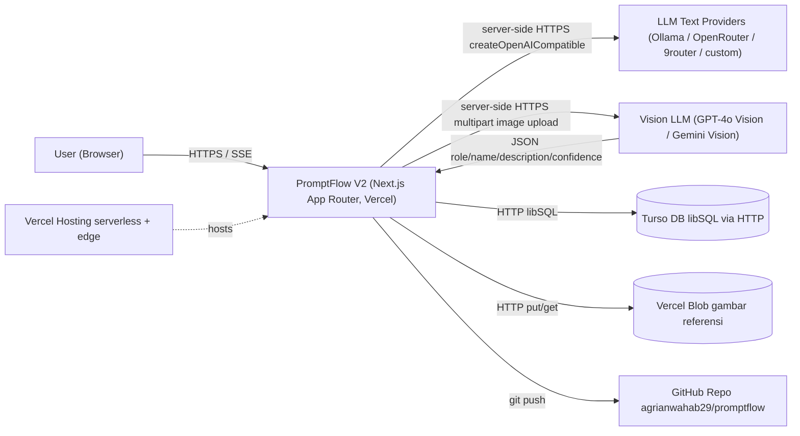
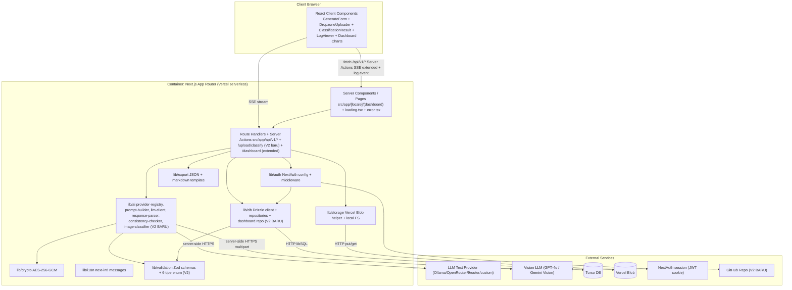
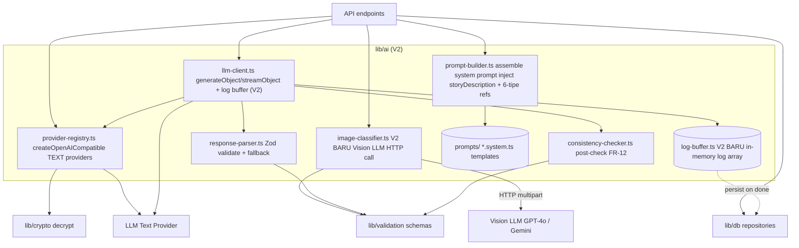
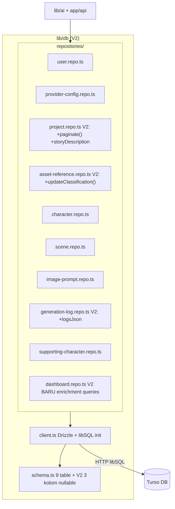
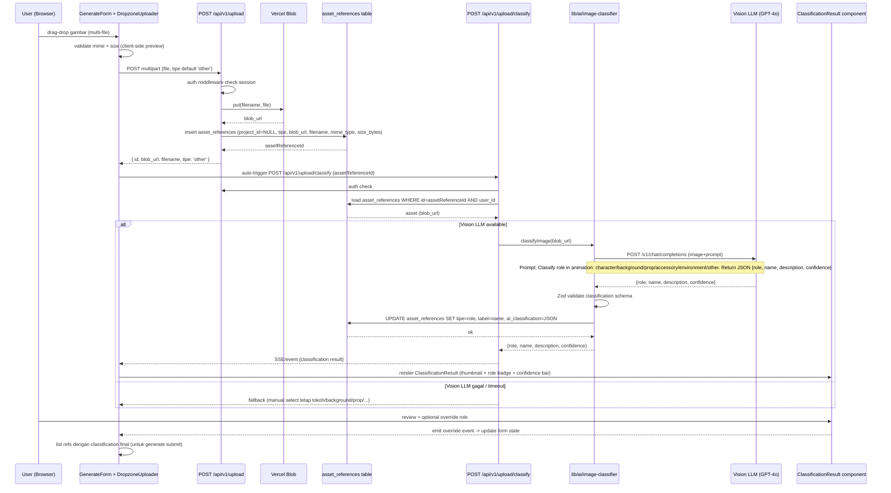
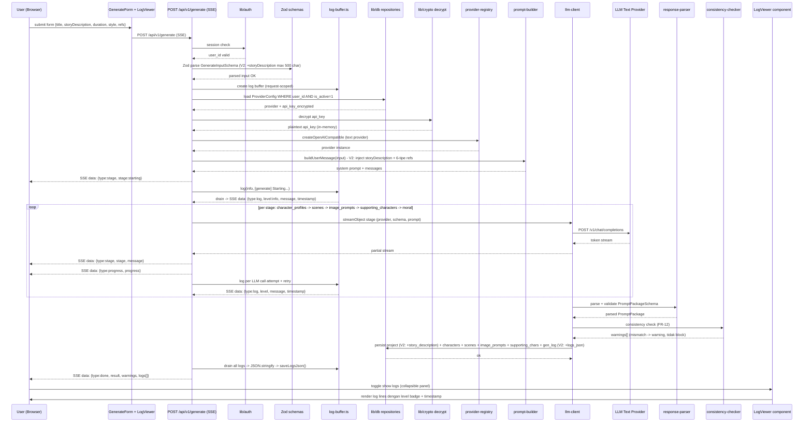
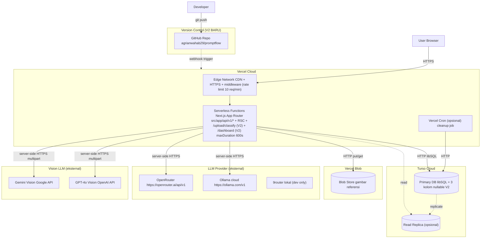

# Project Architecture — PromptFlow V2.0

> **Versi:** 2.0 (OVERWRITE V1.0)
> **Dibuat:** 2026-06-20
> **Status:** Final
> **Pemilik:** Bos Agrian
> **Sumber kebenaran:** `product-docs/RAG-CONTEXT.md` + `product-docs/SRS.md V2.0` + `product-docs/DATABASE_SCHEMA.md V2.0` + `src/lib/db/schema.ts` (ground truth kode) + `package.json`
> **Root proyek:** `C:\laragon\www\PromptFlow`
> **GitHub:** https://github.com/agrianwahab29/promptflow.git
> **Catatan:** OVERWRITE V1.0. V2 = upgrade arsitektur konkret untuk 10 fitur V2 (upload di generate page, Vision LLM classification, story description, real-time logs, dashboard enrichment, navigation optimization, GitHub push). V1 tetap pertahankan 9 tabel + 21 endpoint + modular monolith + server-only boundary. Perubahan = additive saja, tidak breaking.

---

## Daftar Isi

1. Pendahuluan & Ringkasan Arsitektur V2
2. System Context (C4 Level 1) — V2 update
3. Container Diagram (C4 Level 2) — V2 update
4. Component Diagram (C4 Level 3) — V2 + image-classifier
5. Folder / Module Structure V2
6. Data Flow — Upload + Classify (V2 baru)
7. Data Flow — Generate + Real-time Logs (V2 update)
8. External Integrations V2 (Vision LLM)
9. Configuration Management & Environment
10. Security Boundaries V2
11. Scalability, Performance, Observability V2
12. Deployment Topology V2
13. Keputusan Arsitektur (ADR ringkas)
14. Asumsi Arsitektur V2 & Referensi

---

## 1. Pendahuluan & Ringkasan Arsitektur V2

### 1.1 Tujuan Dokumen

Mengubah tech stack & pendekatan teknis SRS V2 + schema V2 menjadi blueprint arsitektur konkret + struktur proyek siap dipakai agent eksekutor membangun kode V2. Diagram Mermaid (C4 style) memetakan komponen, hubungan, alur data, deployment, security boundary V2. Sitasi ke RAG/SRS/DB_SCHEMA per klaim penting.

- Sitasi: `SRS.md V2.0 §1.1, §4` ; `RAG-CONTEXT.md §2, §9` ; `DATABASE_SCHEMA.md V2.0 §1, §14`

### 1.2 Gaya Arsitektur V2

| Aspek | V1 | V2 (baru/ubah) | Justifikasi | Bukti |
|---|---|---|---|---|
| Gaya | Modular Monolith | **Tetap Modular Monolith** (tidak migrasi ke microservice) | Fase V2 masih skala adopsi user, kompleksitas microservice tidak sepadan | `SRS.md V2.0 §4.1` |
| Sub-gaya | Layered + Feature-oriented | **Tetap** + tambah sub-layer `AI/Vision` (image-classifier) | Pemisahan LLM text vs Vision jelas | `SRS.md V2.0 §4.1` |
| Deploy | Serverless Vercel | **Tetap** | Auto-scale, pay-per-use, native Next.js | `RAG-CONTEXT.md §2.1, §5.4` |
| Data | Turso/libSQL | **Tetap** + 3 kolom nullable additive | Tidak breaking, migrasi minimal | `DATABASE_SCHEMA.md V2.0 §9.3` |
| AI Orkestrasi | Vercel AI SDK v4 + `@ai-sdk/openai-compatible` | **Tetap v4** (bukan upgrade ke v6 = OOS V2-3) | AI SDK v4 sudah proven V1; upgrade breaking | `RAG-CONTEXT.md §2` ; `SRS.md V2.0 §5` ; `package.json:25` |
| **V2 baru** Vision AI | Tidak ada | **Vision LLM call** (GPT-4o / Gemini Vision) via HTTP direct + Zod parse | Pipeline image classification butuh vision capability | `SRS.md V2.0 §6.2 FR-V2-02` |
| **V2 baru** Dashboard charts | 3 KPI cards langsung query | **Recharts/Tremor** charts + repository pattern refactor | Dashboard load <= 1.5s butuh query teroptimasi | `SRS.md V2.0 §6.6 FR-V2-06` |
| **V2 baru** Streaming logs SSE | SSE event: stage/progress/done/error | **SSE + event `log`** (level, message, timestamp) | Real-time processing logs | `SRS.md V2.0 §6.5 FR-V2-05` |
| **V2 baru** Pagination | `?page=1&limit=20` hardcoded | **Server-side pagination** + UI page numbers + prefetch | NFR-V2-P1 page transition <= 200ms | `SRS.md V2.0 §6.9 FR-V2-09` |

### 1.3 Prinsip Arsitektur V2

Prinsip V1 dipertahankan + 3 prinsip baru V2:

1. **Server-only boundary** (V1): semua panggilan LLM, decrypt API key, akses DB lewat `lib/*` `import 'server-only'`. TIDAK ada LLM call / decrypt dari Client Component. `SRS.md V2.0 §10.1 SEC-03`.
2. **Structured output first** (V1): `generateObject` + Zod `PromptPackageSchema`. Fallback `streamText` + parse manual. `SRS.md V2.0 §5`.
3. **Streaming anti-timeout** (V1): SSE token < 10s. V2 extend dengan `log` event type untuk observability real-time. `SRS.md V2.0 §6.5 FR-V2-05`.
4. **Ownership RBAC dasar** (V1): semua resource scoped per `user_id`. `SRS.md V2.0 §10.1 SEC-07`.
5. **Encrypt-at-rest API key** (V1): AES-256-GCM via env `ENCRYPTION_KEY`. `SRS.md V2.0 §10.1 SEC-01`.
6. **V2 baru — Vision is separate concern**: Vision LLM call (image classification) dipisah di `lib/ai/image-classifier.ts`. BUKAN pakai AI SDK `generateObject` karena provider mungkin beda (GPT-4o Vision vs text-only). Direct HTTP call + Zod parse. Server-only.
7. **V2 baru — Log buffer in-memory**: real-time logs buffer di memory selama SSE stream. Persist ke `generation_logs.logs_json` saat `done` event. Jangan query DB per log line.
8. **V2 baru — Pagination as first-class**: list endpoint WAJIB support `?page=&limit=` dengan response `{data[], pagination{page, limit, total, totalPages}}`. Repository pattern panggil `paginate()` helper. `SRS.md V2.0 §6.9`.

---

## 2. System Context (C4 Level 1) — V2 update

V2 tambah **Vision LLM** sebagai sistem eksternal baru + pertahankan V1 actors.



| Aktor/Sistem Eksternal | V1 | V2 (baru/ubah) | Interaksi | Bukti |
|---|---|---|---|---|
| User (Browser) | Ada | **Tetap** + interaksi baru: upload di generate page, toggle log viewer | HTTPS + SSE extended (event `log`) | `SRS.md V2.0 §6.1 FR-V2-01, §6.5 FR-V2-05` |
| LLM Text Provider | Ada | **Tetap** | Server-side call via `createOpenAICompatible` | `RAG-CONTEXT.md §5.1` ; `SRS.md V2.0 §5` |
| **V2 baru** Vision LLM | Tidak ada | **Tambah** untuk image classification (FR-V2-02) | Server-side HTTPS call `lib/ai/image-classifier.ts`. Provider: GPT-4o Vision / Gemini Vision. Direct HTTP (BUKAN AI SDK structured output). | `SRS.md V2.0 §6.2 FR-V2-02` ; `RAG-CONTEXT.md §10 B` |
| Turso DB | Ada | **Tetap** + 3 kolom nullable baru | HTTP libSQL via Drizzle ORM | `DATABASE_SCHEMA.md V2.0 §3, §9.3` |
| Vercel Blob | Ada | **Tetap** + asset_references pakai kolom ai_classification | HTTP `put`/`get` via `@vercel/blob` | `SRS.md V2.0 §5` |
| **V2 baru** GitHub Repo | Tidak ada (V1: belum init git) | **Tambah** — version control + CI/CD future | `git push` ke `https://github.com/agrianwahab29/promptflow.git` | `SRS.md V2.0 §6.10 FR-V2-10` ; `BRD.md §7` |
| Vercel Hosting | Ada | **Tetap** | Serverless + edge | `RAG-CONTEXT.md §2.1` |

---

## 3. Container Diagram (C4 Level 2) — V2 update

V2 tambah sub-modul `lib/ai/image-classifier.ts` (Vision LLM), tambah `components/dashboard/Charts/` (Recharts), tambah `components/generate/LogViewer.tsx`.



| Container/Sub-modul | V1 | V2 (baru/ubah) | Tanggung jawab | Bukti |
|---|---|---|---|---|
| Server Components / Pages | Ada | **Tetap** + tambah `loading.tsx` + `error.tsx` per page group (FR-V2-07) | SSR/ISR, data fetch list/detail project, layout, i18n. Loading skeleton + error boundary. | `SRS.md V2.0 §6.7 FR-V2-07` |
| Route Handlers + Server Actions | 21 endpoint V1 | **Tetap 21 + 1 endpoint baru** (`/api/v1/upload/classify`) + extended `/api/v1/dashboard/stats` | Backend endpoints V1 backward-compatible | `SRS.md V2.0 §8.2-§8.3` |
| `lib/ai` | 5 komponen V1 | **+1 komponen baru**: `image-classifier.ts` (Vision LLM) | Orkestrasi LLM text + Vision. Server-only. | `SRS.md V2.0 §6.2 FR-V2-02` |
| `lib/db` | 9 repo V1 | **+1 repo baru**: `dashboard.repo.ts` (enrichment queries) + extended `project.repo.ts` (pagination) | Repository pattern enforced | `SRS.md V2.0 §6.6 FR-V2-06, §6.9 FR-V2-09` |
| `lib/storage` | Ada | **Tetap** | Vercel Blob helper | `SRS.md V2.0 §5` |
| `lib/auth` | Ada | **Tetap** | NextAuth credentials + middleware | `SRS.md V2.0 §10.1 SEC-11` |
| `lib/crypto` | Ada | **Tetap** | AES-256-GCM encrypt/decrypt/mask | `SRS.md V2.0 §10.1 SEC-01` |
| `lib/i18n` | Ada | **Tetap** | next-intl messages id/en | `SRS.md V2.0 §5` |
| `lib/validation` | 6 schema V1 | **Extended**: `GenerateReferenceSchema.type` enum 6 opsi + `storyDescription` field | Zod schemas input + LLM output | `SRS.md V2.0 §6.3 FR-V2-03, §6.4 FR-V2-04` |
| `lib/export` | Ada | **Tetap** | JSON + markdown transform | `SRS.md V2.0 §5` |
| **V2 baru** `components/generate/LogViewer.tsx` | Tidak ada | **Tambah** — Collapsible panel show/hide logs real-time | Toggle panel untuk SSE `log` events | `SRS.md V2.0 §6.5 FR-V2-05` |
| **V2 baru** `components/generate/ClassificationResult.tsx` | Tidak ada | **Tambah** — thumbnail + role badge + confidence bar + override dropdown | Tampilkan hasil Vision LLM classification | `SRS.md V2.0 §6.2 FR-V2-02` |
| **V2 baru** `components/dashboard/*` | Tidak ada | **Tambah** — Recharts Line/Bar/Pie chart components | Dashboard enrichment | `SRS.md V2.0 §6.6 FR-V2-06` |

---

## 4. Component Diagram (C4 Level 3) — V2 update

### 4.1 Komponen `lib/ai` V2



| Komponen | V1 | V2 | Tanggung jawab | Bukti |
|---|---|---|---|---|
| `provider-registry.ts` | Ada | **Tetap** (TEXT only) | Init `createOpenAICompatible` + decrypt key server-side | `SRS.md V2.0 §5` |
| `prompt-builder.ts` | Ada | **Extended** — inject `storyDescription` + 6-tipe refs | Assemble system prompt | `SRS.md V2.0 §6.4 FR-V2-04, §6.3 FR-V2-03` |
| `llm-client.ts` | Ada | **Extended** — tambah log buffer push per tahap | Panggil LLM + retry 3x backoff + buffer log | `SRS.md V2.0 §6.5 FR-V2-05` |
| `response-parser.ts` | Ada | **Tetap** | Zod validate + fallback parse | `SRS.md V2.0 §5` |
| `consistency-checker.ts` | Ada | **Tetap** | Post-check FR-12 | `SRS.md V2.0 §5 FR-12` |
| `prompts/*.system.ts` | Ada | **Extended** — tambah instruction untuk `storyDescription` | Template system prompt | `SRS.md V2.0 §6.4 FR-V2-04` |
| **V2 baru** `image-classifier.ts` | Tidak ada | **Tambah** | Vision LLM HTTP call. Input: blob URL atau local path. Output: `{role, name, description, confidence}` JSON. Zod validate. Cache di `asset_references.ai_classification`. Confidence threshold 0.7. Batch max 5. | `SRS.md V2.0 §6.2 FR-V2-02` |
| **V2 baru** `log-buffer.ts` | Tidak ada | **Tambah** | In-memory array buffer log lines per request. Push per tahap. Drain ke SSE `log` event. Persist JSON ke `generation_logs.logs_json` saat `done`. | `SRS.md V2.0 §6.5 FR-V2-05` |

### 4.2 Komponen `lib/db` V2



| Komponen | V1 | V2 | Bukti |
|---|---|---|---|
| `client.ts` | Ada | **Tetap** | `DATABASE_SCHEMA.md V2.0 §1` |
| `schema.ts` | 9 tabel | **9 tabel + 3 kolom nullable** (`projects.story_description`, `asset_references.ai_classification`, `generation_logs.logs_json`) | `DATABASE_SCHEMA.md V2.0 §4.3, §4.4, §4.8` ; `schema.ts` |
| `repositories/*.repo.ts` | 9 repo | **9 repo V1 + extended queries** (pagination, log JSON, classification cache) | `DATABASE_SCHEMA.md V2.0 §5` |
| **V2 baru** `dashboard.repo.ts` | Tidak ada | **Tambah** — queries: `totalProjects`, `successfulGenerations`, `avgDuration`, `perProviderBreakdown`, `recentProjects(5)`, `weeklyTrend`, `storageUsage` | `SRS.md V2.0 §6.6 FR-V2-06` |

---

## 5. Folder / Module Structure V2

Struktur folder V2 = V1 + file/komponen baru. Pertahankan 100% backward-compatible.

```text
PromptFlow/
  product-docs/                      # 14 dokumen (read-only rujukan)
  drizzle/                           # output migration SQL
  messages/
    id.json
    en.json
  public/
    references/                      # dev-only upload FS
  src/
    app/
      api/
        v1/                          # ASUMSI API-A1, semua endpoint V2 pakai /v1
          auth/[...nextauth]/route.ts
          health/route.ts
          projects/route.ts          # V2: +pagination
          projects/[id]/route.ts
          projects/[id]/export/route.ts
          projects/[id]/characters/route.ts
          projects/[id]/scenes/route.ts
          projects/[id]/image-prompts/route.ts
          projects/[id]/logs/route.ts
          generate/route.ts          # V2: +log SSE event + storyDescription
          upload/route.ts            # V2: 6-tipe enum + return ai_classification
          upload/classify/route.ts   # V2 BARU: trigger AI classification
          dashboard/route.ts         # V2 BARU/extended: enrichment response
          settings/providers/route.ts
          settings/providers/[id]/route.ts
          settings/providers/[id]/test/route.ts
      [locale]/
        layout.tsx
        (dashboard)/
          loading.tsx                # V2 BARU: skeleton
          error.tsx                  # V2 BARU: boundary
          generate/
            loading.tsx              # V2 BARU
            page.tsx                 # V2: upload di sini, bukan project detail
          projects/
            loading.tsx              # V2 BARU
            page.tsx                 # V2: +pagination
            [id]/
              loading.tsx            # V2 BARU
              page.tsx               # V2: view refs only (read-only, upload DIHAPUS)
          dashboard/
            loading.tsx              # V2 BARU
            page.tsx                 # V2: charts + activity + per-provider
          settings/
            loading.tsx              # V2 BARU
            page.tsx
        (auth)/
          login/page.tsx
          register/page.tsx
      layout.tsx
      page.tsx
      globals.css                    # V2: +design tokens (--primary, font, spacing)
    components/
      ui/                            # shadcn/ui (tetap)
      generate/
        generate-form.tsx            # V2: +DropzoneUploader embedded + storyDescription textarea
        dropzone-uploader.tsx        # V2: 6-tipe enum, support upload tanpa projectId
        asset-preview-list.tsx       # V2 BARU: list uploaded refs dgn thumbnail + role badge
        classification-result.tsx    # V2 BARU: thumbnail + role badge + confidence + override
        log-viewer.tsx               # V2 BARU: Collapsible show/hide logs
        result-tabs.tsx              # tetap
        template-picker.tsx          # tetap
      projects/
        project-card.tsx             # tetap
        projects-pagination.tsx      # V2 BARU: page numbers + prev/next
        delete-project-button.tsx    # tetap
      dashboard/
        metric-card.tsx              # V2 BARU: generic metric card
        weekly-trend-chart.tsx       # V2 BARU: Recharts LineChart
        success-fail-chart.tsx       # V2 BARU: Recharts BarChart
        per-provider-table.tsx       # V2 BARU
        recent-activity-table.tsx    # V2 BARU
        storage-usage-card.tsx       # V2 BARU
      settings/
        provider-config-form.tsx
        provider-card.tsx
      common/
        app-header.tsx
        language-toggle.tsx
        copy-button.tsx
      providers.tsx
    lib/
      ai/
        provider-registry.ts         # V1: text providers
        image-classifier.ts          # V2 BARU: Vision LLM
        prompt-builder.ts            # V2: +storyDescription injection
        llm-client.ts                # V2: +log buffer integration
        response-parser.ts
        consistency-checker.ts
        log-buffer.ts                # V2 BARU: in-memory log buffer
        prompts/
          scenes.system.ts           # V2: +storyDescription context
          voiceover.system.ts
          character.system.ts
          image-prompts.system.ts    # V2: 6-tipe enum reference format
          moral.system.ts
      db/
        client.ts
        schema.ts                    # V2: +3 kolom nullable
        repositories/
          user.repo.ts
          provider-config.repo.ts
          project.repo.ts            # V2: +paginate()
          asset-reference.repo.ts    # V2: +updateClassification()
          character.repo.ts
          scene.repo.ts
          image-prompt.repo.ts
          generation-log.repo.ts     # V2: +saveLogsJson()
          supporting-character.repo.ts
          dashboard.repo.ts          # V2 BARU
      storage/blob.ts                # V1: dual-mode Blob/FS
      auth/
        config.ts                    # NextAuth credentials + JWT
        middleware.ts                # protected routes
      crypto/aes.ts                  # AES-256-GCM
      i18n/
        config.ts
        request.ts
      validation/
        schemas.ts                   # V2: 6-tipe enum + storyDescription field
      export/markdown.template.ts
    middleware.ts                    # NextAuth + i18n + rate limit (10 req/min)
  drizzle.config.ts                  # Turso dialect
  next.config.ts                     # next-intl plugin + Vercel Blob images
  tailwind.config.ts                 # atau CSS-first v4
  components.json                    # shadcn/ui config
  package.json                       # V2: +recharts dependency
  tsconfig.json
  .env.local                         # dev (TIDAK commit)
  .env.example                       # dokumentasi env
  .gitignore                         # V2 BARU: node_modules, .env.local, .next, public/references
  README.md                          # V2 updated
```

| Folder | V1 | V2 (baru/ubah) | Bukti |
|---|---|---|---|
| `src/app/api/v1/upload/classify/` | Tidak ada | **V2 BARU** — POST endpoint untuk trigger AI classification | `SRS.md V2.0 §8.3` |
| `src/app/api/v1/dashboard/` | Tidak ada (V1: dashboard via page direct query) | **V2 BARU** — GET endpoint return enrichment data | `SRS.md V2.0 §8.2` |
| `src/app/[locale]/(dashboard)/loading.tsx` per group | Tidak ada | **V2 BARU** — skeleton per page group (FR-V2-07) | `SRS.md V2.0 §6.7 FR-V2-07` |
| `src/app/[locale]/(dashboard)/error.tsx` per group | Tidak ada | **V2 BARU** — error boundary (FR-V2-07) | `SRS.md V2.0 §6.7 FR-V2-07` |
| `src/components/generate/dropzone-uploader.tsx` | Di project detail | **V2**: dipindah ke generate form, support upload tanpa projectId + 6-tipe enum | `SRS.md V2.0 §6.1 FR-V2-01, §6.3 FR-V2-03` |
| `src/components/generate/asset-preview-list.tsx` | Tidak ada | **V2 BARU** — list refs dengan thumbnail + role badge | `SRS.md V2.0 §6.1 FR-V2-01` |
| `src/components/generate/classification-result.tsx` | Tidak ada | **V2 BARU** — Vision LLM result UI + override | `SRS.md V2.0 §6.2 FR-V2-02` |
| `src/components/generate/log-viewer.tsx` | Tidak ada | **V2 BARU** — Collapsible log panel | `SRS.md V2.0 §6.5 FR-V2-05` |
| `src/components/dashboard/*` | Hanya page | **V2 BARU** — chart + table + card components | `SRS.md V2.0 §6.6 FR-V2-06` |
| `src/components/projects/projects-pagination.tsx` | Tidak ada | **V2 BARU** — page numbers + prev/next | `SRS.md V2.0 §6.9 FR-V2-09` |
| `src/lib/ai/image-classifier.ts` | Tidak ada | **V2 BARU** — Vision LLM HTTP call | `SRS.md V2.0 §6.2 FR-V2-02` |
| `src/lib/ai/log-buffer.ts` | Tidak ada | **V2 BARU** — in-memory log buffer | `SRS.md V2.0 §6.5 FR-V2-05` |
| `src/lib/db/repositories/dashboard.repo.ts` | Tidak ada | **V2 BARU** — enrichment queries | `SRS.md V2.0 §6.6 FR-V2-06` |
| `src/lib/db/repositories/project.repo.ts` | V1: listActiveProjects hardcoded | **V2**: +`paginate({userId, page, limit})` | `SRS.md V2.0 §6.9 FR-V2-09` |
| `.gitignore` | Tidak ada | **V2 BARU** — FR-V2-10 | `SRS.md V2.0 §6.10 FR-V2-10` |

---

## 6. Data Flow — Upload + AI Classification (V2 use case kunci)

Use case V2 kunci #1: User upload gambar referensi di generate page → auto-trigger Vision LLM classification → result visible sebelum submit generate.



| Tahap | Aksi | Komponen | Bukti |
|---|---|---|---|
| 1. Upload | User drag-drop di generate page. POST multipart `/api/v1/upload`. | `DropzoneUploader` + `/api/v1/upload` | `SRS.md V2.0 §6.1 FR-V2-01` ; `RAG-CONTEXT.md §9 V2-1` |
| 2. Validasi | MIME image/*, max 10MB, tipe 6 opsi (tokoh/background/prop/accessory/environment/other) | Zod `GenerateReferenceSchema.type` + upload route validation | `SRS.md V2.0 §6.3 FR-V2-03, §9.1` |
| 3. Storage | `lib/storage/blob.ts` — Vercel Blob (prod) atau local FS `public/references/` (dev) | `@vercel/blob` `put()` | `RAG-CONTEXT.md §5 A` |
| 4. Insert DB | INSERT `asset_references` dengan `project_id=NULL` (generate page belum punya project), simpan `tipe`, `filename`, `blob_url`, `mime_type`, `size_bytes` | `asset-reference.repo.ts` `create()` | `DATABASE_SCHEMA.md V2.0 §4.4` |
| 5. Auto-trigger classify | POST `/api/v1/upload/classify {assetReferenceId}` setelah upload success | frontend auto-fire | `SRS.md V2.0 §8.3` |
| 6. Vision LLM call | `lib/ai/image-classifier.ts` HTTP call ke Vision provider (GPT-4o Vision / Gemini Vision). Prompt structured output JSON. | `image-classifier.ts` | `SRS.md V2.0 §6.2 FR-V2-02` ; `RAG-CONTEXT.md §10 B` |
| 7. Parse + validate | Zod parse `{role, name, description, confidence}` schema. Confidence threshold 0.7. | `lib/validation/schemas.ts` classification schema | `SRS.md V2.0 §6.2` |
| 8. Cache result | UPDATE `asset_references` SET `tipe=role`, `label=name`, `ai_classification=JSON` (cache agar tidak reclassify) | `asset-reference.repo.ts` `updateClassification()` | `DATABASE_SCHEMA.md V2.0 §4.4, §13.4` |
| 9. Render result | `ClassificationResult` component — thumbnail + role badge + confidence bar + override dropdown | `components/generate/classification-result.tsx` | `SRS.md V2.0 §6.2 FR-V2-02` |
| 10. Manual override | User bisa ubah role via dropdown (confidence rendah atau Vision LLM gagal → fallback ke manual) | `ClassificationResult` onChange | `SRS.md V2.0 §6.2 FR-V2-02` |
| 11. Include di generate | Saat submit generate, refs dengan classification final di-inject ke `buildUserMessage()` | `prompt-builder.ts` `buildUserMessage()` | `SRS.md V2.0 §6.3 FR-V2-03` |

---

## 7. Data Flow — Generate + Real-time Logs (V2 update use case kunci #2)

V2 extend V1 flow dengan: `storyDescription` field, SSE `log` event, log persistence.



| Tahap | Aksi | Komponen | V2 Change | Bukti |
|---|---|---|---|---|
| 1-4. Auth + Validate + Load config + Decrypt | V1 flow | Sama V1 | Tidak berubah | `SRS.md V2.0 §6.4` |
| 5. Build prompt | `buildUserMessage(input)` | `prompt-builder.ts` | **V2**: inject `storyDescription` (opsional, max 500 char) + 6-tipe refs format | `SRS.md V2.0 §6.4 FR-V2-04` |
| 6. SSE stage events | `data: {type:stage, stage, message}` | `/api/v1/generate` | **V2 extended**: tambah `log` event type | `SRS.md V2.0 §8.4` |
| 7. Log buffer init | Create per-request in-memory array | `log-buffer.ts` (V2 BARU) | **V2 BARU** | `SRS.md V2.0 §6.5 FR-V2-05` |
| 8. Log per tahap | Backend push ke buffer. Buffer drain → SSE `log` event per entry. | `log-buffer.ts` | **V2 BARU** | `SRS.md V2.0 §6.5 FR-V2-05` |
| 9. Frontend LogViewer | Collapsible panel (default OFF) + toggle switch | `components/generate/log-viewer.tsx` | **V2 BARU** | `SRS.md V2.0 §6.5 FR-V2-05` |
| 10-11. Parse + Consistency | V1 flow | Sama | Tidak berubah | `SRS.md V2.0 §6 FR-12` |
| 12. Persist + logs_json | Save project + characters + scenes + image_prompts + supporting_chars + gen_log. V2: tambah `projects.story_description`, `generation_logs.logs_json=JSON.stringify(buffer)`. | `lib/db/repositories/*` | **V2 extended**: 3 kolom nullable diisi | `DATABASE_SCHEMA.md V2.0 §4.3, §4.8, §9.3` |
| 13. Return done | SSE `data: {type:done, result, warnings, logs[]}` | `/api/v1/generate` | **V2 extended**: tambah `logs[]` di done event | `SRS.md V2.0 §8.4` |

---

## 8. External Integrations V2

### 8.1 Vision LLM (V2 BARU)

| Aspek | Detail | Bukti |
|---|---|---|
| Purpose | Image classification (role + name + description + confidence) untuk asset references | `SRS.md V2.0 §6.2 FR-V2-02` |
| Provider pilihan | GPT-4o Vision (OpenAI) ATAU Gemini Vision (Google) | `RAG-CONTEXT.md §10 B` |
| Cara panggil | Direct HTTP POST `multipart` ke provider endpoint. BUKAN via AI SDK structured output (vision model beda capability). | `SRS.md V2.0 §6.2 FR-V2-02` |
| Prompt pattern | "Analyze this image and classify its role in an animation project. Return JSON: {role, name, description, confidence}. Role options: character, background, prop, accessory, environment, other." | `RAG-CONTEXT.md §10 B` |
| Response schema (Zod) | `{role: enum[6], name: string, description: string, confidence: number(0-1)}` | `SRS.md V2.0 §6.2` |
| Confidence threshold | 0.7 — di bawah = warning UI + suggest manual override | `SRS.md V2.0 §6.2` |
| Batch limit | Max 5 gambar per HTTP call (rate limit + cost) | ASUMSI SRS-V2-A12 |
| Cache | Hasil disimpan di `asset_references.ai_classification` (TEXT nullable, JSON) → tidak reclassify | `DATABASE_SCHEMA.md V2.0 §4.4, §13.4` |
| Fallback | Vision LLM gagal/timeout → manual select dropdown (6 opsi), classification nullable | `SRS.md V2.0 §6.2 FR-V2-02` |
| Server-only | `lib/ai/image-classifier.ts` `import 'server-only'`. API key provider Vision via env atau settings. | `SRS.md V2.0 §10.1 SEC-03` |
| Latency target | <= 5s per gambar (NFR-V2-P3) | `SRS.md V2.0 §3.2` |

**Cara konsumsi (illustrative):**
```ts
// src/lib/ai/image-classifier.ts
import 'server-only';
import { z } from 'zod';

const ClassificationResultSchema = z.object({
  role: z.enum(['tokoh','background','prop','accessory','environment','other']),
  name: z.string().max(100),
  description: z.string().max(500),
  confidence: z.number().min(0).max(1),
});

export async function classifyImage(blobUrl: string): Promise<ClassificationResult> {
  // 1. Fetch image bytes dari blobUrl
  // 2. Build multipart request ke Vision provider (GPT-4o Vision)
  // 3. POST dengan image + prompt
  // 4. Parse JSON response
  // 5. ClassificationResultSchema.parse()
  // 6. Return validated result
}
```

### 8.2 LLM Text Provider (V1 — tetap)

| Provider | Base URL | Auth | V2 Change | Bukti |
|---|---|---|---|---|
| Ollama cloud | `https://ollama.com/v1` | Bearer API key | Tetap | `RAG-CONTEXT.md §5.2` |
| OpenRouter | `https://openrouter.ai/api/v1` | Bearer + `HTTP-Referer`, `X-OpenRouter-Title` headers | Tetap | `RAG-CONTEXT.md §5.2` |
| 9router | `http://localhost:20128/v1` | Bearer/none | Tetap (dev lokal only) | ASUMSI SRS-A7 |
| custom | (user input) | (user input) | Tetap | `SRS.md V2.0 §5` |

### 8.3 Turso DB, Vercel Blob, NextAuth, Vercel Hosting (V1 — tetap)

Tidak berubah dari V1. Lihat `PROJECT_ARCHITECTURE.md V1.0 §7.2-§7.5` untuk detail penuh.

### 8.4 GitHub Repo (V2 BARU)

| Aspek | Detail | Bukti |
|---|---|---|
| URL | `https://github.com/agrianwahab29/promptflow.git` | `BRD.md §1` ; `SRS.md V2.0 §6.10 FR-V2-10` |
| Visibility | Public (ASUMSI — konfirmasi user) | ASUMSI SRS-V2-A7 |
| Init | `git init` di root proyek | `SRS.md V2.0 §6.10 FR-V2-10` |
| `.gitignore` | `node_modules`, `.env.local`, `.next`, `public/references`, `*.tsbuildinfo`, `drizzle/meta`, `.DS_Store` | `SRS.md V2.0 §6.10 FR-V2-10` |
| Commit convention | Conventional commits: `feat(scope):`, `fix(scope):`, `chore(scope):` | `AGENTS.md §4` |
| Branch strategy | `main` branch (protected). Feature branches: `feat/v2-upload`, `feat/v2-classification`, `feat/v2-logs`, `feat/v2-dashboard`, `feat/v2-navigation`, `feat/v2-github`. | `AGENTS.md §4 #12` |
| Push | `git push -u origin main` | `SRS.md V2.0 §6.10 FR-V2-10` |

---

## 9. Configuration Management & Environment

### 9.1 Env Keys V2 (`.env.example`)

| Env key | V1 | V2 (baru/ubah) | Wajib | Deskripsi | Bukti |
|---|---|---|---|---|---|
| `TURSO_DATABASE_URL` | Ada | Tetap | YA | URL Turso DB | `DATABASE_SCHEMA.md V2.0 §12.3` |
| `TURSO_AUTH_TOKEN` | Ada | Tetap | YA | Token auth Turso | `DATABASE_SCHEMA.md V2.0 §12.3` |
| `ENCRYPTION_KEY` | Ada | Tetap | YA | Key AES-256-GCM (32 byte base64) | `DATABASE_SCHEMA.md V2.0 §12.1` |
| `NEXTAUTH_SECRET` | Ada | Tetap | YA | Secret NextAuth JWT | `SRS.md V2.0 §10.1 SEC-12` |
| `NEXTAUTH_URL` | Ada | Tetap | YA (prod) | URL deploy | `SRS.md V2.0 §10.1` |
| `BLOB_READ_WRITE_TOKEN` | Ada | Tetap | YA | Token Vercel Blob | `DATABASE_SCHEMA.md V2.0 §12.3` |
| `USE_VERCEL_BLOB` | Ada | Tetap | Opsional | Flag dev Blob vs FS | ASUMSI SRS-A17 |
| `NEXT_PUBLIC_APP_URL` | Ada | Tetap | YA | URL publik client | `CODING_RULES.md §2.1` |
| **V2 baru** `VISION_LLM_PROVIDER` | Tidak ada | **Tambah** | YA (V2) | `'openai' \| 'google'` — pilih Vision provider | ASUMSI SRS-V2-A1 |
| **V2 baru** `VISION_LLM_API_KEY` | Tidak ada | **Tambah** | YA (V2) | API key untuk Vision LLM (GPT-4o atau Gemini Vision) | ASUMSI SRS-V2-A1 |
| **V2 baru** `VISION_LLM_MODEL` | Tidak ada | **Tambah** | YA (V2) | Model ID Vision (mis. `gpt-4o`, `gemini-1.5-flash`) | ASUMSI SRS-V2-A1 |
| **V2 baru** `VISION_LLM_BASE_URL` | Tidak ada | **Tambah** | Opsional (V2) | Custom base URL Vision (default OpenAI-compat) | ASUMSI |
| **V2 baru** `LOG_VIEWER_DEFAULT` | Tidak ada | **Tambah** | Opsional | `'on' \| 'off'` default toggle log viewer (default off) | ASUMSI |
| **V2 baru** `DASHBOARD_DEFAULT_RANGE` | Tidak ada | **Tambah** | Opsional | Default range week untuk weekly trend chart (default 12) | ASUMSI |

> **Catatan Penting:** Vision LLM API key = env (server-side only), BUKAN input per-user via UI di fase V2. Berbeda dengan Text LLM (per-user via UI encrypt di DB). Vision LLM adalah shared service. ASUMSI SRS-V2-A1.

### 9.2 Secrets Management (V1 — tetap)

- Guard wajib di init module: `if (!process.env.ENCRYPTION_KEY) throw new Error('Missing ENCRYPTION_KEY')`. `SRS.md V2.0 §10.1 SEC-08`.
- `.env.example` tanpa value asli. `.env.local` dev TIDAK commit.
- Vercel project settings untuk prod/preview.
- `lib/ai/*` + `lib/crypto/*` `import 'server-only'`. Tidak ada env secret bocor ke client.

### 9.3 Feature Flags V2

| Flag | Default | Lokasi | Fungsi |
|---|---|---|---|
| `USE_VERCEL_BLOB` | `true` (prod) / `false` (dev) | `lib/storage/blob.ts` | Toggle Blob vs local FS upload |
| `LOG_VIEWER_DEFAULT` | `off` | `components/generate/log-viewer.tsx` | Default toggle log panel |
| `VISION_LLM_ENABLED` (planned) | `true` | `lib/ai/image-classifier.ts` | Enable/disable Vision LLM (fallback ke manual) |

---

## 10. Security Boundaries V2

V1 boundaries (SB-01..SB-13) dipertahankan + tambah 3 boundary baru V2.

| ID | Boundary | V1 | V2 (baru/ubah) | Implementasi | Bukti |
|---|---|---|---|---|---|
| SB-01 | Server-only provider call | Ada | **Tetap** | `lib/ai/*` + V2 `image-classifier.ts` `import 'server-only'` | `SRS.md V2.0 §10.1 SEC-03` |
| SB-02 | Server-only crypto | Ada | **Tetap** | `lib/crypto/aes.ts` `import 'server-only'` | `SRS.md V2.0 §10.1 SEC-01` |
| SB-03 | API key encryption at rest | Ada | **Tetap** | AES-256-GCM | `DATABASE_SCHEMA.md V2.0 §12.1` |
| SB-04 | API key tidak expose ke client | Ada | **Tetap** | Mask `****` + 4 char terakhir | `SRS.md V2.0 §10.1 SEC-02` |
| SB-05 | RBAC ownership dasar | Ada | **Tetap** | Filter `user_id = session.user.id` di semua repo | `SRS.md V2.0 §10.1 SEC-07` |
| SB-06 | Protected routes | Ada | **Tetap** | Middleware: `/projects`, `/settings`, `/generate`, `/api/v1/*` | `SRS.md V2.0 §10.1 SEC-11` |
| SB-07 | CSRF protection | Ada | **Tetap** | Next.js built-in CSRF + NextAuth | `SRS.md V2.0 §10.1 SEC-05` |
| SB-08 | Input sanitization (XSS) | Ada | **Tetap** + extend ke `storyDescription` | Zod validate + escape HTML | `SRS.md V2.0 §10.1 SEC-06` |
| SB-09 | Env secret management | Ada | **Tetap** + tambah 4 env V2 | Vercel env, guard di init | `SRS.md V2.0 §10.1 SEC-08` |
| SB-10 | HTTPS only | Ada | **Tetap** | Vercel default | `SRS.md V2.0 §10.1 SEC-09` |
| SB-11 | 9router localhost only | Ada | **Tetap** | Dev only, server-side call | ASUMSI SRS-A7 |
| SB-12 | Rate limit generate | Ada (10 req/min) | **Tetap** | Middleware `X-RateLimit-*` header | `SRS.md V2.0 §10.1 SEC-10` |
| SB-13 | NextAuth secret | Ada | **Tetap** | `NEXTAUTH_SECRET` wajib | `SRS.md V2.0 §10.1 SEC-12` |
| **V2 baru SB-14** | Vision LLM key env-only | Tidak ada | **Tambah** | `VISION_LLM_API_KEY` di env server-only. BUKAN input per-user UI di fase V2. Shared service. | ASUMSI SRS-V2-A1 |
| **V2 baru SB-15** | Story description length limit | Tidak ada | **Tambah** | `storyDescription: z.string().max(500)` Zod validate sebelum prompt injection + DB save. Cegah prompt injection via input panjang. | `SRS.md V2.0 §6.4 FR-V2-04` |
| **V2 baru SB-16** | Log buffer sanitization | Tidak ada | **Tambah** | Log lines di-escape HTML sebelum render di LogViewer. Cegah XSS via LLM error message. | `SRS.md V2.0 §6.5 FR-V2-05` |

---

## 11. Scalability, Performance, Observability V2

### 11.1 Scalability V2

| Aspek | V1 | V2 | Bukti |
|---|---|---|---|
| Auto-scale | Vercel serverless | **Tetap** | `RAG-CONTEXT.md §2.1` |
| Streaming SSE anti-timeout | V1 ada | **Tetap + extended log events** | `SRS.md V2.0 §6.5 FR-V2-05` |
| **V2 baru** Pagination | `?page=1&limit=20` hardcoded | **Server-side pagination** + repository `paginate()` + UI page numbers | `SRS.md V2.0 §6.9 FR-V2-09` |
| **V2 baru** Suspense boundaries | Tidak ada | **Tambah** Suspense per page group | `SRS.md V2.0 §6.9 FR-V2-09` |
| **V2 baru** loading.tsx + error.tsx | Tidak ada | **Tambah** per page group | `SRS.md V2.0 §6.7 FR-V2-07` |
| **V2 baru** Image optimization | Tidak ada (V1 pakai `` biasa) | **Pakai** `<Image>` Next.js component | `SRS.md V2.0 §6.9 FR-V2-09` |
| **V2 baru** Prefetch | Tidak ada | **Pakai** `next/link prefetch=true` | `SRS.md V2.0 §6.9 FR-V2-09` |
| DB read replica | V1 opsional | **Tetap opsional** | `DATABASE_SCHEMA.md V2.0 §1` |
| Connection pooling | Drizzle handle internal | **Tetap** | `DATABASE_SCHEMA.md V2.0 §1.3` |
| Query optimization | V1 indexes | **Tetap 17 indexes** | `DATABASE_SCHEMA.md V2.0 §6` |
| Caching | V1 tidak ada cache layer | **Tetap** (fase awal) | ASUMSI |

### 11.2 Performance Targets V2

| ID | Metrik | Target | V1/V2 | Bukti |
|---|---|---|---|---|
| NFR-P1 | Latency Shorts | <= 60s end-to-end | V1 | `SRS.md V2.0 §11` |
| NFR-P2 | Latency Tutorial | <= 180s end-to-end | V1 | `SRS.md V2.0 §11` |
| NFR-P3 | Streaming partial SSE | Token < 10s | V1 | `SRS.md V2.0 §11` |
| NFR-P4 | UI response time | < 2s page load | V1 | `SRS.md V2.0 §11` |
| NFR-P5 | DB query | < 500ms | V1 | `SRS.md V2.0 §11` |
| **V2 baru NFR-V2-P1** | Page transition | <= 200ms | V2 | `SRS.md V2.0 §3.2, §6.9 FR-V2-09` |
| **V2 baru NFR-V2-P2** | Dashboard load | <= 1.5s | V2 | `SRS.md V2.0 §3.2, §6.6 FR-V2-06` |
| **V2 baru NFR-V2-P3** | AI classification latency | <= 5s per gambar | V2 | `SRS.md V2.0 §3.2, §6.2 FR-V2-02` |
| **V2 baru NFR-V2-P4** | Real-time log latency | <= 100ms server ke UI | V2 | `SRS.md V2.0 §3.2, §6.5 FR-V2-05` |

### 11.3 Observability V2

| Aspek | V1 | V2 (baru/ubah) | Bukti |
|---|---|---|---|
| Platform logs | Vercel logs | **Tetap** | `RAG-CONTEXT.md §2.1` |
| Structured log DB | `generation_logs` (provider, model, duration, status, error_message) | **Tetap + extended** `logs_json` (JSON array log lines) | `DATABASE_SCHEMA.md V2.0 §4.8` |
| **V2 baru** Real-time logs UI | Tidak ada | **Tambah** — LogViewer Collapsible panel | `SRS.md V2.0 §6.5 FR-V2-05` |
| Telemetri KPI | V1: `generation_logs` row per generate | **V2 extended**: per-provider, per-duration, success rate, weekly trend, storage usage | `SRS.md V2.0 §6.6 FR-V2-06` |
| **V2 baru** Dashboard analytics | 3 KPI cards hardcoded query | **V2**: dashboard.repo.ts + Recharts + 6-8 metric cards | `SRS.md V2.0 §6.6 FR-V2-06` |
| Error tracking | Vercel logs + `error_message` DB | **Tetap** | ASUMSI |
| Monitoring | Vercel Analytics | **Tetap** | ASUMSI |
| Audit trail | `created_at`/`updated_at`/`deleted_at` | **Tetap** | `DATABASE_SCHEMA.md V2.0 §4` |

---

## 12. Deployment Topology V2



| Aspek | V1 | V2 (baru/ubah) | Bukti |
|---|---|---|---|
| Hosting | Vercel serverless | **Tetap** | `RAG-CONTEXT.md §2.1` |
| DB | Turso (9 tabel) | **Tetap + 3 kolom nullable** | `DATABASE_SCHEMA.md V2.0 §9.3` |
| Storage | Vercel Blob | **Tetap** | `SRS.md V2.0 §5` |
| **V2 baru** Vision LLM | Tidak deploy | **Server-side HTTPS call** ke GPT-4o / Gemini Vision | `SRS.md V2.0 §6.2 FR-V2-02` |
| **V2 baru** VCS | Tidak ada (V1: belum init git) | **GitHub Repo** + auto-deploy Vercel webhook (planned) | `SRS.md V2.0 §6.10 FR-V2-10` |
| Env vars (Vercel) | 7 keys V1 | **7 + 5 V2** = 12 keys total (lihat §9.1) | `DATABASE_SCHEMA.md V2.0 §12.3` ; `SRS.md V2.0 §6.10` |
| Migration apply V2 | Dev: `drizzle-kit push`. Prod: manual SQL. | **Tetap** + tambah 3 ALTER TABLE untuk kolom nullable | `DATABASE_SCHEMA.md V2.0 §9.3-§9.4` |
| Cron | Cleanup 30 hari project, 90 hari log | **Tetap** | `DATABASE_SCHEMA.md V2.0 §10.3` |
| 9router | Dev only | **Tetap dev only** | ASUMSI SRS-A7 |

---

## 13. Keputusan Arsitektur (ADR Ringkas)

### ADR-001 — Pertahankan Modular Monolith (bukan microservice)
- **Konteks:** V2 tambah 10 fitur baru (Vision LLM, real-time logs, dashboard charts). Pertimbangkan migrasi ke microservice?
- **Keputusan:** Tetap Modular Monolith (Next.js App Router single deploy).
- **Alasan:** (1) V2 masih skala adopsi user, tim kecil. (2) Next.js App Router cukup handle SSE streaming + Vision HTTP call dalam 1 container. (3) Overhead microservice (deployment, service discovery, distributed tracing) tidak sepadan. (4) Bisa migrasi fase akhir bila scale membesar.
- **Bukti:** `SRS.md V2.0 §4.1` ; `AGENTS.md §5`

### ADR-002 — AI SDK tetap v4 (bukan upgrade v6)
- **Konteks:** Docs V1 sebut AI SDK v6, tapi `package.json` catatan `ai: ^4.0.0`. Upgrade v6 = breaking changes?
- **Keputusan:** Tetap AI SDK v4 (ground truth = kode).
- **Alasan:** (1) V1 sudah jalan stabil dengan v4. (2) Upgrade v6 = breaking changes besar (API redesign). (3) Out of scope V2 (`SRS.md V2.0 §3.3 OOS-V2-3`). (4) Kode = ground truth, docs V1 outdated.
- **Bukti:** `RAG-CONTEXT.md §2` ; `SRS.md V2.0 §5` ; `package.json:25`

### ADR-003 — Vision LLM = direct HTTP call (bukan AI SDK)
- **Konteks:** Vision LLM (GPT-4o / Gemini Vision) punya capability berbeda dari text generation. Pakai AI SDK `generateObject` atau direct HTTP?
- **Keputusan:** Direct HTTP POST ke Vision provider endpoint.
- **Alasan:** (1) AI SDK `generateObject` + `PromptPackageSchema` cocok untuk text, belum tentu support vision prompt format. (2) Vision provider response format mungkin beda. (3) Direct HTTP + Zod parse memberi kontrol penuh. (4) Server-only = tetap aman.
- **Bukti:** `SRS.md V2.0 §6.2 FR-V2-02` ; `RAG-CONTEXT.md §10 B`

### ADR-004 — Upload di generate page (bukan project detail)
- **Konteks:** V1 upload ada di project detail page, generate page hanya textarea manual nama file. V2 flow: upload → classify → include di generate.
- **Keputusan:** Pindahkan DropzoneUploader dari project detail ke generate page. Upload tanpa `projectId` (project dibuat saat generate submit).
- **Alasan:** (1) Lebih intuitif: user upload SEBELUM generate, lihat klasifikasi, baru submit. (2) Hindari bolak-balik project detail ↔ generate page. (3) Vision LLM auto-classify butuh konteks generate. (4) Backward compat: project detail tetap view refs read-only.
- **Bukti:** `SRS.md V2.0 §6.1 FR-V2-01` ; `RAG-CONTEXT.md §9 V2-1`

### ADR-005 — Schema V2 = additive nullable only (no breaking)
- **Konteks:** V2 butuh 3 kolom baru (story_description, ai_classification, logs_json). Migrasi besar atau additive?
- **Keputusan:** Additive nullable columns only. 3 ALTER TABLE.
- **Alasan:** (1) Backward-compatible 100% — existing V1 data intact. (2) Tidak ada tabel baru. (3) Tidak ada kolom dihapus. (4) SQLite `ALTER TABLE ADD COLUMN` support nullable tanpa default. (5) Rollback = DROP COLUMN.
- **Bukti:** `DATABASE_SCHEMA.md V2.0 §9.3` ; `SRS.md V2.0 §7.2`

### ADR-006 — Dashboard queries via repository pattern (bukan direct Drizzle)
- **Konteks:** V1 dashboard page pakai direct Drizzle queries (deviasi dari CODING_RULES repository pattern). V2 tambah enrichment (6-8 cards + charts + breakdown).
- **Keputusan:** Refactor ke `dashboard.repo.ts` + repository pattern. Hapus direct Drizzle dari page.
- **Alasan:** (1) Konsisten dengan CODING_RULES repository pattern. (2) Dashboard load <= 1.5s butuh query teroptimasi + cache-able. (3) Pagination + sort logic dipusatkan di repo. (4) Testable — mock repo di unit test.
- **Bukti:** `SRS.md V2.0 §6.6 FR-V2-06` ; `CODING_RULES.md §1.3`

### ADR-007 — Real-time logs = in-memory buffer + SSE (bukan WebSocket)
- **Konteks:** Real-time processing logs butuh push dari server ke client. SSE atau WebSocket?
- **Keputusan:** Extend SSE dengan event type `log`. Buffer in-memory per request.
- **Alasan:** (1) Architecture V1 sudah SSE-based untuk generate — konsisten. (2) WebSocket lebih kompleks (bidirectional, persistent connection). (3) SSE cukup untuk one-way log push. (4) Buffer in-memory drain ke SSE per log line. (5) Persist ke `generation_logs.logs_json` saat `done` event.
- **Bukti:** `SRS.md V2.0 §6.5 FR-V2-05` ; `RAG-CONTEXT.md §10 C`

### ADR-008 — GitHub repo public (bukan private)
- **Konteks:** V2 init git + push ke GitHub. Public atau private?
- **Keputusan:** Public repo (ASUMSI — konfirmasi user).
- **Alasan:** (1) Showcase project open-source. (2) Vercel deploy public preview gratis. (3) Tidak ada data sensitif di kode (API key di env, user data di Turso). (4) `.gitignore` cover `.env.local`.
- **Bukti:** `SRS.md V2.0 §6.10 FR-V2-10` ; ASUMSI SRS-V2-A7

---

## 14. Asumsi Arsitektur V2 & Referensi

### 14.1 Asumsi Arsitektur V2

| ID | Asumsi | Status Bukti | Dampak | Sitasi |
|---|---|---|---|---|
| ARCH-V2-A1 | Vision LLM provider = GPT-4o Vision (OpenAI) ATAU Gemini Vision (Google), env-configurable | ASUMSI SRS-V2-A1 — perlu konfirmasi user | Pipeline V2-3 tidak jalan bila env kosong | `SRS.md V2.0 §14` |
| ARCH-V2-A2 | Vision LLM API key = env shared (`VISION_LLM_API_KEY`), BUKAN per-user UI input di fase V2 | ASUMSI | Tidak ada UI settings Vision LLM di fase V2 | `SRS.md V2.0 §14` |
| ARCH-V2-A3 | Deskripsi cerita = optional textarea max 500 char | ASUMSI SRS-V2-A2 | Schema + form beda bila required | `SRS.md V2.0 §6.4 FR-V2-04` |
| ARCH-V2-A4 | Real-time logs = Collapsible panel, default OFF, switch toggle | ASUMSI SRS-V2-A3 | Frontend design beda | `SRS.md V2.0 §6.5 FR-V2-05` |
| ARCH-V2-A5 | Dashboard = simple cards + tables + charts (Recharts), 6-8 metric cards | ASUMSI SRS-V2-A4 | Dependencies + dev time beda | `SRS.md V2.0 §6.6 FR-V2-06` |
| ARCH-V2-A6 | Upload di generate page = pre-submit (upload → classify → baru generate) | ASUMSI SRS-V2-A5 | UX flow beda | `SRS.md V2.0 §6.1 FR-V2-01` |
| ARCH-V2-A7 | Role classification 6 opsi: tokoh/background/prop/accessory/environment/other | ASUMSI SRS-V2-A6 | Schema + UI beda | `SRS.md V2.0 §6.3 FR-V2-03` |
| ARCH-V2-A8 | GitHub repo public | ASUMSI SRS-V2-A7 — perlu konfirmasi user | `.gitignore` beda bila private | `SRS.md V2.0 §14` |
| ARCH-V2-A9 | Deploy target Vercel (Laragon tetap untuk dev lokal) | ASUMSI SRS-V2-A8 | Env vars beda | `SRS.md V2.0 §14` |
| ARCH-V2-A10 | AI SDK tetap v4, tidak upgrade ke v6 | ASUMSI: OOS V2-3 | Bila upgrade, breaking changes | `SRS.md V2.0 §3.3 OOS-V2-3` |
| ARCH-V2-A11 | Schema V2 = additive nullable columns only, no breaking | ASUMSI confirmed by SRS | Bila migrasi besar, tambah task | `SRS.md V2.0 §7.2` |
| ARCH-V2-A12 | Classification auto-trigger saat upload (seamless UX) | ASUMSI SRS-V2-A11 | Bila manual trigger, flow beda | `SRS.md V2.0 §14` |
| ARCH-V2-A13 | Batch classify max 5 gambar per Vision call | ASUMSI SRS-V2-A12 | API cost beda | `SRS.md V2.0 §14` |
| ARCH-V2-A14 | Confidence threshold 0.7 untuk auto-classify warning | ASUMSI SRS-V2-A13 | UI behavior beda | `SRS.md V2.0 §14` |
| ARCH-V2-A15 | Recharts dipilih untuk dashboard charts (bukan Tremor) | ASUMSI SRS-V2-A14 | Dependencies beda | `SRS.md V2.0 §14` |
| ARCH-V2-A16 | Retry LLM text = 2 attempts (existing V1) | Dari kode existing `llm-client.ts:14` | Sama V1 | `RAG-CONTEXT.md §5 B` |
| ARCH-V2-A17 | Pagination default `limit=20` page=1 | ASUMSI | UI default beda | `SRS.md V2.0 §6.9` |
| ARCH-V2-A18 | i18n dwibahasa ID+EN, scope UI label saja (LLM output ikut judul) | ASUMSI NFR-I2 | Bila extend scope, schema beda | `SRS.md V2.0 §5 FR-19` |

### 14.2 Referensi Internal

| Dokumen | Path |
|---|---|
| RAG-CONTEXT (sumber kebenaran) | `C:\laragon\www\PromptFlow\product-docs\RAG-CONTEXT.md` |
| SRS V2.0 | `C:\laragon\www\PromptFlow\product-docs\SRS.md` |
| DATABASE_SCHEMA V2.0 | `C:\laragon\www\PromptFlow\product-docs\DATABASE_SCHEMA.md` |
| BRD V2.0 | `C:\laragon\www\PromptFlow\product-docs\BRD.md` |
| MRD V2.0 | `C:\laragon\www\PromptFlow\product-docs\MRD.md` |
| PRD V2.0 | `C:\laragon\www\PromptFlow\product-docs\PRD.md` |
| AGENTS.md | `C:\laragon\www\PromptFlow\product-docs\AGENTS.md` |
| GitHub repo (V2 target) | https://github.com/agrianwahab29/promptflow.git |
| Kode ground truth | `src/lib/db/schema.ts`, `src/app/api/v1/generate/route.ts`, `src/lib/ai/llm-client.ts`, `src/components/generate/dropzone-uploader.tsx`, `src/middleware.ts` |

### 14.3 Sitasi Eksternal Kunci

| Sitasi | Klaim didukung | Bagian |
|---|---|---|
| https://ai-sdk.dev/providers/openai-compatible-providers | `createOpenAICompatible`, multi-provider | 4.1, 8.2 |
| https://openrouter.ai/docs/api/reference/authentication | OpenRouter base URL, Bearer, headers | 8.2 |
| https://ollama.com/blog/openai-compatibility | Ollama OpenAI-compat `https://ollama.com/v1` | 8.2 |
| https://platform.openai.com/docs/guides/vision | GPT-4o Vision API | 8.1 |
| https://ai.google.dev/gemini-api/docs/vision | Gemini Vision API | 8.1 |
| https://docs.turso.tech/sdk/ts/guides/nextjs | Turso + Next.js setup | 12 |
| https://turso.tech/blog/serverless | Vercel FS tidak persisten -> Turso | 1.2, 12 |
| https://vercel.com/marketplace/tursocloud | Turso Vercel Marketplace | 12 |
| https://vercel.com/docs/vercel-blob | Vercel Blob storage | 12 |
| https://recharts.org/ | Dashboard charts library | 3, 4.2 |
| https://ui.shadcn.com/docs/installation/next | shadcn/ui Next.js | 5 |
| https://nextjs.org/docs/app/building-your-application/routing/loading | loading.tsx + Suspense | 5 |
| https://nextjs.org/docs/app/building-your-application/routing/error-handling | error.tsx boundary | 5 |

### 14.4 Ringkasan Perubahan V1 -> V2

| Aspek | V1 | V2 | Dampak |
|---|---|---|---|
| Gaya arsitektur | Modular Monolith | Tetap | Tidak berubah |
| Container | 1 Next.js | Tetap + Vision LLM external | Tambah 1 external system |
| Sub-modul `lib/ai` | 5 komponen | 6 komponen (+image-classifier) | +1 file |
| Sub-modul `lib/db` | 9 repo | 10 repo (+dashboard.repo) | +1 file |
| Schema DB | 9 tabel, 17 indexes | 9 tabel, 17 indexes, +3 kolom nullable | Additive only |
| Endpoint API | 21 | 22 (+/upload/classify, +/dashboard) | +2 (satu dedicated, satu extended) |
| SSE events | 4 type (stage/progress/done/error) | 5 type (+log) | +1 event type |
| Folder `src/app/[locale]/(dashboard)/` | Page only | Page + loading.tsx + error.tsx per group | +5-7 file |
| Folder `src/components/dashboard/` | Tidak ada | 6 file (charts + tables + cards) | +1 folder |
| Folder `src/components/generate/` | 4 file | 7 file (+asset-preview-list, +classification-result, +log-viewer) | +3 file |
| Env vars | 7 keys | 12 keys (+5 V2) | +5 keys |
| Security boundary | SB-01..SB-13 | SB-01..SB-16 (+SB-14 Vision key, +SB-15 story desc limit, +SB-16 log sanitization) | +3 boundary |
| VCS | Tidak ada | GitHub repo + conventional commits | +1 system |
| Vision LLM integration | Tidak ada | Direct HTTP + Zod parse + cache | +1 pipeline |
| Pagination | Hardcoded page=1 limit=20 | Server-side + UI page numbers + prefetch | +1 feature |
| Charts library | Tidak ada | Recharts | +1 dependency |
| `package.json` dependencies | V1 stable | V1 stable + recharts | +1 dep |

---

**Dokumen ini fokus pada BLUEPRINT ARSITEKTUR konkret V2 siap eksekusi. Tujuan
bisnis di BRD V2, pasar di MRD V2, produk di PRD V2, spesifikasi teknis di SRS V2,
skema data penuh di DATABASE_SCHEMA V2, kontrak API penuh di API_CONTRACT V2,
aturan kode di CODING_RULES. PROJECT_ARCHITECTURE V2 tidak membangun deliverable
akhir / menulis kode — hanya blueprint.**

> **Dibuat oleh:** docgen-architecture subagent
> **Tanggal:** 2026-06-20
> **Versi:** 2.0 (OVERWRITE V1.0)
