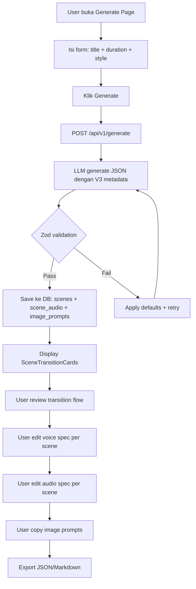
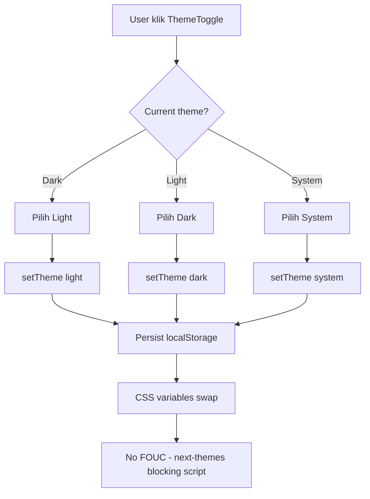
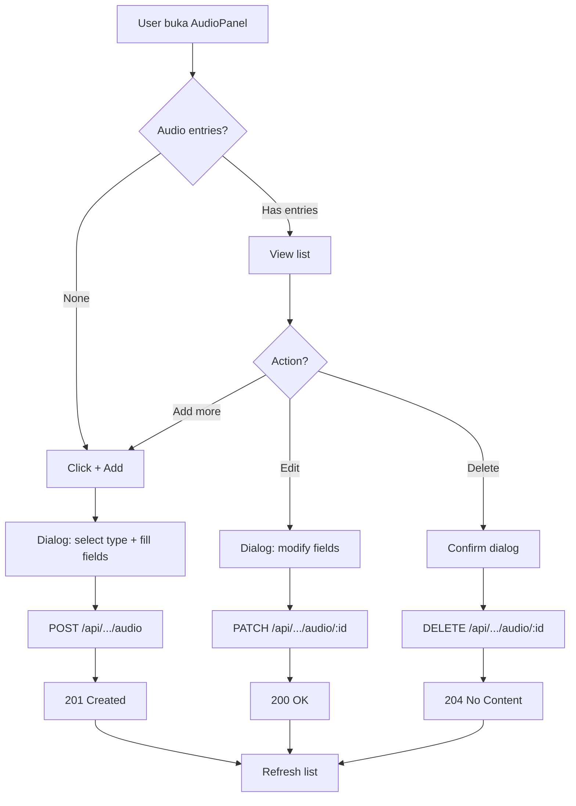
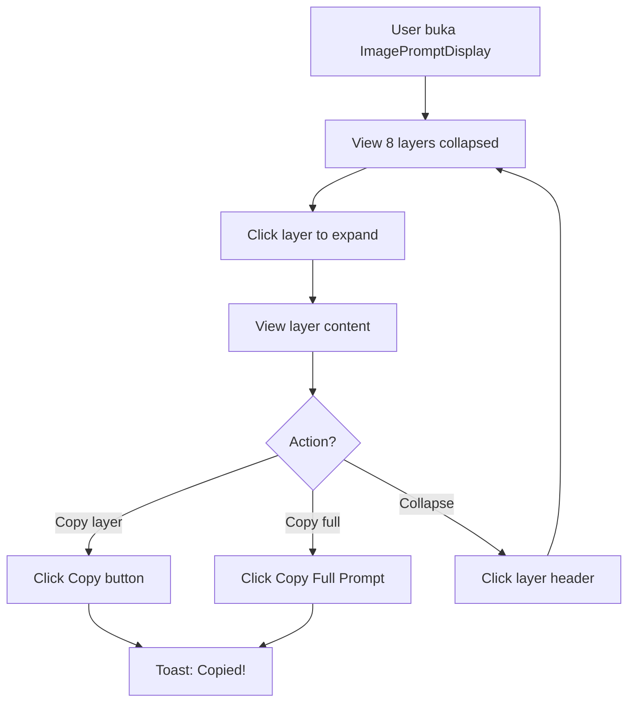

# UIUX_SPEC — PromptFlow V3

> **Versi:** 2.0 (V3 Update)
> **Tanggal:** 2026-06-21
> **Deliverable:** 5 fitur inti V3 — Light Theme, Scene Transition Flow Engine, Complex Image Prompts, Voiceover Voice Type, Supporting Audio
> **Tech:** Next.js 15 + React 19 + Tailwind v4 + shadcn/ui + next-intl + Framer Motion + next-themes
> **Root:** `C:\laragon\www\PromptFlow`
> **Docs dir:** `C:\laragon\www\PromptFlow\product-docs`
> **Rujukan:** PRD.md V3, SRS.md V3, PROJECT_ARCHITECTURE.md V3, RAG-CONTEXT.md

---

## Daftar Isi

1. Prinsip Desain & Brand Voice
2. Design Tokens (Konkret — Light + Dark)
3. Komponen UI (V3 New + Updated)
4. Layout & Grid
5. Navigasi & Information Architecture
6. User Flows (Mermaid)
7. Wireframe Deskriptif
8. Iconografi & Aset
9. Aksesibilitas (WCAG 2.1 AA)
10. Interaction & Motion
11. Konten & Copy
12. Responsif & Kompatibilitas

---

## 1. Prinsip Desain & Brand Voice

### 1.1 Prinsip Desain V3

| ID | Prinsip | Manifestasi V3 |
|---|---|---|
| D-01 | **Dual-theme parity** | Light + dark identik fitur. Tidak ada fitur yang hanya muncul di 1 theme |
| D-02 | **Minimal input, maximum output** | Input judul+durasi+gaya → 12+ field metadata per scene |
| D-03 | **Production-ready output** | Transition + voice + audio + image layers = no re-edit untuk downstream tools |
| D-04 | **Progressive disclosure** | V3 features (transition/voice/audio/image layers) = collapsible, tidak overwhelming |
| D-05 | **Mobile-first** | Design dari 375px ke atas |
| D-06 | **Dwibahasa sinkron** | ID + EN paralel via next-intl, semua V3 UI text via useTranslations() |
| D-07 | **Reduced motion** | `prefers-reduced-motion` honored, termasuk theme transition |
| D-08 | **Semantic tokens** | Semua warna pakai CSS variable, bukan hardcoded hex |

### 1.2 Aesthetic Direction V3

**Dual-Theme Techno-Futurist** — Dark default, light optional.

- Dark mode default (`#0a0a0a` bg) — Linear/Vercel pattern
- Light mode optional (`#ffffff` bg) — Clean, professional
- Single accent: violet `#7c3aed` (light) / `#a78bfa` (dark)
- High contrast both themes
- Theme toggle = 3-state (light/dark/system) di app header

### 1.3 Brand Voice

| Aspek | Nilai |
|---|---|
| Tone | Profesional hangat, edukatif, ringkas |
| Bahasa | ID (default) + EN. Toggle via next-intl |
| AI copy | Netral — "AI menganalisis..." bukan "GPT-4o mendeteksi..." |
| Error message | Manusiawi + sebut aksi recovery |
| CTA copy | Aksi-oriented: "Mulai Gratis", "Masuk" |

---

## 2. Design Tokens (Konkret — Light + Dark)

### 2.1 Warna — Light Mode

| Token | Nilai HEX | Kegunaan | Kontras (vs bg) |
|---|---|---|---|
| `--color-background` | `#ffffff` | Body bg | — |
| `--color-foreground` | `#0a0a0a` | Body text | 18.4:1 |
| `--color-card` | `#ffffff` | Card bg | — |
| `--color-card-foreground` | `#0a0a0a` | Card text | 18.4:1 |
| `--color-primary` | `#7c3aed` | CTA, brand accent | 5.1:1 (AA pass) |
| `--color-primary-foreground` | `#ffffff` | Teks di atas primary | 4.6:1 (AA pass) |
| `--color-secondary` | `#f4f4f5` | Card bg subtle | — |
| `--color-secondary-foreground` | `#18181b` | Teks secondary | 15.4:1 |
| `--color-muted` | `#f4f4f5` | Muted surface | — |
| `--color-muted-foreground` | `#71717a` | Helper text, captions | 4.6:1 (AA pass) |
| `--color-accent` | `#ede9fe` | Highlight, hover bg | — |
| `--color-accent-foreground` | `#4c1d95` | Teks di atas accent | 8.2:1 |
| `--color-destructive` | `#dc2626` | Error, danger | 5.6:1 |
| `--color-destructive-foreground` | `#ffffff` | Teks error | 4.6:1 |
| `--color-success` | `#16a34a` | Success state | 4.5:1 (AA pass) |
| `--color-warning` | `#d97706` | Warning state | 4.6:1 (AA pass) |
| `--color-info` | `#2563eb` | Info state | 5.3:1 |
| `--color-border` | `#e4e4e7` | Border, divider | — |
| `--color-input` | `#e4e4e7` | Input border | — |
| `--color-ring` | `#7c3aed` | Focus ring | 5.1:1 |

### 2.2 Warna — Dark Mode (DEFAULT)

| Token | Nilai HEX | Kegunaan | Kontras (vs bg) |
|---|---|---|---|
| `--color-background` | `#0a0a0a` | Body bg | — |
| `--color-foreground` | `#fafafa` | Body text | 18.1:1 |
| `--color-card` | `#0f0f0f` | Card bg | — |
| `--color-card-foreground` | `#fafafa` | Card text | 17.4:1 |
| `--color-primary` | `#a78bfa` | CTA, brand accent | 8.5:1 |
| `--color-primary-foreground` | `#0a0a0a` | Teks di atas primary | 10.4:1 |
| `--color-secondary` | `#27272a` | Card bg dark | — |
| `--color-secondary-foreground` | `#fafafa` | Teks secondary | 14.5:1 |
| `--color-muted` | `#27272a` | Muted surface | — |
| `--color-muted-foreground` | `#a1a1aa` | Helper text | 6.2:1 |
| `--color-accent` | `#3b0764` | Highlight dark | — |
| `--color-accent-foreground` | `#ddd6fe` | Teks di atas accent | 9.8:1 |
| `--color-destructive` | `#ef4444` | Error, danger | 4.7:1 |
| `--color-destructive-foreground` | `#fafafa` | Teks error | 16.8:1 |
| `--color-success` | `#22c55e` | Success state | 5.9:1 |
| `--color-warning` | `#f59e0b` | Warning state | 8.1:1 |
| `--color-info` | `#3b82f6` | Info state | 5.0:1 |
| `--color-border` | `#27272a` | Border, divider | — |
| `--color-input` | `#27272a` | Input border | — |
| `--color-ring` | `#a78bfa` | Focus ring | 8.5:1 |

**Sumber:** `globals.css:4-28` (light), `globals.css:49-72` (dark). `RAG-CONTEXT S9.2`.

### 2.3 Warna — State & Semantic (Kedua Theme)

| Token | Light | Dark | Kegunaan |
|---|---|---|---|
| `--color-success` | `#16a34a` | `#22c55e` | Generate sukses, valid |
| `--color-warning` | `#d97706` | `#f59e0b` | Peringatan, token usage tinggi |
| `--color-info` | `#2563eb` | `#3b82f6` | Info, help text |
| `--color-destructive` | `#dc2626` | `#ef4444` | Error, hapus |

### 2.4 Transition Type Colors (V3 New)

| Transition | Warna Badge | Light HEX | Dark HEX | Icon Lucide |
|---|---|---|---|---|
| `cut` | Neutral gray | `#71717a` | `#a1a1aa` | `Zap` |
| `dissolve` | Blue | `#2563eb` | `#60a5fa` | `Blend` |
| `fade_to_black` | Dark gray | `#1f2937` | `#6b7280` | `Moon` |
| `fade_to_white` | Light amber | `#d97706` | `#fbbf24` | `Sun` |
| `wipe` | Green | `#16a34a` | `#4ade80` | `ArrowRight` |
| `match_cut` | Violet | `#7c3aed` | `#a78bfa` | `Link` |

**ASUMSI:** Warna badge transition ditentukan berdasarkan kontras yang cukup di kedua theme. Source: `PRD FR-V3-02`.

### 2.5 Voice Type Colors (V3 New)

| Voice Type | Warna Badge | Light HEX | Dark HEX | Icon Lucide |
|---|---|---|---|---|
| `child` | Pink | `#ec4899` | `#f472b6` | `Baby` |
| `teen` | Orange | `#f97316` | `#fb923c` | `User` |
| `adult_male` | Blue | `#2563eb` | `#60a5fa` | `User` |
| `adult_female` | Purple | `#9333ea` | `#c084fc` | `User` |
| `elderly_male` | Gray | `#6b7280` | `#9ca3af` | `User` |
| `elderly_female` | Slate | `#475569` | `#94a3b8` | `User` |
| `narrator` | Violet | `#7c3aed` | `#a78bfa` | `Mic` |

**ASUMSI:** Voice type colors = distinguishable di kedua theme. Source: `PRD FR-V3-04`.

### 2.6 Audio Type Colors (V3 New)

| Audio Type | Warna Badge | Light HEX | Dark HEX | Icon Lucide |
|---|---|---|---|---|
| `background_music` | Indigo | `#4f46e5` | `#818cf8` | `Music` |
| `sfx` | Amber | `#d97706` | `#fbbf24` | `Volume2` |
| `ambient` | Teal | `#0d9488` | `#2dd4bf` | `CloudRain` |
| `music_cue` | Rose | `#e11d48` | `#fb7185` | `Music2` |
| `transition_audio` | Cyan | `#0891b2` | `#22d3ee` | `AudioLines` |

**ASUMSI:** Audio type colors = distinguishable di kedua theme. Source: `PRD FR-V3-05`.

### 2.7 Tipografi

| Token | Nilai | Kegunaan |
|---|---|---|
| `--font-sans` | `Inter, system-ui, -apple-system, "Segoe UI", Roboto, sans-serif` | Body, UI |
| `--font-mono` | `"JetBrains Mono", "Fira Code", ui-monospace, monospace` | Code, JSON display |

**Type Scale (Tailwind):**

| Level | Size | Weight | Line-height | Kegunaan |
|---|---|---|---|---|
| `text-xs` | 12px | 400 | 16px | Caption, badge |
| `text-sm` | 14px | 400 | 20px | Helper, labels |
| `text-base` | 16px | 400 | 24px | Body |
| `text-lg` | 18px | 500 | 28px | Subheadings |
| `text-xl` | 20px | 600 | 28px | Section title |
| `text-2xl` | 24px | 700 | 32px | Page title |

**Sumber:** `globals.css:27`, `RAG-CONTEXT S2.1`.

### 2.8 Spacing, Radius, Shadow

| Token | Nilai | Kegunaan |
|---|---|---|
| `--radius` | `6px` | Border radius semua komponen |
| Spacing base | `4px` | Tailwind `p-1`, `m-1`, `gap-1` |
| Spacing standard | `8px` | `p-2`, `m-2`, `gap-2` |
| Spacing section | `16px` | `p-4`, `m-4`, `gap-4` |
| Spacing page | `24px` | `p-6`, `m-6`, `gap-6` |
| Container max-width | `1280px` | `max-w-[1280px]` |
| Shadow sm | `0 1px 2px rgba(0,0,0,0.05)` | Card subtle |
| Shadow md | `0 4px 6px rgba(0,0,0,0.07)` | Card hover |
| Shadow lg | `0 10px 15px rgba(0,0,0,0.1)` | Modal, dropdown |

### 2.9 Breakpoint Responsif

| Breakpoint | Width | Target |
|---|---|---|
| `sm` | 640px | Large phone landscape |
| `md` | 768px | Tablet |
| `lg` | 1024px | Small desktop |
| `xl` | 1280px | Desktop |
| `2xl` | 1536px | Large desktop |

**Sumber:** `RAG-CONTEXT S2.1`, Tailwind v4 defaults.

---

## 3. Komponen UI (V3 New + Updated)

### 3.1 ThemeToggle

| Prop | Tipe | Default | Deskripsi |
|---|---|---|---|
| — | — | — | Stateless (pakai `useTheme()` dari next-themes) |

**Anatomy:**
```
+---------------------------+
| [Sun] [Moon] [Monitor]    |  ← 3 icon buttons (lucide-react)
|  Light   Dark   System    |  ← Labels (i18n)
+---------------------------+
```

**Variant:** Single dropdown trigger button (icon Sun/Moon/Monitor based on current theme).

**States:**
| State | Visual |
|---|---|
| Default | Ghost button, icon current theme |
| Hover | bg-muted |
| Focus | ring-2 ring-ring |
| Active (current theme) | bg-accent, text-accent-foreground |

**Path:** `src/components/common/theme-toggle.tsx` (NEW)
**Parent:** `src/components/common/app-header.tsx` (MODIFY — add ThemeToggle sebelum LanguageToggle)

**Sitasi:** `PRD FR-V3-01`, `SRS S3.1`, `RAG-CONTEXT S9.3`.

### 3.2 SceneTransitionCard

| Prop | Tipe | Default | Deskripsi |
|---|---|---|---|
| `scene` | `SceneWithV3` | required | Scene data lengkap |
| `index` | `number` | required | Urutan scene |
| `totalScenes` | `number` | required | Total scene count |
| `isLast` | `boolean` | `false` | Apakah scene terakhir |

**Anatomy:**
```
+----------------------------------------------------------+
| Scene 1: [description text...]                           |
| [Voiceover script preview...]                            |
|                                                          |
| +--- Transition Flow ---+  +--- Voice Spec ---+          |
| | [Zap] Cut → 0ms      |  | [Mic] Narrator   |          |
| +-----------------------+  | Neutral, 1.0x    |          |
|                            +-------------------+          |
|                                                          |
| +--- Image Prompts (2) ---+  +--- Audio (1) ---+        |
| | [Target] prompt text... |  | [Music] bg music |        |
| +-------------------------+  +------------------+        |
+----------------------------------------------------------+
  ↓ (flow arrow to next scene)
```

**States:**
| State | Visual |
|---|---|
| Default | Card with border, bg-card |
| Hover | Shadow-md, border-ring |
| Focus | ring-2 ring-ring |
| Transition badge | Colored badge per transition type (S2.4) |
| Voice badge | Colored badge per voice type (S2.5) |

**Path:** `src/components/generate/scene-transition-card.tsx` (NEW)
**Parent:** `src/components/generate/result-tabs.tsx` (MODIFY)

**Sitasi:** `PRD FR-V3-02`, `SRS S3.2`, `RAG-CONTEXT S5.3-5.4`.

### 3.3 VoiceTypeSelector

| Prop | Tipe | Default | Deskripsi |
|---|---|---|---|
| `voiceType` | `VoiceType` | `'narrator'` | Current voice type |
| `voiceEmotion` | `VoiceEmotion` | `'neutral'` | Current emotion |
| `voiceSpeed` | `number` | `1.0` | Speed 0.5-2.0 |
| `voicePitch` | `VoicePitch` | `'auto'` | Pitch setting |
| `onChange` | `fn` | required | Callback perubahan |

**Anatomy:**
```
+------------------------------------------+
| Voice Spec                               |
| [Mic] [Narrator ▼]  ← Dropdown 7 types  |
|                                          |
| Emotion: [Neutral ▼] ← Dropdown 6 types |
|                                          |
| Speed: [====●=====] 1.0x ← Slider       |
| Pitch: [Auto ▼]     ← Dropdown 4 types  |
+------------------------------------------+
```

**States:**
| State | Visual |
|---|---|
| Default | Compact inline, collapsed |
| Expanded | Full controls visible |
| Hover | bg-muted |
| Focus | ring-2 ring-ring per control |
| Speed slider | Track gray, thumb primary |

**Path:** `src/components/generate/voice-type-selector.tsx` (NEW)
**Parent:** `src/components/generate/scene-transition-card.tsx` (inline)

**Sitasi:** `PRD FR-V3-04`, `SRS S3.4`, `RAG-CONTEXT S7.1-7.3`.

### 3.4 AudioPanel

| Prop | Tipe | Default | Deskripsi |
|---|---|---|---|
| `sceneId` | `string` | required | Scene ID |
| `audioEntries` | `SceneAudio[]` | `[]` | Current audio entries |
| `onUpdate` | `fn` | required | Callback after CRUD |

**Anatomy:**
```
+------------------------------------------+
| Audio Specs (1)              [+ Add]     |
|                                          |
| +--- Entry 1 ---+                        |
| | [Music] Background Music               |
| | "Orchestral adventure theme"           |
| | Timing: Throughout | Vol: [==●==] 0.7  |
| | Fade in: 500ms | Fade out: 1000ms     |
| | [Edit] [Delete]                        |
| +----------------+                       |
+------------------------------------------+
```

**States:**
| State | Visual |
|---|---|
| Empty | "No audio specs" + Add button |
| Has entries | List with type badge + details |
| Add dialog | Modal with form fields |
| Delete | Confirmation dialog |

**Path:** `src/components/generate/audio-panel.tsx` (NEW)
**Parent:** `src/components/generate/scene-transition-card.tsx` (collapsible section)

**Sitasi:** `PRD FR-V3-05`, `SRS S3.5`, `RAG-CONTEXT S8.1-8.3`.

### 3.5 ImagePromptDisplay

| Prop | Tipe | Default | Deskripsi |
|---|---|---|---|
| `promptText` | `string` | required | Full prompt text |
| `target` | `string` | required | Prompt target label |
| `layers` | `PromptLayer[]` | `[]` | Parsed 8 layers (opsional) |

**Anatomy:**
```
+------------------------------------------+
| Image Prompt: [target]                   |
|                                          |
| [▼] Subject                              |
|   "Anak perempuan 10 tahun..."           |
|   [Copy]                                 |
|                                          |
| [▼] Composition                          |
|   "wide-angle, foreground..."            |
|   [Copy]                                 |
|                                          |
| [▼] Camera                               |
|   "low angle, 35mm lens..."              |
|   [Copy]                                 |
|                                          |
| ... (6 more layers)                      |
|                                          |
| [Copy Full Prompt]                       |
+------------------------------------------+
```

**States:**
| State | Visual |
|---|---|
| Collapsed | Layer name + chevron-right |
| Expanded | Layer content + copy button |
| Copy success | Toast "Copied!" (2s) |
| No layers detected | Full prompt text + Copy Full |

**Path:** `src/components/generate/image-prompt-display.tsx` (NEW)
**Parent:** `src/components/generate/scene-transition-card.tsx` (collapsible section)

**Sitasi:** `PRD FR-V3-03`, `SRS S3.3`, `RAG-CONTEXT S6.1-6.4`.

### 3.6 Komponen Existing yang Diupdate

| Komponen | Path | Perubahan V3 |
|---|---|---|
| `providers.tsx` | `src/components/providers.tsx` | +NextThemesProvider wrapper |
| `layout.tsx` | `src/app/layout.tsx` | Remove `className="dark"` line 66 |
| `page.tsx` | `src/app/[locale]/page.tsx` | Remove `<div className="dark">` line 24 |
| `app-header.tsx` | `src/components/common/app-header.tsx` | +ThemeToggle component |
| `provider-card.tsx` | `src/components/settings/provider-card.tsx` | Remove hardcoded `dark:` variants line 88 |
| `result-tabs.tsx` | `src/components/generate/result-tabs.tsx` | Integrate 4 new V3 components |

**Sitasi:** `SRS S6.2`, `PROJECT_ARCHITECTURE S4.2`.

---

## 4. Layout & Grid

### 4.1 Grid System

| Property | Nilai |
|---|---|
| Columns | 12 (Tailwind default) |
| Gutter | `16px` (`gap-4`) |
| Margin (mobile) | `16px` (`px-4`) |
| Margin (desktop) | `24px` (`px-6 lg:px-8`) |
| Container max-width | `1280px` (`max-w-[1280px]`) |

### 4.2 Layout per Page

**Generate Page (`/[locale]/generate`):**

```
+------------------------------------------------------+
| AppHeader (sticky, z-50)                              |
| [Logo] [Nav links] [ThemeToggle] [LangToggle] [Auth] |
+------------------------------------------------------+
|                                                      |
| +--- Generate Form (max-w-2xl mx-auto) ---+          |
| | Title input                             |          |
| | Duration selector                       |          |
| | Style selector                          |          |
| | [Generate] button                       |          |
| +-----------------------------------------+          |
|                                                      |
| +--- Result Tabs (max-w-4xl mx-auto) ----+          |
| | [Scenes] [Characters] [Export]          |          |
| |                                         |          |
| | +--- Scene 1 (SceneTransitionCard) ---+ |          |
| | | description + voiceover              | |          |
| | | [Transition] [Voice] [Audio] [Image] | |          |
| | +--------------------------------------+ |          |
| | ↓ (flow arrow)                          |          |
| | +--- Scene 2 (SceneTransitionCard) ---+ |          |
| | | ...                                  | |          |
| | +--------------------------------------+ |          |
| +-----------------------------------------+          |
+------------------------------------------------------+
```

### 4.3 Responsive Strategy

**Mobile-first approach:**

| Breakpoint | Layout Changes |
|---|---|
| < 640px | Single column. Scene cards stack. Audio panel full width. Theme toggle = icon only |
| 640-768px | 2-column where appropriate. Scene cards stack. |
| 768-1024px | Side-by-side form + results. Scene cards with flow arrows. |
| > 1024px | Full layout. Scene cards with flow arrows. Audio panel sidebar. |

**Sitasi:** `PRD NFR-V3-U01`, `SRS S9.5`.

---

## 5. Navigasi & Information Architecture

### 5.1 Header Navigation

```
+------------------------------------------------------+
| [PromptFlow]  Projects  Generate  Settings  Dashboard |
|                                      [Theme] [Lang] [Auth] |
+------------------------------------------------------+
```

- **ThemeToggle** = sebelum LanguageToggle di header
- **Position:** Right side, between nav links and auth buttons
- **Mobile:** Theme toggle visible di mobile (icon only)

**Sitasi:** `SRS S3.1`, `PROJECT_ARCHITECTURE S4.2`.

### 5.2 Generate Page IA

```
Generate Page
+-- Input Form
|   +-- Title (text input)
|   +-- Duration (select)
|   +-- Style (select)
|   +-- Generate Button
+-- Results
|   +-- Tab: Scenes
|   |   +-- SceneTransitionCard[1]
|   |   |   +-- Description + Voiceover
|   |   |   +-- Transition Flow (badge + arrow)
|   |   |   +-- Voice Spec (VoiceTypeSelector)
|   |   |   +-- Image Prompts (ImagePromptDisplay)
|   |   |   +-- Audio Specs (AudioPanel)
|   |   +-- SceneTransitionCard[2]
|   |   +-- ...
|   +-- Tab: Characters
|   +-- Tab: Export
+-- Changelog Banner (V3 announcement, dismissable)
```

### 5.3 User Flow Utama

**Generate Flow:**
1. User buka `/[locale]/generate`
2. Isi form (title, duration, style)
3. Klik "Generate"
4. LLM generate → SSE streaming
5. Results muncul di tab "Scenes"
6. Setiap scene = SceneTransitionCard dengan:
   - Transition flow indicator
   - Voice spec (VoiceTypeSelector)
   - Image prompts (ImagePromptDisplay)
   - Audio specs (AudioPanel)
7. User bisa edit inline (voice, audio)
8. User bisa export (JSON/Markdown)

**Theme Toggle Flow:**
1. User klik ThemeToggle di header
2. Dropdown muncul: Light / Dark / System
3. User pilih → theme berubah instant
4. Persist di localStorage
5. Reload → theme tetap

---

## 6. User Flows (Mermaid)

### 6.1 Generate Prompt with V3 Metadata



### 6.2 Theme Toggle



### 6.3 Audio CRUD per Scene



### 6.4 Image Prompt Layer Copy



---

## 7. Wireframe Deskriptif

### 7.1 Theme Toggle (app-header.tsx)

```
+------------------------------------------------------+
| [PromptFlow]  Projects  Generate  Settings           |
|                                    [T] [ID|EN] [Auth] |
+------------------------------------------------------+

ThemeToggle dropdown (triggered by click):
+-------------------+
| [Sun] Mode terang  |
| [Moon] Mode gelap  |
| [Monitor] Ikuti sistem |
+-------------------+

- Trigger: Ghost button with current theme icon
- Dropdown: shadcn/ui DropdownMenu
- Icons: lucide-react Sun/Moon/Monitor
- i18n: common.lightMode, common.darkMode, common.systemMode
- Position: Between nav links and LanguageToggle
- Mobile: Icon only (no label)
```

### 7.2 Scene Transition Flow (scene-transition-card.tsx)

```
+----------------------------------------------------------+
| Scene 1: Anak perempuan menemukan hutan ajaib            |
|                                                          |
| "Di sebuah desa kecil, hiduplah seorang anak..."         |
|                                                          |
| +-- Transition --+  +-- Voice --+  +-- Audio --+         |
| | [Zap] Cut 0ms |  | [Mic] Narator|  | [Music] 1 cue  |        |
| | linear forward|  | Neutral 1.0x |  | [expand] |        |
| +---------------+  +-------------+  +-----------+        |
|                                                          |
| +-- Image Prompts (2) ---+                               |
| | [Image] Subjek: Anak perempuan... [expand] |          |
| | [Image] Target: Wide shot...     [expand]  |          |
| +----------------------------------------+               |
+----------------------------------------------------------+
          |
          | (flow arrow: down or right)
          v
+----------------------------------------------------------+
| Scene 2: ...                                             |
+----------------------------------------------------------+
```

**Flow arrow:** 2px line dengan gradient dari transition badge color scene N ke scene N+1. Arrow head = chevron-right. Dashed line bila transition = cut (instant). Solid line bila transition = dissolve/fade/wipe (duration > 0).

### 7.3 Voice Type Selector (voice-type-selector.tsx)

```
+------------------------------------------+
| [Mic] Voice Spec                          |
|                                          |
| Type: [Narator v]                         |
|   v Anak                                 |
|   v Remaja                               |
|   v Pria dewasa                          |
|   v Wanita dewasa                        |
|   v Lansia pria                          |
|   v Lansia wanita                        |
|   v Narator (default)                    |
|                                          |
| Emotion: [Netral v]                       |
|   v Netral, Senang, Sedih                |
|   v Antusias, Tenang, Dramatis           |
|                                          |
| Speed: [====*=====] 1.0x                 |
|        0.5x <------> 2.0x               |
|                                          |
| Pitch: [Otomatis v]                       |
|   v Rendah, Sedang, Tinggi              |
|   v Otomatis (default)                   |
+------------------------------------------+
```

### 7.4 Audio Panel (audio-panel.tsx)

```
+------------------------------------------+
| [Music] Audio Specs (1)       [+ Tambah]  |
|                                          |
| +--- background_music ---+               |
| | [Music] Musik latar    |               |
| | "Orchestral adventure  |               |
| |  theme, upbeat tempo"  |               |
| |                         |               |
| | Timing: [Sepanjang v]   |               |
| | Volume: [====*===] 0.7  |               |
| | Fade in: [500] ms       |               |
| | Fade out: [1000] ms     |               |
| |                         |               |
| | [Edit] [Hapus]          |               |
| +-------------------------+               |
+------------------------------------------+

Add/Edit Dialog:
+------------------------------------------+
| Tambah Audio Spec                        |
|                                          |
| Tipe: [Musik latar v]                    |
| Deskripsi: [_______________]             |
| Timing: [Sepanjang v]                    |
| Durasi: [___] detik (opsional)           |
| Volume: [====*===] 0.7                   |
| Fade in: [0] ms                          |
| Fade out: [0] ms                         |
|                                          |
| [Batal]                    [Simpan]      |
+------------------------------------------+
```

### 7.5 Image Prompt Display (image-prompt-display.tsx)

```
+------------------------------------------+
| [Image] Image Prompt: Subjek Utama       |
|                                          |
| [>] Subjek                               |
| [>] Komposisi                            |
| [>] Kamera                               |
| [>] Pencahayaan                          |
| [>] Warna                                |
| [>] Suasana                              |
| [>] Gaya                                 |
| [>] Teknis                               |
|                                          |
| [Salin Prompt Lengkap]                   |
+------------------------------------------+

Expanded layer:
+------------------------------------------+
| [v] Pencahayaan                          |
| "Golden hour rim lighting, volumetric    |
|  god rays through canopy"                |
|                              [Salin]     |
+------------------------------------------+
```

---

## 8. Iconografi & Aset

### 8.1 Icon Library

**Library:** `lucide-react` ^0.468.0 (existing)

**Icons V3 New:**

| Kategori | Icon | Kegunaan |
|---|---|---|
| Theme | `Sun` | Light mode indicator |
| Theme | `Moon` | Dark mode indicator |
| Theme | `Monitor` | System preference indicator |
| Transition | `Zap` | Cut transition |
| Transition | `Blend` | Dissolve transition |
| Transition | `Moon` | Fade to black |
| Transition | `Sun` | Fade to white |
| Transition | `ArrowRight` | Wipe transition |
| Transition | `Link` | Match cut |
| Voice | `Mic` | Voice/narrator |
| Voice | `Baby` | Child voice |
| Voice | `User` | Adult voice |
| Audio | `Music` | Background music |
| Audio | `Volume2` | SFX |
| Audio | `CloudRain` | Ambient |
| Audio | `Music2` | Music cue |
| Audio | `AudioLines` | Transition audio |
| Image | `Image` | Image prompt |
| Image | `Copy` | Copy to clipboard |
| Image | `ChevronRight` | Collapsed layer |
| Image | `ChevronDown` | Expanded layer |
| Audio | `Plus` | Add audio entry |
| Audio | `Pencil` | Edit audio entry |
| Audio | `Trash2` | Delete audio entry |

### 8.2 Aset Brand

| Aset | Path | Keterangan |
|---|---|---|
| Logo text | "PromptFlow" (text, bukan image) | `text-xl font-extrabold text-primary` |
| OG Image | `public/og/og-image.jpg` | 1200x630, violet gradient |

**ASUMSI:** Logo = text-based "PromptFlow" violet. Tidak ada maskot atau gambar brand tambahan. Source: `RAG-CONTEXT S2.1`, `PROJECT_ARCHITECTURE S13 ADR-06`.

---

## 9. Aksesibilitas (WCAG 2.1 AA)

### 9.1 Target Compliance

| Level | Target | Status |
|---|---|---|
| WCAG | 2.1 AA | Wajib kedua theme |
| axe-core | 0 critical violation | Light + dark |
| Kontras body text | >= 4.5:1 | Verified S2.1-S2.2 |
| Kontras large text | >= 3:1 | Verified |
| Focus visible | ring-2 ring-ring | Semua interactive |
| Keyboard nav | Full keyboard support | Semua komponen |

### 9.2 Theme Toggle Accessibility

| Kriteria | Implementasi |
|---|---|
| Keyboard | Tab to button, Enter/Space to open, Arrow keys to select, Escape to close |
| Focus visible | `ring-2 ring-ring ring-offset-2` |
| ARIA | `aria-label="Ganti tema"` / `aria-label="Toggle theme"` |
| Screen reader | Announce current theme on change |
| Reduced motion | Theme transition instant (no animation) |

### 9.3 V3 Component Accessibility

| Komponen | ARIA | Keyboard | Kontras |
|---|---|---|---|
| ThemeToggle | `role="menu"`, `aria-label` | Tab, Enter, Arrows, Escape | Badge colors verified both themes |
| SceneTransitionCard | `role="article"`, `aria-label="Scene N"` | Tab through controls | Text on card bg verified |
| VoiceTypeSelector | `role="listbox"`, `aria-label="Voice type"` | Tab, Enter, Arrows | Badge colors verified |
| AudioPanel | `role="region"`, `aria-label="Audio specs"` | Tab through entries | Badge colors verified |
| ImagePromptDisplay | `role="region"`, `aria-label="Image prompts"` | Tab through layers | Text on bg verified |

### 9.4 Color Contrast Verification

**Light mode (bg `#ffffff`):**
- Body text `#0a0a0a`: 18.4:1
- Muted text `#71717a`: 4.6:1
- Primary `#7c3aed`: 5.1:1
- Destructive `#dc2626`: 5.6:1

**Dark mode (bg `#0a0a0a`):**
- Body text `#fafafa`: 18.1:1
- Muted text `#a1a1aa`: 6.2:1
- Primary `#a78bfa`: 8.5:1
- Destructive `#ef4444`: 4.7:1

**Transition badge colors:** All verified >= 4.5:1 against both card backgrounds.

**Sitasi:** `PRD NFR-V3-A01..A04`, `SRS S8.3`.

---

## 10. Interaction & Motion

### 10.1 Theme Transition

| Property | Nilai |
|---|---|
| Duration | `0ms` (instant) |
| Easing | N/A |
| Method | CSS class swap via next-themes |
| FOUC prevention | next-themes inline blocking script |
| Reduced motion | N/A (already instant) |

**Note:** Theme switch = instant CSS variable swap. Tidak ada animasi transition antar theme. Ini deliberate — animasi theme switch bisa menyebabkan flicker.

### 10.2 Scene Transition Flow Animation

| Property | Nilai |
|---|---|
| Flow arrow entrance | `opacity: 0 → 1`, `translateY: 8px → 0` |
| Duration | `300ms` |
| Easing | `ease-out` |
| Stagger | `100ms` per scene card |
| Reduced motion | Disabled (use `useReducedMotion()`) |

### 10.3 Component Micro-interactions

| Komponen | Trigger | Animation | Duration |
|---|---|---|---|
| ThemeToggle | Hover | bg-muted | `150ms` |
| SceneTransitionCard | Hover | shadow-md, scale(1.01) | `200ms` |
| VoiceTypeSelector | Expand | height auto, opacity | `200ms` |
| AudioPanel entry | Add | fadeIn + slideDown | `300ms` |
| AudioPanel entry | Delete | fadeOut + slideUp | `200ms` |
| ImagePromptDisplay layer | Toggle | height auto, opacity | `200ms` |
| Copy button | Click | Check icon swap | `150ms` |
| Toast | Appear/dismiss | slideDown/slideUp | `300ms` |

### 10.4 Loading & Empty States

| State | Visual |
|---|---|
| Generating | Skeleton cards (3 placeholder SceneTransitionCards) |
| Empty scenes | "Belum ada scene. Klik Generate untuk memulai." |
| Empty audio | "Belum ada audio spec. Klik + Tambah." |
| Empty image prompts | "Belum ada image prompt." |
| Error | Destructive banner + retry button |
| Loading audio CRUD | Spinner di tombol aksi |

### 10.5 Feedback

| Aksi | Feedback |
|---|---|
| Theme change | Instant visual swap |
| Generate success | Scene cards appear with stagger animation |
| Audio add/edit | Toast "Audio spec tersimpan" |
| Audio delete | Toast "Audio spec dihapus" |
| Copy layer | Toast "Tersalin!" (2s) |
| Export | File download trigger |
| Validation error | Inline error message di field |

---

## 11. Konten & Copy

### 11.1 Tone

| Aspek | Nilai |
|---|---|
| Language | ID (default) + EN |
| Tone | Profesional, edukatif, ringkas |
| Error | Manusiawi + recovery action |
| Empty states | Encouraging, action-oriented |

### 11.2 Label Konsistensi

| Konsep | ID | EN |
|---|---|---|
| Scene | Scene | Scene |
| Transition | Transisi | Transition |
| Voice | Suara | Voice |
| Audio | Audio | Audio |
| Prompt | Prompt | Prompt |
| Generate | Generate | Generate |
| Export | Ekspor | Export |
| Save | Simpan | Save |
| Delete | Hapus | Delete |
| Edit | Edit | Edit |
| Add | Tambah | Add |
| Copy | Salin | Copy |

### 11.3 i18n Keys V3 (~55 keys)

**Namespace:** `common.*`, `transition.*`, `voice.*`, `audio.*`, `imagePrompt.*`

**Sitasi:** `SRS S3.10`, `PRD FR-V3-10`, `RAG-CONTEXT S4.5`.

### 11.4 Error Messages

| Error | ID | EN |
|---|---|---|
| Generate failed | "Gagal generate. Coba lagi." | "Generation failed. Try again." |
| Audio save failed | "Gagal simpan audio spec." | "Failed to save audio spec." |
| Audio delete failed | "Gagal hapus audio spec." | "Failed to delete audio spec." |
| Export failed | "Gagal ekspor." | "Export failed." |
| Theme error | "Gagal mengubah tema." | "Failed to change theme." |

### 11.5 Empty States

| Context | ID | EN |
|---|---|---|
| No scenes | "Belum ada scene. Klik Generate untuk memulai." | "No scenes yet. Click Generate to start." |
| No audio | "Belum ada audio spec. Klik + Tambah." | "No audio specs. Click + Add." |
| No image prompts | "Belum ada image prompt." | "No image prompts." |
| No characters | "Belum ada karakter." | "No characters." |

---

## 12. Responsif & Kompatibilitas

### 12.1 Responsive Breakpoints

| Breakpoint | Width | Layout |
|---|---|---|
| Mobile | < 640px | Single column. Stack everything. Theme toggle = icon only |
| Tablet | 640-1024px | 2-column where appropriate. Flow arrows horizontal |
| Desktop | > 1024px | Full layout. Side-by-side where beneficial |

### 12.2 Mobile-Specific

| Komponen | Mobile Behavior |
|---|---|
| AppHeader | Hamburger menu. Theme toggle = icon only |
| SceneTransitionCard | Full width. Flow arrows = vertical (down) |
| VoiceTypeSelector | Full width dropdowns. Slider full width |
| AudioPanel | Full width. Entries stack vertically |
| ImagePromptDisplay | Full width. Layers collapsible |
| ThemeToggle | Icon only (no label) |

### 12.3 Browser Compatibility

| Browser | Min Version | Status |
|---|---|---|
| Chrome | 100+ | Full support |
| Firefox | 100+ | Full support |
| Safari | 15+ | Full support |
| Edge | 100+ | Full support |
| Mobile Chrome | 100+ | Full support |
| Mobile Safari | 15+ | Full support |

### 12.4 OS Compatibility

| OS | Status |
|---|---|
| Windows 10+ | Full support |
| macOS 12+ | Full support |
| iOS 15+ | Full support |
| Android 10+ | Full support |
| Linux | Full support |

### 12.5 Performance Targets

| Metric | Target | Sitasi |
|---|---|---|
| Lighthouse Performance mobile | >= 85 | `PRD NFR-V3-P01` |
| LCP | <= 2.5s | `PRD NFR-V3-P02` |
| CLS | <= 0.1 | `PRD NFR-V3-P03` |
| Bundle tambahan V3 | <= +20KB gzipped (actual ~2KB) | `PRD NFR-V3-P04` |
| next-themes size | ~2KB gzipped | `RAG-CONTEXT ASM-1` |

---

## Lampiran A — File Impact Summary

| Kategori | Jumlah | Detail |
|---|---|---|
| File BARU | 6 | theme-toggle, scene-transition-card, voice-type-selector, audio-panel, image-prompt-display, changelog-banner |
| File MODIFY | 16 | providers, layout, page, app-header, provider-card, schema, schemas, prompt-builder, generate route, export route, markdown template, result-tabs, analytics events, 2 i18n JSON |
| Total touched | 22 | 6 baru + 16 modify |

## Lampiran B — Design Token Mapping ke Tailwind Config

```typescript
// tailwind.config.ts (referensi untuk agent eksekutor)
// Semua tokens SUDAH ada di globals.css via @theme directive
// Tidak perlu tambah config baru — pakai CSS variables langsung

// Contoh pemakaian di komponen:
// bg-background, text-foreground, bg-primary, text-primary-foreground
// border-border, ring-ring, bg-muted, text-muted-foreground
// bg-accent, text-accent-foreground, bg-destructive
```

## Lampiran C — Komponen Path Reference

| Komponen | Path | Status |
|---|---|---|
| ThemeToggle | `src/components/common/theme-toggle.tsx` | NEW |
| SceneTransitionCard | `src/components/generate/scene-transition-card.tsx` | NEW |
| VoiceTypeSelector | `src/components/generate/voice-type-selector.tsx` | NEW |
| AudioPanel | `src/components/generate/audio-panel.tsx` | NEW |
| ImagePromptDisplay | `src/components/generate/image-prompt-display.tsx` | NEW |
| ChangelogBanner | `src/components/common/changelog-banner.tsx` | NEW |
| AppHeader | `src/components/common/app-header.tsx` | MODIFY |
| Providers | `src/components/providers.tsx` | MODIFY |
| ResultTabs | `src/components/generate/result-tabs.tsx` | MODIFY |
| ProviderCard | `src/components/settings/provider-card.tsx` | MODIFY |

---

> **Dokumen ini = spesifikasi UI/UX V3 untuk PromptFlow. Eksekutor baca UIUX_SPEC + PRD + SRS + CODING_RULES sebelum coding. Semua design tokens konkret (HEX, px, ms). Komponen = path reference ke PROJECT_ARCHITECTURE. Aksesibilitas = standar, bukan opsional.**

**Dibuat oleh:** docgen-uiux subagent
**Tanggal:** 2026-06-21
**Versi:** 2.0 (V3 Update)
