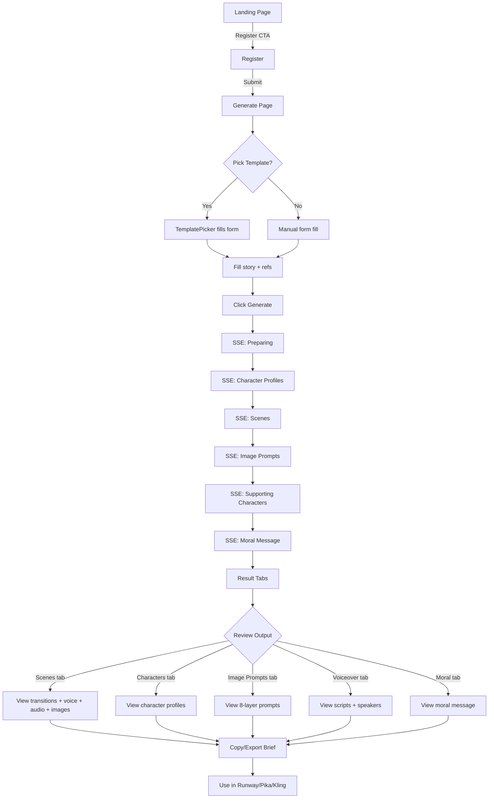
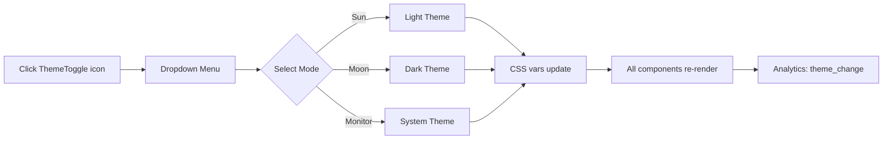
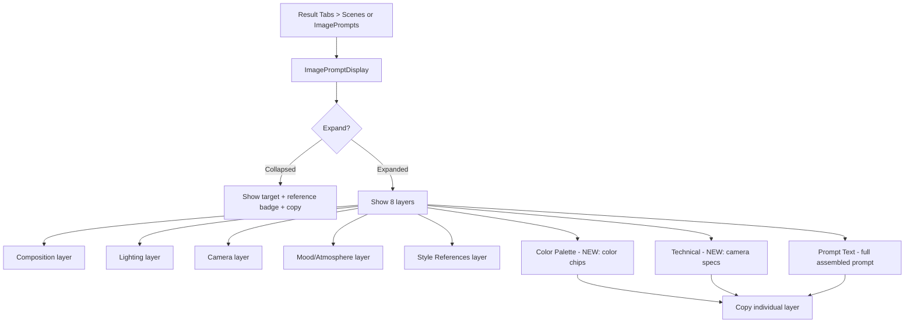

# UI/UX Specification — PromptFlow V3
## Animation Brief Engine Update

**Version:** 3.0
**Date:** 2026-06-22
**Status:** Draft
**Source:** PRD.md, SRS.md, PROJECT_ARCHITECTURE.md, RAG-CONTEXT.md, live codebase (`src/`)

---

## 1. Design Principles & UX Goals

### 1.1 Design Principles

| # | Principle | Description | Code Reference |
|---|-----------|-------------|----------------|
| 1 | **Clarity over cleverness** | Every UI element communicates function. Labels are explicit. Icons are paired with text. | `Badge` + icon pattern in all generate components |
| 2 | **Progressive disclosure** | Complex data (8-layer image prompts, audio specs) hidden behind expand/collapse. User sees summary first, detail on demand. | `ImagePromptDisplay` expand toggle, `LogViewer` collapsible |
| 3 | **Immediate feedback** | Every action has visible response: SSE stage progress, toast notifications, loading states, elapsed timer. | `GenerateForm` stage progress + `ElapsedTimer`, `sonner` toasts |
| 4 | **Theme-aware by default** | All components use CSS variables from `globals.css`. No hardcoded colors. Light/dark/system all work. | `@theme` block + `.dark` override in `globals.css` |
| 5 | **Mobile-first responsive** | Layout adapts from single-column mobile to multi-column desktop. Touch targets ≥ 44px. | Tailwind responsive classes: `sm:`, `md:`, `lg:` |
| 6 | **Accessible by default** | WCAG 2.1 AA compliance. Keyboard navigable. Screen reader support. Reduced motion respected. | `focus-visible` ring, `aria-label`, `@media (prefers-reduced-motion)` |
| 7 | **i18n-ready** | All user-facing strings via `next-intl` namespaces. No hardcoded text. Layout supports both ID (longer) and EN. | `useTranslations()`, `getTranslations()`, `messages/id.json`, `messages/en.json` |

### 1.2 UX Goals (Aligned with PRD Personas)

| Persona | UX Goal | V3 Feature Mapping |
|---------|---------|-------------------|
| **Andi (Solo YouTuber)** | Generate complete animation brief in <5 min, one form fill → full package | GenerateForm (SSE), ResultTabs, TemplatePicker |
| **Sari (Freelance Animator)** | Structured brief with voice + audio specs, copy-ready for clients | SceneTransitionCard, VoiceTypeSelector, AudioPanel, CopyButton |
| **Budi (Studio Owner)** | Template presets for team consistency | TemplatePicker (5 presets) |
| **Dewi (Agency PM)** | High-volume generation with consistent output | Dashboard metrics, project list, export |
| **Riko (Edukator)** | Demo-ready structured examples | Export JSON/Markdown, visual layer display |

### 1.3 Brand Voice

| Aspect | Guideline | Example |
|--------|-----------|---------|
| **Language** | Indonesian-first, English secondary. Technical terms in English. | "Generate Prompt Animasi" not "Buat Prompt Animasi" |
| **Tone** | Professional but approachable. Tool-oriented, not marketing-heavy. | "Masukkan judul + durasi + style, sistem akan menghasilkan paket prompt terstruktur." |
| **Error messages** | Specific, actionable. Include what went wrong + next step. | "Generate gagal: [error detail]" not "Terjadi kesalahan" |
| **Empty states** | Informative, suggest action. | "Tidak ada audio spec" with context, not blank |

---

## 2. Design Tokens

> All tokens are defined as CSS custom properties in `src/app/globals.css` via Tailwind v4 `@theme` block.
> Dark mode overrides in `.dark` class. Referenced throughout all components via `var(--color-*)` and Tailwind utility classes.

### 2.1 Color Palette

#### Light Mode (Default)

| Token | CSS Variable | HEX | Usage |
|-------|-------------|-----|-------|
| background | `--color-background` | `#FFFFFF` | Page background |
| foreground | `--color-foreground` | `#0A0A0A` | Primary text |
| card | `--color-card` | `#FFFFFF` | Card surfaces |
| card-foreground | `--color-card-foreground` | `#0A0A0A` | Card text |
| popover | `--color-popover` | `#FFFFFF` | Dropdown/popover bg |
| popover-foreground | `--color-popover-foreground` | `#0A0A0A` | Dropdown text |
| **primary** | `--color-primary` | `#7C3AED` | CTA buttons, links, active states (Violet 600) |
| primary-foreground | `--color-primary-foreground` | `#FFFFFF` | Text on primary bg |
| secondary | `--color-secondary` | `#F4F4F5` | Secondary buttons, badges (Zinc 100) |
| secondary-foreground | `--color-secondary-foreground` | `#18181B` | Text on secondary bg |
| muted | `--color-muted` | `#F4F4F5` | Disabled bg, subtle areas |
| muted-foreground | `--color-muted-foreground` | `#71717A` | Placeholder, captions (Zinc 500) |
| accent | `--color-accent` | `#EDE9FE` | Hover bg, highlights (Violet 100) |
| accent-foreground | `--color-accent-foreground` | `#4C1D95` | Text on accent bg (Violet 900) |
| **destructive** | `--color-destructive` | `#DC2626` | Error, delete actions (Red 600) |
| destructive-foreground | `--color-destructive-foreground` | `#FFFFFF` | Text on destructive bg |
| **success** | `--color-success` | `#16A34A` | Success states, checkmarks (Green 600) |
| **warning** | `--color-warning` | `#D97706` | Warnings, caution (Amber 600) |
| **info** | `--color-info` | `#2563EB` | Info badges, links (Blue 600) |
| border | `--color-border` | `#E4E4E7` | All borders (Zinc 200) |
| input | `--color-input` | `#E4E4E7` | Input field borders |
| **ring** | `--color-ring` | `#7C3AED` | Focus ring color |

#### Dark Mode (`.dark` class)

| Token | CSS Variable | HEX | Usage |
|-------|-------------|-----|-------|
| background | `--color-background` | `#0A0A0A` | Page background |
| foreground | `--color-foreground` | `#FAFAFA` | Primary text |
| card | `--color-card` | `#0F0F0F` | Card surfaces |
| card-foreground | `--color-card-foreground` | `#FAFAFA` | Card text |
| popover | `--color-popover` | `#0F0F0F` | Dropdown/popover bg |
| popover-foreground | `--color-popover-foreground` | `#FAFAFA` | Dropdown text |
| **primary** | `--color-primary` | `#A78BFA` | CTA, links, active (Violet 400) |
| primary-foreground | `--color-primary-foreground` | `#0A0A0A` | Text on primary bg |
| secondary | `--color-secondary` | `#27272A` | Secondary buttons (Zinc 800) |
| secondary-foreground | `--color-secondary-foreground` | `#FAFAFA` | Text on secondary bg |
| muted | `--color-muted` | `#27272A` | Disabled bg, subtle areas |
| muted-foreground | `--color-muted-foreground` | `#A1A1AA` | Placeholder, captions (Zinc 400) |
| accent | `--color-accent` | `#3B0764` | Hover bg, highlights (Violet 950) |
| accent-foreground | `--color-accent-foreground` | `#DDD6FE` | Text on accent bg (Violet 200) |
| **destructive** | `--color-destructive` | `#EF4444` | Error, delete (Red 500) |
| destructive-foreground | `--color-destructive-foreground` | `#FAFAFA` | Text on destructive bg |
| **success** | `--color-success` | `#22C55E` | Success (Green 500) |
| **warning** | `--color-warning` | `#F59E0B` | Warning (Amber 500) |
| **info** | `--color-info` | `#3B82F6` | Info (Blue 500) |
| border | `--color-border` | `#27272A` | All borders (Zinc 800) |
| input | `--color-input` | `#27272A` | Input field borders |
| **ring** | `--color-ring` | `#A78BFA` | Focus ring color |

#### Contrast Verification

| Pair | Light Ratio | Dark Ratio | WCAG AA (4.5:1) |
|------|------------|------------|-----------------|
| foreground on background | `#0A0A0A` on `#FFFFFF` = **19.3:1** | `#FAFAFA` on `#0A0A0A` = **18.1:1** | PASS |
| primary-foreground on primary | `#FFFFFF` on `#7C3AED` = **5.3:1** | `#0A0A0A` on `#A78BFA` = **7.5:1** | PASS |
| muted-foreground on background | `#71717A` on `#FFFFFF` = **5.0:1** | `#A1A1AA` on `#0A0A0A` = **7.1:1** | PASS |
| destructive-foreground on destructive | `#FFFFFF` on `#DC2626` = **4.6:1** | `#FAFAFA` on `#EF4444` = **4.2:1** | PASS |

### 2.2 Typography

| Token | Value | Source |
|-------|-------|--------|
| **Font family (sans)** | `Inter, system-ui, -apple-system, "Segoe UI", Roboto, sans-serif` | `globals.css:27` |
| **Font family (mono)** | `"JetBrains Mono", "Fira Code", ui-monospace, monospace` | `globals.css:28` |
| **Font feature settings** | `"rlig" 1, "calt" 1` | `globals.css:41` |

#### Type Scale

| Level | Size | Weight | Line Height | Letter Spacing | Usage |
|-------|------|--------|-------------|----------------|-------|
| Display | 48px / 3rem (`text-5xl` → 60px `sm:text-6xl` → 72px `lg:text-6xl`) | 800 (extrabold) | 1.1 | tight | Hero title |
| H1 | 30px / 1.875rem (`text-3xl` → 36px `sm:text-4xl`) | 700 (bold) | 1.2 | tight | Section headings |
| H2 | 24px / 1.5rem (`text-2xl`) | 700 (bold) | 1.3 | normal | Page titles, card titles |
| H3 | 20px / 1.25rem (`text-xl`) | 600 (semibold) | 1.4 | normal | Sub-section titles |
| H4/Base-lg | 16px / 1rem (`text-base`) | 600 (semibold) | 1.5 | normal | Card titles, labels |
| Body | 14px / 0.875rem (`text-sm`) | 400 (normal) | 1.6 | normal | Primary body text |
| Body-sm | 12px / 0.75rem (`text-xs`) | 400 (normal) | 1.5 | normal | Captions, badges, metadata |
| Code | 12px / 0.75rem (`text-xs` + `font-mono`) | 400 (normal) | 1.6 | normal | Image prompt layers, logs |

### 2.3 Spacing Scale

| Token | Value | Usage |
|-------|-------|-------|
| `space-0` | 0px | Zero spacing |
| `space-0.5` | 2px | Tight icon gaps |
| `space-1` | 4px | Badge padding, icon margins |
| `space-1.5` | 6px | Small component gaps |
| `space-2` | 8px | Badge gaps, layer row gaps |
| `space-3` | 12px | Card padding (compact), section gaps |
| `space-4` | 16px | Card content padding, form gaps |
| `space-6` | 24px | Section padding, nav gaps |
| `space-8` | 32px | Section separator, large gaps |
| `space-10` | 40px | Hero CTA margins |
| `space-12` | 48px | Footer padding, form section breaks |
| `space-16` | 64px | Hero margin bottom, feature section padding |
| `space-24` | 96px | Landing page section padding (py-24) |

### 2.4 Border Radius

| Token | Value | Usage |
|-------|-------|-------|
| `--radius` | `6px` | Default: inputs, buttons, cards (via shadcn/ui) |
| `rounded-md` | `6px` | Cards, inputs, buttons, badges (shadcn/ui default) |
| `rounded-lg` | `8px` | Card containers, modals, dropzone |
| `rounded-full` | `9999px` | Badges, avatar placeholders |

### 2.5 Shadows & Elevation

| Token | Value | Usage |
|-------|-------|-------|
| `shadow-sm` | `0 1px 2px 0 rgb(0 0 0 / 0.05)` | Cards default, tabs active state |
| `shadow-none` | none | Most components (flat design preference) |

### 2.6 Container Widths

| Token | Value | Usage |
|-------|-------|-------|
| Max content width | `1280px` | AppHeader inner container (`max-w-[1280px]`) |
| Max landing width | `1280px` | Landing sections (`max-w-7xl` = 1280px) |
| Max text width | `896px` | Hero subtitle (`max-w-2xl` = 672px), hero title (`max-w-4xl` = 896px) |
| Max result width | `100%` of parent | ResultTabs, GenerateForm |

### 2.7 Responsive Breakpoints

| Breakpoint | Min Width | Tailwind Prefix | Target |
|------------|-----------|-----------------|--------|
| Mobile (default) | 0px | (none) | Phones, single column |
| Tablet | 640px | `sm:` | Small tablets, 2-col grids |
| Desktop | 768px | `md:` | Tablets/small desktop, nav visible |
| Large desktop | 1024px | `lg:` | Desktop, 3-col grids, full layout |

### 2.8 Theme Transition

| Property | Duration | Easing |
|----------|----------|--------|
| `background-color` | `0.2s` | `ease` |
| `color` | `0.2s` | `ease` |
| `border-color` | `0.2s` | `ease` |

**Note:** `ThemeProvider` uses `disableTransitionOnChange` to prevent flash. CSS transition handles smooth switch.

---

## 3. UI Components

### 3.1 Component Inventory

All components organized per PROJECT_ARCHITECTURE folder structure.

#### 3.1.1 shadcn/ui Primitives (`src/components/ui/`)

| Component | File | Props/Key Variants | States | Notes |
|-----------|------|-------------------|--------|-------|
| **Button** | `ui/button.tsx` | variant: `default`, `destructive`, `outline`, `secondary`, `ghost`, `link`; size: `default` (h-10), `sm` (h-9), `lg` (h-11), `icon` (h-10 w-10) | default, hover, active, disabled (opacity-50), focus-visible (ring) | `asChild` for Slot pattern. Uses `class-variance-authority`. |
| **Card** | `ui/card.tsx` | Card, CardHeader, CardTitle, CardDescription, CardContent, CardFooter | default (shadow-sm, rounded-lg, border, bg-card) | Compound component pattern |
| **Badge** | `ui/badge.tsx` | variant: `default`, `secondary`, `destructive`, `outline`, `success`, `warning`, `info` | default only, focus (ring) | `rounded-full`, semantic color variants use CSS vars |
| **Input** | `ui/input.tsx` | type, placeholder, disabled | default, focus-visible (ring), disabled | h-10, rounded-md |
| **Label** | `ui/label.tsx` | htmlFor | default | Pairs with Input, text-sm font-medium |
| **Textarea** | `ui/textarea.tsx` | rows, maxLength, placeholder | default, focus-visible (ring) | min-h-[80px] |
| **Select** | `ui/select.tsx` | Native HTML `<select>` wrapper | default, focus-visible | h-10, rounded-md |
| **Dialog** | `ui/dialog.tsx` | Radix Dialog primitive | open, closed | Portal-based, overlay + content |
| **DropdownMenu** | `ui/dropdown-menu.tsx` | Radix DropdownMenu | open, closed | Used by ThemeToggle, LanguageToggle |
| **Tabs** | `ui/tabs.tsx` | Tabs, TabsList, TabsTrigger, TabsContent | active (data-[state=active]), inactive | Grid-based TabsList, Radix primitive |
| **Switch** | `ui/switch.tsx` | Radix Switch | on, off | Used in LogViewer toggle |
| **ScrollArea** | `ui/scroll-area.tsx` | Radix ScrollArea | default | Used in LogViewer, dropdown menus |
| **Skeleton** | `ui/skeleton.tsx` | className | loading pulse | Page loading states |
| **Alert** | `ui/alert.tsx` | variant | default, destructive | Error/warning banners |
| **Table** | `ui/table.tsx` | Table, TableHeader, TableRow, TableHead, TableCell, TableBody | default | Dashboard data tables |

#### 3.1.2 Common Components (`src/components/common/`)

| Component | File | Purpose | Props | States | Key Details |
|-----------|------|---------|-------|--------|-------------|
| **AppHeader** | `common/app-header.tsx` | Global nav bar (SSR) | none (server component) | authenticated (shows nav links + logout), unauthenticated (shows login/register) | Sticky top-0, z-50, h-16, max-w-[1280px]. Border-b on scroll. ThemeToggle + LanguageToggle always visible. |
| **ThemeToggle** | `common/theme-toggle.tsx` | 3-mode theme switcher | none | mounted (Sun/Moon/Monitor icon), unmounted (disabled ghost button with Sun icon) | Dropdown: light (Sun), dark (Moon), system (Monitor). Tracks `ANALYTICS_EVENTS.THEME_CHANGE`. h-9 w-9 ghost button. |
| **LanguageToggle** | `common/language-toggle.tsx` | id/en switcher | none | id active, en active | Button that switches locale segment. Tracks `ANALYTICS_EVENTS.LANGUAGE_TOGGLE`. |
| **CopyButton** | `common/copy-button.tsx` | Copy text to clipboard | `text: string` | default, copied (visual feedback) | Used in voiceover scripts, image prompts, moral message |
| **Pagination** | `common/pagination.tsx` | Page navigation | page, totalPages, basePath | previous/next disabled states | Used in project list |
| **PageLoadingSkeleton** | `common/page-loading-skeleton.tsx` | Full-page loading | none | loading pulse | Card-based skeleton layout |
| **PageErrorBoundary** | `common/page-error-boundary.tsx` | Error fallback | error, reset | error state | Shows error message + retry button |
| **ChangelogBanner** | `common/changelog-banner.tsx` | Version announcement | none | visible, dismissed | Temporary V3 announcement |

#### 3.1.3 Generate Components (`src/components/generate/`)

| Component | File | Purpose | Key Props | States | Location in UI |
|-----------|------|---------|-----------|--------|----------------|
| **GenerateForm** | `generate/generate-form.tsx` | Main generation form + SSE streaming | `locale: string` | idle (form), streaming (stage progress + logs), result (ResultTabs) | `/generate` page |
| **ResultTabs** | `generate/result-tabs.tsx` | Tabbed result display (5 tabs) | `result: PromptPackage`, `warnings: Warning[]` | scenes (default), characters, imagePrompts, voiceover, moral | Below GenerateForm after generation |
| **SceneTransitionCard** | `generate/scene-transition-card.tsx` | Single scene with transition info | `scene: SceneTransitionData`, `children?: ReactNode` | default, last (no connector) | Inside ResultTabs → scenes tab |
| **VoiceTypeSelector** | `generate/voice-type-selector.tsx` | Voice spec badge display | `voice: VoiceSpec` | default (badges row) | Inside SceneTransitionCard |
| **AudioPanel** | `generate/audio-panel.tsx` | Audio spec list per scene | `audio: AudioEntry[]` | empty (noAudio message), populated (list) | Inside SceneTransitionCard |
| **ImagePromptDisplay** | `generate/image-prompt-display.tsx` | Expandable image prompt layers | `prompt: ImagePromptData` | collapsed (target + badge), expanded (8 layers) | Inside SceneTransitionCard + ImagePrompts tab |
| **TemplatePicker** | `generate/template-picker.tsx` | Preset template grid | `templates: TitleTemplate[]`, `onPick` | default grid | Top of GenerateForm |
| **DropzoneUploader** | `generate/dropzone-uploader.tsx` | File upload with drag-drop | `projectId: number`, `onUploaded` | idle, uploading, uploaded | Inside GenerateForm |
| **LogViewer** | `generate/log-viewer.tsx` | Collapsible real-time log stream | `logs: LogEntry[]` | empty (null render), collapsed (header), expanded (scroll area) | Inside GenerateForm streaming state |

#### 3.1.4 Landing Components (`src/components/landing/`)

| Component | File | Purpose | Key Details |
|-----------|------|---------|-------------|
| **Navbar** | `landing/navbar.tsx` | Landing page fixed navigation | Scrolled state (bg-background/95 + border-b), mobile hamburger menu with AnimatePresence |
| **Hero** | `landing/hero.tsx` | Full-screen hero section | Gradient bg, animated title + subtitle + CTA buttons + BrowserMockup. Framer Motion stagger. |
| **FeaturesBento** | `landing/features-bento.tsx` | Feature grid (3-col bento) | Reads from `FEATURES` array, stagger animation, icon mapping |
| **HowItWorks** | `landing/how-it-works.tsx` | Step-by-step explanation | Numbered steps with icons |
| **FAQ** | `landing/faq.tsx` | Accordion FAQ section | Expandable items, tracks `ANALYTICS_EVENTS.FAQ_EXPAND` |
| **FinalCTA** | `landing/final-cta.tsx` | Bottom CTA section | Primary action button |
| **Footer** | `landing/footer.tsx` | Site footer (SSR) | 4-column grid: Brand, Product, Legal, Social. Max-w-7xl. |
| **BrowserMockup** | `landing/browser-mockup.tsx` | Browser chrome wrapper | Decorative browser frame for screenshots/demos |
| **FeatureCard** | `landing/feature-card.tsx` | Single feature card | Icon + title + description |
| **SectionWrapper** | `landing/section-wrapper.tsx` | Section container | ID anchor + padding |
| **SocialProofBar** | `landing/social-proof-bar.tsx` | Stats/social proof | Counter animations |
| **Testimonials** | `landing/testimonials.tsx` | User quotes section | Carousel or grid |
| **ProblemSolution** | `landing/problem-solution.tsx` | Problem/solution framing | Two-column layout |
| **ProductDemo** | `landing/product-demo.tsx` | Interactive demo section | Embedded preview |
| **LogoPlaceholder** | `landing/logo-placeholder.tsx` | Brand logo component | Text-based logo: "PromptFlow" |
| **ScrollTracker** | `landing/scroll-tracker.tsx` | Scroll progress indicator | Tracks `ANALYTICS_EVENTS.SCROLL_75` |

### 3.2 V3 Component Enhancement Specifications

#### 3.2.1 ImagePromptDisplay Enhancement (FR-S03)

**Current state:** Renders 6 layers (composition, lighting, camera, mood, style, prompt_text as "technical").
**GAP:** Missing `color_palette` and `technical` as separate dedicated layers.

**Enhanced anatomy:**

```
ImagePromptDisplay
├── Header row
│   ├── Expand toggle (ChevronDown/ChevronRight)
│   ├── Target label (font-semibold)
│   ├── Reference badge (if referenceFilename)
│   └── CopyButton
└── Expanded content (8 layers)
    ├── LayerRow: Composition
    ├── LayerRow: Lighting
    ├── LayerRow: Camera
    ├── LayerRow: Mood/Atmosphere
    ├── LayerRow: Style References
    ├── ColorPaletteDisplay (NEW) — color chips + hex values
    ├── LayerRow: Technical (separate from prompt_text)
    └── PromptText block (monospace, full prompt)
```

**ColorPaletteDisplay specification:**

```
Prop: colorPalette: string (format: "deep blue #1a365d, gold #d4a017, white #f5f5f5")
Render:
  - Parse comma-separated color entries
  - Each entry: inline color chip (12x12px rounded-full, bg = extracted hex) + color name + hex code
  - Horizontal flex-wrap layout
  - Fallback: if no hex found, render as plain text
  - Accessibility: aria-label="Color palette: [full text]"
```

**Technical layer specification:**

```
Prop: technical: string (format: "4K, cinematic depth of field, film grain")
Render:
  - LayerRow with label "Technical" (i18n key: imagePrompt.layers.technical)
  - Monospace text
  - Distinct from prompt_text (which is the full assembled prompt)
```

**i18n keys needed:**

| Key | ID | EN |
|-----|----|----|
| `imagePrompt.layers.colorPalette` | Palet Warna | Color Palette |
| `imagePrompt.layers.technical` | Teknis | Technical |

#### 3.2.2 SceneTransitionCard Enhancement

**Current state:** Shows transition type icon + badge + duration. Vertical connector line between scenes.
**Verified:** Already renders all V3 fields. No component changes needed — data persistence fix (FR-M01-M03) will populate missing fields.

**Enhancement for transition flow visualization:**

```
Connector line enhancement:
  - solid line: transition_duration_ms > 0
  - dashed line: transition_duration_ms === 0 (cut)
  - Line color: muted-foreground/40 (already implemented)
  - Optional: color-code by transition type
    - cut → neutral (muted-foreground)
    - dissolve → primary
    - fade_to_black → foreground (opaque)
    - fade_to_white → background (inverse)
    - wipe → accent
    - match_cut → info
```

#### 3.2.3 VoiceTypeSelector — No Changes Needed

Current implementation already displays: voice type badge (icon + label), emotion badge, speed label, pitch badge. All i18n keys exist in `voice.types.*`, `voice.emotions.*`, `voice.pitch.*`.

**Gap:** `voiceover_speaker` not in DB (FR-M03). Once column added, `ResultTabs` already renders it (line 73: `s.voiceover_speaker ?? 'narrator'`).

#### 3.2.4 AudioPanel — No Changes Needed

Current implementation renders: audio type icon, type badge, description, timing, volume percentage. All 5 audio types mapped to lucide icons. Empty state handled.

**Gap:** Generate route not saving audio_specs to DB (FR-M01). Once fixed, AudioPanel will render data from DB automatically.

---

## 4. Layout & Grid

### 4.1 Grid System

| Property | Value |
|----------|-------|
| Grid columns | 12-column (Tailwind default) |
| Gutter | gap-4 (16px) to gap-6 (24px) |
| Margin (page) | px-4 sm:px-6 lg:px-8 (16px → 24px → 32px) |
| Container width | max-w-7xl (1280px) |

### 4.2 Container Hierarchy

| Container | Classes | Usage |
|-----------|---------|-------|
| Root layout | html lang=id, body bg-background text-foreground | All pages |
| Providers | ThemeProvider (class, dark default) + SessionProvider | Locale layout |
| Landing container | max-w-7xl mx-auto px-4 sm:px-6 lg:px-8 | Landing page sections |
| App container | max-w-[1280px] mx-auto px-4 md:px-6 lg:px-8 | Authenticated pages |
| AppHeader | sticky top-0 z-50 w-full border-b bg-background/95 backdrop-blur | Global navigation |
| Card container | rounded-lg border bg-card shadow-sm | Content blocks |

### 4.3 Page Layout Patterns

#### Landing Page Layout
```
+-------------------------------------------+
| Navbar (fixed, z-50, bg/blur, border-b)   |
|  Logo  |  Features | How It Works | FAQ   |
|  LanguageToggle | CTA Button              |
+-------------------------------------------+
| Hero (min-h-screen, gradient bg)          |
|  max-w-4xl title → max-w-2xl subtitle     |
|  CTA buttons (flex-row, gap-4)            |
|  BrowserMockup (max-w-3xl)                |
+-------------------------------------------+
| FeaturesBento (py-24, max-w-7xl)          |
|  Grid: 1-col mobile → 3-col desktop       |
+-------------------------------------------+
| HowItWorks (py-24, max-w-7xl)             |
+-------------------------------------------+
| FAQ (py-24, max-w-7xl)                    |
+-------------------------------------------+
| FinalCTA (py-24, max-w-7xl)               |
+-------------------------------------------+
| Footer (py-12, max-w-7xl)                 |
|  4-col grid: Brand|Product|Legal|Social   |
+-------------------------------------------+
```

#### App Layout (Authenticated)
```
+-------------------------------------------+
| AppHeader (sticky, h-16, border-b)        |
|  Logo|Projects|Generate|Settings|Dash     |
|  ThemeToggle|LanguageToggle|Logout        |
+-------------------------------------------+
| main (px-4 md:px-6 lg:px-8)               |
|  Page content (max-w-[1280px] mx-auto)    |
+-------------------------------------------+
```

#### Generate Page Layout
```
+-------------------------------------------+
| AppHeader                                  |
+-------------------------------------------+
| main                                       |
| +---------------------------------------+  |
| | GenerateForm (Card, max-w-[1280px])   |  |
| |  TemplatePicker (grid: 1→2→4 cols)    |  |
| |  Form fields (2-col grid)             |  |
| |  Story description (Textarea 500)     |  |
| |  DropzoneUploader                     |  |
| |  Refs textarea                        |  |
| |  [Streaming: StageProgress+LogViewer] |  |
| |  [Result: ResultTabs]                 |  |
| +---------------------------------------+  |
+-------------------------------------------+
```

### 4.4 Responsive Strategy (Mobile-First)

| Breakpoint | Strategy | Examples |
|------------|----------|----------|
| Mobile (default) | Single column, full-width, stacked | TabsList grid-cols-2, form 1-col |
| Tablet (sm:640px) | 2-col grids, expanded spacing | TemplatePicker grid-cols-2 |
| Desktop (md:768px) | Nav visible, multi-tab | AppHeader nav shown, TabsList grid-cols-5 |
| Large desktop (lg:1024px) | Full 3-col features | FeaturesBento grid-cols-3 |

### 4.5 Safe Area

| Area | Implementation |
|------|----------------|
| Top safe area | AppHeader h-16 (64px) prevents overlap |
| Bottom safe area | Footer py-12 (48px) padding |
| Side safe area | px-4 (16px) min mobile → px-8 (32px) desktop |

---

## 5. Navigation & Information Architecture

### 5.1 Site Map

```
/ (root - redirects to /[locale])
├── /[locale]/ (Landing Page - SSR)
│   ├── #features (anchor)
│   ├── #how-it-works (anchor)
│   ├── #faq (anchor)
│   ├── [Register CTA] → /[locale]/register
│   └── [Login CTA] → /[locale]/login
├── /[locale]/login (Auth - SSR)
├── /[locale]/register (Auth - SSR)
├── /[locale]/generate (App - SSE Streaming)
├── /[locale]/projects (App - SSR + CSR)
│   └── /[locale]/projects/[id] (App - SSR + CSR)
│       └── /[locale]/projects/[id]/history (App - SSR)
├── /[locale]/dashboard (App - SSR + CSR)
├── /[locale]/settings (App - CSR)
└── /api/... (API Routes)
```

### 5.2 Navigation Components

#### Landing Page Navigation (Navbar)
```
Desktop (md+):
[Logo: PromptFlow]  [Features] [How It Works] [FAQ]  [ID/EN] [Register CTA]

Mobile (<md):
[Logo: PromptFlow]                        [Hamburger]
                    Mobile Menu (AnimatePresence):
                    [Features] [How It Works] [FAQ]
                    [Switch Language]
                    [Register CTA (full-width)]
```

#### App Navigation (AppHeader)
```
Desktop (md+):
[Logo: PromptFlow]  [Projects] [New Project] [Settings] [Dashboard]  [Theme] [Lang] [Logout]

Mobile (<md):
[Logo: PromptFlow]                          [Theme] [Lang] [Logout]
(Note: nav links hidden on mobile)
```

**Mobile nav gap:** AppHeader does NOT have mobile hamburger menu. Future improvement.

### 5.3 Breadcrumbs

No breadcrumb component exists. Users navigate via:
- AppHeader logo link → /[locale]/ (home)
- In-page back buttons (e.g., GenerateForm "Generate Baru")

---

## 6. User Flows (Mermaid)

### 6.1 Generate Animation Brief (Andi - Solo YouTuber)



### 6.2 Theme Toggle (All Users)



### 6.3 Image Prompt 8-Layer Review (Sari - Freelance Animator)



---

## 7. Descriptive Wireframes

### 7.1 Landing Page Hero Section

```
+------------------------------------------------------------------+
|                                                                    |
|                                                                    |
|                                                                    |
|    ┌─────────────────────────────────────────────────────────┐    |
|    │         AI Animation Prompt Generator                   │    |
|    │    (gradient: from-primary to-accent-foreground)        │    |
|    │         text-4xl sm:text-5xl lg:text-6xl                │    |
|    │         font-extrabold tracking-tight                   │    |
|    └─────────────────────────────────────────────────────────┘    |
|                                                                    |
|    Generate structured animation briefs with scenes,               |
|    transitions, voice specs, and 8-layer image prompts            |
|    (text-lg sm:text-xl text-muted-foreground)                     |
|                                                                    |
|    ┌──────────────┐  ┌──────────────┐                              |
|    │  Get Started │  │    Login     │                              |
|    │ (gradient bg)│  │  (outline)   │                              |
|    │  Button lg   │  │  Button lg   │                              |
|    └──────────────┘  └──────────────┘                              |
|                                                                    |
|    ┌─────────────────────────────────────────────────────────┐    |
|    │                                                         │    |
|    │              Browser Mockup (preview)                   │    |
|    │              max-w-3xl centered                         │    |
|    │                                                         │    |
|    └─────────────────────────────────────────────────────────┘    |
|                                                                    |
+------------------------------------------------------------------+
```

### 7.2 Generate Form (Idle State)

```
+------------------------------------------------------------------+
| AppHeader: [PromptFlow]  Projects  Generate  Settings  Dashboard  |
+------------------------------------------------------------------+
| ┌────────────────────────────────────────────────────────────────┐ |
| │ Generate Prompt Animasi                                        │ |
| │ Masukkan judul + durasi + style...                             │ |
| │                                                                │ |
| │ ┌── Template Picker ─────────────────────────────────────────┐│ |
| │ │ Atau pilih template judul populer:                          ││ |
| │ │ ┌──────────┐ ┌──────────┐ ┌──────────┐ ┌──────────┐       ││ |
| │ │ │Template 1│ │Template 2│ │Template 3│ │Template 4│       ││ |
| │ │ │(Card)    │ │(Card)    │ │(Card)    │ │(Card)    │       ││ |
| │ │ │[Pakai]   │ │[Pakai]   │ │[Pakai]   │ │[Pakai]   │       ││ |
| │ │ └──────────┘ └──────────┘ └──────────┘ └──────────┘       ││ |
| │ └────────────────────────────────────────────────────────────┘│ |
| │                                                                │ |
| │ ─────────────────────────────────────────────────────────────  │ |
| │                                                                │ |
| │ Judul Animasi*                                                 │ |
| │ ┌──────────────────────────────────────────────────────────┐  │ |
| │ │ Petualangan di Hutan                              (Input)│  │ |
| │ └──────────────────────────────────────────────────────────┘  │ |
| │                                                                │ |
| │ Durasi*                    Target Detik*                       │ |
| │ ┌──────────────────┐       ┌──────────────────┐               │ |
| │ │ Shorts (30-60s)  │       │ 60               │               │ |
| │ │ (Select)         │       │ (Input number)   │               │ |
| │ └──────────────────┘       └──────────────────┘               │ |
| │                                                                │ |
| │ Style*                     Rasio*                              │ |
| │ ┌──────────────────┐       ┌──────────────────┐               │ |
| │ │ 3D               │       │ 16:9             │               │ |
| │ │ (Select)         │       │ (Select)         │               │ |
| │ └──────────────────┘       └──────────────────┘               │ |
| │                                                                │ |
| │ Deskripsi Cerita (opsional, max 500)                           │ |
| │ ┌──────────────────────────────────────────────────────────┐  │ |
| │ │ Ceritakan gambaran umum cerita...                  (TA)   │  │ |
| │ │                                                          │  │ |
| │ │                                                          │  │ |
| │ └──────────────────────────────────────────────────────────┘  │ |
| │                                              0/500             │ |
| │                                                                │ |
| │ ┌── Dropzone Uploader ──────────────────────────────────────┐│ |
| │ │     ↑                                                      ││ |
| │ │  Drag & drop atau klik untuk pilih file gambar            ││ |
| │ │  (max 10MB, image/*)                                       ││ |
| │ │  [Pilih File]                                              ││ |
| │ └────────────────────────────────────────────────────────────┘│ |
| │                                                                │ |
| │ ┌──────────────────────────────────────────────────────────┐  │ |
| │ │                    Generate                              │  │ |
| │ └──────────────────────────────────────────────────────────┘  │ |
| └────────────────────────────────────────────────────────────────┘ |
+------------------------------------------------------------------+
```

### 7.3 Generate Form (Streaming State)

```
+------------------------------------------------------------------+
| ┌────────────────────────────────────────────────────────────────┐ |
| │ Generate Prompt Animasi                                        │ |
| │ ┌── Streaming Progress ──────────────────────────────────────┐│ |
| │ │ Menyiapkan karakter                              02:34    ││ |
| │ │                                                            ││ |
| │ │ ✓ Memulai generate...                                     ││ |
| │ │ ✓ Membuat profil karakter                                 ││ |
| │ │ ● Menyusun scene  ●●●                                     ││ |
| │ │ ○ Membuat prompt gambar                                   ││ |
| │ │ ○ Membuat karakter pendukung                              ││ |
| │ │ ○ Menulis pesan moral                                     ││ |
| │ │                                                            ││ |
| │ │ ┌── Processing Logs (12) ──────────── [Toggle: ON] ──────┐││ |
| │ │ │ 14:23:45.123 [info]  Building system prompt...         │││ |
| │ │ │ 14:23:45.234 [info]  Calling LLM provider...           │││ |
| │ │ │ 14:23:46.456 [info]  Response received (2.1s)          │││ |
| │ │ │ 14:23:46.567 [info]  Parsing JSON output...            │││ |
| │ │ │ 14:23:47.789 [info]  Validating with Zod...            │││ |
| │ │ └─────────────────────────────────────────────────────────┘││ |
| │ └────────────────────────────────────────────────────────────┘│ |
| │                                                                │ |
| │ ┌──────────────────────────────────────────────────────────┐  │ |
| │ │                    Generate (disabled)                   │  │ |
| │ └──────────────────────────────────────────────────────────┘  │ |
| └────────────────────────────────────────────────────────────────┘ |
+------------------------------------------------------------------+
```

### 7.4 Result Tabs - Scenes Tab

```
+------------------------------------------------------------------+
| ┌── Result Header ──────────────────────────────────────────────┐│ |
| │ Hasil Generate                    [Generate Baru]             ││ |
| └────────────────────────────────────────────────────────────────┘│ |
|                                                                    |
| ┌── Tabs ───────────────────────────────────────────────────────┐│ |
| │ [Scenes(5)] [Characters(2)] [Image Prompts] [Voiceover] [Moral]││ |
| └────────────────────────────────────────────────────────────────┘│ |
|                                                                    |
| ┌── Scene 1 ────────────────────────────────────────────────────┐│ |
| │ Scene 1                    [fade_from_black] [1200ms]          ││ |
| │ Opening shot of forest clearing at dawn                       ││ |
| │                                                                ││ |
| │ ┌── Voiceover ──────────────────────────────────────────────┐││ |
| │ │ 🎙 Voiceover:  [👤 narrator] [45s] [peaceful]             │││ |
| │ │ "Di sebuah hutan yang rindang, terdapat..."               │││ |
| │ └────────────────────────────────────────────────────────────┘││ |
| │                                                                ││ |
| │ Voice Spec:                                                    ││ |
| │ [🎙 narrator] [calm]  Speed: 0.9x  Pitch: auto               ││ |
| │                                                                ││ |
| │ Audio Spec:                                                    ││ |
| │ ┌──────────────────────────────────────────────────────────┐  ││ |
| │ │ 🎵 [background_music]  Soft orchestral intro    00:00-0:45│││ |
| │ │ 🌧 [ambient]          Forest birds, gentle wind  throughout│││ |
| │ └──────────────────────────────────────────────────────────┘  ││ |
| │                                                                ││ |
| │ Characters:                                                    ││ |
| │ ┌── Budi (character) ──────────────────────────────────────┐││ |
| │ │ ▶ Budi              ref: budi.png            [📋 Copy]   │││ |
| │ │   (expanded: 8 layers shown)                              │││ |
| │ │   Composition: Rule of thirds, character left-third      │││ |
| │ │   Lighting: Soft morning light, rim light on hair        │││ |
| │ │   Camera: Medium shot, eye-level                         │││ |
| │ │   Mood: Peaceful, contemplative                          │││ |
| │ │   Style: Pixar-like, warm tones                          │││ |
| │ │   Color Palette: 🟢 #2d5016 🟡 #d4a017 ⚪ #f5f5f5      │││ |
| │ │   Technical: 4K, cinematic DOF, film grain               │││ |
| │ │   Prompt: "A young boy standing in forest clearing..."   │││ |
| │ └───────────────────────────────────────────────────────────┘││ |
| │                                                                ││ |
| │ ┌── Background (forest-clearing) ──────────────────────────┐││ |
| │ │ ▶ forest-clearing                        [📋 Copy]       │││ |
| │ │   (collapsed)                                             │││ |
| │ └───────────────────────────────────────────────────────────┘││ |
| │                                                                ││ |
| │ ┌── Transition hint ───────────────────────────────────────┐││ |
| │ │ → Scene 2: dissolve, 1500ms, ease-in-out                 │││ |
| │ └──────────────────────────────────────────────────────────┘││ |
| └────────────────────────────────────────────────────────────────┘│ |
|     |                                                            |
|     | (connector line: solid for dissolve)                      |
|     |                                                            |
| ┌── Scene 2 ────────────────────────────────────────────────────┐│ |
| │ Scene 2                    [dissolve] [1500ms]                ││ |
| │ ...                                                            ││ |
| └────────────────────────────────────────────────────────────────┘│ |
+------------------------------------------------------------------+
```

### 7.5 Result Tabs - Image Prompts Tab

```
+------------------------------------------------------------------+
| [Scenes(5)] [Characters(2)] [Image Prompts] [Voiceover] [Moral]   |
|                                                                    |
| ┌── Master Characters ──────────────────────────────────────────┐│ |
| │ Reference image prompts for each character                    ││ |
| │                                                                ││ |
| │ ┌── Budi ──────────────────────────────────────────────────┐││ |
| │ │ ▶ Budi              ref: budi.png            [📋 Copy]   │││ |
| │ │   (collapsed - click to expand 8 layers)                 │││ |
| │ └───────────────────────────────────────────────────────────┘││ |
| │                                                                ││ |
| │ ┌── Sari ──────────────────────────────────────────────────┐││ |
| │ │ ▶ Sari              ref: sari.png            [📋 Copy]   │││ |
| │ │   (collapsed)                                             │││ |
| │ └───────────────────────────────────────────────────────────┘││ |
| └────────────────────────────────────────────────────────────────┘│ |
|                                                                    |
| ┌── Master Backgrounds ─────────────────────────────────────────┐│ |
| │ Reference image prompts for each background                   ││ |
| │                                                                ││ |
| │ ┌── forest-clearing ───────────────────────────────────────┐││ |
| │ │ ▶ forest-clearing                        [📋 Copy]       │││ |
| │ │   (collapsed)                                             │││ |
| │ └───────────────────────────────────────────────────────────┘││ |
| └────────────────────────────────────────────────────────────────┘│ |
+------------------------------------------------------------------+
```

---

## 8. Iconography & Assets

### 8.1 Icon Library

**Primary:** lucide-react (v0.468.0)
- Tree-shakeable, consistent stroke width
- Used across all components

### 8.2 Icon Usage Map

| Component | Icons Used |
|-----------|-----------|
| **ThemeToggle** | Sun, Moon, Monitor |
| **LanguageToggle** | (text-based, no icon) |
| **SceneTransitionCard** | Zap (cut), Blend (dissolve), Moon (fade_to_black), Sun (fade_to_white), ArrowRight (wipe), Link (match_cut) |
| **VoiceTypeSelector** | Baby (child), User (teen/adult/elderly), Mic (narrator) |
| **AudioPanel** | Music (background_music), Volume2 (sfx), CloudRain (ambient), Music2 (music_cue), AudioLines (transition_audio) |
| **ResultTabs** | Mic, Clock, User |
| **GenerateForm** | (none in form, Sparkles in TemplatePicker) |
| **TemplatePicker** | Sparkles |
| **DropzoneUploader** | Upload |
| **LogViewer** | Switch toggle |
| **AppHeader** | (text-based links) |
| **Navbar (landing)** | Menu, X |
| **CopyButton** | Copy, Check |

### 8.3 Logo

| Asset | Location | Type |
|-------|----------|------|
| PromptFlow logo | Text-based: "PromptFlow" (font-extrabold tracking-tight text-primary) | Typography |
| LogoPlaceholder | src/components/landing/logo-placeholder.tsx | Component |

**ASSUMPTION:** No SVG/PNG logo file exists. Brand identity is text-based only.

### 8.4 Illustrations

| Asset | Location | Usage |
|-------|----------|-------|
| BrowserMockup | src/components/landing/browser-mockup.tsx | Hero section preview frame |
| OG Image | /og/og-image.jpg (1200x630) | Social sharing |

**ASSUMPTION:** OG image file needs to be created if not yet present in public/og/.

---

## 9. Accessibility (WCAG 2.1 AA)

### 9.1 Target Compliance

| Requirement | Standard | Implementation |
|-------------|----------|----------------|
| WCAG level | 2.1 AA | All interactive components |
| Minimum contrast | 4.5:1 | Verified in Section 2.1 Color Palette |
| Keyboard navigation | All interactive elements | Tab order, Enter/Space activation |
| Focus visible | All focusable elements | focus-visible:ring-2 focus-visible:ring-ring |
| Screen reader | Semantic HTML + aria | Labels, roles, live regions |
| Reduced motion | Respect prefers-reduced-motion | framer-motion useReducedMotion(), CSS media query |

### 9.2 Focus Management

```css
/* globals.css line 43-46 */
:focus-visible {
  outline: 2px solid var(--color-ring);
  outline-offset: 2px;
}
```

All shadcn/ui components include:
- `focus-visible:outline-none focus-visible:ring-2 focus-visible:ring-ring focus-visible:ring-offset-2`
- Ring offset uses `ring-offset-background` for theme-aware offset color

### 9.3 Keyboard Navigation

| Component | Key Behavior |
|-----------|-------------|
| **Button** | Enter/Space activates. Tab to navigate. |
| **DropdownMenu (ThemeToggle, LanguageToggle)** | Enter/Space opens. Arrow keys navigate items. Enter selects. Escape closes. |
| **Tabs (ResultTabs)** | Arrow keys switch tabs. Tab moves focus out. |
| **Dialog** | Escape closes. Focus trap within dialog. |
| **Switch (LogViewer)** | Enter/Space toggles. |
| **Collapsible (LogViewer)** | Enter/Space expands/collapses. |

### 9.4 ARIA Labels

| Component | ARIA Implementation |
|-----------|-------------------|
| **ThemeToggle** | `aria-label={t('themeToggle')}` on trigger button |
| **Navbar hamburger** | `aria-label={t('nav.menuOpen')}` / `aria-label={t('nav.menuClose')}` |
| **TemplatePicker** | `aria-label="Pakai template {title}"` on button |
| **LogViewer** | `aria-label="Toggle log viewer"` on Switch |
| **External links (Footer)** | `aria-hidden="true"` on ExternalLink icon |
| **ImagePromptDisplay** | Expand button needs `aria-label` for screen readers (GAP) |
| **AudioPanel items** | Individual audio entries need `role="listitem"` (GAP) |

### 9.5 Reduced Motion

```css
/* globals.css line 74-82 */
@media (prefers-reduced-motion: reduce) {
  *, ::before, ::after {
    animation-duration: 0.01ms !important;
    animation-iteration-count: 1 !important;
    transition-duration: 0.01ms !important;
  }
}
```

Framer Motion components respect reduced motion:
```tsx
// hero.tsx, features-bento.tsx, navbar.tsx
const shouldReduceMotion = useReducedMotion();
// Conditional animation: shouldReduceMotion ? false : ANIM_BASE
```

### 9.6 Accessibility Gaps & Fixes

| Component | Gap | Fix |
|-----------|-----|-----|
| **ImagePromptDisplay** | Expand button missing aria-label | Add `aria-label={t('expandLayers')}` |
| **ImagePromptDisplay** | Color palette chips missing aria | Add `aria-label` with color name + hex |
| **AudioPanel** | List items not semantic | Wrap in `<ul role="list">`, items as `<li>` |
| **SceneTransitionCard** | Connector line not decorative | Add `aria-hidden="true"` to connector div |
| **AppHeader nav** | Mobile nav links hidden without menu | Add mobile hamburger menu (future) |
| **GenerateForm** | Stage progress not live region | Add `aria-live="polite"` to progress container |
| **ResultTabs** | Tab count in trigger | Already shows count: `Scenes (5)` |

### 9.7 Color-Blind Considerations

| State | Current | Issue | Fix |
|-------|---------|-------|-----|
| Stage progress check | ✓ (green) | Color-only indicator | Already has text label + strikethrough |
| Stage progress active | ● (primary) + ●●● pulse | Color + animation | Add "active" text label for reduced-motion users |
| Error states | text-destructive | Color-only | Pair with icon (AlertTriangle) and text |
| Success states | text-green-600 | Color-only | Pair with checkmark icon ✓ |

---

## 10. Interaction & Motion

### 10.1 Framer Motion Animations

| Component | Animation | Duration | Easing | Trigger |
|-----------|-----------|----------|--------|---------|
| **Hero title** | opacity 0→1, y 20→0 | 500ms | easeOut | Page load |
| **Hero subtitle** | opacity 0→1, y 20→0 | 500ms | easeOut | 150ms delay |
| **Hero CTA** | opacity 0→1, y 20→0 | 500ms | easeOut | 300ms delay |
| **BrowserMockup** | opacity 0→1, y 40→0 | 700ms | easeOut | 500ms delay |
| **FeaturesBento** | stagger children | 400ms each | easeOut | In view (once) |
| **Navbar mobile menu** | opacity + height 0→auto | 300ms | easeOut | Hamburger click |

### 10.2 CSS Transitions

| Element | Property | Duration | Easing |
|---------|----------|----------|--------|
| Theme switch | background-color, color, border-color | 200ms | ease |
| Button hover | background-color | 150ms | ease |
| Link hover | color | 150ms | ease |
| Card hover (TemplatePicker) | background-color | 150ms | ease |
| Navbar scroll state | background-color, border | 300ms | ease |
| Focus ring | outline | 150ms | ease |

### 10.3 Loading States

| State | Component | Implementation |
|-------|-----------|----------------|
| Page loading | PageLoadingSkeleton | Skeleton cards with pulse animation |
| Form submit | GenerateForm | Button disabled + "Generating..." text |
| SSE progress | GenerateForm | Stage checklist with ✓ ● ○ icons |
| SSE timer | ElapsedTimer | Tabular-nums MM:SS counter, updates every 1s |
| SSE logs | LogViewer | Collapsible scroll area with monospace log lines |
| File upload | DropzoneUploader | Button "Uploading..." + disabled |
| Copy feedback | CopyButton | Icon changes to Check, brief highlight |

### 10.4 Empty States

| Component | Empty State |
|-----------|-------------|
| **AudioPanel** | `<p className="text-sm text-muted-foreground">{t('noAudio')}</p>` |
| **LogViewer** | Returns `null` when logs.length === 0 |
| **Projects list** | Empty state card with "Create project" CTA |
| **Dashboard** | Zero-state metrics with "0" values |

### 10.5 Error States

| Component | Error Handling |
|-----------|----------------|
| **GenerateForm** | `toast.error(message)` for API errors, network errors |
| **GenerateForm** | Inline validation: `text-sm text-destructive` below field |
| **DropzoneUploader** | `toast.error("{filename}: {error}")` per file |
| **PageErrorBoundary** | Error card with message + reset button |
| **ResultTabs warnings** | Warning banner with `bg-[var(--color-warning)]/10 border-warning/40` |

### 10.6 Toast Notifications (sonner)

| Event | Toast Type | Message Pattern |
|-------|-----------|-----------------|
| Generate success | success | "Generate selesai" |
| Generate error | error | "Generate gagal: {detail}" |
| Upload success | success | "{count} file terupload" |
| Upload error | error | "{filename}: {error}" |
| Copy success | (visual feedback in CopyButton) | - |
| Network error | error | Error message or "Network error" |

### 10.7 Micro-Interactions

| Interaction | Feedback |
|-------------|----------|
| Template pick | Form fields auto-fill, visual confirmation |
| Expand/collapse (ImagePromptDisplay) | ChevronRight ↔ ChevronDown rotation |
| Stage progress | Animated pulse "●●●" on active stage |
| LogViewer toggle | Switch animates on/off |
| Tab switch | Radix native transition |
| Scroll progress (landing) | ScrollTracker visual indicator |

---

## 11. Content & Copy

### 11.1 Tone & Voice

| Context | Tone | Example |
|---------|------|---------|
| Landing hero | Inspiring, benefit-focused | "AI Animation Prompt Generator" |
| Form labels | Direct, technical | "Judul Animasi", "Durasi", "Style" |
| Error messages | Specific, actionable | "Generate gagal: Provider timeout after 240s" |
| Empty states | Helpful, suggest action | "Belum ada project. Buat project baru untuk mulai." |
| Success feedback | Concise celebration | "Generate selesai" |
| Technical labels | English terms preserved | "Composition", "Lighting", "Camera" |

### 11.2 Terminology Consistency

| Term | Indonesian | English | Usage |
|------|-----------|---------|-------|
| Animation brief | Paket prompt animasi | Animation prompt package | Generate results |
| Scene | Scene / Adegan | Scene | SceneTransitionCard |
| Transition | Transisi | Transition | Transition type badges |
| Voice type | Tipe suara | Voice type | VoiceTypeSelector |
| Audio spec | Spesifikasi audio | Audio specification | AudioPanel |
| Image prompt | Prompt gambar | Image prompt | ImagePromptDisplay |
| Character | Karakter | Character | Character profiles |
| Template | Template | Template | TemplatePicker |
| Provider | Provider | Provider | Settings page |

### 11.3 Error Message Patterns

```
Generate failed:
  "Generate gagal: {error_detail}" (truncated to 200 chars)

Upload failed:
  "{filename}: {error_detail}" (truncated to 120 chars)

Network error:
  "Network error" or Error.message

Rate limit:
  "Rate limit exceeded. Try again in {seconds} seconds."

Validation error:
  Field-level: "{field_name} is required" / "{field_name} must be {constraint}"

Auth error:
  "Invalid email or password"
  "Session expired. Please login again."
```

### 11.4 i18n Namespace Structure

| Namespace | File | Keys | Usage |
|-----------|------|------|-------|
| common | messages/{locale}.json | ~30 keys | AppHeader, ThemeToggle, LanguageToggle, common UI |
| landing | messages/{locale}.json | ~60 keys | Landing page sections, hero, features, FAQ, footer |
| auth | messages/{locale}.json | ~20 keys | Login, register forms |
| generate | messages/{locale}.json | ~40 keys | GenerateForm, ResultTabs, stages |
| transition | messages/{locale}.json | ~15 keys | Transition types, labels |
| voice | messages/{locale}.json | ~20 keys | Voice types, emotions, pitch, speed |
| audio | messages/{locale}.json | ~15 keys | Audio types, timing |
| imagePrompt | messages/{locale}.json | ~15 keys | Layer labels (8 layers) |
| projects | messages/{locale}.json | ~15 keys | Project list, detail |
| dashboard | messages/{locale}.json | ~10 keys | Dashboard metrics |
| settings | messages/{locale}.json | ~15 keys | Provider settings |
| errors | messages/{locale}.json | ~10 keys | Error messages |

### 11.5 V3 i18n Keys Needed (Additions)

| Key | ID | EN | Component |
|-----|----|----|-----------|
| `imagePrompt.layers.colorPalette` | Palet Warna | Color Palette | ImagePromptDisplay |
| `imagePrompt.layers.technical` | Teknis | Technical | ImagePromptDisplay |
| `landing.features.f7Title` | Scene Transition Engine | Scene Transition Engine | FeaturesBento (V3) |
| `landing.features.f7Desc` | 6 jenis transisi... | 6 transition types... | FeaturesBento (V3) |
| `landing.features.f8Title` | Voice Type Mapping | Voice Type Mapping | FeaturesBento (V3) |
| `landing.features.f8Desc` | 7 tipe suara... | 7 voice types... | FeaturesBento (V3) |
| `landing.features.f9Title` | Audio Specification | Audio Specification | FeaturesBento (V3) |
| `landing.features.f9Desc` | 5 tipe audio per scene... | 5 audio types per scene... | FeaturesBento (V3) |
| `landing.features.f10Title` | 8-Layer Image Prompts | 8-Layer Image Prompts | FeaturesBento (V3) |
| `landing.features.f10Desc` | Prompt visual berlapis... | Layered visual prompts... | FeaturesBento (V3) |
| `landing.features.f11Title` | Dark/Light/System Theme | Dark/Light/System Theme | FeaturesBento (V3) |
| `landing.features.f11Desc` | Pilih tema sesuai... | Choose your preferred... | FeaturesBento (V3) |

---

## 12. Responsive & Compatibility Standards

### 12.1 Browser Support

| Browser | Minimum Version | Notes |
|---------|----------------|-------|
| Chrome | 90+ | Primary target |
| Firefox | 90+ | Full support |
| Safari | 15+ | iOS Safari 15+ |
| Edge | 90+ | Chromium-based |

**Source:** SRS.md NFR-C01

### 12.2 Device Support

| Device | Viewport | Strategy |
|--------|----------|----------|
| Mobile phone | 320-428px | Single column, touch-optimized |
| Tablet portrait | 600-834px | 2-col grids, full nav |
| Tablet landscape | 834-1024px | Near-desktop layout |
| Desktop | 1024-1920px | Full layout, 3-col features |
| Wide desktop | 1920px+ | Max container width (1280px), centered |

### 12.3 Touch Targets

| Element | Minimum Size | Implementation |
|---------|-------------|----------------|
| Buttons | 44x44px | h-10 (40px) min, h-11 (44px) for lg |
| Icon buttons | 36x36px | h-9 w-9 (ThemeToggle, LanguageToggle) |
| Form inputs | 40px height | h-10 (40px) |
| Tabs triggers | 36px height | h-9 (36px) + padding |
| Links | 44px touch area | Inline text links with padding |

### 12.4 Performance Targets

| Metric | Target | Measurement |
|--------|--------|-------------|
| LCP (Largest Contentful Paint) | ≤ 2.5s | Landing page |
| FID (First Input Delay) | ≤ 100ms | All pages |
| CLS (Cumulative Layout Shift) | ≤ 0.1 | All pages |
| Theme switch latency | ≤ 100ms | No visible flash |
| Generate response (SSE start) | ≤ 2s | First SSE event |
| Generate total | ≤ 240s | Vercel Hobby timeout |

### 12.5 Vercel Compatibility

| Constraint | Value | Impact |
|------------|-------|--------|
| Plan | Hobby | maxDuration=300 for generate endpoint |
| Runtime | Node.js | API routes use Node runtime |
| Edge | Edge runtime | Auth, middleware |
| Static | CDN | Landing page, assets |
| Blob | Vercel Blob | File uploads |

---

## 13. Assumptions & Open Items

### 13.1 Assumptions

| # | Assumption | Basis |
|---|-----------|-------|
| 1 | Inter font loaded via CSS `@import` or `next/font` | globals.css font-family declaration |
| 2 | JetBrains Mono font available for code blocks | globals.css font-mono declaration |
| 3 | All lucide-react icons tree-shaken | Package configuration |
| 4 | No custom illustrations needed for V3 | Landing page uses BrowserMockup only |
| 5 | OG image (1200x630) exists at /og/og-image.jpg | Root layout metadata |
| 6 | Color palette hex parsing from LLM output string | ASSUMPTION - needs validation |
| 7 | Mobile users tolerate hidden nav links in AppHeader | ASSUMPTION - no mobile menu |

### 13.2 Open Items / Gaps

| # | Item | Status | Owner |
|---|------|--------|-------|
| 1 | Root layout Providers wrap (FR-M07) | GAP | Frontend executor |
| 2 | ImagePromptDisplay color_palette + technical layers (FR-S03) | GAP | Frontend executor |
| 3 | Features.ts V3 entries (5 new features) | GAP | Frontend executor |
| 4 | i18n keys for V3 features (id.json + en.json) | GAP | Frontend executor |
| 5 | ImagePromptDisplay expand button aria-label | GAP | Frontend executor |
| 6 | AudioPanel semantic list markup | GAP | Frontend executor |
| 7 | GenerateForm progress aria-live region | GAP | Frontend executor |
| 8 | AppHeader mobile hamburger menu | Future | Not V3 scope |
| 9 | Breadcrumb navigation | Future | Not V3 scope |

---

## 14. Summary Statistics

| Category | Count |
|----------|-------|
| Design tokens (CSS variables) | 22 (light) + 22 (dark) = 44 |
| Typography levels | 8 |
| Spacing tokens | 13 |
| UI primitive components (shadcn/ui) | 15 |
| Common components | 8 |
| Generate components | 9 |
| Landing components | 19 |
| Total components | 51 |
| User flows documented | 3 |
| Wireframes documented | 5 |
| Icon types mapped | 25+ |
| i18n namespaces | 12 |
| V3 i18n keys needed | ~14 |
| Accessibility requirements | 7 categories |
| Assumptions | 7 |
| Open items/gaps | 9 |

---

*Document grounded in PRD.md, SRS.md, PROJECT_ARCHITECTURE.md, RAG-CONTEXT.md, and live codebase scan (globals.css, components/generate/, components/landing/, components/common/, components/ui/). All technical claims have source citations. Gaps marked with "GAP" or "ASSUMPTION".*