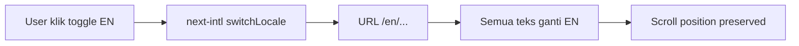
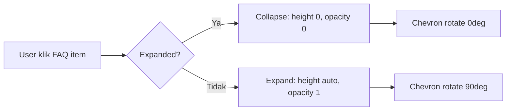

# UIUX_SPEC — PromptFlow Landing Page

> **Versi:** 1.0
> **Tanggal:** 2026-06-20
> **Deliverable:** Landing page `src/app/[locale]/page.tsx` — redesign total
> **Tech:** Next.js 15 + React 19 + Tailwind v4 + shadcn/ui + next-intl + Framer Motion
> **Root:** `C:\laragon\www\PromptFlow`
> **Docs dir:** `C:\laragon\www\PromptFlow\product-docs`
> **Rujukan:** PRD.md, SRS.md, RAG-CONTEXT.md, AGENTS.md

---

## Daftar Isi

1. Prinsip Desain & Brand Voice
2. Design Tokens (Konkret)
3. Komponen UI per Section
4. Layout & Grid
5. Navigasi & Information Architecture
6. User Flows (Mermaid)
7. Wireframe Deskriptif per Section
8. Iconografi & Aset
9. Aksesibilitas (WCAG 2.1 AA)
10. Interaction & Motion (Framer Motion)
11. Konten & Copy
12. Responsif & Kompatibilitas

---

## 1. Prinsip Desain & Brand Voice

### 1.1 Prinsip Desain

| ID | Prinsip | Manifestasi di Landing |
|---|---|---|
| D-01 | **10-second rule** | Hero: apa produk + kenapa + CTA dalam 10 detik |
| D-02 | **1:1 attention ratio** | 1 halaman = 1 tujuan (sign-up) |
| D-03 | **Benefit > feature** | Headline fokus hasil, bukan teknologi |
| D-04 | **Show don't tell** | Product mockup > text panjang |
| D-05 | **Trust through craft** | Dark mode + animasi halus + high contrast |
| D-06 | **Mobile-first** | Design dari 375px ke atas |
| D-07 | **Dwibahasa sinkron** | ID + EN paralel via next-intl |
| D-08 | **Reduced motion** | `prefers-reduced-motion` honored |

### 1.2 Aesthetic Direction

**Techno-Futurist Dark Mode** — Linear/Vercel pattern.

- Dark mode default (`#0a0a0a` bg)
- Single accent: violet `#7c3aed`
- High contrast, minimal, high-craft
- Scroll-triggered animations
- Bento grid layout

### 1.3 Brand Voice

| Aspek | Nilai |
|---|---|
| Tone | Profesional hangat, edukatif, ringkas |
| Bahasa | ID (default) + EN. Toggle via next-intl |
| AI copy | Netral — "AI menganalisis..." bukan "GPT-4o mendeteksi..." |
| Error message | Manusiawi + sebut aksi recovery |
| CTA copy | Aksi-oriented: "Mulai Gratis", "Lihat Demo" |

---

## 2. Design Tokens (Konkret)

### 2.1 Warna — Light Mode

| Token | Nilai | Kegunaan |
|---|---|---|
| `--background` | `#ffffff` | Body bg light |
| `--foreground` | `#0a0a0a` | Body text |
| `--primary` | `#7c3aed` | CTA, brand accent |
| `--primary-foreground` | `#ffffff` | Teks di atas primary |
| `--secondary` | `#f4f4f5` | Card bg, subtle surface |
| `--secondary-foreground` | `#18181b` | Teks di atas secondary |
| `--accent` | `#ede9fe` | Highlight, hover bg |
| `--accent-foreground` | `#5b21b6` | Teks di atas accent |
| `--muted` | `#f4f4f5` | Muted surface |
| `--muted-foreground` | `#71717a` | Helper text, captions |
| `--destructive` | `#ef4444` | Error, danger |
| `--destructive-foreground` | `#ffffff` | Teks di atas destructive |
| `--border` | `#e4e4e7` | Border, divider |
| `--ring` | `#7c3aed` | Focus ring |

### 2.2 Warna — Dark Mode (DEFAULT)

| Token | Nilai | Kegunaan |
|---|---|---|
| `--background` | `#0a0a0a` | Body bg dark |
| `--foreground` | `#fafafa` | Body text dark |
| `--primary` | `#a78bfa` | CTA, brand accent (lighter for contrast) |
| `--primary-foreground` | `#0a0a0a` | Teks di atas primary dark |
| `--secondary` | `#18181b` | Card bg dark |
| `--secondary-foreground` | `#fafafa` | Teks di atas secondary dark |
| `--accent` | `#3b0764` | Highlight dark |
| `--accent-foreground` | `#c4b5fd` | Teks di atas accent dark |
| `--muted` | `#18181b` | Muted surface dark |
| `--muted-foreground` | `#a1a1aa` | Helper text dark |
| `--destructive` | `#dc2626` | Error dark |
| `--destructive-foreground` | `#fafafa` | Teks di atas destructive dark |
| `--border` | `#27272a` | Border dark |
| `--ring` | `#a78bfa` | Focus ring dark |

### 2.3 Warna State

| State | Token | Nilai (dark) | Kegunaan |
|---|---|---|---|
| Success | `--success` | `#22c55e` | Status sukses |
| Success fg | `--success-foreground` | `#fafafa` | Teks success |
| Warning | `--warning` | `#f59e0b` | Status warning |
| Warning fg | `--warning-foreground` | `#0a0a0a` | Teks warning |
| Error | `--destructive` | `#dc2626` | Status error |
| Info | `--info` | `#3b82f6` | Status info |

### 2.4 Gradient

| Nama | Nilai CSS | Kegunaan |
|---|---|---|
| Hero gradient | `linear-gradient(135deg, #0a0a0a 0%, #1a0533 50%, #0a0a0a 100%)` | Hero bg |
| CTA gradient | `linear-gradient(135deg, #7c3aed 0%, #a78bfa 100%)` | Final CTA bg |
| Glow | `radial-gradient(ellipse at center, rgba(124,58,237,0.15) 0%, transparent 70%)` | Subtle glow effects |

### 2.5 Tipografi

| Level | Font | Size | Weight | Line-height | Letter-spacing | Kegunaan |
|---|---|---|---|---|---|---|
| Display | Inter | `3rem` (48px) | 800 | 1.1 | `-0.02em` | Hero headline (desktop) |
| Display-sm | Inter | `2.25rem` (36px) | 800 | 1.15 | `-0.015em` | Hero headline (mobile) |
| H1 | Inter | `1.875rem` (30px) | 700 | 1.2 | `-0.01em` | Section title |
| H2 | Inter | `1.5rem` (24px) | 700 | 1.3 | `0` | Sub-section title |
| H3 | Inter | `1.25rem` (20px) | 600 | 1.4 | `0` | Card title |
| Body-lg | Inter | `1.125rem` (18px) | 400 | 1.6 | `0` | Subheadline, body besar |
| Body | Inter | `1rem` (16px) | 400 | 1.6 | `0` | Body default |
| Body-sm | Inter | `0.875rem` (14px) | 400 | 1.5 | `0` | Caption, helper |
| Code | JetBrains Mono | `0.875rem` (14px) | 400 | 1.5 | `0` | Code snippet, mockup |

**Font stack:** `Inter, system-ui, -apple-system, sans-serif`
**Mono stack:** `JetBrains Mono, ui-monospace, monospace`

### 2.6 Spacing Scale (base 4px)

| Token | Tailwind | px | Kegunaan Landing |
|---|---|---|---|
| `space-1` | `p-1` / `m-1` | 4 | Micro gap |
| `space-2` | `p-2` / `m-2` | 8 | Inline gap |
| `space-3` | `p-3` / `m-3` | 12 | Small padding |
| `space-4` | `p-4` / `m-4` | 16 | Card padding, gap |
| `space-5` | `p-5` / `m-5` | 20 | Medium padding |
| `space-6` | `p-6` / `m-6` | 24 | Card gap, block gap |
| `space-8` | `p-8` / `m-8` | 32 | Section internal padding |
| `space-10` | `p-10` / `m-10` | 40 | Section padding |
| `space-12` | `p-12` / `m-12` | 48 | Section margin antar |
| `space-16` | `p-16` / `m-16` | 64 | Hero padding, large gap |
| `space-20` | `p-20` / `m-20` | 80 | Hero top/bottom padding |

### 2.7 Radius

| Token | Tailwind | px | Kegunaan |
|---|---|---|---|
| `--radius` | `rounded` | 6px | Default radius |
| Radius sm | `rounded-sm` | 4px | Badge, tag |
| Radius lg | `rounded-lg` | 8px | Card |
| Radius xl | `rounded-xl` | 12px | Browser mockup |
| Radius 2xl | `rounded-2xl` | 16px | Feature card |
| Radius full | `rounded-full` | 9999px | Avatar, pill button |

### 2.8 Shadow / Elevation

| Level | Tailwind | Nilai CSS | Kegunaan |
|---|---|---|---|
| Shadow sm | `shadow-sm` | `0 1px 2px rgba(0,0,0,0.3)` | Subtle card |
| Shadow | `shadow` | `0 1px 3px rgba(0,0,0,0.3), 0 1px 2px rgba(0,0,0,0.3)` | Card default |
| Shadow lg | `shadow-lg` | `0 10px 15px rgba(0,0,0,0.3), 0 4px 6px rgba(0,0,0,0.3)` | Elevated card |
| Shadow violet | custom | `0 0 20px rgba(124,58,237,0.15)` | Hover glow effect |
| Shadow violet-lg | custom | `0 0 40px rgba(124,58,237,0.2)` | CTA hover glow |

### 2.9 Border

| Token | Nilai | Kegunaan |
|---|---|---|
| Border default | `1px solid var(--border)` | Card, divider |
| Border violet | `1px solid rgba(124,58,237,0.3)` | Hover state card |
| Border violet strong | `1px solid rgba(124,58,237,0.5)` | Active focus |

### 2.10 Container & Max-width

| Breakpoint | Max-width | Padding | Kegunaan |
|---|---|---|---|
| Default | `1280px` | `px-4 sm:px-6 lg:px-8` | Main container |
| Narrow | `768px` | `px-4` | FAQ, single-column |
| Wide | `1440px` | `px-4 sm:px-6 lg:px-8` | Product demo |

---

## 3. Komponen UI per Section

### 3.1 Navbar

| Field | Detail |
|---|---|
| File | `src/components/landing/navbar.tsx` |
| Tipe | Client Component |
| Anatomy | Logo (kiri) + Nav links (tengah) + Language toggle + CTA (kanan) |
| Position | `sticky top-0 z-50` |
| Bg | Transparent -> `bg-background/80 backdrop-blur-md border-b border-border/50` setelah scroll 50px |
| Transition | `transition-all duration-300` |
| Logo | Text "PromptFlow" -- `text-xl font-bold text-primary` |
| Nav links | Fitur -> `#features`, Cara Kerja -> `#how-it-works`, FAQ -> `#faq` |
| Language toggle | `ID \| EN` -- pill style, active = `bg-primary text-primary-foreground` |
| CTA | "Mulai Gratis" -- shadcn Button `variant="default" size="sm"` filled violet |
| Mobile | Hamburger icon (Menu/X toggle) -> slide-in overlay |
| States | Default / Scrolled (solid bg) / Mobile open |
| Focus | `focus-visible:ring-2 focus-visible:ring-ring focus-visible:ring-offset-2` |

### 3.2 Hero

| Field | Detail |
|---|---|
| File | `src/components/landing/hero.tsx` |
| Tipe | Client Component |
| Layout | 2 kolom desktop (60% text, 40% mockup) / stack center mobile |
| Headline | `text-4xl sm:text-5xl lg:text-6xl font-extrabold tracking-tight` |
| Subheadline | `text-lg sm:text-xl text-muted-foreground max-w-2xl` |
| CTA Primary | "Mulai Gratis" -> `/register` -- shadcn Button `size="lg"` filled violet |
| CTA Secondary | "Masuk" -> `/login` -- shadcn Button `size="lg"` variant="outline"` |
| Product visual | BrowserMockup component (generate flow mockup) |
| Bg | Hero gradient + animated gradient shift |
| Animation | Fade-in + slide-up stagger (Framer Motion) |

### 3.3 Social Proof Bar

| Field | Detail |
|---|---|
| File | `src/components/landing/social-proof-bar.tsx` |
| Tipe | Client Component |
| Height | Max 200px |
| Content | "Dipercaya X kreator AI" + 5-6 logo placeholder + rating stars |
| Counter | AnimatedCounter: 0 -> 100+ |
| Logo style | Grayscale 60%, hover: full color + scale 1.02 |
| Rating | 4.8/5 -- "Beta tester" label |

### 3.4 Problem / Solution

| Field | Detail |
|---|---|
| File | `src/components/landing/problem-solution.tsx` |
| Tipe | Client Component |
| Layout | 2 kolom desktop, stack mobile |
| Pain (kiri) | 3 item: icon + judul + deskripsi. Bg `bg-red-500/10 border-red-500/20` |
| Solution (kanan) | 3 item: icon + judul + deskripsi. Bg `bg-primary/10 border-primary/20` |
| Mapping | Pain 1->Solution 1, Pain 2->Solution 2, Pain 3->Solution 3 |
| Animation | Stagger fade-in |

### 3.5 How It Works

| Field | Detail |
|---|---|
| File | `src/components/landing/how-it-works.tsx` |
| Tipe | Client Component |
| Layout | 3 kolom horizontal + connector arrows (desktop) / vertical timeline (mobile) |
| Step | Number besar (1/2/3) + icon + judul + 1 kalimat |
| Connector | Arrow SVG atau `->` character antar step |
| Step bg | `bg-primary/10 rounded-full` |

### 3.6 Features Bento Grid

| Field | Detail |
|---|---|
| File | `src/components/landing/features-bento.tsx` |
| Tipe | Client Component |
| Layout | Bento asymmetric -- `grid grid-cols-1 md:grid-cols-3 gap-4` |
| Card | `FeatureCard` component -- icon + judul + 1-2 kalimat |
| Col-span | Character Master = `md:col-span-2` (prominent) |
| Hover | `scale(1.02)` + violet border glow |
| Bg | `bg-secondary/50` subtle |
| Animation | Stagger fade-in on viewport |

### 3.7 Product Demo

| Field | Detail |
|---|---|
| File | `src/components/landing/product-demo.tsx` |
| Tipe | Client Component |
| Wrapper | `BrowserMockup` -- chrome frame (3 dot traffic light) |
| Content kiri | Form mockup: judul + durasi + gaya |
| Animation | Typing effect -> loading bar violet -> JSON snippet kanan |
| Loop | 8-10 detik, pause on hover |
| Mockup data | "Petualangan Kiko di Pasar Malam" / 60s / 3D |

### 3.8 Testimonials

| Field | Detail |
|---|---|
| File | `src/components/landing/testimonials.tsx` |
| Tipe | Client Component |
| Layout | 3 kolom desktop, 1 kolom carousel mobile |
| Card | `TestimonialCard` -- avatar (initials violet circle) + nama + role + quote |
| Quote | Max 25 kata. Pain -> outcome |
| Label | "Cerita dari beta tester" (transparansi placeholder) |
| Bg | `bg-secondary/30` |

### 3.9 FAQ

| Field | Detail |
|---|---|
| File | `src/components/landing/faq.tsx` |
| Tipe | Client Component |
| Component | shadcn/ui Accordion (Radix) |
| Items | 5-6 Q&A |
| Default | Collapsed. Multi-open allowed |
| Animation | Smooth expand (height auto + opacity). Chevron rotate 90deg |
| Max-width | `max-w-3xl mx-auto` |

### 3.10 Final CTA

| Field | Detail |
|---|---|
| File | `src/components/landing/final-cta.tsx` |
| Tipe | Client Component |
| Bg | Full-width CTA gradient |
| Content | Headline besar + subheadline + CTA white-on-violet + disclaimer |
| CTA | "Mulai Gratis" -- Button `size="lg"` white bg |
| Disclaimer | "Tanpa kartu kredit. Tanpa komitmen." -- `text-sm text-white/70` |

### 3.11 Footer

| Field | Detail |
|---|---|
| File | `src/components/landing/footer.tsx` |
| Tipe | Server Component |
| Layout | 4 kolom desktop, 2 kolom tablet, 1 kolom mobile |
| Bg | `bg-background border-t border-border` |
| Content | Brand + Product links + Legal links + Social icons |
| Copyright | "2026 PromptFlow" |

### 3.12 Reusable Components

| Component | File | Tipe | Fungsi |
|---|---|---|---|
| SectionWrapper | `section-wrapper.tsx` | Client | `whileInView` + stagger wrapper |
| AnimatedCounter | `animated-counter.tsx` | Client | Counter Framer Motion |
| BrowserMockup | `browser-mockup.tsx` | Client | Browser chrome frame |
| FeatureCard | `feature-card.tsx` | Client | 1 feature card hover |
| TestimonialCard | `testimonial-card.tsx` | Client | 1 testimonial card |
| FaqItem | `faq-item.tsx` | Client | 1 accordion item |
| LogoPlaceholder | `logo-placeholder.tsx` | Server | SVG/text logo placeholder |

---

## 4. Layout & Grid

### 4.1 Grid System

| Property | Nilai |
|---|---|
| Columns | 12 (Tailwind grid-cols-12) |
| Gutter | `gap-4` (16px) / `gap-6` (24px) |
| Margin | `px-4 sm:px-6 lg:px-8` |
| Container | `max-w-7xl mx-auto` (1280px) |

### 4.2 Breakpoints

| Name | Min-width | Tailwind prefix | Layout |
|---|---|---|---|
| Mobile | 0px | (default) | 1 kolom, stack |
| Small | 640px | `sm:` | 1 kolom, minor adjust |
| Tablet | 768px | `md:` | 2 kolom where applicable |
| Desktop | 1024px | `lg:` | Full layout, 3 kolom bento |
| Large | 1280px | `xl:` | Max-width constrained |
| X-Large | 1536px | `2xl:` | Max-width constrained |

### 4.3 Responsive Strategy

**Mobile-first.** Semua styling dimulai dari mobile (0px), breakpoint tambah kolom/fitur di atas.

| Section | Mobile (<768) | Tablet (768-1023) | Desktop (1024+) |
|---|---|---|---|
| Navbar | Hamburger + logo + CTA | Kompak horizontal | Full horizontal |
| Hero | Stack center, mockup bawah | Stack center | 2 kolom (60/40) |
| Social Proof | Scroll 4 logo | Scroll 6 logo | Horizontal row 6 |
| Problem/Solution | Stack | 2 kolom | 2 kolom |
| How It Works | Vertical timeline | 3 kolom stacked | 3 kolom + connector |
| Features Bento | Bento 1 kolom | Bento 2 kolom | Bento 3 kolom |
| Product Demo | overflow-x-auto | Full-width | Full-width max-w-5xl |
| Testimonials | 1 kolom carousel | 3 kolom stacked | 3 kolom |
| FAQ | Accordion full | Accordion max-w-3xl | Accordion max-w-3xl |
| Final CTA | Full-width | Full-width | Full-width |
| Footer | 1 kolom stack | 2 kolom | 4 kolom |

### 4.4 Safe Area

- Top: `pt-16` (64px) untuk navbar offset saat anchor scroll
- Bottom: `pb-16` (64px) untuk footer breathing room
- Mobile: `env(safe-area-inset-bottom)` untuk notch devices

---

## 5. Navigasi & Information Architecture

### 5.1 Struktur Menu

```
Navbar
+-- Logo "PromptFlow" -> #top
+-- Nav Links (anchor scroll)
|   +-- Fitur -> #features
|   +-- Cara Kerja -> #how-it-works
|   +-- FAQ -> #faq
+-- Language Toggle (ID | EN)
+-- CTA "Mulai Gratis" -> /register
```

### 5.2 Section Flow (atas ke bawah)

```
1. Navbar        -- sticky, transparent->solid
2. Hero          -- headline + sub + 2 CTA + mockup
3. SocialProof   -- trust signal
4. ProblemSolution -- pain -> solution
5. HowItWorks    -- 3 step
6. FeaturesBento -- 6 features
7. ProductDemo   -- browser mockup animation
8. Testimonials  -- 3 quotes
9. FAQ           -- 5-6 Q&A
10. FinalCTA     -- closing conversion
11. Footer       -- nav + legal
```

### 5.3 Anchor Mapping

| Anchor ID | Section | Nav Link |
|---|---|---|
| `#top` | Hero (top) | Logo click |
| `#features` | Features Bento Grid | "Fitur" |
| `#how-it-works` | How It Works | "Cara Kerja" |
| `#faq` | FAQ | "FAQ" |

### 5.4 User Flow Utama

```
Visitor -> Landing Page -> Paham value (< 60 detik) -> Klik "Mulai Gratis" -> /register -> Sign-up
```

---

## 6. User Flows (Mermaid)

### 6.1 Flow: Visitor -> Sign-up

```mermaid
flowchart TD
    A[Visitor buka /id] --> B[Lihat Hero: apa + kenapa + CTA]
    B --> C{Scroll?}
    C -->|Ya| D[Lihat Social Proof: trust signal]
    D --> E[Lihat Problem/Solution: resonansi]
    E --> F[Lihat How It Works: edukasi]
    F --> G[Lihat Features: diferensiasi]
    G --> H[Lihat Product Demo: bukti]
    H --> I[Lihat Testimonials: social proof]
    I --> J[Lihat FAQ: objection handling]
    J --> K[Lihat Final CTA: closing]
    C -->|Tidak| K
    K --> L{Klik CTA?}
    L -->|Mulai Gratis| M[/register - Sign-up]
    L -->|Masuk| N[/login - Login]
    L -->|Tidak| O[Exit / bounce]
```

### 6.2 Flow: Language Toggle



### 6.3 Flow: FAQ Expand



---

## 7. Wireframe Deskriptif per Section

### 7.1 Navbar

```
Desktop:
+------------------------------------------------------------------+
| [PromptFlow]    Fitur  Cara Kerja  FAQ    [ID|EN]  [Mulai Gratis]|
+------------------------------------------------------------------+
  logo          nav links (center)         toggle    CTA (right)

Mobile:
+---------------------------+
| [hamburger]  PromptFlow  [Mulai Gratis] |
+---------------------------+
```

### 7.2 Hero

```
Desktop (2 kolom):
+------------------------------------------------------------------+
|                                                                    |
|   Satu judul ke paket           +---------------------------+    |
|   prompt animasi siap pakai      |  Browser Mockup           |    |
|                                  |  [traffic light dots]     |    |
|   Karakter konsisten lintas      |                           |    |
|   adegan. Multi-provider LLM.   |  Judul: Petualangan Kiko  |    |
|   Export JSON / Markdown.        |  Durasi: 60s | Gaya: 3D  |    |
|                                  |                           |    |
|   [Mulai Gratis]  [Masuk]       |  -> Loading... -> JSON   |    |
|                                  +---------------------------+    |
+------------------------------------------------------------------+

Mobile (stack):
+---------------------------+
|   Satu judul ke paket     |
|   prompt animasi siap     |
|   pakai                   |
|   Karakter konsisten...   |
|   [Mulai Gratis]          |
|   [Masuk]                 |
|   +-------------------+  |
|   | Browser Mockup    |  |
|   +-------------------+  |
+---------------------------+
```

### 7.3 Social Proof Bar

```
+------------------------------------------------------------------+
|         Dipercaya 100+ kreator AI    stars 4.8/5                  |
|  [Logo1]  [Logo2]  [Logo3]  [Logo4]  [Logo5]  [Logo6]            |
|  (grayscale, hover -> full color)                                  |
+------------------------------------------------------------------+
```

### 7.4 Problem / Solution

```
Desktop (2 kolom):
+-----------------------------------+-----------------------------------+
| PROBLEM                           | SOLUSI                             |
|                                   |                                     |
| clock Susun prompt per adegan     | zap Generate paket instan           |
| = 30+ menit manual                | dari satu judul                    |
|                                   |                                     |
| users Karakter inkonsisten        | fingerprint Character master        |
| lintas adegan                     | otomatis dirujuk                    |
|                                   |                                     |
| server Ketergantungan 1 provider  | shuffle Multi-provider fleksibel    |
+-----------------------------------+-----------------------------------+
```

### 7.5 How It Works

```
Desktop (3 kolom + connector):
+-------------------+     +-------------------+     +-------------------+
|        1          | --> |        2          | --> |        3          |
|    [PenLine]      |     |    [Wand2]        |     |   [FileDown]      |
| Input             |     | Generate           |     | Export            |
| Masukkan judul,   |     | AI susun paket    |     | Download JSON     |
| durasi, dan gaya  |     | prompt lengkap    |     | atau Markdown     |
+-------------------+     +-------------------+     +-------------------+

Mobile (vertical timeline):
+-------------------+
| 1 [PenLine] Input |
| Masukkan judul... |
+-------- | --------+
          |
+-------- | --------+
| 2 [Wand2] Generate|
| AI susun paket... |
+-------- | --------+
          |
+-------- | --------+
| 3 [FileDown] Exp. |
| Download JSON...  |
+-------------------+
```

### 7.6 Features Bento Grid

```
Desktop (bento asymmetric):
+-------------------+---------------------------+
| 1. Input Minimal  | 2. Character Master       |
| [Sparkles]        | [Brain]                   |
| Masukkan judul... | Karakter terstruktur...   |
| (col-span-1)      | (col-span-2)              |
+-------------------+---------------------------+
| 3. Multi-Provider | 4. Export JSON+MD         |
| [Layers]          | [Download]                |
| Pilih Ollama...   | Output terstruktur...     |
+-------------------+---------------------------+
| 5. Real-time Logs | 6. Upload Referensi       |
| [Activity]        | [Upload]                  |
| Pantau proses...  | Upload gambar...          |
+-------------------+---------------------------+
```

### 7.7 Product Demo

```
+------------------------------------------------------------------+
| [o o o] Browser Mockup -- PromptFlow Generate                     |
+------------------------------------------------------------------+
|  INPUT (kiri)              |  OUTPUT (kanan)                      |
|  +-------------------+    |  +---------------------------+       |
|  | Judul:            |    |  | {                         |       |
|  | Petualangan Kiko  |    |  |   "title": "Petualangan   |       |
|  | di Pasar Malam    |    |  |    Kiko di Pasar Malam",  |       |
|  | Durasi: 60s       |    |  |   "scenes": [             |       |
|  | Gaya: 3D          |    |  |     { "order": 1, ... }   |       |
|  | [Generate ->]     |    |  |   ]                      |       |
|  +-------------------+    |  +---------------------------+       |
|  (typing animation loop)  |  (JSON syntax highlight violet)     |
+------------------------------------------------------------------+
```

### 7.8 Testimonials

```
+-------------------+-------------------+-------------------+
| (R) Rian          | (B) Bumi          | (S) Sinta         |
| Kreator Solo      | Studio Animasi    | Edukator          |
|                   |                   |                   |
| "Hemat 3 jam per  | "Akhirnya        | "Murid paham      |
|  video. Generate  |  karakter konsis- |  dalam 5 menit."  |
|  prompt jadi      |  ten lintas       |                   |
|  instan."         |  adegan."         |                   |
+-------------------+-------------------+-------------------+
Label: "Cerita dari beta tester"
```

### 7.9 FAQ

```
+------------------------------------------------------------------+
| Pertanyaan Umum                                                   |
|                                                                    |
| > Provider LLM apa saja yang didukung?                       [v]  |
| > Apakah PromptFlow gratis?                                 [v]  |
| > Bagaimana konsistensi karakter dijamin?                   [v]  |
| > Apakah data saya aman?                                    [v]  |
| > Bisa dipakai di mobile?                                   [v]  |
| > Bahasa apa saja yang didukung?                            [v]  |
+------------------------------------------------------------------+
(Click -> expand: jawaban max 2 kalimat, smooth animation)
```

### 7.10 Final CTA

```
+------------------------------------------------------------------+
|  (full-width violet gradient bg)                                   |
|                                                                    |
|    Mulai buat paket prompt pertama dalam 60 detik.                |
|                                                                    |
|    [Mulai Gratis]                                                  |
|                                                                    |
|    Tanpa kartu kredit. Tanpa komitmen.                            |
+------------------------------------------------------------------+
```

### 7.11 Footer

```
Desktop (4 kolom):
+------------------------------------------------------------------+
| PromptFlow        Product         Legal          Social            |
| Workflow engine   Fitur           Kebijakan      [GitHub]          |
| otomasi prompt    Cara Kerja      Privasi        [Twitter/X]       |
| animasi AI.       FAQ             Syarat         [ID|EN]           |
|                                                                    |
| (c) 2026 PromptFlow. All rights reserved.                         |
+------------------------------------------------------------------+
```

---

## 8. Iconografi & Aset

### 8.1 Icon Library

**lucide-react** (v0.468.0, sudah ada)

| Section | Icon | Kegunaan |
|---|---|---|
| Hero | `Sparkles` | Brand / magic |
| Features | `Sparkles` | Input Minimal |
| Features | `Brain` | Character Master |
| Features | `Layers` | Multi-Provider LLM |
| Features | `Download` | Export JSON+MD |
| Features | `Activity` | Real-time Logs |
| Features | `Upload` | Upload Referensi |
| How It Works | `PenLine` | Step 1 Input |
| How It Works | `Wand2` | Step 2 Generate |
| How It Works | `FileDown` | Step 3 Export |
| Problem | `Clock` | Pain: waktu |
| Problem | `Users` | Pain: karakter |
| Problem | `Server` | Pain: provider |
| Solution | `Zap` | Solusi: instan |
| Solution | `Fingerprint` | Solusi: konsistensi |
| Solution | `Shuffle` | Solusi: multi-provider |
| FAQ | `ChevronDown` | Accordion expand |
| Footer | `Github` | Social link |
| Footer | `Twitter` | Social link |
| Navbar | `Menu` | Hamburger mobile |
| Navbar | `X` | Close mobile menu |
| Navbar | `Globe` | Language toggle |

### 8.2 Logo

**Text-based:** "PromptFlow" -- `text-xl font-bold text-primary`

ASUMSI: Tidak ada logo ilustrasi PromptFlow khusus (RAG-CONTEXT GAP-02). BRD OOS-01 confirm text-based.

### 8.3 Aset Placeholder

| Aset | Status | Solusi |
|---|---|---|
| Logo PromptFlow | TIDAK ADA | Text-based violet styling |
| Social proof logos | TIDAK ADA | SVG text brand fiktif |
| Avatar testimonial | TIDAK ADA | Initials dalam lingkaran violet |
| Product screenshot | TIDAK ADA | Text-based browser mockup |
| OG image | TIDAK ADA | Buat: violet gradient + PromptFlow + tagline 1200x630 |

### 8.4 Aturan Pemakaian Icon

- Ukuran default: `w-5 h-5` (20px)
- Ukuran besar (hero/features): `w-6 h-6` (24px) atau `w-8 h-8` (32px)
- Warna: `text-primary` untuk accent, `text-muted-foreground` untuk subtle
- Stroke width: default (1.5px dari lucide)

---

## 9. Aksesibilitas (WCAG 2.1 AA)

### 9.1 Target Compliance

| Level | Target |
|---|---|
| WCAG | 2.1 AA |
| axe-core | 0 critical violation |

### 9.2 Kontras

| Element | Ratio Minimum | Token |
|---|---|---|
| Body text | >= 4.5:1 | `--foreground` on `--background` |
| Large text (>= 18px bold) | >= 3:1 | Headlines |
| CTA button | >= 4.5:1 | `--primary-foreground` on `--primary` |
| Focus ring | >= 3:1 | `--ring` on `--background` |
| Placeholder text | >= 4.5:1 | `--muted-foreground` on `--background` |

### 9.3 Keyboard Navigation

| Requirement | Implementasi |
|---|---|
| Tab order | Logical: navbar -> hero CTA -> sections -> footer |
| Focus visible | `focus-visible:ring-2 focus-visible:ring-ring focus-visible:ring-offset-2` |
| Skip link | `<a href="#main" class="sr-only focus:not-sr-only">Skip to content</a>` |
| Enter/Space | Toggle FAQ accordion, activate links |
| Escape | Close mobile menu |
| Arrow keys | Navigate within FAQ accordion |

### 9.4 Screen Reader

| Requirement | Implementasi |
|---|---|
| Landmarks | `<header>`, `<main>`, `<footer>`, `<nav>` |
| ARIA labels | `aria-label="Main navigation"`, `aria-expanded` FAQ |
| ARIA live | Counter animation: `aria-live="polite"` |
| Alt text | Semua image punya alt atau `aria-hidden="true"` |
| Heading hierarchy | h1 -> h2 -> h3 (tidak skip level) |

### 9.5 Reduced Motion

| Requirement | Implementasi |
|---|---|
| `prefers-reduced-motion` | Respect via Framer Motion `useReducedMotion()` |
| Fallback | Semua animasi disabled. Content tetap visible. |
| Existing code | `globals.css:74-80` sudah ada |

### 9.6 Additional

| Requirement | Implementasi |
|---|---|
| `html lang` | `id` atau `en` per locale |
| Form labels | Semua input punya label (landing = minimal form) |
| Touch targets | Min 44x44px untuk semua interactive element |
| Zoom | Layout tidak pecah di 200% zoom |

---

## 10. Interaction & Motion (Framer Motion)

### 10.1 Library

| Package | Version | Size | Status |
|---|---|---|---|
| framer-motion | ^11.x | ~30KB gzipped | WAJIB INSTALL |

### 10.2 Animation Patterns

| Pattern | Kapan Pakai | Implementasi | Durasi |
|---|---|---|---|
| **Fade-in scroll** | Setiap section masuk viewport | `whileInView={{ opacity: 1, y: 0 }}` + `initial={{ opacity: 0, y: 20 }}` + `viewport={{ once: true }}` | 600ms ease-out |
| **Stagger children** | Feature cards, testimonial cards | Parent `variants` + `transition={{ staggerChildren: 0.1 }}` | 100ms delay per child |
| **Hover scale** | Feature cards, CTA buttons | `whileHover={{ scale: 1.02 }}` + `whileTap={{ scale: 0.98 }}` | 200ms spring |
| **Gradient shift** | Hero background | CSS `@keyframes` + `background-size: 200%` + `animation: gradientShift 8s ease infinite` | 8s loop |
| **Counter** | Stats numbers (100+) | `useMotionValue` + `useTransform` + `animate(0, target)` | 2000ms ease-out |
| **Typing effect** | Product demo input | Framer Motion word-by-word atau CSS `steps()` | 3000ms |
| **Smooth scroll** | Nav anchor links | CSS `scroll-behavior: smooth` + `scrollIntoView({ behavior: 'smooth' })` | 500ms |
| **Accordion** | FAQ expand/collapse | Height auto + opacity transition | 300ms ease-in-out |
| **Chevron rotate** | FAQ open/close | `rotate: 90deg` on open | 300ms |

### 10.3 SectionWrapper Pattern

```tsx
// src/components/landing/section-wrapper.tsx
'use client';
import { motion } from 'framer-motion';

const variants = {
  hidden: { opacity: 0, y: 20 },
  visible: { opacity: 1, y: 0 },
};

export function SectionWrapper({ children, className }: Props) {
  return (
    <motion.div
      initial="hidden"
      whileInView="visible"
      viewport={{ once: true, margin: '-100px' }}
      variants={variants}
      transition={{ duration: 0.6, ease: 'easeOut' }}
      className={className}
    >
      {children}
    </motion.div>
  );
}
```

### 10.4 Performance Rules

| Rule | Detail |
|---|---|
| GPU-accelerated only | `transform`, `opacity` -- no `width`, `height`, `top` |
| No layout shift | Animations shouldn't cause CLS (<= 0.1) |
| Lazy load | Below-fold animations -> load on intersection |
| Bundle | Total tambahan <= 50KB gzipped |
| Reduced motion | All animations disabled when OS setting active |

### 10.5 Loading / Empty / Error States

| State | Implementasi |
|---|---|
| **Loading** | Skeleton placeholder (shadcn Skeleton) saat page load |
| **Empty** | Tidak applicable -- landing page = static content |
| **Error** | Tidak applicable -- landing page = frontend only, no API call |
| **Toast** | Tidak applicable -- no form submission di landing |

---

## 11. Konten & Copy

### 11.1 Tone & Style

| Aspek | Aturan |
|---|---|
| Tone | Profesional hangat, edukatif, ringkas |
| Panjang headline | Max 10 kata |
| Panjang subheadline | Max 25 kata |
| Panjang body | Max 3 kalimat per paragraph |
| Panjang quote | Max 25 kata |
| Panjang FAQ answer | Max 2 kalimat |

### 11.2 Label Konsistensi

| Istilah | Pakai | Jangan Pakai |
|---|---|---|
| Produk | PromptFlow | prompt flow, Prompt Flow |
| Fitur generate | Generate paket prompt | Generate dokument, Generate file |
| Output | Paket prompt | Output file, Hasil generate |
| Provider | Provider LLM | AI provider, Model provider |
| Karakter | Character master | Character template, Karakter profile |
| Export | Export JSON / Markdown | Download, Ekspor |
| CTA | Mulai Gratis | Daftar Sekarang, Sign Up |
| Bahasa | Bahasa Indonesia | Bahasa ID, Indonesian |

### 11.3 Pesan Error (untuk FAQ / edge case)

| Context | Pesan |
|---|---|
| FAQ placeholder | "Jawaban akan tersedia setelah produk launch." |
| Social proof | "Dipercaya ratusan kreator AI" (placeholder jujur) |
| Testimonial label | "Cerita dari beta tester" |

### 11.4 i18n

| Aspek | Detail |
|---|---|
| Library | next-intl ^3.26.0 |
| Namespace | `landing.*` |
| Default locale | `id` |
| Toggle | `ID \| EN` |
| Keys target | 60+ keys di `messages/id.json` dan `messages/en.json` |
| Rule | Tidak ada hardcoded text (L09). Semua via `useTranslations('landing')` |
| CTA | Kontekstual per bahasa, bukan translate literal |

---

## 12. Responsif & Kompatibilitas

### 12.1 Viewport Testing

| Viewport | Width | Target |
|---|---|---|
| Mobile S | 375px | No horizontal scroll, CTA thumb-zone, text legible |
| Mobile L | 425px | Comfortable reading |
| Tablet | 768px | 2 kolom where applicable |
| Laptop | 1024px | Full layout |
| Desktop | 1440px | Max-width constrained |

### 12.2 Browser Compatibility

| Browser | Minimum Version | Status |
|---|---|---|
| Chrome | 100+ | Full support |
| Firefox | 100+ | Full support |
| Safari | 15+ | Full support |
| Edge | 100+ | Full support |
| Mobile Chrome | 100+ | Full support |
| Mobile Safari | 15+ | Full support |

### 12.3 OS Compatibility

| OS | Status |
|---|---|
| Windows 10+ | Full support |
| macOS 12+ | Full support |
| iOS 15+ | Full support |
| Android 10+ | Full support |

### 12.4 Performance Targets

| Metric | Target | Sumber |
|---|---|---|
| Lighthouse Performance (mobile) | >= 85 | BRD KPI-08 |
| LCP | <= 2.5s | BRD KPI-09 |
| CLS | <= 0.1 | BRD KPI-10 |
| TBT | <= 200ms | PRD NFR-P04 |
| FCP | <= 1.8s | PRD NFR-P07 |
| Bundle tambahan | <= 50KB gzipped | PRD NFR-P05 |

---

## Ringkasan

| Aspek | Jumlah |
|---|---|
| Section components | 11 (navbar, hero, social-proof, problem-solution, how-it-works, features-bento, product-demo, testimonials, faq, final-cta, footer) |
| Reusable components | 7 (section-wrapper, animated-counter, browser-mockup, feature-card, testimonial-card, faq-item, logo-placeholder) |
| Design tokens | 50+ (warna 28, tipografi 9, spacing 11, radius 6, shadow 5, border 3, container 3) |
| Animation patterns | 9 (fade-in, stagger, hover, gradient, counter, typing, scroll, accordion, chevron) |
| i18n keys target | 60+ |
| Asumsi | 12 (dokumentasi di setiap section terkait) |

---

> **Dokumen ini = UI/UX specification untuk landing page PromptFlow. Eksekutor baca ini + PRD.md + SRS.md sebelum coding. Semua design tokens konkret (nilai nyata: HEX, px, ms). Setiap komponen di-sebut nama folder konsisten dengan SRS 6.1.**

**Dibuat oleh:** docgen-uiux subagent
**Tanggal:** 2026-06-20
**Versi:** 1.0 (Landing Page Focus)
