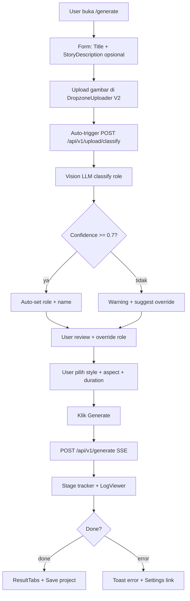
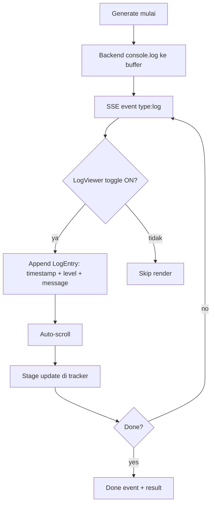
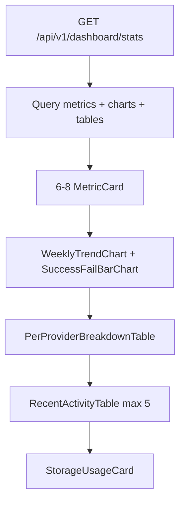
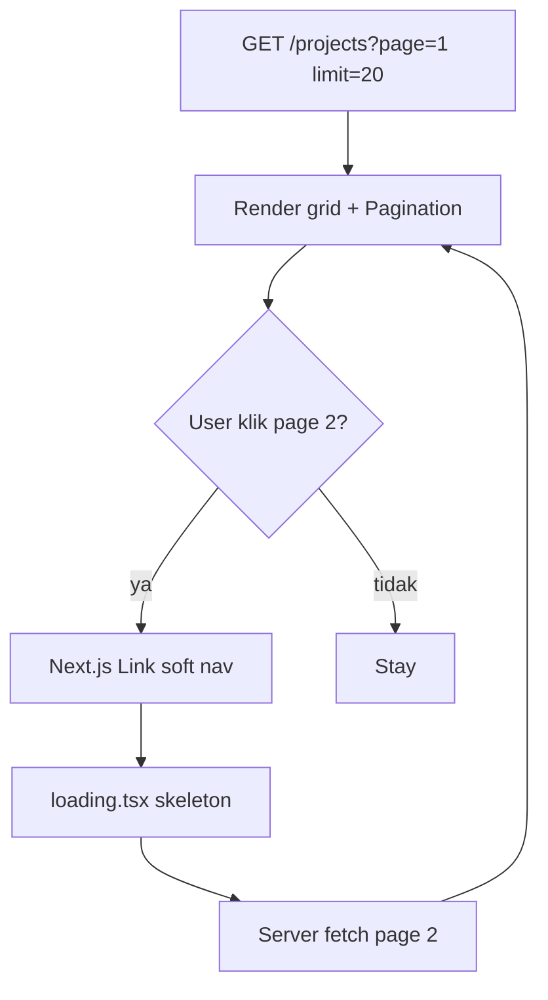

# UIUX Specification V2.0 — PromptFlow
## Workflow Engine Otomasi Prompt Animasi AI

> **Versi:** 2.0
> **Dibuat:** 2026-06-20
> **Status:** Final
> **Pemilik:** Bos Agrian
> **Sumber kebenaran:** `product-docs/RAG-CONTEXT.md` + `product-docs/PRD.md` V2.0 + `product-docs/SRS.md` V2.0 + `product-docs/PROJECT_ARCHITECTURE.md`
> **Root proyek:** `C:\laragon\www\PromptFlow`
> **GitHub:** https://github.com/agrianwahab29/promptflow.git
> **Catatan:** V2 OVERWRITE V1. V1 design tokens dipertahankan (`--primary #7c3aed`, Inter + JetBrains Mono, spacing 4px base, radius 6px). Fokus V2: upload di generate page + role classification + story description + real-time logs + dashboard enrichment + UI consistency (loading.tsx/error.tsx/Suspense/pagination).

---

## Daftar Isi

1. Pendahuluan, Prinsip Desain & Brand Voice
2. Design System (Design Tokens)
3. Inventory Komponen UI V2
4. Layout & Grid
5. Navigasi & Information Architecture
6. User Flows (Mermaid)
7. Wireframes Deskriptif V2
8. Iconografi & Aset
9. Aksesibilitas
10. Interaction & Motion
11. Konten & Copy & i18n
12. Responsif & Kompatibilitas
13. Empty / Error / Loading States
14. Asumsi UIUX V2 & Referensi
15. Verifikasi Implementasi

---

## 1. Pendahuluan, Prinsip Desain & Brand Voice

### 1.1 Tujuan Dokumen

UIUX_SPEC V2 menjabarkan design system + spesifikasi UI konkret untuk upgrade V2 PromptFlow. V1 sudah built & berjalan di Laragon (9 tabel DB, 21 endpoint API, shadcn/ui + Tailwind v4). V2 menambah 8 fitur UI utama (lihat 1.5) yang mengubah alur kerja dari "upload di project detail" menjadi "upload di generate page + AI classification + real-time logs + dashboard enrichment".

Tujuan: agent eksekutor frontend bisa langsung mengkode tanpa menebak style/struktur/token. Output aplikasi = teks prompt terstruktur (JSON + export markdown), BUKAN file media.

### 1.2 Persona Sasaran UI

| Persona | Implikasi UI V2 |
|---|---|
| Kreator Solo ("Rian") | Upload + generate 1 halaman, AI classification transparan, real-time logs untuk transparansi proses |
| Indie Studio ("Bumi Animasi") | Dashboard monitoring produktivitas, per-provider breakdown, paginate untuk multi-proyek |
| Edukator ("Bu Sinta") | Loading states jelas, error boundaries recover-able, dwibahasa ID+EN, pesan moral |

### 1.3 Prinsip Desain V2

1. **Workflow-first** (V1) - 1 judul ke 1 paket prompt. V2: 1 halaman upload + generate.
2. **Konsistensi visual karakter** (V1) - Tab Karakter + warning mismatch FR-12.
3. **Streaming-first UX** (V1) - Partial real-time per stage.
4. **Copy-everywhere** (V1) - CopyButton per prompt item.
5. **Dwibahasa default** (V1) - ID default, EN toggle, persist cookie.
6. **Aksesibilitas WAJIB** (V1) - WCAG 2.1 AA, keyboard, ARIA.
7. **Dark mode** (V1) - Token DARK tetap di-define, toggle di-OOS V2 (deferred V3).
8. **Transparency V2** - Real-time processing logs (collapsible) transparansi proses LLM.
9. **AI-augmented V2** - Upload gambar ke Vision LLM auto-classify ke user override. AI = ko-pilot.
10. **Optimistic feedback V2** - Loading.tsx + Suspense + skeleton + disabled state.

### 1.4 Brand Voice

- **Tone:** Profesional hangat, edukatif, ringkas. Tidak jargon AI/LLM berlebih.
- **Bahasa:** Dwibahasa ID+EN. ID default untuk persona lokal.
- **Istilah konsisten:** "Proyek"/"Project", "Adegan"/"Scene", "Karakter"/"Character", "Voiceover" (sama), "Image Prompt" (sama), "Provider" (sama), "Pesan Moral"/"Moral Message", "Referensi"/"Reference", "Klasifikasi"/"Classification", "Catatan Proses"/"Process Logs".
- **Pesan error:** manusiawi + sebut aksi recovery.
- **AI:** Bahasa netral ("AI menganalisis..." bukan "GPT-4o mendeteksi...").

### 1.5 V2 Fitur UI yang Ditambahkan

| ID | Fitur UI V2 | Lokasi | Sitasi |
|---|---|---|---|
| F-V2-UI-01 | DropzoneUploader inline di generate form | `/generate` | RAG-CONTEXT S9 V2-1 |
| F-V2-UI-02 | AssetPreviewList (thumbnail + role badge + override) | `/generate` | PRD V2.0 S6.1 |
| F-V2-UI-03 | ClassificationResult (AI auto-classify + manual override + confidence) | `/generate` | RAG-CONTEXT S9 V2-3 |
| F-V2-UI-04 | Extended role select (6 opsi) | `/generate` | RAG-CONTEXT S9 V2-2 |
| F-V2-UI-05 | StoryDescriptionTextarea (max 500 char) | `/generate` | RAG-CONTEXT S9 V2-4 |
| F-V2-UI-06 | LogViewer (Collapsible panel + Switch toggle) | `/generate` | RAG-CONTEXT S9 V2-5 |
| F-V2-UI-07 | Dashboard MetricCard (6-8 kartu) | `/dashboard` | RAG-CONTEXT S9 V2-6 |
| F-V2-UI-08 | Dashboard Charts (line + bar via Recharts) | `/dashboard` | PRD V2.0 S10.2 |
| F-V2-UI-09 | PerProviderBreakdown table | `/dashboard` | RAG-CONTEXT S9 V2-6 |
| F-V2-UI-10 | RecentActivityTable (5 project terbaru) | `/dashboard` | RAG-CONTEXT S9 V2-6 |
| F-V2-UI-11 | Pagination di projects list | `/projects` | RAG-CONTEXT S9 V2-9 |
| F-V2-UI-12 | loading.tsx per page group | semua | RAG-CONTEXT S9 V2-7 |
| F-V2-UI-13 | error.tsx boundary per page group | semua | RAG-CONTEXT S11 GAP-13 |
| F-V2-UI-14 | StoryDescription display di project detail | `/projects/[id]` | RAG-CONTEXT S9 V2-1 |
| F-V2-UI-15 | AI classification badge di refs | `/projects/[id]` | RAG-CONTEXT S9 V2-3 |

---

## 2. Design System (Design Tokens)

> V2 mempertahankan SEMUA token V1. Tambah token minor untuk state V2. Dark mode token DIDEFINISIKAN tapi toggle di-OOS-kan V2 (deferred V3).

### 2.1 Warna — Palet

| Token | Light | Dark | Kegunaan |
|---|---|---|---|
| `--background` | `#ffffff` | `#0a0a0a` | Body bg |
| `--foreground` | `#0a0a0a` | `#fafafa` | Body text |
| `--card` | `#ffffff` | `#0f0f0f` | Card bg |
| `--card-foreground` | `#0a0a0a` | `#fafafa` | Card text |
| `--primary` (brand) | `#7c3aed` | `#a78bfa` | CTA, brand |
| `--primary-foreground` | `#ffffff` | `#0a0a0a` | Teks di atas primary |
| `--secondary` | `#f4f4f5` | `#27272a` | CTA sekunder, chip |
| `--secondary-foreground` | `#18181b` | `#fafafa` | Teks di atas secondary |
| `--muted` | `#f4f4f5` | `#27272a` | Skeleton, disabled bg |
| `--muted-foreground` | `#71717a` | `#a1a1aa` | Helper text |
| `--accent` | `#ede9fe` | `#3b0764` | Highlight, hover |
| `--accent-foreground` | `#4c1d95` | `#ddd6fe` | Teks di atas accent |
| `--destructive` | `#dc2626` | `#ef4444` | Error, delete |
| `--destructive-foreground` | `#ffffff` | `#fafafa` | Teks di atas destructive |
| `--success` | `#16a34a` | `#22c55e` | Success toast, badge |
| `--warning` | `#d97706` | `#f59e0b` | Mismatch FR-12, warning |
| `--info` | `#2563eb` | `#3b82f6` | Info toast, log info |
| `--border` | `#e4e4e7` | `#27272a` | Border, divider |
| `--input` | `#e4e4e7` | `#27272a` | Border input field |
| `--ring` | `#7c3aed` | `#a78bfa` | Focus ring |

**Token V2 baru:**

| Token | Light | Dark | Kegunaan V2 |
|---|---|---|---|
| `--log-info-bg` | `#eff6ff` | `#172554` | Background log info |
| `--log-warn-bg` | `#fffbeb` | `#451a03` | Background log warn |
| `--log-error-bg` | `#fef2f2` | `#450a0a` | Background log error |
| `--confidence-low` | `#dc2626` | `#ef4444` | Confidence < 0.5 |
| `--confidence-mid` | `#d97706` | `#f59e0b` | Confidence 0.5-0.7 |
| `--confidence-high` | `#16a34a` | `#22c55e` | Confidence > 0.7 |

### 2.2 Warna — Role Classification (V2 Baru)

| Role | Color token | Hex (Light) | Hex (Dark) |
|---|---|---|---|
| tokoh | `--primary` | `#7c3aed` | `#a78bfa` |
| background | `--info` | `#2563eb` | `#3b82f6` |
| prop | `--warning` | `#d97706` | `#f59e0b` |
| accessory | `--accent-foreground` | `#4c1d95` | `#ddd6fe` |
| environment | `--success` | `#16a34a` | `#22c55e` |
| other | `--muted-foreground` | `#71717a` | `#a1a1aa` |

### 2.3 Tipografi

| Token | Family |
|---|---|
| `--font-sans` | `Inter, system-ui, -apple-system, Segoe UI, Roboto, sans-serif` |
| `--font-mono` | `'JetBrains Mono', 'Fira Code', ui-monospace, monospace` |
| `--font-heading` | sama `--font-sans` |

### 2.4 Tipografi — Size Scale

Skala modular 1.25. Base 16px.

| Token | Size | Weight | Line-height | Letter-spacing | Penggunaan |
|---|---|---|---|---|---|
| `text-xs` | 12px | 400 | 1.4 | 0.01em | Badge, label, log timestamp |
| `text-sm` | 14px | 400 | 1.5 | 0 | Body sekunder, log message |
| `text-base` | 16px | 400 | 1.6 | 0 | Body default, log mono |
| `text-lg` | 18px | 500 | 1.5 | 0 | Card title, section |
| `text-xl` | 20px | 600 | 1.4 | -0.01em | Page H3, metric value |
| `text-2xl` | 24px | 700 | 1.3 | -0.02em | Page H2, wizard step |
| `text-3xl` | 30px | 700 | 1.2 | -0.02em | Page H1, hero |
| `text-4xl` | 36px | 800 | 1.1 | -0.03em | Landing hero |
| `text-5xl` | 48px | 800 | 1.05 | -0.04em | Landing hero display |

### 2.5 Spacing Scale (base 4px)

| Token | px | Penggunaan |
|---|---|---|
| `space-0` | 0 | Reset |
| `space-1` | 4 | Icon gap, padding chip, log gap |
| `space-2` | 8 | Gap inline, button padding, log entry |
| `space-3` | 12 | Padding card, gap form field, badge gap |
| `space-4` | 16 | Padding default, gap section, form gap |
| `space-5` | 20 | Gap antar komponen |
| `space-6` | 24 | Padding section, gap block, dashboard grid |
| `space-8` | 32 | Margin antar section |
| `space-10` | 40 | Padding landing section |
| `space-12` | 48 | Margin block besar |
| `space-16` | 64 | Padding hero |

### 2.6 Radius, Border, Shadow

| Token | Nilai | Penggunaan |
|---|---|---|
| `--radius-sm` | 4px | Badge, chip, log entry |
| `--radius-md` | 6px | Input, select, default button (default) |
| `--radius-lg` | 8px | Card, dialog, dropdown |
| `--radius-xl` | 12px | Card besar, panel wizard, metric hero |
| `--radius-full` | 9999px | Avatar, toggle, pill, confidence bar |
| `--border-width` | 1px | Default border |
| `--border-width-focus` | 2px | Focus ring |

Shadow:

| Token | Nilai |
|---|---|
| `--shadow-xs` | `0 1px 2px 0 rgb(0 0 0 / 0.05)` |
| `--shadow-sm` | `0 1px 3px 0 rgb(0 0 0 / 0.1), 0 1px 2px -1px rgb(0 0 0 / 0.1)` |
| `--shadow-md` | `0 4px 6px -1px rgb(0 0 0 / 0.1), 0 2px 4px -2px rgb(0 0 0 / 0.1)` |
| `--shadow-lg` | `0 10px 15px -3px rgb(0 0 0 / 0.1), 0 4px 6px -4px rgb(0 0 0 / 0.1)` |
| `--shadow-xl` | `0 20px 25px -5px rgb(0 0 0 / 0.1), 0 8px 10px -6px rgb(0 0 0 / 0.1)` |

### 2.7 Container & Breakpoint

| Token | Nilai |
|---|---|
| `--container-sm` | 640px |
| `--container-md` | 768px |
| `--container-lg` | 1024px |
| `--container-xl` | 1280px |
| `--container-2xl` | 1536px |
| `--container-gutter` | 16px mobile, 24px >= md, 32px >= lg |

| Prefix | Min-width | Target |
|---|---|---|
| (default) | 0 | Mobile portrait |
| `sm` | 640px | Mobile landscape |
| `md` | 768px | Tablet |
| `lg` | 1024px | Desktop |
| `xl` | 1280px | Desktop lebar |
| `2xl` | 1536px | Desktop besar |

### 2.8 Motion Token

| Token | Durasi | Easing | Penggunaan |
|---|---|---|---|
| `--motion-fast` | 120ms | `cubic-bezier(0.4, 0, 0.2, 1)` | Hover, tap feedback |
| `--motion-base` | 200ms | `cubic-bezier(0.4, 0, 0.2, 1)` | Toggle, chip, tab fade |
| `--motion-slow` | 320ms | `cubic-bezier(0.16, 1, 0.3, 1)` | Dialog, panel expand, collapsible |
| `--motion-skeleton` | 1500ms | `linear` infinite | Skeleton shimmer |
| `--motion-progress` | 800ms | `ease-in-out` | Progress bar fill |
| `--motion-log-entry` | 200ms | `cubic-bezier(0.4, 0, 0.2, 1)` | V2: log entry slide-in |

### 2.9 z-index Scale

| Token | Nilai | Penggunaan |
|---|---|---|
| `--z-base` | 0 | Default |
| `--z-dropdown` | 1000 | Dropdown, select |
| `--z-sticky` | 1100 | Sticky header |
| `--z-toast` | 1200 | Sonner toast |
| `--z-modal` | 1300 | Dialog, modal |
| `--z-tooltip` | 1400 | Tooltip |

### 2.10 Implementasi Token Tailwind v4 + shadcn

`src/app/globals.css`:

```css
@import "tailwindcss";

@theme {
  --color-background: #ffffff;
  --color-foreground: #0a0a0a;
  --color-card: #ffffff;
  --color-card-foreground: #0a0a0a;
  --color-primary: #7c3aed;
  --color-primary-foreground: #ffffff;
  --color-secondary: #f4f4f5;
  --color-secondary-foreground: #18181b;
  --color-muted: #f4f4f5;
  --color-muted-foreground: #71717a;
  --color-accent: #ede9fe;
  --color-accent-foreground: #4c1d95;
  --color-destructive: #dc2626;
  --color-destructive-foreground: #ffffff;
  --color-success: #16a34a;
  --color-warning: #d97706;
  --color-info: #2563eb;
  --color-border: #e4e4e7;
  --color-input: #e4e4e7;
  --color-ring: #7c3aed;
  --color-log-info-bg: #eff6ff;
  --color-log-warn-bg: #fffbeb;
  --color-log-error-bg: #fef2f2;
  --color-confidence-low: #dc2626;
  --color-confidence-mid: #d97706;
  --color-confidence-high: #16a34a;
  --radius: 6px;
  --font-sans: Inter, system-ui, sans-serif;
  --font-mono: "JetBrains Mono", ui-monospace, monospace;
}

.dark {
  --color-background: #0a0a0a;
  --color-foreground: #fafafa;
  --color-card: #0f0f0f;
  --color-card-foreground: #fafafa;
  --color-primary: #a78bfa;
  --color-primary-foreground: #0a0a0a;
  --color-secondary: #27272a;
  --color-secondary-foreground: #fafafa;
  --color-muted: #27272a;
  --color-muted-foreground: #a1a1aa;
  --color-accent: #3b0764;
  --color-accent-foreground: #ddd6fe;
  --color-destructive: #ef4444;
  --color-destructive-foreground: #fafafa;
  --color-success: #22c55e;
  --color-warning: #f59e0b;
  --color-info: #3b82f6;
  --color-border: #27272a;
  --color-input: #27272a;
  --color-ring: #a78bfa;
  --color-log-info-bg: #172554;
  --color-log-warn-bg: #451a03;
  --color-log-error-bg: #450a0a;
  --color-confidence-low: #ef4444;
  --color-confidence-mid: #f59e0b;
  --color-confidence-high: #22c55e;
}
```

---

## 3. Inventory Komponen UI V2

### 3.1 Komponen shadcn/ui (dipakai)

| Komponen | Lokasi | Variant | State | Props utama |
|---|---|---|---|---|
| Button | `components/ui/button.tsx` | size: sm/md/lg/icon; variant: default/secondary/outline/ghost/destructive/link | default/hover/active/disabled/focus/loading | variant, size, disabled, loading |
| Input | `components/ui/input.tsx` | size: sm/md | default/focus/disabled/error | type, placeholder, value |
| Textarea | `components/ui/textarea.tsx` | rows | default/focus/disabled/error | placeholder, rows, maxLength |
| Select | `components/ui/select.tsx` | size: sm/md | default/open/disabled | value, onValueChange, options |
| Card | `components/ui/card.tsx` | — | default/elevated | className |
| Dialog | `components/ui/dialog.tsx` | size: sm/md/lg | open/closed | open, onOpenChange |
| Tabs | `components/ui/tabs.tsx` | — | active/inactive | value, onValueChange |
| Sonner | `components/ui/sonner.tsx` | variant: success/error/warning/info | enter/exit | title, description, variant |
| Table | `components/ui/table.tsx` | — | default/hover | — |
| Badge | `components/ui/badge.tsx` | variant: default/secondary/success/warning/destructive/info | default | variant, children |
| Skeleton | `components/ui/skeleton.tsx` | shape: rect/circle/text | shimmer | className |
| Alert | `components/ui/alert.tsx` | variant: default/destructive/warning/info | default | variant, title, description |
| Label | `components/ui/label.tsx` | — | default | htmlFor |
| Tooltip | `components/ui/tooltip.tsx` | — | open/closed | content, side |
| Switch | `components/ui/switch.tsx` | size: sm/md | on/off/disabled | checked, onCheckedChange, disabled |
| Collapsible | `components/ui/collapsible.tsx` | — | open/closed | open, onOpenChange |
| ScrollArea | `components/ui/scroll-area.tsx` | — | default | className |
| Progress | `components/ui/progress.tsx` | size: sm/md | indeterminate/determinate | value, max |

### 3.2 Komponen Custom V1 (dipertahankan)

| Komponen | Lokasi | State | Sumber |
|---|---|---|---|
| PromptCard | `components/projects/prompt-card.tsx` | default/hover/loading | FR-15 |
| SceneCard | `components/generate/scene-card.tsx` | collapsed/expanded/streaming | FR-03/FR-09 |
| CharacterCard | `components/generate/character-card.tsx` | default/streaming | FR-07 |
| ImagePromptList | `components/generate/image-prompt-list.tsx` | default/copied | FR-06 |
| ProviderConfigForm | `components/settings/provider-config-form.tsx` | default/submitting/error | FR-13/FR-14 |
| WizardStep | `components/generate/wizard-step.tsx` | active/inactive/done | V1 |
| ResultTabs | `components/generate/result-tabs.tsx` | idle/streaming/done/error | Result V1 |
| DropzoneUploader | `components/generate/dropzone-uploader.tsx` | idle/drag/uploading/error | FR-17 V2-extended |
| CopyButton | `components/common/copy-button.tsx` | idle/copying/copied | NFR-U4 |
| ExportMenu | `components/generate/export-menu.tsx` | open/closed | FR-16 |
| GenerateProgress | `components/generate/generate-progress.tsx` | idle/streaming/partial/done/error | NFR-U1 |
| EmptyState | `components/common/empty-state.tsx` | default | — |
| ErrorBoundary | `components/common/error-boundary.tsx` | default/error | — |
| LanguageToggle | `components/common/language-toggle.tsx` | id/en | FR-19 |
| AppHeader | `components/common/app-header.tsx` | auth/unauth | V1 |
| AppFooter | `components/common/app-footer.tsx` | default | V1 |

### 3.3 Komponen Custom V2 BARU

| Komponen | Lokasi | Anatomi | State | Sumber |
|---|---|---|---|---|
| StoryDescriptionTextarea | `components/generate/story-description-textarea.tsx` | Textarea + char counter (0/500) + clear button | default/focus/disabled/error | FR-V2-04 |
| AssetPreviewList | `components/generate/asset-preview-list.tsx` | Grid 2-4 col: thumb + filename + role badge + remove + override | default/uploading/classified/error | FR-V2-01 |
| ClassificationResult | `components/generate/classification-result.tsx` | Card: thumb + role badge + name + desc mono + confidence bar + override select | classifying/classified/error/overridden | FR-V2-02 |
| ConfidenceBar | `components/generate/confidence-bar.tsx` | Progress bar 0-1 + color level + value text | — | FR-V2-02 |
| LogViewer | `components/generate/log-viewer.tsx` | Collapsible: header (Switch + counter badge) + ScrollArea log list | closed/open; toggle on/off | FR-V2-05 |
| LogEntry | `components/generate/log-entry.tsx` | Row: timestamp + level badge + message mono | info/warn/error | FR-V2-05 |
| RoleBadge | `components/generate/role-badge.tsx` | Pill badge icon + label per role | 6 roles | FR-V2-03 |
| ConsistencyChecker | `components/generate/consistency-checker.tsx` | Alert warning list mismatch | none/warning | FR-12 |
| MetricCard | `components/dashboard/metric-card.tsx` | Card: label + value (text-2xl) + delta + icon | default/loading | FR-V2-06 |
| WeeklyTrendChart | `components/dashboard/weekly-trend-chart.tsx` | Line chart Recharts: x=minggu, y=jumlah | loading/loaded/empty | FR-V2-06 |
| SuccessFailBarChart | `components/dashboard/success-fail-bar-chart.tsx` | Bar chart Recharts: x=status, y=jumlah | loading/loaded/empty | FR-V2-06 |
| PerProviderBreakdownTable | `components/dashboard/per-provider-breakdown-table.tsx` | Table 5 col: provider + avg dur + sr% + calls + last used | loading/loaded/empty | FR-V2-06 |
| RecentActivityTable | `components/dashboard/recent-activity-table.tsx` | Table 5 col: title + status badge + duration + style + created (max 5) | loading/loaded/empty | FR-V2-06 |
| StorageUsageCard | `components/dashboard/storage-usage-card.tsx` | Card: icon + total files + total size + breakdown | loading/loaded/empty | FR-V2-06 |
| Pagination | `components/common/pagination.tsx` | Page numbers + prev/next + first/last + total info | default/disabled | FR-V2-09 |
| PageLoadingSkeleton | `components/common/page-loading-skeleton.tsx` | Generic skeleton: header + content slots | variant: generate/projects/detail/dashboard/settings | FR-V2-07 |
| PageErrorBoundary | `components/common/page-error-boundary.tsx` | Error fallback: icon + message + retry + home | default/error | FR-V2-07 |

### 3.4 Struktur Folder V2

```text
src/components/
  ui/                         # shadcn/ui (18 komponen)
  common/                     # AppHeader, AppFooter, CopyButton, EmptyState,
                              # ErrorBoundary, LanguageToggle, Pagination (V2),
                              # PageLoadingSkeleton (V2), PageErrorBoundary (V2)
  generate/                   # V1: WizardStep, GenerateProgress, ResultTabs,
                              # SceneCard, CharacterCard, ImagePromptList,
                              # DropzoneUploader (extended), ExportMenu
                              # V2: StoryDescriptionTextarea, AssetPreviewList,
                              # ClassificationResult, ConfidenceBar, LogViewer,
                              # LogEntry, RoleBadge, ConsistencyChecker
  dashboard/                  # V2: MetricCard, WeeklyTrendChart,
                              # SuccessFailBarChart, PerProviderBreakdownTable,
                              # RecentActivityTable, StorageUsageCard
  projects/                   # PromptCard
  settings/                   # ProviderConfigForm
```

---

## 4. Layout & Grid

### 4.1 Sistem Grid

Mobile-first. Container max-width + gutter responsif.

| Breakpoint | Kolom | Gutter | Margin | Max width |
|---|---|---|---|---|
| <640px | 4 | 16px | 16px | 100% |
| 640-1024px | 8 | 24px | 24px | 768px |
| >=1024px | 12 | 24px | 32px | 1280px |

### 4.2 Layout Pattern per Halaman (V2)

| Halaman | Layout | Grid | V2 Catatan |
|---|---|---|---|
| Landing | Full-width, container 2xl 1536px | 12 kolom | Sama V1 |
| Login/Register | Centered, container sm 640px | 1 kolom | Sama V1 |
| Generate | V2: Single-page, container lg 1024px | 2 kolom desktop (main+sidebar) | Bukan wizard |
| Projects list | Container xl 1280px + Pagination | 1/2/3/4 kol responsif | V2: +Pagination +Skeleton |
| Project detail | Container xl 1280px | tabs: 1 kol mobile, 2 kol lg | V2: read-only refs |
| Dashboard | V2: Container xl 1280px | Metric 2x4 + charts 2 col + tables 2 col | V2 BARU |
| Settings | Container lg 1024px | 1 kolom form, table full | Sama V1 |

### 4.3 Safe-area

Mobile: `padding: env(safe-area-inset-top/bottom)`.

### 4.4 Suspense Boundaries (V2)

Lokasi loading.tsx:

```text
src/app/[locale]/
  loading.tsx                 # root fallback
  generate/loading.tsx        # variant="generate"
  projects/loading.tsx        # variant="projects"
  projects/[id]/loading.tsx   # variant="detail"
  dashboard/loading.tsx       # variant="dashboard"
  settings/loading.tsx        # variant="settings"
```

Lokasi error.tsx:

```text
src/app/[locale]/
  error.tsx                   # root boundary
  generate/error.tsx
  projects/error.tsx
  projects/[id]/error.tsx
  dashboard/error.tsx
  settings/error.tsx
```

---

## 5. Navigasi & Information Architecture (V2)

### 5.1 Top Navigation (AppHeader V2)

| Item | Label ID | Label EN | Route | Auth |
|---|---|---|---|---|
| Logo | PromptFlow | PromptFlow | `/` | always |
| **Dasbor** | **Dasbor** | **Dashboard** | **`/dashboard`** | **wajib** |
| Proyek | Proyek | Projects | `/projects` | wajib |
| Proyek Baru | Proyek Baru | New Project | `/generate` | wajib |
| Pengaturan | Pengaturan | Settings | `/settings` | wajib |
| Language | ID/EN | ID/EN | toggle | always |
| User Menu | nama user | user name | dropdown | wajib |
| Login | Masuk | Log in | `/login` | — |
| Register | Daftar | Sign up | `/register` | — |

V2: Theme Toggle dihapus (OOS-10).

### 5.2 Breadcrumb

| Halaman | Breadcrumb |
|---|---|
| Dashboard | Dasbor |
| Projects | Proyek |
| Project detail | Proyek / [judul] |
| Generate | Proyek Baru |
| Settings | Pengaturan |

### 5.3 Route Map V2

| Route | Halaman | Auth | Perubahan V2 |
|---|---|---|---|
| `/` | Landing | optional | V1 |
| `/login` | Login | no | V1 |
| `/register` | Register | no | V1 |
| `/dashboard` | Dashboard | wajib | **V2 BARU** |
| `/projects` | Projects (paginated) | wajib | **V2: pagination + Suspense** |
| `/projects/[id]` | Project detail | wajib | **V2: read-only refs + AI badge** |
| `/generate` | Generate (single-page) | wajib | **V2: single-page form** |
| `/settings` | Settings | wajib | V1 |

API V2 endpoints baru:

| Method | Path | Deskripsi |
|---|---|---|
| POST | `/api/v1/upload/classify` | AI classification trigger |
| GET | `/api/v1/dashboard/stats` | Extended enrichment data |
| GET | `/api/v1/projects?page=&limit=` | Pagination |

### 5.4 IA V2

```text
PromptFlow
├── Public
│   ├── Landing (/)
│   ├── Login (/login)
│   └── Register (/register)
└── App (auth wajib)
    ├── Dashboard (/dashboard)          [V2 BARU]
    ├── Projects (/projects)             [V2: pagination]
    │   └── [id] (detail)               [V2: read-only refs]
    ├── Generate (/generate)             [V2: single-page form]
    └── Settings (/settings)
```

---

## 6. User Flows (Mermaid)

### 6.1 Flow Generate V2



### 6.2 Flow Real-time Logs



### 6.3 Flow Dashboard Enrichment



### 6.4 Flow Projects Pagination



---

## 7. Wireframes Deskriptif V2

### 7.1 Landing (/)

```text
+---------------------------------------------------------------+
| HEADER (sticky)                                                |
| [Logo PromptFlow]  ............  [Masuk] [Daftar]  [ID/EN]    |
+---------------------------------------------------------------+
| HERO (centered, container 2xl)                                 |
|   Headline (text-4xl/5xl, w800)                                |
|   "Satu judul -> paket prompt animasi siap pakai"              |
|   Subheadline (text-lg, muted)                                 |
|   "Karakter konsisten + multi-provider + AI klasifikasi"      |
|   [Mulai Gratis] (primary lg) [Lihat Demo] (outline)          |
+---------------------------------------------------------------+
| SECTION: Cara Kerja (3 kolom lg)                               |
| [1 Input]  [2 Generate]  [3 Export]                           |
+---------------------------------------------------------------+
| SECTION: Fitur V2 (2 kolom lg)                                 |
| [AI Image Classification]  [Real-time Process Logs]           |
| [Dashboard Monitoring]      [Konsistensi Karakter]            |
+---------------------------------------------------------------+
| CTA akhir: [Mulai Gratis Sekarang]                            |
+---------------------------------------------------------------+
| FOOTER                                                         |
| [Produk] [Sumber Daya] [Legal]  (c) 2026  [ID/EN]            |
+---------------------------------------------------------------+
```

### 7.2 Login (/login) — V1 sama

```text
+---------------------------------------------------------------+
| HEADER minimal (Logo only)                            [ID/EN] |
+---------------------------------------------------------------+
| CENTERED CONTAINER (max 640px)                                 |
|   +-------------------------------------------------------+   |
|   | CARD                                                  |   |
|   |   Title: Masuk ke PromptFlow (text-2xl, w700)         |   |
|   |   [Email]      (Input email, wajib)                   |   |
|   |   [Password]   (Input password, wajib)                |   |
|   |   [Masuk] (primary, full width, loading)              |   |
|   |   Link: Belum punya akun? Daftar (-> /register)       |   |
|   +-------------------------------------------------------+   |
+---------------------------------------------------------------+
```

### 7.3 Dashboard V2 (/dashboard) — BARU

```text
+---------------------------------------------------------------+
| HEADER (Dasbor aktif)                                          |
+---------------------------------------------------------------+
| CONTAINER (max 1280px)                                         |
|   Title: Dasbor (text-2xl)                                     |
|   Subtitle: Pantau produktivitas dan performa generate         |
|                                                               |
|   METRIC GRID (2 col mobile, 4 col desktop):                   |
|   +-----------+ +-----------+ +-----------+ +-----------+      |
|   |Total      | |Generasi   | |Rata-rata  | |Total      |      |
|   |Proyek     | |Berhasil   | |Durasi     | |Upload     |      |
|   |42 +5      | |38 +3      | |28s -2s    | |16 file    |      |
|   +-----------+ +-----------+ +-----------+ +-----------+      |
|   +-----------+ +-----------+ +-----------+ +-----------+      |
|   |Success    | |Provider   | |Active     | |Latest     |      |
|   |Rate       | |Aktif      | |Provider   | |Sync       |      |
|   |90.5%      | |Ollama     | |llama-3.1  | |2m ago     |      |
|   +-----------+ +-----------+ +-----------+ +-----------+      |
|                                                               |
|   CHARTS (2 col desktop):                                      |
|   +---------------------------+ +---------------------------+ |
|   | WeeklyTrendChart          | | SuccessFailBarChart       | |
|   | LineChart Recharts        | | BarChart Recharts          | |
|   | x: minggu y: jumlah       | | x: success/fail y: count  | |
|   +---------------------------+ +---------------------------+ |
|                                                               |
|   TABLES (2 col desktop):                                      |
|   +---------------------------+ +---------------------------+ |
|   | PerProviderBreakdownTable | | RecentActivityTable       | |
|   | provider | avg dur | sr%  | | project | status | style  | |
|   | calls | last used         | | date | actions            | |
|   +---------------------------+ +---------------------------+ |
|                                                               |
|   STORAGE:                                                     |
|   +-------------------------------------------------------+   |
|   | StorageUsageCard: 16 file, 12.4 MB                    |   |
|   | Breakdown: tokoh 8, background 4, prop 3, other 1     |   |
|   +-------------------------------------------------------+   |
+---------------------------------------------------------------+

State:
- loading -> PageLoadingSkeleton variant="dashboard"
- empty -> EmptyState + CTA
```

### 7.4 Generate V2 (/generate) — SINGLE-PAGE FORM

```text
+---------------------------------------------------------------+
| HEADER (Proyek Baru aktif)                                     |
+---------------------------------------------------------------+
| CONTAINER (max 1024px)                                         |
|                                                               |
|   Title: Buat Proyek Baru (text-2xl)                           |
|                                                               |
|   CARD 1: Informasi Dasar                                      |
|   +-------------------------------------------------------+   |
|   | Label: Judul Animasi *                                |   |
|   | [Input text, wajib min 3 max 200]                     |   |
|   |                                                       |   |
|   | Label: Deskripsi Singkat Cerita (opsional)            |   |
|   | [StoryDescriptionTextarea, 4 rows, max 500 char]      |   |
|   | Char counter: 42/500                                  |   |
|   +-------------------------------------------------------+   |
|                                                               |
|   CARD 2: Referensi Gambar (opsional)                          |
|   +-------------------------------------------------------+   |
|   | [DropzoneUploader V2: drag-drop multi-file]           |   |
|   |                                                       |   |
|   | [AssetPreviewList V2 - grid 2-4 col]:                 |   |
|   | +-------+ +-------+ +-------+ +-------+              |   |
|   | | thumb | | thumb | | thumb | | thumb |              |   |
|   | | tokoh | | bkgd  | | prop  | | env   | (RoleBadge)  |   |
|   | |[Select role]      [X remove]                       |   |
|   | +-------+ +-------+ +-------+ +-------+              |   |
|   |                                                       |   |
|   | [ClassificationResult V2 - per gambar]:               |   |
|   | +-----------------------------------------------+     |   |
|   | | thumb | RoleBadge: tokoh | 0.87 (high)       |     |   |
|   | |       | "Wahab" (mono text-sm)                |     |   |
|   | |       | desc: "Pria 25th, rambut hitam"       |     |   |
|   | |       | ConfidenceBar (87% high)              |     |   |
|   | |       | [Override Select: 6 role] [Remove]    |     |   |
|   | +-----------------------------------------------+     |   |
|   |                                                       |   |
|   | Checkbox: Lewati (tanpa referensi, AI buat otomatis) |   |
|   +-------------------------------------------------------+   |
|                                                               |
|   CARD 3: Pengaturan Generate                                  |
|   +-------------------------------------------------------+   |
|   | Grid 2 col:                                           |   |
|   | Tipe Durasi: [Select shorts/tutorial]                 |   |
|   | Durasi Target (detik, opsional): [Input number]       |   |
|   | Gaya Gambar: [Select 3D/2D]                           |   |
|   | Aspect Ratio: [Select 16:9/9:16/1:1/4:3/21:9]        |   |
|   | Provider Aktif: [Badge] [link Settings bila kosong]   |   |
|   | Model: [Select dari provider aktif]                   |   |
|   +-------------------------------------------------------+   |
|                                                               |
|   [Generate Paket Prompt] (primary lg full width, disabled)   |
|                                                               |
|   SIDEBAR (lg only, sticky):                                   |
|   +-------------------------------------------------------+   |
|   | LogViewer V2                                          |   |
|   | [Switch toggle - default OFF] "Catatan Proses"        |   |
|   | Badge: 12                                              |   |
|   | Collapsible body (ScrollArea max 400px):              |   |
|   | [10:23:45] [INFO] [generate] Resolving provider...    |   |
|   | [10:23:46] [INFO] [llm] Calling GPT-4o...            |   |
|   | [10:23:50] [WARN] [llm] Retry 1/2                    |   |
|   | [10:24:01] [INFO] Stage: scenes...                    |   |
|   +-------------------------------------------------------+   |
|                                                               |
|   SAAT GENERATING:                                             |
|   [GenerateProgress]: 1.char_profiles(done) 2.scenes(active)  |
|   3.image_prompts(pending) 4.supporting(pending) 5.moral(pend)|
|   Progress: 35%                                                |
+---------------------------------------------------------------+

State:
- idle -> form, sidebar log collapsed, toggle OFF
- uploading -> DropzoneUploader loading per file
- classifying -> "AI menganalisis..." spinner
- generating -> form disabled, StageTracker active, LogViewer auto-ON
- done -> ResultTabs inline atau redirect /projects/[id]
- error -> Alert destructive + Toast
```

### 7.5 Projects V2 (/projects)

```text
+---------------------------------------------------------------+
| HEADER (Proyek aktif)                                          |
+---------------------------------------------------------------+
| CONTAINER (max 1280px)                                         |
|   Title: Proyek Saya                                           |
|   Toolbar: [Search] [Filter durasi] [Proyek Baru]             |
|                                                               |
|   GRID (1/2/3/4 col responsif):                                |
|   +-----------+ +-----------+ +-----------+                    |
|   | PromptCard| | PromptCard| | PromptCard|                    |
|   | judul     | | judul     | | judul     |                    |
|   | meta      | | meta      | | meta      |                    |
|   | [Buka]    | | [Buka]    | | [Buka]    |                    |
|   +-----------+ +-----------+ +-----------+                    |
|                                                               |
|   PAGINATION (centered):                                       |
|   [<<] [<] [1] [2] [3] ... [10] [>] [>>]                     |
|   "Halaman 1 dari 10 - Total 187 proyek"                      |
+---------------------------------------------------------------+

State: loading -> 8 SkeletonCard | empty -> EmptyState + CTA
```

### 7.6 Project Detail V2 (/projects/[id])

```text
+---------------------------------------------------------------+
| Breadcrumb: Proyek / [judul]                                   |
+---------------------------------------------------------------+
| CONTAINER (max 1280px)                                         |
|   Header: [Judul] [meta] [ExportMenu] [Generate Ulang]        |
|                                                               |
|   Story Description (V2, jika ada):                            |
|   +-------------------------------------------------------+   |
|   | Info Alert: Deskripsi Cerita                          |   |
|   | "Petualangan Wahab di hutan..."                       |   |
|   +-------------------------------------------------------+   |
|                                                               |
|   Referensi Gambar (V2: READ-ONLY):                            |
|   +-------------------------------------------------------+   |
|   | Grid 2-4 col: thumb + filename + RoleBadge + AI badge |   |
|   | (Tidak ada DropzoneUploader)                           |   |
|   +-------------------------------------------------------+   |
|                                                               |
|   RESULT TABS (sticky):                                       |
|   [Adegan] [Voiceover] [Karakter] [Image Prompts] [Moral]    |
|                                                               |
|   TAB CONTENT: SceneCard, CharacterCard, ImagePromptList...   |
+---------------------------------------------------------------+
```

### 7.7 Settings (/settings) — V1 sama

```text
+---------------------------------------------------------------+
| Breadcrumb: Pengaturan                                         |
+---------------------------------------------------------------+
| CONTAINER (max 1024px)                                         |
|   TABS: [Provider] [Profil]                                    |
|   Toolbar: [Tambah Provider] (primary)                         |
|   TABLE:                                                       |
|   | Name | Provider | Base URL | Model | Active | [edit][del] |
|                                                               |
|   DIALOG (ProviderConfigForm):                                 |
|   [Nama] [Provider select] [Base URL] [Model] [API Key]       |
|   [Switch: Set Active] [Simpan] [Batal]                       |
+---------------------------------------------------------------+
```

### 7.8 Loading / Error Page Pattern (V2)

**loading.tsx:**

```text
+---------------------------------------------------------------+
| HEADER                                                         |
+---------------------------------------------------------------+
| CONTAINER                                                      |
|   [Skeleton: Title bar]                                        |
|   [Skeleton: Toolbar]                                          |
|   [Skeleton: Grid 3x2 cards] (shimmer 1500ms)                |
+---------------------------------------------------------------+
```

**error.tsx:**

```text
+---------------------------------------------------------------+
| HEADER                                                         |
+---------------------------------------------------------------+
| CONTAINER (max 640px, centered)                                |
|   [AlertTriangle icon 48px destructive]                        |
|   "Terjadi kesalahan" (text-2xl)                               |
|   "Gagal memuat halaman. Coba lagi." (muted)                   |
|   [Coba Lagi] (primary) [Kembali ke Dasbor] (outline)         |
+---------------------------------------------------------------+
```

---

## 8. Iconografi & Aset

### 8.1 Icon Set (Lucide React)

| Aksi | Icon | V1/V2 |
|---|---|---|
| Generate | Sparkles / Wand2 | V1 |
| Copy | Copy / Clipboard | V1 |
| Export | Download | V1 |
| Upload | Upload / UploadCloud | V1 |
| Delete | Trash2 | V1 |
| Check | Check / CheckCircle2 | V1 |
| Alert | AlertTriangle / AlertCircle | V1 |
| Loader | Loader2 (spin) | V1 |
| **Dashboard** | **LayoutDashboard** | **V2** |
| **TrendingUp/Down** | **TrendingUp / TrendingDown** | **V2** (delta indicator) |
| **BarChart** | **BarChart3** | **V2** (chart icon) |
| **LineChart** | **LineChart** | **V2** (chart icon) |
| **Storage** | **HardDrive** | **V2** (storage usage) |
| **Prop** | **Package** | **V2** (prop role) |
| **Accessory** | **Glasses** | **V2** (accessory role) |
| **Environment** | **TreePine / Mountain** | **V2** (environment role) |
| **Help** | **HelpCircle** | **V2** (other role) |
| **Logs** | **Terminal** | **V2** (log viewer) |
| **Story** | **FileText** | **V2** (story description) |
| **Pagination** | **ChevronLeft / ChevronRight** | **V2** |

### 8.2 Logo & Aset

Logo: wordmark "PromptFlow" font Inter weight 800, primary `#7c3aed`. Icon `Sparkles`. Maskot: tidak ada.

Path: `public/` (logo). Upload dev: `public/references/`.

### 8.3 Aturan Icon

- Size: 16px (text-sm) atau 20px (text-base). Button icon: 18-20px.
- Stroke width 1.5.
- Warna `currentColor`, kecuali state spesifik.
- Konsisten Lucide saja.

---

## 9. Aksesibilitas (WCAG 2.1 AA)

### 9.1 Kontras

| Konteks | Minimum | Verifikasi |
|---|---|---|
| Body text di bg | 4.5:1 | foreground vs background (~16:1) |
| Large text >= 24px | 3:1 | heading |
| UI border/icon | 3:1 | input border, focus ring |
| Teks di primary button | 4.5:1 | primary-foreground vs primary (~6:1) |
| State color badge | 4.5:1 | success/warning/error badge |
| **V2: Role badge** | 4.5:1 | per role color |
| **V2: Confidence bar** | 4.5:1 | low/mid/high |
| **V2: Log bg text** | 4.5:1 | log-info/warn/error-bg |

### 9.2 Keyboard

- Semua interaktif reachable via Tab.
- Skip link "Lewati ke konten utama".
- Focus visible: outline `--ring` 2px solid offset 2px.
- Modal: fokus trap, Esc tutup.
- **V2:** LogViewer arrow key navigasi.
- **V2:** Pagination arrow key + Enter.
- **V2:** ClassificationResult override Select keyboard navigable.

### 9.3 ARIA (V1 + V2)

- V1: aria-label, aria-expanded, aria-selected, aria-live, role=alert/status.
- **V2:** LogViewer `role="log"`, `aria-live="polite"`.
- **V2:** Pagination `aria-current="page"`.
- **V2:** MetricCard `aria-label="[label]: [value]"`.
- **V2:** Chart `aria-label="[chart title]"`.
- **V2:** error.tsx `role="alert"`, `aria-live="assertive"`.
- **V2:** ClassificationResult `aria-valuenow/min/max`.

### 9.4 Teks Alternatif

- Logo: `alt="PromptFlow"`.
- Upload: `alt=label/nama file`.
- **V2:** ClassificationResult thumb: `alt="[role]: [name]"`.

### 9.5 Reduce Motion

- Nonaktifkan skeleton shimmer, micro-interaction.
- **V2:** Log entry slide-in jadi instant.
- **V2:** Recharts `isAnimationActive={false}`.
- Loading tetap teks status (bukan animasi).

### 9.6 Check-list

- [ ] 0 violation WCAG AA
- [ ] Keyboard reachable semua (termasuk V2)
- [ ] Focus visible semua
- [ ] Skip link berfungsi
- [ ] Dialog trap + Esc
- [ ] Toast aria-live
- [ ] V2: LogViewer aria-live polite
- [ ] V2: Pagination aria-current
- [ ] V2: Chart aria-label
- [ ] Kontras >= 4.5:1 (termasuk V2)
- [ ] Reduce motion aman (termasuk V2)

---

## 10. Interaction & Motion

### 10.1 Transisi Komponen

| Komponen | Trigger | Efek | Durasi |
|---|---|---|---|
| Button | hover | bg lighten 8% | 120ms |
| Button | focus | ring 2px | instant |
| Card | hover | shadow-lg, translateY -2px | 200ms |
| Input/Select | focus | border ring | 120ms |
| Dialog | open | fade + scale 0.95->1 | 320ms |
| Dropdown | open | fade + slide down 4px | 200ms |
| Toast | enter | slide right + fade | 200ms |
| Collapsible | toggle | height expand/collapse | 320ms |
| Switch | toggle | knob translate | 200ms |
| Skeleton | loop | shimmer | 1500ms infinite |
| Progress | fill | width transition | 800ms |
| **V2: LogEntry** | enter | slide down + fade | 200ms |
| **V2: ClassificationResult** | classified | fade in | 200ms |
| **V2: ConfidenceBar** | fill | width transition | 800ms |
| **V2: MetricCard delta** | load | count-up | 600ms |
| **V2: Recharts** | render | draw-in | 400ms |

### 10.2 Micro-interaction

- CopyButton: icon swap Copy ke Check, toast.
- Generate button: label ganti "Generating..." + spinner.
- Dropzone: drag over -> border dashed primary.
- **V2:** LogViewer Switch toggle -> knob slide + Collapsible open.
- **V2:** ClassificationResult override -> role badge color transition.
- **V2:** StoryDescription char counter -> warna danger > 480 char.

### 10.3 Loading State

- Skeleton: block muted + shimmer. V2: MetricCard, chart, log.
- Spinner: Loader2 spin 16-20px.
- Progress bar: determinate atau indeterminate.
- **V2:** PageLoadingSkeleton per variant.

### 10.4 Empty State

| Konteks | Icon | Title | CTA |
|---|---|---|---|
| Project kosong | FolderOpen 48px | "Belum ada proyek" | [Proyek Baru] |
| Search no result | SearchX | "Tidak ditemukan" | [Reset] |
| **V2: Dashboard baru** | **BarChart3 48px** | **"Belum ada data"** | **[Proyek Baru]** |
| **V2: Log toggle OFF** | **Terminal 32px** | **"Catatan nonaktif"** | **[Switch ON]** |
| **V2: Upload kosong** | **UploadCloud 48px** | **"Belum ada gambar"** | **[Pilih File]** |
| **V2: No result page** | **SearchX** | **"Tidak ada proyek halaman ini"** | **[Halaman 1]** |

### 10.5 Error State

| Konteks | Komponen | Pesan |
|---|---|---|
| Validation | inline Alert | "Field wajib diisi" / "Min 3" / "Maks 200" / "Maks 500 deskripsi" |
| Provider error | Toast + Alert | "Provider gagal. Cek API key atau ganti di Pengaturan." |
| Provider timeout | Alert warning | "Generasi terputus. Hasil parsial tersimpan." |
| Auth error | redirect + toast | "Sesi berakhir, silakan masuk kembali." |
| 404 | full page | "Halaman tidak ditemukan" + [Dasbor] |
| 500 | full page | "Terjadi kesalahan. Coba lagi." + [Refresh] |
| **V2: Upload gagal** | **Toast + Alert** | **"Gagal upload {file}: {msg}"** |
| **V2: Classification gagal** | **Alert warning** | **"AI tidak dapat menganalisis. Pilih role manual."** |
| **V2: Low confidence** | **Alert warning** | **"Keyakinan rendah ({n}%). Periksa atau pilih manual."** |
| **V2: page error** | **PageErrorBoundary** | **"Terjadi kesalahan" + [Coba Lagi] + [Dasbor]** |

### 10.6 Feedback (Sonner Toast)

| Trigger | Variant | ID | EN |
|---|---|---|---|
| Copy | success | "Prompt tersalin" | "Prompt copied" |
| Save project | success | "Proyek tersimpan" | "Project saved" |
| Save provider | success | "Provider tersimpan" | "Provider saved" |
| Provider active | info | "Provider aktif diubah" | "Active provider changed" |
| Delete | success | "Proyek dihapus" | "Project deleted" |
| Provider error | destructive | "Provider gagal: {msg}" | "Provider failed: {msg}" |
| Mismatch | warning | "Karakter tidak konsisten" | "Character inconsistent" |
| Export | success | "File diunduh" | "File downloaded" |
| **V2: Upload success** | **success** | **"Gambar diunggah ({n})"** | **"Uploaded ({n} files)"** |
| **V2: Classify done** | **info** | **"AI menganalisis {n} gambar"** | **"AI analyzed {n} images"** |
| **V2: Generate done** | **success** | **"Paket prompt siap!"** | **"Prompt package ready!"** |
| **V2: Override role** | **info** | **"Role diubah ke {role}"** | **"Role changed to {role}"** |
| **V2: Remove asset** | **info** | **"Gambar dihapus"** | **"Image removed"** |

---

## 11. Konten & Copy & i18n

### 11.1 Istilah Konsisten (V2)

| Key | ID | EN |
|---|---|---|
| nav.dashboard | Dasbor | Dashboard |
| nav.projects | Proyek | Projects |
| nav.newProject | Proyek Baru | New Project |
| nav.settings | Pengaturan | Settings |
| generate.title | Buat Proyek Baru | Create New Project |
| V2: generate.storyDesc.label | Deskripsi Singkat Cerita (opsional) | Short Story Description (optional) |
| V2: generate.storyDesc.helper | Jelaskan premis, tokoh, atau pesan utama | Describe the premise, characters, or main message |
| V2: generate.ref.label | Referensi Gambar (opsional) | Image Reference (optional) |
| V2: generate.ref.dropTitle | Drag-drop gambar di sini, atau klik | Drag-drop images here, or click to select |
| V2: generate.ref.skip | Lewati (tanpa referensi) | Skip (no reference) |
| V2: generate.classify.analyzing | AI menganalisis gambar... | AI analyzing image... |
| V2: generate.classify.lowConf | Keyakinan rendah. Pilih role manual. | Low confidence. Select role manually. |
| V2: generate.role.tokoh | Tokoh | Character |
| V2: generate.role.background | Latar | Background |
| V2: generate.role.prop | Properti | Prop |
| V2: generate.role.accessory | Aksesoris | Accessory |
| V2: generate.role.environment | Lingkungan | Environment |
| V2: generate.role.other | Lainnya | Other |
| V2: generate.log.title | Catatan Proses | Process Logs |
| V2: generate.log.toggle | Tampilkan catatan proses | Show process logs |
| V2: generate.log.empty | Aktifkan toggle untuk melihat log | Enable toggle to see real-time logs |
| V2: dashboard.title | Dasbor | Dashboard |
| V2: dashboard.subtitle | Pantau produktivitas | Monitor productivity |
| V2: dashboard.metric.totalProjects | Total Proyek | Total Projects |
| V2: dashboard.metric.successful | Generasi Berhasil | Successful Generations |
| V2: dashboard.metric.avgDuration | Rata-rata Durasi | Average Duration |
| V2: dashboard.metric.successRate | Tingkat Keberhasilan | Success Rate |
| V2: dashboard.chart.weeklyTrend | Tren Mingguan | Weekly Trend |
| V2: dashboard.table.providerBreakdown | Rincian Provider | Per-Provider Breakdown |
| V2: dashboard.table.recentActivity | Aktivitas Terbaru | Recent Activity |
| V2: dashboard.storage.title | Penyimpanan | Storage |
| V2: pagination.prev | Sebelumnya | Previous |
| V2: pagination.next | Selanjutnya | Next |
| V2: pagination.info | Halaman {current} dari {total} | Page {current} of {total} |
| V2: error.page.title | Terjadi kesalahan | Something went wrong |
| V2: error.page.retry | Coba Lagi | Try Again |
| V2: error.page.home | Kembali ke Dasbor | Back to Dashboard |
| result.tabs.scenes | Adegan | Scenes |
| result.tabs.voiceover | Voiceover | Voiceover |
| result.tabs.characters | Karakter | Characters |
| result.tabs.imagePrompts | Image Prompts | Image Prompts |
| result.tabs.moral | Pesan Moral | Moral Message |
| error.providerFail | Provider gagal. Cek API key atau ganti. | Provider failed. Check key or switch. |
| error.timeout | Generasi terputus. Hasil parsial tersimpan. | Generation interrupted. Partial saved. |
| empty.projects | Belum ada proyek. Mulai buat yang pertama. | No projects yet. Create your first. |

### 11.2 Pesan Error

- 400: "Input tidak valid: {detail}"
- 401: "Sesi berakhir, silakan masuk kembali."
- 403: "Anda tidak memiliki akses."
- 404: "Tidak ditemukan."
- 429: "Terlalu banyak permintaan. Coba lagi."
- 500: "Terjadi kesalahan server. Coba lagi."
- 502/504: "Provider tidak merespons. Coba ganti provider."
- **V2:** classification_error: "Gagal menganalisis gambar. Pilih role manual."

### 11.3 Placeholder

- Judul: "Mis. Petualangan Si Kancil di Hutan"
- **V2: Deskripsi cerita:** "Mis. Wahab adalah pemuda pemberani yang belajar menjaga hutan..."
- Model: "Mis. gpt-4o-mini, llama-3.1-70b"
- API key: "Masukkan API key"
- Search: "Cari proyek..."

### 11.4 i18n

Library: next-intl. Locale: `id` (default), `en`. Persist cookie `NEXT_LOCALE`. File: `messages/id.json`, `messages/en.json`. V2 tambah key di 11.1.

---

## 12. Responsif & Kompatibilitas

### 12.1 Breakpoint

| Breakpoint | Min | Adaptasi V2 |
|---|---|---|
| mobile | 0 | Header hamburger, generate form stack, Pagination simplified |
| sm | 640px | Project grid 2, AssetPreview 2 col |
| md | 768px | Generate form container 1024, result sidebar |
| lg | 1024px | Generate 2 col (main+sidebar), Dashboard 4 col metric |
| xl | 1280px | Dashboard chart 2 col, project grid 4 |

### 12.2 Reflow V2

| Komponen | Mobile | Desktop |
|---|---|---|
| Generate form | Stack vertikal (main + log di bawah) | 2 col (main + sidebar sticky) |
| LogViewer | Bawah form, full width Collapsible | Sidebar 400px height |
| AssetPreview | 1-2 col | 3-4 col |
| ClassificationResult | Stack: thumb atas, info bawah | Horizontal: thumb kiri, info kanan |
| Pagination | Simplified: [prev] [current/total] [next] | Full: [<<][<][1][2][3][>][>>] |
| Dashboard metric | 1-2 col | 4 col |
| Dashboard charts | 1 col | 2 col |
| Dashboard tables | 1 col | 2 col |
| Toast | Bottom center full width | Bottom right fixed |

### 12.3 Browser/Device/OS

| Browser | Min |
|---|---|
| Chrome | 120+ |
| Edge | 120+ |
| Firefox | 120+ |
| Safari | 17+ |
| Mobile Safari | iOS 17+ |
| Chrome Android | 120+ |

V2 dependency: Recharts (^2.x), bundle +~80KB gzip. Lazy load dashboard route.

### 12.4 Touch Target

Min 44x44px. Button icon padding `p-3` (12px) + icon 20px = 44px.

### 12.5 Performance V2

- Thumbnail refs: max 200px, `loading="lazy"`, Next.js Image.
- Code split per route (App Router default).
- **V2:** Recharts lazy: `dynamic(() => import(...), { ssr: false })`.
- **V2:** Pagination prefetch=true.
- **V2:** Dashboard bundle <= 200KB JS gzipped.
- **V2:** NFR-V2-P1 Page transition <= 200ms.
- **V2:** NFR-V2-P2 Dashboard load <= 1.5s.

---

## 13. Empty / Error / Loading States (loading.tsx + error.tsx)

### 13.1 loading.tsx (V2)

5 variant PageLoadingSkeleton:

| Variant | Skeleton | Halaman |
|---|---|---|
| generate | Title + Card skeletons + Button | `/generate` |
| projects | Title + Toolbar + 8 Card skeletons | `/projects` |
| detail | Title + Meta + Refs + Tabs skeletons | `/projects/[id]` |
| dashboard | Title + 8 MetricCard + 2 Chart + 2 Table skeletons | `/dashboard` |
| settings | Title + Tabs + Table skeleton | `/settings` |

### 13.2 error.tsx (V2)

```tsx
'use client';
import { PageErrorBoundary } from '@/components/common/page-error-boundary';
export default function Error({ error, reset }) {
  return <PageErrorBoundary error={error} reset={reset} />;
}
```

### 13.3 Disabled State (V2)

Disabled: generating, uploading, classifying, deleting, saving.
Visual: `opacity-50` + `cursor-not-allowed` + `pointer-events-none`.

### 13.4 Suspense (V2)

```tsx
<Suspense fallback={<PageLoadingSkeleton variant="projects" />}>
  <ProjectsList />
</Suspense>
```

---

## 14. Asumsi UIUX V2 & Referensi

### 14.1 Asumsi

| ID | Asumsi | Status | Sitasi |
|---|---|---|---|
| UX-V2-A1 | Brand accent = `#7c3aed` | Dipertahankan V1 | RAG-CONTEXT S7 |
| UX-V2-A2 | Font = Inter + JetBrains Mono | Dipertahankan V1 | RAG-CONTEXT S7 |
| UX-V2-A3 | Icon = Lucide React | Dipertahankan V1 | RAG-CONTEXT S2.1 |
| UX-V2-A4 | Logo = wordmark + Sparkles | V1 (TIDAK ADA aset) | RAG-CONTEXT S7 |
| UX-V2-A5 | Dark mode token defined, toggle dihapus V2 | OOS per PRD V2 S11 | PRD V2.0 S11 OOS-10 |
| UX-V2-A6 | Generate = single-page form | Dikonfirmasi V2 | PRD V2.0 S10.1 |
| UX-V2-A7 | Story desc = optional, max 500 | ASUMSI V2 | PRD V2.0 S10.1 |
| UX-V2-A8 | LogViewer = Collapsible + Switch, default OFF | ASUMSI V2 | RAG-CONTEXT S9 V2-5 |
| UX-V2-A9 | Dashboard = 6-8 cards + charts + tables | ASUMSI V2 | PRD V2.0 S10.2 |
| UX-V2-A10 | Pagination = 20 per page | ASUMSI V2 | RAG-CONTEXT S9 V2-9 |
| UX-V2-A11 | Role = 6 opsi | Dikonfirmasi V2 | PRD V2.0 S5 FR-V2-03 |
| UX-V2-A12 | Confidence threshold 0.7 | ASUMSI V2 | RAG-CONTEXT S10 B |
| UX-V2-A13 | Recharts untuk chart | ASUMSI V2 | PRD V2.0 S5 FR-V2-06 |
| UX-V2-A14 | loading.tsx + error.tsx per page group | Dikonfirmasi V2 | RAG-CONTEXT S11 GAP-12 |
| UX-V2-A15 | Touch target 44x44px | Dikonfirmasi V1 | PRD V2.0 S6.6 |

### 14.2 Referensi

| Dokumen | Path |
|---|---|
| RAG-CONTEXT | product-docs/RAG-CONTEXT.md |
| PRD V2.0 | product-docs/PRD.md |
| SRS V2.0 | product-docs/SRS.md |
| PROJECT_ARCHITECTURE | product-docs/PROJECT_ARCHITECTURE.md |

### 14.3 Sitasi Eksternal

| Sitasi | Klaim |
|---|---|
| https://ui.shadcn.com/docs/installation/next | shadcn/ui install |
| https://ui.shadcn.com/docs/tailwind-v4 | shadcn/ui Tailwind v4 token |
| https://nextjs.org/docs | App Router, loading.tsx, error.tsx |
| https://recharts.org/ | Recharts dashboard chart |
| https://lucide.dev | Lucide icon set |
| https://next-intl-docs.vercel.app | next-intl dwibahasa |
| https://www.w3.org/TR/WCAG21 | WCAG 2.1 AA |

---

## 15. Verifikasi Implementasi (Check-list)

**Design Tokens:**
- [ ] Token warna/typo/spacing/radius/shadow/motion di globals.css
- [ ] V2: Token log, confidence, role color ditambah
- [ ] V2: Dark mode token defined (toggle OOS)

**Komponen:**
- [ ] 18 shadcn/ui ter-install
- [ ] 16 custom V1 di folder benar
- [ ] V2: 17 komponen baru (7 generate + 6 dashboard + 3 common + 1)
- [ ] Folder konsisten PROJECT_ARCHITECTURE

**Layout V2:**
- [ ] Generate single-page (bukan wizard)
- [ ] Dashboard layout metric+charts+tables
- [ ] loading.tsx + error.tsx per page group
- [ ] Suspense boundaries

**Generate Page (KRITIS):**
- [ ] DropzoneUploader inline multi-file 6 role
- [ ] AssetPreviewList grid + RoleBadge
- [ ] ClassificationResult + ConfidenceBar + override
- [ ] StoryDescriptionTextarea max 500
- [ ] LogViewer sidebar Collapsible + Switch OFF default
- [ ] Form disabled saat generating
- [ ] GenerateProgress + skeleton

**Dashboard (KRITIS):**
- [ ] 6-8 MetricCard + delta
- [ ] 2 chart Recharts (line + bar)
- [ ] PerProviderBreakdownTable
- [ ] RecentActivityTable max 5
- [ ] StorageUsageCard
- [ ] Load <= 1.5s

**Projects V2:**
- [ ] Pagination component
- [ ] Skeleton via Suspense + loading.tsx
- [ ] Page transition <= 200ms

**Project Detail V2:**
- [ ] Read-only refs (no upload)
- [ ] StoryDescription display
- [ ] AI classification badge

**A11y:**
- [ ] WCAG 2.1 AA 0 violation
- [ ] Keyboard reachable (termasuk V2)
- [ ] Focus visible
- [ ] V2: LogViewer aria-live
- [ ] V2: Pagination aria-current
- [ ] V2: Chart aria-label
- [ ] Kontras >= 4.5:1
- [ ] Reduce motion

**i18n:**
- [ ] ID+EN via next-intl
- [ ] V2: Key baru di messages/*.json

**Responsif:**
- [ ] Semua breakpoint
- [ ] V2: Generate form reflow
- [ ] V2: LogViewer reflow
- [ ] V2: Pagination mobile/desktop

**Quality Gate:**
- [ ] Lint 0, typecheck 0, build pass
- [ ] Coverage >= 80%
- [ ] E2E: login -> provider -> generate(classify+log) -> save -> export
- [ ] A11y Axe 0 violation

---

> **Dokumen ini = design system + spesifikasi UI V2 siap dikode.**
> **V1 tokens dipertahankan (`--primary #7c3aed`, Inter + JetBrains Mono, 4px, 6px).**
> **V2: 17 komponen baru + 1 route baru (Dashboard) + single-page generate + AI classification + real-time logs + dashboard enrichment + loading.tsx/error.tsx.**
> **Business di BRD V2, pasar di MRD V2, produk di PRD V2, teknis di SRS V2, arsitektur di PROJECT_ARCHITECTURE, data di DATABASE_SCHEMA, API di API_CONTRACT, aturan di CODING_RULES.**

> **Dibuat oleh:** docgen-uiux subagent
> **Tanggal:** 2026-06-20
> **Versi:** 2.0
