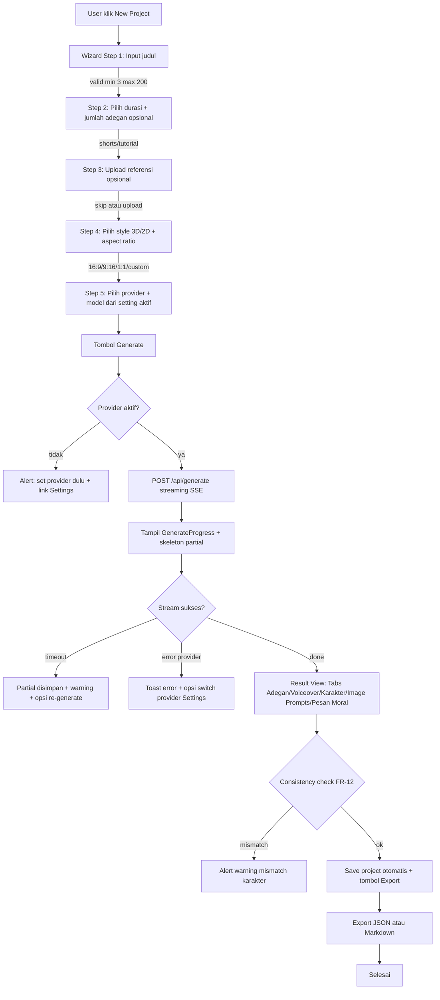
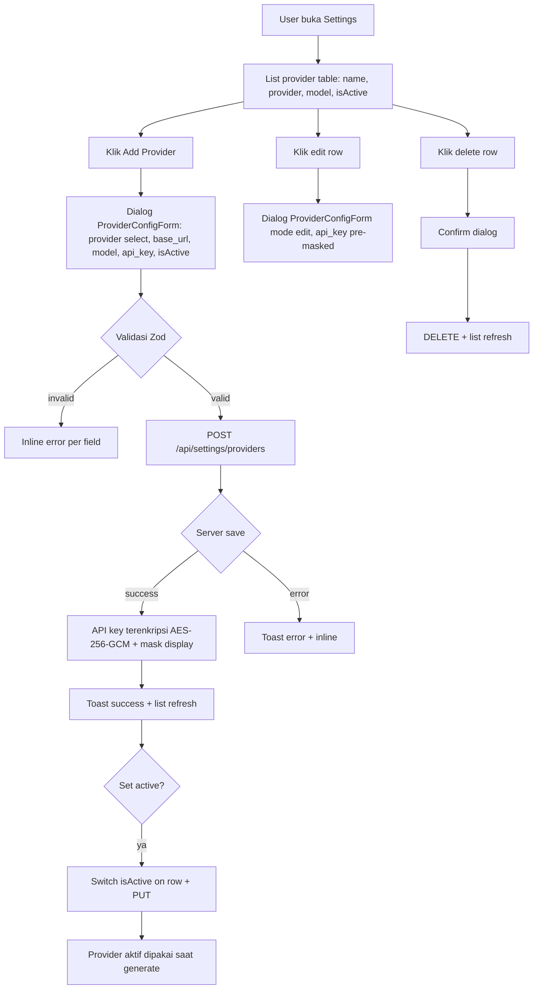
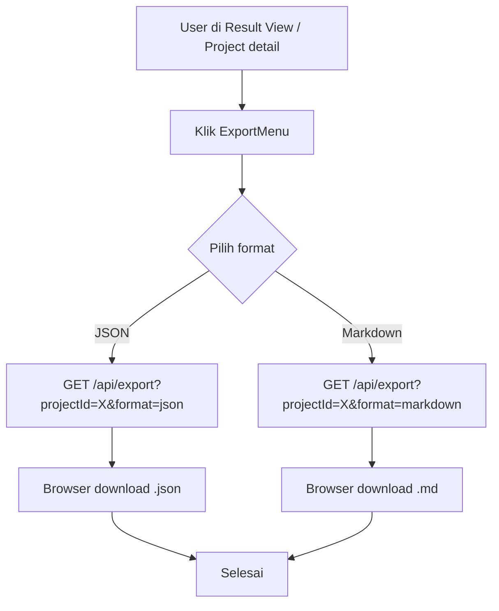

# UIUX Specification — PromptFlow
## Workflow Engine Otomasi Prompt Animasi AI

> **Versi:** 1.0
> **Dibuat:** 2026-06-19
> **Status:** Draft
> **Pemilik:** Bos Agrian
> **Sumber kebenaran:** `product-docs/RAG-CONTEXT.md` + `product-docs/PRD.md` + `product-docs/SRS.md` + `product-docs/PROJECT_ARCHITECTURE.md` (bersitasi per klaim penting)
> **Root proyek:** `C:\laragon\www\PromptFlow`
> **GitHub:** https://github.com/agrianwahab29/promptflow.git
> **Catatan:** UIUX_SPEC menurunkan persona PRD §2 + tech stack frontend SRS §4 + struktur folder PROJECT_ARCHITECTURE §5 menjadi design system + spesifikasi UI konkret siap dikode agent eksekutor frontend. Token WAJIB konkret (HEX/px/ms), bukan deskripsi vague.

---

## Daftar Isi

1. Pendahuluan, Prinsip Desain & Brand Voice
2. Design System (Design Tokens)
3. Inventory Komponen UI
4. Layout & Grid
5. Navigasi & Information Architecture
6. User Flows (Mermaid)
7. Wireframes Deskriptif
8. Iconografi & Aset
9. Aksesibilitas
10. Interaction & Motion
11. Konten & Copy
12. Responsif & Kompatibilitas
13. Empty / Error / Loading States
14. Asumsi UIUX & Referensi

---

## 1. Pendahuluan, Prinsip Desain & Brand Voice

### 1.1 Tujuan Dokumen

UIUX_SPEC menjabarkan design system + spesifikasi UI konkret untuk PromptFlow
— web app fullstack Next.js App Router otomasi susun prompt animasi AI.
Tujuan: agent eksekutor frontend bisa langsung mengkode tanpa menebak
style/struktur/token. Output aplikasi = teks prompt terstruktur (JSON + opsi
export markdown), BUKAN file media.
- Sitasi: `PRD.md 1.1, 1.2` ; `SRS.md 1.1` ; `PROJECT_ARCHITECTURE.md 1.2`

### 1.2 Persona Sasaran UI

UI diturunkan dari persona PRD §2. Tiga persona utama: Kreator Solo, Indie
Studio, Edukator. Faktor desain dominan: kecepatan, simpel, dwibahasa,
konsistensi visual karakter, biaya rendah.
- Sitasi: `PRD.md 2.1, 2.2` ; `RAG-CONTEXT.md 7`

| Persona | Implikasi UI |
|---|---|
| Kreator Solo ("Rian") | Cepat, 1 layar wizard minimal, tombol Generate besar, copy-to-clipboard everywhere |
| Indie Studio ("Bumi Animasi") | Format terstandar, reproducible, export markdown, list project paginate |
| Edukator ("Bu Sinta") | UI sederhana, dwibahasa ID+EN default, pesan moral visible, adegan berurut |

### 1.3 Prinsip Desain

1. **Workflow-first**: 1 judul -> 1 paket prompt. Wizard 5 langkah linear,
   progress indicator jelas, tidak dead-end.
2. **Konsistensi visual karakter**: tab Karakter tampilkan master stabil
   lintas adegan. Warning mismatch tampil bila identitas drift.
3. **Streaming-first UX**: partial result tampil real-time per komponen,
   skeleton + progress, bukan blank loading panjang.
4. **Copy-everywhere**: setiap prompt item punya tombol copy, export JSON/md.
5. **Dwibahasa default**: ID default, EN toggle. Bahasa aktif dipersist cookie.
6. **Dark mode native**: shadcn default light/dark, toggle di header.
7. **Aksesibilitas WAJIB**: WCAG 2.1 AA, keyboard nav, focus visible, ARIA.

### 1.4 Brand Voice

- **Tone:** Profesional hangat, edukatif, ringkas. Tidak jargon berlebih.
- **Bahasa:** Dwibahasa ID+EN. ID default untuk persona lokal, EN untuk global.
- **Istilah konsisten:** "Proyek" (ID) / "Project" (EN), "Adegan"/"Scene",
  "Karakter"/"Character", "Voiceover" (sama), "Image Prompt" (sama),
  "Provider" (sama), "Pesan Moral"/"Moral Message".
- **Pesan error:** manusiawi, sebut aksi recovery. Bukan kode raw.
- Sitasi: `PRD.md 5 (FR-19)` ; `SRS.md 5 (FR-19)` ; ASUMSI tone

---

## 2. Design System (Design Tokens)

> **Catatan implementasi:** Tech stack frontend = Next.js App Router +
> Tailwind CSS v4 + shadcn/ui (copy-paste components). Token di bawah
> diturunkan jadi variabel Tailwind v4 (CSS-first `@theme`) + CSS variables
> shadcn (`--background`, `--foreground`, dst). Folder token: `src/app/globals.css`
> + `tailwind.config.ts`. Sitasi: `RAG-CONTEXT.md 2.1` ; `SRS.md 4.1` ;
> `PROJECT_ARCHITECTURE.md 5` (folder `src/components/ui`, `globals.css`).

### 2.1 Warna — Palet

Brand accent PromptFlow = ungu-violet modern (kreatif + teknologi). Default
neutral + state warna pakai shadcn semantic tokens. Dark mode via `@media
(prefers-color-scheme: dark)` + class toggle `.dark`.

| Token | Light | Dark | Hex (Light) | Hex (Dark) | Kegunaan |
|---|---|---|---|---|---|
| `--background` | white | `#0a0a0a` | `#ffffff` | `#0a0a0a` | Body bg |
| `--foreground` | `#0a0a0a` | `#fafafa` | `#0a0a0a` | `#fafafa` | Body text |
| `--card` | `#ffffff` | `#0f0f0f` | `#ffffff` | `#0f0f0f` | Card bg |
| `--card-foreground` | `#0a0a0a` | `#fafafa` | `#0a0a0a` | `#fafafa` | Card text |
| `--primary` (brand) | `#7c3aed` | `#a78bfa` | `#7c3aed` | `#a78bfa` | CTA utama, brand |
| `--primary-foreground` | `#ffffff` | `#0a0a0a` | `#ffffff` | `#0a0a0a` | Teks di atas primary |
| `--secondary` | `#f4f4f5` | `#27272a` | `#f4f4f5` | `#27272a` | CTA sekunder, chip |
| `--secondary-foreground` | `#18181b` | `#fafafa` | `#18181b` | `#fafafa` | Teks di atas secondary |
| `--muted` | `#f4f4f5` | `#27272a` | `#f4f4f5` | `#27272a` | Skeleton, disabled bg |
| `--muted-foreground` | `#71717a` | `#a1a1aa` | `#71717a` | `#a1a1aa` | Teks helper |
| `--accent` | `#ede9fe` | `#3b0764` | `#ede9fe` | `#3b0764` | Highlight, hover chip |
| `--accent-foreground` | `#4c1d95` | `#ddd6fe` | `#4c1d95` | `#ddd6fe` | Teks di atas accent |
| `--destructive` | `#dc2626` | `#ef4444` | `#dc2626` | `#ef4444` | Error, delete |
| `--destructive-foreground` | `#ffffff` | `#fafafa` | `#ffffff` | `#fafafa` | Teks di atas destructive |
| `--success` | `#16a34a` | `#22c55e` | `#16a34a` | `#22c55e` | Success toast, badge |
| `--warning` | `#d97706` | `#f59e0b` | `#d97706` | `#f59e0b` | Warning konsistensi mismatch |
| `--info` | `#2563eb` | `#3b82f6` | `#2563eb` | `#3b82f6` | Info toast, info badge |
| `--border` | `#e4e4e7` | `#27272a` | `#e4e4e7` | `#27272a` | Border, divider |
| `--input` | `#e4e4e7` | `#27272a` | `#e4e4e7` | `#27272a` | Border input field |
| `--ring` | `#7c3aed` | `#a78bfa` | `#7c3aed` | `#a78bfa` | Focus ring |

> **Brand accent `#7c3aed`** = ASUMSI (TIDAK ADA brand asset existing,
> `RAG-CONTEXT.md 8` greenfield). Violet dipilih = kreatif + AI vibe.
> Bisa diubah user. Token primary = brand.

### 2.2 Warna — State Semantik

| State | Token | Hex (Light) | Hex (Dark) | Penggunaan |
|---|---|---|---|---|
| Success | `--success` | `#16a34a` | `#22c55e` | Toast "Tersimpan", copy success badge |
| Warning | `--warning` | `#d97706` | `#f59e0b` | Mismatch karakter (FR-12), tutorial out-of-range |
| Error | `--destructive` | `#dc2626` | `#ef4444` | Validation error, provider error, 400 |
| Info | `--info` | `#2563eb` | `#3b82f6` | Info toast, info badge |

Kontras AA: semua foreground di atas bg WAJIB >= 4.5:1 (§9).

### 2.3 Tipografi

Font family default = **Inter** (ASUMSI, `RAG-CONTEXT.md 8` sebut Inter/Geist).
Mono = **JetBrains Mono** untuk kode/prompt teks. Tailwind v4 font stack.

| Token | Family | Catatan |
|---|---|---|
| `--font-sans` | `Inter, system-ui, -apple-system, Segoe UI, Roboto, sans-serif` | Heading + body |
| `--font-mono` | `'JetBrains Mono', 'Fira Code', ui-monospace, monospace` | Prompt teks, kode, JSON |
| `--font-heading` | sama `--font-sans` | Konsisten |

### 2.4 Tipografi — Size Scale

Skala modular 1.25. Base 16px. Tailwind v4 utility map.

| Token | Size (px/rem) | Weight | Line-height | Letter-spacing | Penggunaan |
|---|---|---|---|---|---|
| `text-xs` | 12px / 0.75rem | 400 | 1.4 | 0.01em | Badge, label kecil |
| `text-sm` | 14px / 0.875rem | 400 | 1.5 | 0 | Body sekunder, helper |
| `text-base` | 16px / 1rem | 400 | 1.6 | 0 | Body default |
| `text-lg` | 18px / 1.125rem | 500 | 1.5 | 0 | Card title, section |
| `text-xl` | 20px / 1.25rem | 600 | 1.4 | -0.01em | Page H3 |
| `text-2xl` | 24px / 1.5rem | 700 | 1.3 | -0.02em | Page H2, wizard step title |
| `text-3xl` | 30px / 1.875rem | 700 | 1.2 | -0.02em | Page H1, hero |
| `text-4xl` | 36px / 2.25rem | 800 | 1.1 | -0.03em | Landing hero |
| `text-5xl` | 48px / 3rem | 800 | 1.05 | -0.04em | Landing hero display |

### 2.5 Spacing Scale

Base 4px. Tailwind v4 spacing scale.

| Token | px | Penggunaan umum |
|---|---|---|
| `space-0` | 0 | Reset |
| `space-1` | 4 | Icon gap kecil, padding chip |
| `space-2` | 8 | Gap inline, padding button kecil |
| `space-3` | 12 | Padding card, gap form field |
| `space-4` | 16 | Padding default, gap section |
| `space-5` | 20 | Gap antar komponen |
| `space-6` | 24 | Padding section, gap block |
| `space-8` | 32 | Margin antar section |
| `space-10` | 40 | Padding landing section |
| `space-12` | 48 | Margin block besar |
| `space-16` | 64 | Padding hero |
| `space-20` | 80 | Padding section landing |
| `space-24` | 96 | Margin vertikal besar |

### 2.6 Radius, Border, Shadow

| Token | Nilai | Penggunaan |
|---|---|---|
| `--radius-sm` | 4px | Badge, chip, small button |
| `--radius-md` | 6px | Input, select, default button |
| `--radius-lg` | 8px | Card, dialog, dropdown |
| `--radius-xl` | 12px | Card besar, panel wizard |
| `--radius-full` | 9999px | Avatar, toggle, pill |
| `--border-width` | 1px | Default border |
| `--border-width-focus` | 2px | Focus ring (outline-style solid) |

Shadow (elevation):

| Token | Nilai |
|---|---|
| `--shadow-xs` | `0 1px 2px 0 rgb(0 0 0 / 0.05)` |
| `--shadow-sm` | `0 1px 3px 0 rgb(0 0 0 / 0.1), 0 1px 2px -1px rgb(0 0 0 / 0.1)` |
| `--shadow-md` | `0 4px 6px -1px rgb(0 0 0 / 0.1), 0 2px 4px -2px rgb(0 0 0 / 0.1)` |
| `--shadow-lg` | `0 10px 15px -3px rgb(0 0 0 / 0.1), 0 4px 6px -4px rgb(0 0 0 / 0.1)` |
| `--shadow-xl` | `0 20px 25px -5px rgb(0 0 0 / 0.1), 0 8px 10px -6px rgb(0 0 0 / 0.1)` |

### 2.7 Container & Breakpoint

| Token | Nilai | Catatan |
|---|---|---|
| `--container-sm` | 640px | Mobile landscape, form sempit |
| `--container-md` | 768px | Tablet |
| `--container-lg` | 1024px | Desktop |
| `--container-xl` | 1280px | Desktop lebar, dashboard grid |
| `--container-2xl` | 1536px | Max landing |
| `--container-gutter` | 16px mobile, 24px >= md, 32px >= lg |

Breakpoint (Tailwind v4 default):

| Prefix | Min-width | Target |
|---|---|---|
| (default) | 0 | Mobile portrait |
| `sm` | 640px | Mobile landscape / tablet kecil |
| `md` | 768px | Tablet |
| `lg` | 1024px | Desktop |
| `xl` | 1280px | Desktop lebar |
| `2xl` | 1536px | Desktop besar |

### 2.8 Motion Token

| Token | Durasi | Easing | Penggunaan |
|---|---|---|---|
| `--motion-fast` | 120ms | `cubic-bezier(0.4, 0, 0.2, 1)` | Hover, tap feedback |
| `--motion-base` | 200ms | `cubic-bezier(0.4, 0, 0.2, 1)` | Toggle, chip select, default transition |
| `--motion-slow` | 320ms | `cubic-bezier(0.16, 1, 0.3, 1)` | Dialog open, panel expand, collapse |
| `--motion-skeleton` | 1500ms | `linear` infinite | Skeleton shimmer |
| `--motion-progress` | 800ms | `ease-in-out` | Progress bar fill |

`prefers-reduced-motion: reduce` -> nonaktifkan semua animasi non-esensial
(§9). Hanya feedback warna/state yang tetap.

### 2.9 z-index Scale

| Token | Nilai | Penggunaan |
|---|---|---|
| `--z-base` | 0 | Default |
| `--z-dropdown` | 1000 | Dropdown, select menu |
| `--z-sticky` | 1100 | Sticky header |
| `--z-toast` | 1200 | Sonner toast |
| `--z-modal` | 1300 | Dialog, modal |
| `--z-tooltip` | 1400 | Tooltip |

### 2.10 Implementasi Token Tailwind v4 + shadcn

`src/app/globals.css` (CSS-first Tailwind v4 `@theme` + CSS vars shadcn):

```css
@import "tailwindcss";

@theme {
  --color-background: #ffffff;
  --color-foreground: #0a0a0a;
  --color-card: #ffffff;
  --color-card-foreground: #0a0a0a;
  --color-primary: #7c3aed;
  --color-primary-foreground: #ffffff;
  --color-secondary: #f4f4f5;
  --color-secondary-foreground: #18181b;
  --color-muted: #f4f4f5;
  --color-muted-foreground: #71717a;
  --color-accent: #ede9fe;
  --color-accent-foreground: #4c1d95;
  --color-destructive: #dc2626;
  --color-destructive-foreground: #ffffff;
  --color-success: #16a34a;
  --color-warning: #d97706;
  --color-info: #2563eb;
  --color-border: #e4e4e7;
  --color-input: #e4e4e7;
  --color-ring: #7c3aed;
  --radius: 6px;
  --font-sans: Inter, system-ui, sans-serif;
  --font-mono: "JetBrains Mono", ui-monospace, monospace;
}

.dark {
  --color-background: #0a0a0a;
  --color-foreground: #fafafa;
  /* ...dark tokens... */
}
```

- Sitasi: `RAG-CONTEXT.md 2.1` ; `SRS.md 4.1` ; `PROJECT_ARCHITECTURE.md 5` (folder `src/app/globals.css`, `tailwind.config.ts`, `components.json`)

---

## 3. Inventory Komponen UI

> shadcn/ui components (copy-paste di `src/components/ui/`) + custom components
> (di `src/components/{generate,projects,settings,common}/`). Selaras
> struktur `PROJECT_ARCHITECTURE.md §5`. Setiap komponen sebut folder lokasi.

### 3.1 Komponen shadcn/ui (dipakai)

| Komponen | Lokasi | Anatomi | Variant | State | Props utama | Penggunaan |
|---|---|---|---|---|---|---|
| Button | `components/ui/button.tsx` | label + optional icon + optional loading spinner | size: `sm/md/lg/icon`; variant: `default/secondary/outline/ghost/destructive/link` | default/hover/active/disabled/focus/loading | `variant`, `size`, `disabled`, `loading`, `asChild` | CTA Generate, Save, Copy, Cancel |
| Input | `components/ui/input.tsx` | native input styled | size: `sm/md` | default/focus/disabled/error | `type`, `placeholder`, `value`, `onChange` | Judul, model, base URL |
| Textarea | `components/ui/textarea.tsx` | native textarea | size: `sm/md` | default/focus/disabled/error | `placeholder`, `rows`, `value` | Prompt display (read-only), notes |
| Select | `components/ui/select.tsx` | trigger + popover list | size: `sm/md` | default/open/disabled | `value`, `onValueChange`, `options` | Duration type, style, aspect ratio, provider |
| Form | `components/ui/form.tsx` (react-hook-form + Zod resolver) | label + control + message | — | default/error/submitting | `form`, `name`, `rules` | Wizard form, provider form, login |
| Card | `components/ui/card.tsx` | header + content + footer | — | default/elevated | `className` | Project card, result section, settings panel |
| Dialog | `components/ui/dialog.tsx` | trigger + content + header + footer + close | size: `sm/md/lg` | open/closed | `open`, `onOpenChange` | Re-generate confirm, delete confirm, add provider |
| Tabs | `components/ui/tabs.tsx` | tabs list + trigger + content | — | active/inactive | `value`, `onValueChange` | Result View (Adegan/Voiceover/Karakter/Image Prompts/Pesan Moral) |
| Toast/Sonner | `components/ui/sonner.tsx` | toast item | variant: `default/success/error/warning/info` | enter/exit | `title`, `description`, `variant` | Copy success, save, error provider |
| Dropzone | `components/ui/dropzone.tsx` (custom wrapper atau react-dropzone) | drag area + file list + preview thumbnail | size: `sm/md` | idle/drag-over/uploading/error | `onDrop`, `accept`, `maxSize`, `multiple` | Upload referensi tokoh/background |
| Table | `components/ui/table.tsx` | header + row + cell | — | default/hover/striped | — | List provider config, history generasi |
| Badge | `components/ui/badge.tsx` | label + dot optional | variant: `default/secondary/success/warning/error/info` | default | `variant`, `children` | Tipe image prompt (character/background), status, mismatch warning |
| Skeleton | `components/ui/skeleton.tsx` | pulse block | shape: `rect/circle/text` | shimmer | `className` | Loading project list, streaming partial |
| Alert | `components/ui/alert.tsx` | icon + title + description | variant: `default/error/warning/info` | default | `variant`, `title`, `description` | Warning mismatch karakter, warning durasi out-of-range |
| Label | `components/ui/label.tsx` | text label | — | default | `htmlFor`, `children` | Form label |
| Tooltip | `components/ui/tooltip.tsx` | trigger + content | — | open/closed | `content`, `side` | Icon hint, info singkat |
| Avatar | `components/ui/avatar.tsx` | image + fallback | size: `sm/md/lg` | default | `src`, `alt`, `fallback` | Profile, user menu |
| DropdownMenu | `components/ui/dropdown-menu.tsx` | trigger + items | — | open/closed | `items` | User menu, export menu, project actions |
| Separator | `components/ui/separator.tsx` | line | orientation: `horizontal/vertical` | default | `orientation` | Section divider |
| ScrollArea | `components/ui/scroll-area.tsx` | viewport + scrollbar | — | default | `className` | Result tabs content panjang, project list |
| Progress | `components/ui/progress.tsx` | bar fill | size: `sm/md` | indeterminate/determinate | `value`, `max` | Generate streaming progress |
| Checkbox | `components/ui/checkbox.tsx` | box + check | — | unchecked/checked/indeterminate | `checked`, `onCheckedChange` | Skip referensi, set active provider |
| Switch | `components/ui/switch.tsx` | toggle | size: `sm/md` | on/off | `checked`, `onCheckedChange` | Toggle dark mode, set provider active |
| Collapsible | `components/ui/collapsible.tsx` | trigger + content | — | open/closed | `open`, `onOpenChange` | Result section per adegan, character detail |
| Breadcrumb | `components/ui/breadcrumb.tsx` | list + item + separator | — | default | `items` | Project detail nav |

### 3.2 Komponen Custom (domain PromptFlow)

| Komponen | Lokasi | Anatomi | Variant | State | Props | Sumber fitur |
|---|---|---|---|---|---|---|
| `PromptCard` | `components/projects/prompt-card.tsx` | Card: title + meta (durasi, style, rasio) + status badge + actions (open, delete) | size: `sm/md` | default/hover/loading | `project`, `onOpen`, `onDelete` | FR-15 list project |
| `SceneCard` | `components/generate/scene-card.tsx` | Collapsible: order badge + description + voiceover block + image_prompts sub-list | — | collapsed/expanded/streaming | `scene`, `streaming` | FR-03/FR-09 result view |
| `CharacterCard` | `components/generate/character-card.tsx` | Card: nama + peran badge + grid field (rambut/wajah/pakaian atas/bawah/alas kaki/latar/aksi) | peran: `utama/lain/pendamping` | default/streaming | `character` | FR-07 master karakter |
| `ImagePromptList` | `components/generate/image-prompt-list.tsx` | List item: target + Badge tipe (character/background) + prompt_text (mono, read-only) + reference_filename badge + CopyButton | tipe: `character/background` | default/copied | `items`, `tipe` | FR-06 image prompts |
| `ProviderConfigForm` | `components/settings/provider-config-form.tsx` | Form: provider select + base_url input + model input + api_key password (mask) + isActive switch + save/delete buttons | mode: `create/edit` | default/submitting/error | `provider?`, `onSave`, `onDelete` | FR-13/FR-14 |
| `WizardStep` | `components/generate/wizard-step.tsx` | Stepper header + content slot + nav (Back/Next/Generate) | — | active/inactive/done | `step`, `total`, `onBack`, `onNext`, `onGenerate` | New Project Wizard |
| `ResultTabs` | `components/generate/result-tabs.tsx` | Tabs: Adegan / Voiceover / Karakter / Image Prompts / Pesan Moral + content per tab + ExportMenu + Re-generate button | — | idle/streaming/done/error | `result`, `warnings`, `streaming`, `onRegenerate` | Result view FR-16 |
| `DropzoneUploader` | `components/generate/dropzone-uploader.tsx` | Dropzone + file list (thumb + filename + tipe select tokoh/background + remove) | tipe: `tokoh/background` | idle/drag/uploading/preview/error | `files`, `onAdd`, `onRemove`, `onChangeTipe` | FR-17 upload referensi |
| `CopyButton` | `components/common/copy-button.tsx` | Button icon (clipboard) + tooltip + toast on success | size: `sm/md/icon` | idle/copying/copied | `text`, `label?` | NFR-U4 copy per prompt |
| `ExportMenu` | `components/generate/export-menu.tsx` | DropdownMenu: JSON / Markdown | — | open/closed | `projectId`, `onExport` | FR-16 export |
| `GenerateProgress` | `components/generate/generate-progress.tsx` | Progress bar + status text per komponen (character_profiles, scenes, image_prompts, moral) + skeleton | — | idle/streaming/partial/done/error | `status`, `partial` | NFR-U1 streaming UX |
| `EmptyState` | `components/common/empty-state.tsx` | icon + title + description + optional CTA | variant: `default/error` | default | `icon`, `title`, `description`, `action?` | Empty project list, no result |
| `ErrorBoundary` | `components/common/error-boundary.tsx` | fallback UI: icon + message + retry | — | default/error | `children`, `fallback` | Global error catch |
| `LanguageToggle` | `components/common/language-toggle.tsx` | Toggle ID/EN (segmented) | — | id/en | `locale`, `onChange` | FR-19 dwibahasa |
| `ThemeToggle` | `components/common/theme-toggle.tsx` | Switch light/dark | — | light/dark | `theme`, `onChange` | Dark mode |
| `AppHeader` | `components/common/app-header.tsx` | Logo + nav links + LanguageToggle + ThemeToggle + UserMenu | — | auth/unauth | `session?` | Global header |
| `AppFooter` | `components/common/app-footer.tsx` | Links + copyright + locale | — | default | — | Global footer landing |

### 3.3 Status Komponen per Lokasi Folder

```text
src/components/
  ui/                         # shadcn/ui (Button, Input, Card, ...)
  common/                      # AppHeader, AppFooter, CopyButton, EmptyState,
                               # ErrorBoundary, LanguageToggle, ThemeToggle
  generate/                    # WizardStep, GenerateProgress, ResultTabs,
                               # SceneCard, CharacterCard, ImagePromptList,
                               # DropzoneUploader, ExportMenu
  projects/                    # PromptCard, project list/detail
  settings/                    # ProviderConfigForm
```

- Sitasi: `PROJECT_ARCHITECTURE.md §5` (struktur `src/components/`)

---

## 4. Layout & Grid

### 4.1 Sistem Grid

Mobile-first. Container max-width + gutter responsif.

| Breakpoint | Grid | Kolom | Gutter | Margin (container) | Max width |
|---|---|---|---|---|---|
| <640px (mobile) | 4 kolom | 4 | 16px | 16px | 100% |
| 640-1024px (tablet) | 8 kolom | 8 | 24px | 24px | 768px / 100% |
| >=1024px (desktop) | 12 kolom | 12 | 24px | 32px | 1280px / 1536px landing |

CSS: `display:grid; grid-template-columns: repeat(N, 1fr); gap: <gutter>`.

### 4.2 Layout Pattern per Tipe Halaman

| Halaman | Layout | Grid | Catatan |
|---|---|---|---|
| Landing | Full-width, section bertumpuk, container 2xl max 1536px | 12 kolom, hero 12, feature grid 3x4 kol (lg) | Background gradient subtle, CTA primary |
| Login/Register | Centered, container sm max 640px | 1 kolom | Card panel, dark mode aware |
| Dashboard project list | Container xl max 1280px, header + toolbar + grid card | Card grid: 1 kol mobile, 2 kol sm, 3 kol lg, 4 kol xl | Search + filter sticky top |
| New Project Wizard | Container md max 768px centered | 1 kolom | Stepper header sticky, content scroll |
| Result View | Container lg max 1280px (lg) / full (2xl), header + tabs + content | Tabs: 1 kolom mobile, 2 kolom lg (main + sidebar info) | Tab content scroll, sidebar: meta + export + re-generate |
| Settings | Container lg max 1024px, header + list provider (table) + add button | 1 kolom (form), table full width | Provider form di dialog |
| History | Container lg max 1280px, table | 1 kolom, table full width | Paginate bottom |

### 4.3 Safe-area

Mobile: `padding: env(safe-area-inset-top/bottom)` untuk header/footer fixed.
iOS notch + Android gesture bar.

### 4.4 Kontainer Implementasi

```tsx
// Container wrapper
<div className="mx-auto w-full max-w-[1280px] px-4 md:px-6 lg:px-8">
  {children}
</div>
```

- Landing: `max-w-[1536px]`
- Auth: `max-w-[640px]`
- Wizard: `max-w-[768px]`
- Dashboard/result: `max-w-[1280px]`

---

## 5. Navigasi & Information Architecture

### 5.1 Top Navigation (AppHeader)

| Item | Label ID | Label EN | Route | Auth | Visible |
|---|---|---|---|---|---|
| Logo | PromptFlow | PromptFlow | `/` | — | always |
| Dashboard | Proyek | Projects | `/projects` | wajib | authed |
| New Project | Proyek Baru | New Project | `/generate` | wajib | authed |
| Settings | Pengaturan | Settings | `/settings` | wajib | authed |
| Language Toggle | ID / EN | ID / EN | toggle | — | always |
| Theme Toggle | Mode | Mode | toggle | — | always |
| User Menu | nama user | user name | dropdown: Profile, Logout | wajib | authed |
| Login | Masuk | Log in | `/login` | — | unauthed |
| Register | Daftar | Sign up | `/register` | — | unauthed |

Mobile: header collapse -> hamburger menu (DropdownMenu) untuk nav links.
Language + Theme toggle tetap inline.

### 5.2 Breadcrumb

| Halaman | Breadcrumb |
|---|---|
| Project detail | Proyek / [judul project] |
| Settings | Pengaturan |
| New Project | Proyek Baru |
| Result (di wizard) | Proyek Baru / Hasil |

### 5.3 Route Map

| Route | Halaman | Layout | Auth |
|---|---|---|---|
| `/` | Landing marketing | public (no header/footer variant) | optional |
| `/login` | Login form | auth centered | no |
| `/register` | Register form | auth centered | no |
| `/projects` | Dashboard list project | dashboard (header + footer) | wajib |
| `/projects/[id]` | Project detail (result view) | dashboard | wajib |
| `/generate` | New Project Wizard | dashboard | wajib |
| `/settings` | Settings (provider + profile) | dashboard | wajib |
| `/settings/providers` | (sub) Provider list | dashboard | wajib |
| `/settings/profile` | (sub) Profile | dashboard | wajib |
| `/api/*` | Backend | — | wajib (kecuali `/api/auth`) |

Middleware: `src/middleware.ts` redirect `/projects`, `/settings`, `/generate`,
`/api/*` (kecuali `/api/auth`) ke `/login?callbackUrl=<asli>` bila unauth.
- Sitasi: `SRS.md 9.1 SEC-11` ; `PROJECT_ARCHITECTURE.md 9 SB-06`

### 5.4 Footer

Landing: footer penuh (link produk, link sumber daya, link legal, copyright,
locale). Dashboard: footer minimal (copyright + locale).

### 5.5 Information Architecture

```text
PromptFlow
├── Public
│   ├── Landing (/)
│   ├── Login (/login)
│   └── Register (/register)
└── App (auth wajib)
    ├── Projects (/projects)
    │   └── [id] (detail/result)
    ├── New Project (/generate, wizard 5 step)
    └── Settings (/settings)
        ├── Providers
        └── Profile
```

---

## 6. User Flows (Mermaid)

### 6.1 Flow New Project Wizard -> Generate -> Result



### 6.2 Flow Settings Provider CRUD



### 6.3 Flow Export



- Sitasi: `PRD.md 5 (FR-16), 8.3` ; `SRS.md 5 (FR-16)` ; `PROJECT_ARCHITECTURE.md 6`

---

## 7. Wireframes Deskriptif

> Wireframe tekstual (bukan gambar). Layout per key screen: region, komponen,
> aksi, state. Skala: mobile-first, catat adaptasi desktop.

### 7.1 Landing (`/`)

```text
+---------------------------------------------------------------+
| HEADER (sticky, full-width)                                    |
| [Logo PromptFlow]  ............  [Masuk] [Daftar]  [ID/EN] [☀] |
+---------------------------------------------------------------+
| HERO (full-width, centered, container 2xl)                     |
|                                                               |
|         Headline besar (text-4xl/5xl, weight 800)              |
|         "Satu judul -> paket prompt animasi siap pakai"        |
|                                                               |
|         Subheadline (text-lg, muted-foreground)                |
|         "Karakter konsisten, multi-provider, export JSON/md"    |
|                                                               |
|         [CTA: Mulai Gratis] (Button primary, lg)              |
|         [CTA sekunder: Lihat Demo] (Button outline)            |
|                                                               |
|         (opsional: ilustrasi/preview mockup di bawah, ASUMSI)  |
+---------------------------------------------------------------+
| SECTION: Cara Kerja (container xl, grid 3 kolom lg)            |
| +-------------+ +-------------+ +-------------+               |
| | 1 Input     | | 2 Generate  | | 3 Export    |               |
| | judul+opsi  | | prompt paket| | JSON/md     |               |
| | icon        | | icon        | | icon        |               |
| +-------------+ +-------------+ +-------------+               |
+---------------------------------------------------------------+
| SECTION: Fitur (container xl, grid 2 kolom lg)                 |
| +---------------------------+ +---------------------------+    |
| | Konsistensi Karakter      | | Multi-Provider LLM        |    |
| | desc                      | | desc                      |    |
| +---------------------------+ +---------------------------+    |
| +---------------------------+ +---------------------------+    |
| | Dwibahasa ID+EN           | | Streaming Real-time       |    |
| | desc                      | | desc                      |    |
| +---------------------------+ +---------------------------+    |
+---------------------------------------------------------------+
| SECTION: CTA akhir (centered)                                  |
|         [Mulai Gratis Sekarang] (Button primary)              |
+---------------------------------------------------------------+
| FOOTER (full-width)                                            |
| [Produk] [Sumber Daya] [Legal]  © 2026 PromptFlow  [ID/EN]    |
+---------------------------------------------------------------+
```

State: unauth -> tombol Masuk/Daftar tampil; authed -> User Menu gantikan.

### 7.2 Login (`/login`)

```text
+---------------------------------------------------------------+
| HEADER minimal (Logo only)                            [ID/EN] |
+---------------------------------------------------------------+
| CENTERED CONTAINER (max 640px)                                 |
|   +-------------------------------------------------------+   |
|   | CARD                                                  |   |
|   |   Title: Masuk ke PromptFlow (text-2xl, weight 700)   |   |
|   |   Subtitle: Selamat datang kembali (text-sm, muted)   |   |
|   |                                                       |   |
|   |   FORM:                                               |   |
|   |   [Email]      (Input, type email, wajib)             |   |
|   |   [Password]   (Input, type password, wajib)          |   |
|   |   [Button: Masuk] (primary, full width, loading state)|   |
|   |                                                       |   |
|   |   Link: Belum punya akun? Daftar (-> /register)       |   |
|   +-------------------------------------------------------+   |
+---------------------------------------------------------------+
State: error -> Alert inline (variant error) "Email/password salah".
```

### 7.3 Dashboard Project List (`/projects`)

```text
+---------------------------------------------------------------+
| HEADER (AppHeader full)                                        |
+---------------------------------------------------------------+
| CONTAINER (max 1280px)                                         |
|   Page Title: Proyek Saya (text-2xl)                           |
|   Toolbar (sticky):                                           |
|     [Search input] [Filter: tipe durasi] [Button: Proyek Baru]|
|                                                               |
|   GRID CARD (1/2/3/4 kolom responsif):                        |
|   +-------------+ +-------------+ +-------------+            |
|   | PromptCard  | | PromptCard  | | PromptCard  |            |
|   | judul       | | judul       | | judul       |            |
|   | meta durasi | | meta durasi | | meta durasi |            |
|   | style badge | | style badge | | style badge |            |
|   | [Buka][...] | | [Buka][...] | | [Buka][...] |            |
|   +-------------+ +-------------+ +-------------+            |
|                                                               |
|   Paginate bottom: [< 1 2 3 >]                                |
+---------------------------------------------------------------+
State:
- empty -> EmptyState icon + "Belum ada proyek" + CTA [Proyek Baru]
- loading -> Skeleton grid 8 card
- error -> Alert error + retry
```

### 7.4 New Project Wizard (`/generate`)

Layout wizard: container max 768px centered, stepper header sticky.

```text
+---------------------------------------------------------------+
| HEADER                                                          |
+---------------------------------------------------------------+
| CONTAINER (max 768px, centered)                                |
|   STEPPER HEADER (sticky):                                     |
|   [1 Judul] -- [2 Durasi] -- [3 Referensi] -- [4 Style] -- [5 Provider] [Generate]
|   (progress bar di bawah stepper, --motion-progress)           |
|                                                               |
|   STEP CONTENT (scroll):                                       |
|   ┌───────────────────────────────────────────────┐            |
|   │ Step 1: Judul Animasi                         │            |
|   │   Label: Judul Animasi (wajib, 3-200 char)    │            |
|   │   [Input text, besar]                         │            |
|   │   Helper: Min 3, maks 200 karakter             │            |
|   │   (error inline bila invalid)                 │            |
|   └───────────────────────────────────────────────┘            |
|                                                               |
|   NAV: [Kembali: disabled]   [Lanjut: primary]                |
+---------------------------------------------------------------+
```

Step detail:

**Step 1 — Judul:**
- Input `title` (wajib). Helper min 3 maks 200. Error inline bila kosong.

**Step 2 — Durasi:**
- Select `duration_type` (shorts/tutorial).
- Numeric `target_seconds` opsional (override).
- Helper: Shorts ideal 30-60s maks 180s. Tutorial 420-900s.
- Warning Alert bila tutorial out-of-range (boleh proceed).
- Error bila shorts > 180.

**Step 3 — Referensi (opsional):**
- DropzoneUploader (drag-drop atau klik).
- File list: thumbnail + filename + Select tipe (tokoh/background) + remove.
- Checkbox "Skip (tanpa referensi)" -> sistem auto-buat (FR-05).
- Accept `image/*`, max 10MB (ASUMSI).

**Step 4 — Style + Aspect:**
- Select `style` (3D/2D) — kartu pilihan visual 2 opsi (icon + label).
- Select `aspect_ratio` (16:9 / 9:16 / 1:1 / 4:3 / 21:9) — grid tombol
  dengan preview ratio.

**Step 5 — Provider + Model:**
- Display provider aktif (dari setting). Bila belum set -> Alert +
  link ke Settings.
- Select model (dari list provider aktif, ASUMSI fetch dari setting).
- Tombol Generate (primary, lg, full width).

State setelah Generate:
- GenerateProgress muncul ganti konten wizard.
- Skeleton + status per komponen (character_profiles, scenes,
  image_prompts, moral).
- Token partial tampil real-time di tab terkait.
- Done -> Result View (ganti atau route ke `/projects/[id]`).
- Error -> Toast error + opsi Settings/Retry.

### 7.5 Result View (`/projects/[id]` atau inline di wizard done)

```text
+---------------------------------------------------------------+
| HEADER + Breadcrumb: Proyek / [judul]                          |
+---------------------------------------------------------------+
| CONTAINER (max 1280px)                                         |
|   HEADER RESULT:                                               |
|   [Judul text-2xl] [meta: durasi, style, rasio, created]       |
|   [ExportMenu: JSON/Markdown] [Button: Re-generate]            |
|   (bila warning mismatch FR-12 -> Alert warning di sini)       |
|                                                               |
|   RESULT TABS (sticky):                                       |
|   [Adegan] [Voiceover] [Karakter] [Image Prompts] [Pesan Moral]|
|                                                               |
|   TAB CONTENT (ScrollArea):                                   |
|   ┌───────────────────────────────────────────────┐            |
|   │ Tab Adegan:                                    │            |
|   │   SceneCard (Collapsible) per scene:           │            |
|   │   [Order badge 1] [deskripsi singkat]          │            |
|   │   Expanded:                                    │            |
|   │     - Deskripsi lengkap (text)                 │            |
|   │     - Voiceover_script (mono block, read-only) │            |
|   │     - Image prompts per scene (sub-list)       │            |
|   │         [target + badge tipe + prompt + copy]  │            |
|   └───────────────────────────────────────────────┘            |
|                                                               |
|   ┌───────────────────────────────────────────────┐            |
|   │ Tab Voiceover:                                 │            |
|   │   List per scene: order + voiceover_script     │            |
|   │   + CopyButton per item                         │            |
|   └───────────────────────────────────────────────┘            |
|                                                               |
|   ┌───────────────────────────────────────────────┐            |
|   │ Tab Karakter:                                  │            |
|   │   CharacterCard per karakter master:           │            |
|   │   [nama + peran badge]                          │            |
|   │   Grid field: gayarambut, wajah_asal,           │            |
|   │   pakaian_atas, pakaian_bawah, alas_kaki,       │            |
|   │   deskripsi_latar, aksi                         │            |
|   │   (identitas stabil lintas adegan FR-12)        │            |
|   └───────────────────────────────────────────────┘            |
|                                                               |
|   ┌───────────────────────────────────────────────┐            |
|   │ Tab Image Prompts:                             │            |
|   │   Sub-section: Karakter (master list)          │            |
|   │     ImagePromptList tipe=character:            │            |
|   │     [target + Badge character + prompt +       │            |
|   │      reference_filename badge + copy]          │            |
|   │   Sub-section: Background (master list)        │            |
|   │     ImagePromptList tipe=background:            │            |
|   │     [target + Badge background + prompt +      │            |
|   │      reference_filename + copy]                │            |
|   └───────────────────────────────────────────────┘            |
|                                                               |
|   ┌───────────────────────────────────────────────┐            |
|   │ Tab Pesan Moral:                               │            |
|   │   moral_message block + CopyButton             │            |
|   └───────────────────────────────────────────────┘            |
|                                                               |
|   SIDEBAR (lg only, sticky):                                  |
|   - Meta project (durasi, style, rasio, created)              |
|   - ExportMenu                                                |
|   - Re-generate button                                         |
|   - History (COULD fase 3)                                    |
+---------------------------------------------------------------+
State streaming: tab aktif tampilkan skeleton + partial teks.
State error: Alert error di header result.
```

### 7.6 Settings (`/settings`)

```text
+---------------------------------------------------------------+
| HEADER + Breadcrumb: Pengaturan                                |
+---------------------------------------------------------------+
| CONTAINER (max 1024px)                                         |
|   TABS: [Provider] [Profil]                                    |
|                                                               |
|   TAB PROVIDER:                                                |
|     Toolbar: [Button: Tambah Provider] (primary)              |
|     TABLE:                                                     |
|     | Name | Provider | Base URL | Model | Active | Aksi |    |
|     | ...  | ...     | ...      | ...   | [sw]   | [edit][del]|
|     Paginate                                                   |
|                                                               |
|   DIALOG add/edit (ProviderConfigForm):                       |
|   +-------------------------------------------------------+   |
|   | Nama (Input)                                          |   |
|   | Provider (Select: ollama/openrouter/9router/custom)   |   |
|   | Base URL (Input, pre-fill per provider)               |   |
|   | Model (Input)                                         |   |
|   | API Key (Input password, mask **** di edit)          |   |
|   | [Switch: Set Active]                                  |   |
|   | [Button: Simpan] [Button: Batal]                      |   |
|   +-------------------------------------------------------+   |
|                                                               |
|   TAB PROFIL:                                                 |
|     Avatar + nama + email (read-only)                         |
|     Form edit nama                                            |
+---------------------------------------------------------------+
```

### 7.7 History (`/projects/[id]?tab=history` COULD fase 3)

```text
+---------------------------------------------------------------+
| HEADER + Breadcrumb: Proyek / [judul] / Riwayat               |
+---------------------------------------------------------------+
| CONTAINER (max 1280px)                                         |
|   TABLE:                                                       |
|   | Waktu | Provider | Model | Durasi | Status | Aksi |       |
|   | ...   | ...      | ...   | ...    | [badge]| [view][rollback]|
|   Paginate                                                     |
+---------------------------------------------------------------+
```

- Sitasi: `PRD.md 3.5 (US-25), 4 (F-21)` COULD fase 3

---

## 8. Iconografi & Aset

### 8.1 Icon Set

Library: **Lucide React** (default shadcn/ui, via `lucide-react`).
- Sitasi: shadcn/ui default (ASUMSI, `RAG-CONTEXT.md 2.1` shadcn/ui pakai Lucide)

Icon semantic konsisten:

| Aksi/Konteks | Icon Lucide | Penggunaan |
|---|---|---|
| Generate | `Sparkles` / `Wand2` | Tombol Generate utama |
| Copy | `Copy` / `Clipboard` | CopyButton |
| Export | `Download` | ExportMenu |
| Add | `Plus` | Add provider, new project |
| Edit | `Pencil` | Edit provider |
| Delete | `Trash2` | Delete project/provider |
| Save | `Save` | Save project |
| Back/Next | `ArrowLeft` / `ArrowRight` | Wizard nav |
| Close | `X` | Dialog close, remove file |
| Upload | `Upload` / `UploadCloud` | Dropzone |
| Settings | `Settings` | Nav Settings |
| User | `User` / `CircleUser` | User menu |
| Sun/Moon | `Sun` / `Moon` | Theme toggle |
| Languages | `Languages` | Language toggle |
| Check | `Check` / `CheckCircle2` | Success, active |
| Alert | `AlertTriangle` / `AlertCircle` | Warning/error |
| Info | `Info` | Info toast |
| Character | `UserRound` | Karakter tab |
| Scene | `Film` / `Clapperboard` | Adegan tab |
| Mic | `Mic` | Voiceover tab |
| Image | `Image` | Image prompts tab |
| Heart | `Heart` / `Sparkle` | Pesan moral |
| Eye | `Eye` / `EyeOff` | Toggle mask API key |
| ChevronDown | `ChevronDown` | Collapsible, select trigger |
| Loader | `Loader2` (spin) | Loading spinner |

### 8.2 Logo & Maskot

**TIDAK ADA aset existing** (greenfield, `RAG-CONTEXT.md 8`). ASUMSI:
- Logo: wordmark "PromptFlow" font Inter weight 800, warna primary `#7c3aed`.
  Bisa tambah mark sederhana (icon `Sparkles` di kotak rounded primary).
- Maskot: ASUMSI tidak ada. Bila dibutuhkan, konsep = karakter abstrak
  (bukan hewan spesifik) — TBD user.

### 8.3 Ilustrasi & Aset Lain

- Landing ilustrasi: ASUMSI SVG abstract (gradient primary -> accent),
  atau mockup screenshot app. TBD.
- Empty state ilustrasi: ASUMSI icon besar Lucide (mis `FolderOpen` untuk
  empty project, `SearchX` untuk no result).
- Path aset: `public/` (logo, ilustrasi). Referensi upload dev: `public/references/`.
- Sitasi: `PROJECT_ARCHITECTURE.md §5` (`public/`, `public/references/`) ;
  `RAG-CONTEXT.md 8` (TIDAK ADA aset)

### 8.4 Aturan Pemakaian Icon

- Ukuran default 16px (text-sm) atau 20px (text-base). Button icon = 18-20px.
- Stroke width 1.5 (Lucide default 2, sesuaikan ke 1.5 untuk halus).
- Warna ikut `currentColor` (inherit text color), kecuali state spesifik
  (success/warning/error).
- TIDAK campur library icon. Konsisten Lucide saja.

---

## 9. Aksesibilitas

Target: **WCAG 2.1 AA** minimum. Bukan opsional.
- Sitasi: `PRD.md 6.6 (NFR-A1/A2/A3)` ; `SRS.md` (NFR-A)

### 9.1 Kontras Warna

| Konteks | Rasio minimum | Verifikasi |
|---|---|---|
| Body text di background | 4.5:1 | `--foreground` vs `--background` (light: ~16:1, dark: ~16:1) |
| Large text (>= 24px / 18.66px bold) | 3:1 | Heading |
| UI component border/icon | 3:1 | Input border, focus ring |
| Link text | 4.5:1 | Primary link |
| Teks di atas primary button | 4.5:1 | `--primary-foreground` vs `--primary` (light: ~6:1, dark: ~10:1) |
| State color text (success/warning/error/info) di bg | 4.5:1 | Badge, toast |

Verifikasi: Axe DevTools / Lighthouse audit. Target 0 violation AA.

### 9.2 Keyboard Navigasi

- Semua komponen interaktif WAJIB reachable via Tab.
- Logical tab order mengikuti visual order.
- Skip link "Lewati ke konten utama" di atas header (fokus pertama).
- Focus visible: outline `--ring` 2px solid, offset 2px. TIDAK pernah
  `outline: none` tanpa pengganti.
- Modal/Dialog: fokus trap, Tab sirkular di dalam modal, Esc tutup.
- Dropdown: arrow key navigasi, Enter pilih, Esc tutup.
- Wizard: Tab antar field, Enter submit form di step terakhir.

### 9.3 ARIA & Semantik

- `aria-label` di icon-only button (CopyButton, close, delete).
- `aria-expanded` di Collapsible/Dropdown/Accordion.
- `aria-selected` di Tabs trigger aktif.
- `aria-live="polite"` di region streaming result (partial update).
- `aria-live="assertive"` di toast error.
- `role="status"` di toast success/info.
- `role="alert"` di Alert error/warning.
- Form: `<label htmlFor>` atau react-hook-form Label bind. `aria-invalid`
  + `aria-describedby` ke pesan error.
- Table: `<thead>/<tbody>`, `scope="col"`/`scope="row"`.
- Dropzone: `role="button"`, `aria-label="Upload gambar referensi"`,
  instruksi drag-drop teks.

### 9.4 Teks Alternatif

- Image referensi upload: `alt` = label/nama file (bukan nama file mentah
  bila label diisi).
- Logo: `alt="PromptFlow"`.
- Ilustrasi dekoratif: `alt=""` (empty) bila murni dekoratif.
- Avatar user: `alt="Foto profil <nama>"`.

### 9.5 Reduce Motion

`@media (prefers-reduced-motion: reduce)`:
- Nonaktifkan skeleton shimmer (ganti statis bg `--muted`).
- Nonaktifkan micro-interaction (hover scale, slide).
- Transisi tetap instant (0ms) untuk state change warna.
- Loading tetap tampilkan teks status (bukan animasi).
- Animasi esensial (fokus, scroll-to) tetap.

### 9.6 Bahasa & Aksesibilitas

- `lang` attribute di `<html>` ikut locale aktif (`id`/`en`).
- Direction LTR (TIDAK ada RTL fase awal).
- Teks tidak terpotong oleh ellipsis di breakpoint kecil -> wrap.

### 9.7 Check-list Verifikasi A11y

- [ ] 0 violation WCAG AA (Axe/Lighthouse)
- [ ] Semua aksi keyboard reachable
- [ ] Focus visible semua komponen
- [ ] Skip link ada dan berfungsi
- [ ] Dialog trap fokus + Esc
- [ ] Toast announce via aria-live
- [ ] Kontras semua teks >= 4.5:1
- [ ] Form error announce + label bind
- [ ] Reduce motion aman

---

## 10. Interaction & Motion

### 10.1 Transisi State Komponen

| Komponen | Trigger | Efek | Durasi | Easing |
|---|---|---|---|---|
| Button | hover | bg lighten 8%, border subtle | 120ms | base |
| Button | active/press | scale 0.97 | 120ms | base |
| Button | focus | ring 2px `--ring` | instant | — |
| Button | disabled | opacity 0.5, cursor not-allowed | instant | — |
| Card | hover | shadow-md -> shadow-lg, translateY -2px | 200ms | base |
| Input/Select | focus | border `--ring`, ring offset | 120ms | base |
| Tabs trigger | active | underline/dot slide | 200ms | base |
| Dialog | open | fade + scale 0.95 -> 1 | 320ms | slow |
| Dialog | close | fade + scale 1 -> 0.95 | 200ms | base |
| Dropdown | open | fade + slide down 4px | 200ms | base |
| Toast | enter | slide right + fade | 200ms | base |
| Toast | exit | slide right + fade out | 200ms | base |
| Collapsible | toggle | height auto expand/collapse | 320ms | slow |
| Switch | toggle | knob translate | 200ms | base |
| Skeleton | loop | shimmer gradient | 1500ms infinite | linear |
| Progress | fill | width transition | 800ms | ease-in-out |

### 10.2 Micro-interaction

- CopyButton: klik -> icon swap Copy -> Check (200ms), toast "Tersalin".
- Generate button: klik -> label ganti "Generating..." + spinner Loader2 spin.
- Dropzone: drag over -> border dashed primary, bg `--accent`.
- Provider switch isActive: knob slide + toast "Provider aktif".
- Tab switch: content fade cross-fade 200ms.

### 10.3 Loading State

- **Skeleton**: block `--muted` + shimmer gradient overlay. Untuk list card,
  form field, result section (sebelum partial tiba).
- **Spinner**: Loader2 spin 16-20px di button loading + GenerateProgress.
- **Progress bar**: determinate bila persen tahu, indeterminate (stripes
  moving) bila tidak. Label status teks per komponen.
- **Streaming partial**: teks partial tampil dengan cursor pulse (optional,
  respect reduce-motion) di tab terkait.

### 10.4 Empty State

| Konteks | Ilustrasi/icon | Title | Description | CTA |
|---|---|---|---|---|
| Project list kosong | `FolderOpen` 48px muted | "Belum ada proyek" | "Mulai buat paket prompt animasi pertama Anda." | [Proyek Baru] |
| Result belum generate | `Sparkles` | "Hasil akan muncul di sini" | "Selesaikan wizard lalu klik Generate." | — |
| Search no result | `SearchX` | "Tidak ditemukan" | "Coba kata kunci lain." | [Reset] |
| History kosong | `History` | "Belum ada riwayat" | "Generasi akan tercatat di sini." | — |

### 10.5 Error State

| Konteks | Komponen | Pesan |
|---|---|---|
| Validation field | inline Alert kecil di bawah field | "{field} wajib diisi" / "Min 3 karakter" / "Maks 200" |
| Form submit error | Alert di atas form | "Gagal menyimpan. Periksa kembali." |
| Provider error generate | Toast error + Alert di GenerateProgress | "Provider {name} gagal. Cek API key/base URL atau ganti provider di Pengaturan." + link |
| Provider timeout | Alert warning + partial disimpan | "Generasi terputus. Hasil parsial tersimpan. Coba Generate ulang." |
| Auth error | redirect `/login?callbackUrl` + toast info | "Sesi berakhir, silakan masuk kembali." |
| 404 | full page | "Halaman tidak ditemukan" + [Kembali ke Dashboard] |
| 500 | full page | "Terjadi kesalahan. Coba lagi." + [Refresh] |
| Network offline | banner top | "Koneksi terputus" |

### 10.6 Feedback (toast via Sonner)

| Trigger | Variant | Pesan (ID) | Pesan (EN) |
|---|---|---|---|
| Copy prompt | success | "Prompt tersalin" | "Prompt copied" |
| Save project | success | "Proyek tersimpan" | "Project saved" |
| Save provider | success | "Provider tersimpan" | "Provider saved" |
| Provider active | info | "Provider aktif diubah" | "Active provider changed" |
| Delete project | success | "Proyek dihapus" | "Project deleted" |
| Delete provider | success | "Provider dihapus" | "Provider deleted" |
| Provider error | error | "Provider gagal: {msg}" | "Provider failed: {msg}" |
| Validation | warning | "Periksa input" | "Check your input" |
| Mismatch karakter | warning | "Karakter tidak konsisten. Cek tab Karakter." | "Character inconsistency. Check Character tab." |
| Export done | success | "File diunduh" | "File downloaded" |
| Upload gagal | error | "Upload gagal: {msg}" | "Upload failed: {msg}" |

---

## 11. Konten & Copy

### 11.1 Tone & Konsistensi Istilah

- Tone: profesional hangat, ringkas, edukatif. Hindari jargon teknis berlebih
  (kecuali field teknis seperti base URL/API key).
- Istilah konsisten ID/EN (dictionary file `messages/id.json` +
  `messages/en.json`):

| Key i18n | ID | EN |
|---|---|---|
| `nav.dashboard` | Proyek | Projects |
| `nav.newProject` | Proyek Baru | New Project |
| `nav.settings` | Pengaturan | Settings |
| `nav.login` | Masuk | Log in |
| `nav.register` | Daftar | Sign up |
| `nav.logout` | Keluar | Log out |
| `nav.profile` | Profil | Profile |
| `wizard.step1.title` | Judul Animasi | Animation Title |
| `wizard.step2.title` | Durasi Target | Target Duration |
| `wizard.step3.title` | Referensi Gambar | Image Reference |
| `wizard.step4.title` | Gaya & Rasio | Style & Aspect Ratio |
| `wizard.step5.title` | Provider & Model | Provider & Model |
| `wizard.generate` | Generate | Generate |
| `wizard.back` | Kembali | Back |
| `wizard.next` | Lanjut | Next |
| `wizard.skip` | Lewati (tanpa referensi) | Skip (no reference) |
| `result.tabs.scenes` | Adegan | Scenes |
| `result.tabs.voiceover` | Voiceover | Voiceover |
| `result.tabs.characters` | Karakter | Characters |
| `result.tabs.imagePrompts` | Image Prompts | Image Prompts |
| `result.tabs.moral` | Pesan Moral | Moral Message |
| `result.export` | Ekspor | Export |
| `result.regenerate` | Generate Ulang | Regenerate |
| `result.copy` | Salin | Copy |
| `result.copied` | Tersalin | Copied |
| `settings.provider` | Provider | Provider |
| `settings.baseUrl` | Base URL | Base URL |
| `settings.model` | Model | Model |
| `settings.apiKey` | API Key | API Key |
| `settings.active` | Aktif | Active |
| `settings.add` | Tambah Provider | Add Provider |
| `settings.save` | Simpan | Save |
| `settings.delete` | Hapus | Delete |
| `settings.cancel` | Batal | Cancel |
| `error.required` | Wajib diisi | Required |
| `error.minChars` | Min {n} karakter | Min {n} characters |
| `error.maxChars` | Maks {n} karakter | Max {n} characters |
| `error.providerFail` | Provider gagal. Cek API key/base URL atau ganti provider di Pengaturan. | Provider failed. Check API key/base URL or switch provider in Settings. |
| `error.timeout` | Generasi terputus. Hasil parsial tersimpan. | Generation interrupted. Partial result saved. |
| `empty.projects` | Belum ada proyek. Mulai buat paket prompt animasi pertama Anda. | No projects yet. Start creating your first animation prompt package. |
| `warning.mismatch` | Karakter tidak konsisten lintas adegan. | Character inconsistent across scenes. |

### 11.2 Pesan Error Umum

- 400 validation: "Input tidak valid: {detail}" (detail dari Zod).
- 401 auth: "Sesi berakhir, silakan masuk kembali."
- 403: "Anda tidak memiliki akses ke resource ini."
- 404: "Tidak ditemukan."
- 429 rate limit: "Terlalu banyak permintaan. Coba lagi sebentar."
- 500: "Terjadi kesalahan server. Coba lagi."
- 502/504 provider: "Provider tidak merespons. Coba ganti provider atau
  ulangi."

### 11.3 Placeholder

- Input judul: "Mis. Petualangan Si Kancil di Hutan" (ID) /
  "E.g. The Kancil's Forest Adventure" (EN).
- Model: "Mis. gpt-4o-mini, llama-3.1-70b" (sama ID/EN).
- Base URL: auto-fill per provider.
- API key: "Masukkan API key" (ID) / "Enter API key" (EN).
- Search project: "Cari proyek..." (ID) / "Search projects..." (EN).

### 11.4 Empty State Copy

Lihat §10.4. Teks dwibahasa, ambil dari i18n key `empty.*`.

### 11.5 Internasionalisasi (i18n)

- Library: **next-intl** (ASUMSI, `SRS.md 4.1` / `PROJECT_ARCHITECTURE.md 12`).
- Locale: `id` (default), `en`. Persist via cookie `NEXT_LOCALE`.
- File: `messages/id.json`, `messages/en.json`.
- Toggle: LanguageToggle di header (segmented ID/EN).
- Konten generate LLM: bahasa ikut judul (ASUMSI NFR-I2), BUKAN UI locale.
- Format tanggal/angka: pakai `Intl.DateTimeFormat` + `Intl.NumberFormat`
  per locale.
- Sitasi: `PRD.md 5 (FR-19)` ; `SRS.md 5 (FR-19)` ; `PROJECT_ARCHITECTURE.md 12`

---

## 12. Responsif & Kompatibilitas

### 12.1 Breakpoint & Strategi

Mobile-first. Semua layout default mobile, augmentasi `sm`/`md`/`lg`/`xl`.

| Breakpoint | Min | Adaptasi utama |
|---|---|---|
| mobile | 0 | Header hamburger, single col, wizard full width, result tabs scroll horizontal bila overflow |
| sm | 640px | Project grid 2 col, header nav inline (Dashboard, New, Settings) |
| md | 768px | Project grid 2 col, result sidebar mulai muncul (lg), wizard container 768 |
| lg | 1024px | Project grid 3 col, result sidebar sticky penuh, header full nav inline |
| xl | 1280px | Project grid 4 col, container dashboard 1280 |
| 2xl | 1536px | Landing container 1536 |

### 12.2 Reflow Komponen

| Komponen | Mobile | Desktop |
|---|---|---|
| AppHeader | hamburger menu (DropdownMenu) untuk nav; LanguageToggle + ThemeToggle inline | nav inline (Dashboard, New, Settings) + Language + Theme + UserMenu |
| Dashboard grid | 1 col | 4 col (xl) |
| Wizard | full width, stepper horizontal compact (ikon only + label di bawah) | container 768, stepper penuh dengan label |
| Result | tabs + content stack, sidebar jadi block bawah | tabs + content 2 col (main + sidebar sticky) |
| Settings table | horizontal scroll bila overflow, atau card list | table full width |
| Provider form dialog | full screen modal | dialog centered |
| Toast | bottom center, full width minus margin | bottom right, fixed width |

### 12.3 Kompatibilitas Browser/Device/OS

Target dukungan modern evergreen (dari SRS NFR, ASUMSI best practice):

| Browser | Min versi | Catatan |
|---|---|---|
| Chrome | 120+ | Primary target |
| Edge | 120+ | Chromium base |
| Firefox | 120+ | — |
| Safari | 17+ | macOS + iOS |
| Mobile Safari | iOS 17+ | iPhone/iPad |
| Chrome Android | 120+ | — |

Fitur yang dipakai (CSS grid, `:has()`, container queries bila perlu) didukung
browser modern. TIDAK support IE. TIDAK support native app (OOS-4).

### 12.4 Touch Target

Mobile: min touch target 44x44px (WCAG 2.5.5 AAA, rekomendasi AA 24x24 ->
PromptFlow target 44x44). Button icon padding `p-3` (12px) + icon 20px = 44px.

### 12.5 Performance Frontend

- Image referensi preview: thumbnail kecil (max 200px), bukan full image.
- Lazy load image (`loading="lazy"`).
- Code split per route (Next.js App Router default).
- Skeleton sebelum data fetch untuk hindari layout shift (CLS).
- Font: `next/font` Inter (ASUMSI) + `display:swap`.

---

## 13. Asumsi UIUX & Referensi

### 13.1 Asumsi UIUX

| ID | Asumsi | Status Bukti | Dampak | Sitasi |
|---|---|---|---|---|
| UX-A1 | Brand accent = violet `#7c3aed` | ASUMSI (greenfield, TIDAK ADA brand asset) | Bisa diubah user. Token primary. | `RAG-CONTEXT.md 8` |
| UX-A2 | Font = Inter + JetBrains Mono | ASUMSI (RAG sebut Inter/Geist) | Bisa Geist bila user prefer. | `RAG-CONTEXT.md 8` ; `PRD.md 8.4` |
| UX-A3 | Icon set = Lucide React | ASUMSI (shadcn/ui default) | Konsisten dengan shadcn. | `RAG-CONTEXT.md 2.1` |
| UX-A4 | Logo = wordmark PromptFlow + icon Sparkles | ASUMSI (TIDAK ADA aset) | TBD user desain final. | `RAG-CONTEXT.md 8` |
| UX-A5 | Maskot = tidak ada fase awal | ASUMSI | Bila dibutuhkan konsep abstrak. | — |
| UX-A6 | Tone brand = profesional hangat edukatif | ASUMSI | Konsisten persona Edukator. | `PRD.md 2.1` |
| UX-A7 | Dark mode default ikut system + toggle | ASUMSI (shadcn default) | Persist cookie `theme`. | `RAG-CONTEXT.md 8` |
| UX-A8 | i18n lib = next-intl | ASUMSI (SRS rekomendasi) | Bisa native App Router i18n. | `SRS.md 4.1` ; `RAG-CONTEXT.md 9 G5` |
| UX-A9 | Result view = inline di wizard done ATAU route `/projects/[id]` | ASUMSI | Implementasi agent pilih. | `PROJECT_ARCHITECTURE.md 5` |
| UX-A10 | Touch target 44x44px | ASUMSI (WCAG 2.5.5) | Mobile a11y. | `PRD.md 6.6` |
| UX-A11 | Dropzone max file 10MB | ASUMSI | Validasi Zod. | `SRS.md 5 (FR-17)` |
| UX-A12 | History UI = COULD fase 3, deferred | ASUMSI | F-21 COULD. | `PRD.md 4 (F-21)` |
| UX-A13 | Template library judul = COULD fase 3, deferred | ASUMSI | F-20 COULD. | `PRD.md 4 (F-20)` |
| UX-A14 | Konsistensi mismatch = warning, tidak block save | DIKONFIRMASI PRD | Alert warning, FR-12. | `PRD.md 5 (FR-12), 7 AC-12` |
| UX-A15 | Bahasa konten LLM ikut judul, BUKAN locale UI | ASUMSI NFR-I2 | Konten prompt teks bahasa judul. | `SRS.md 6.7` |
| UX-A16 | Max tokoh default 10 per project | ASUMSI P-A3 | Validasi Zod input. | `PRD.md 10.2 P-A3` ; `RAG-CONTEXT.md 9 G11` |

### 13.2 Referensi Internal

| Dokumen | Path | Bagian relevan |
|---|---|---|
| RAG-CONTEXT | `C:\laragon\www\PromptFlow\product-docs\RAG-CONTEXT.md` | §2 stack, §8 aset, §9 gap |
| PRD | `C:\laragon\www\PromptFlow\product-docs\PRD.md` | §2 persona, §4 MoSCoW, §5 FR, §7 AC, §8.2 JSON schema |
| SRS | `C:\laragon\www\PromptFlow\product-docs\SRS.md` | §4 stack, §5 FR teknis, §8 constraint, §9 keamanan, §10 fase |
| PROJECT_ARCHITECTURE | `C:\laragon\www\PromptFlow\product-docs\PROJECT_ARCHITECTURE.md` | §5 folder, §6 data flow, §12 cross-cutting |
| GitHub | https://github.com/agrianwahab29/promptflow.git | — |

### 13.3 Sitasi Eksternal Kunci

| Sitasi | Klaim didukung | Bagian |
|---|---|---|
| https://ui.shadcn.com/docs/installation/next | shadcn/ui install Next.js | §2.10, §3 |
| https://ui.shadcn.com/docs/tailwind-v4 | shadcn/ui Tailwind v4 token | §2 |
| https://nextjs.org/docs | Next.js App Router, layout, i18n | §4, §5, §11.5 |
| https://lucide.dev | Lucide icon set | §8.1 |
| https://next-intl-docs.vercel.app | next-intl dwibahasa (ASUMSI) | §11.5 |
| https://www.w3.org/TR/WCAG21 | WCAG 2.1 AA | §9 |
| https://vercel.com/docs/vercel-blob | Vercel Blob (ASUMSI storage) | §8.3, §13 |

---

## 14. Verifikasi Implementasi (Check-list Agent Eksekutor)

Sebelum ship UI, verifikasi:

- [ ] Token warna/typografi/spacing/radius/shadow/motion konkret di
      `globals.css` + `tailwind.config.ts` (§2).
- [ ] Semua komponen shadcn/ui ter-install di `src/components/ui/` (§3.1).
- [ ] Komponen custom di folder konsisten `PROJECT_ARCHITECTURE.md §5` (§3.2).
- [ ] Layout grid mobile-first + container max per tipe halaman (§4).
- [ ] AppHeader + footer + breadcrumb + route map (§5).
- [ ] Wizard 5 step + stepper + nav (§7.4).
- [ ] Result tabs 5 + sidebar + export + re-generate (§7.5).
- [ ] Settings provider CRUD + form dialog + mask API key (§7.6).
- [ ] Dropzone upload referensi + tipe tokoh/background (§7.4 step 3).
- [ ] CopyButton di setiap prompt item (§3.2, §7.5).
- [ ] Empty/error/loading state sesuai tabel (§10).
- [ ] Toast Sonner untuk feedback (§10.6).
- [ ] A11y: skip link, focus ring, aria, kontras 4.5:1, reduce-motion (§9).
- [ ] Dwibahasa ID+EN via next-intl, file `messages/*.json` (§11.5).
- [ ] Dark mode toggle + persist (§2.1, §2.10).
- [ ] Responsive semua breakpoint (§12).
- [ ] Lucide icon konsisten (§8.1).
- [ ] Streaming partial result tampil real-time + skeleton (§10.3).

---

**Dokumen ini fokus pada DESIGN SYSTEM + SPESIFIKASI UI konkret siap dikode.
Tujuan bisnis di BRD, pasar di MRD, produk di PRD, spesifikasi teknis di SRS,
arsitektur di PROJECT_ARCHITECTURE, data di DATABASE_SCHEMA, kontrak API di
API_CONTRACT, aturan kode di CODING_RULES. UIUX_SPEC tidak membangun deliverable
akhir / menulis kode komponen produk — hanya spesifikasi UI.**

> **Dibuat oleh:** docgen-uiux subagent
> **Tanggal:** 2026-06-19
> **Versi:** 1.0
